> [!IMPORTANT]
> This one is very long, and it gets pretty technical. I try to keep the ideas understandable as I go, so hopefully there is still something interesting here even if you do not care much about compilers and whatnot.
>
> Maybe play some minecraft music while reading this, that's what I did while writing it :)

## Thinking in Systems

A fun fact about me is that I got my start in software through the world of security.

I think in terms of systems, rather than products, or even individual instructions. There is a difference between these, and in my experience a developer can be great while thinking in any of those dimensions. Still, systems and security go particularly well together, so I think it came naturally to me.

Quite early on, though, my mindset moved away from wanting to break systems and toward wanting to create them. I can concretely remember this shift because at some point I asked myself a very simple question:

> What if instead of breaking systems, I created them?

I cannot take all the credit for this. The idea was nudged toward me by my father, who perhaps saw an opportunity for me to grow, or perhaps something else entirely. I cannot speak on his behalf. Still, it stuck with me.

At the time I was an insecure teenager, and I did not really believe I was capable of doing that. Breaking something gave me cheap results. Building something substantial sounded like hard work that I would inevitably fail at.

Years later, I am happy to have proven myself wrong.

Security never really left, though. Instead it became something adjacent to how I build things. To protect a system you need to understand how somebody might attack it, and once you start thinking this way, the boundary between attacking and defending becomes surprisingly thin.

This is also where the systems part comes in.

When I work on something, whether that is a codebase, a visual project, music, or almost anything else, I tend to picture it as an entangled web. With something concrete, say a photograph, moving one part affects another: angle affects lighting, lighting affects colour, colour affects the mood of the picture, and so on. With something abstract like software, the web becomes much larger. Architecture affects performance; performance decisions affect portability; portability affects the abstractions you can use; those abstractions affect correctness, maintenance and security.

Once I understand enough of that web, I can mentally move one part and follow how the consequences spread through the rest of it. Even at the narrowest of details.

I think this is one of the more valuable things security taught me.

A vulnerability can ultimately come down to one badly written line of code, but finding that line among hundreds of thousands of others is the difficult part. You could inspect everything one statement at a time, but you would probably have a very long white beard by the time you are finished. Understanding the surrounding system instead tells you where assumptions meet, where trust boundaries exist, and where things are most likely to go wrong.

It is a little like trying to infiltrate a compound in an Assassin's Creed game. You do not inspect every square centimetre of every wall. You look at guard movements, height, busy and quiet areas, escape routes, blind spots and how each part interacts with everything around it.


### *This is you, but with code! :)*

The reality is much less romantic, of course. Finding a meaningful vulnerability can take hours, days or months, mixed with a little bit of luck.

But the same way of thinking works from the other side.

Understanding a system as a whole helps with architecture, technical debt, scaling, performance and reliability just as much as it helps with attacking it.

That is much closer to what I feel I grew into. Security simply remained one of the places where I practised it and this project is probably one of the clearest examples.

There is another part of this way of thinking that has followed me through a lot of my work: I have a tendency to challenge rules when I do not yet understand why they exist.

Not necessarily because I think the rule is wrong, but because "you are not supposed to do that" has never been a particularly satisfying explanation to me. I want to know what breaks if I do it anyway. Quite often I will push through an abstraction, violate some assumption, or try to rebuild something myself, only to eventually encounter the exact problem that caused somebody else to establish the rule in the first place.

I think there is a big difference between knowing that you should not do something and understanding why you should not do it. The latter tends to stick.

This project ended up being one of the projects where I did this over and over again.

## Two Sides of the Same Coin

Around late 2024 I became particularly interested in how people exploit software to cheat in video games.

This might sound like a strange place to look for interesting security work, but the technical arms race surrounding modern games can become remarkably sophisticated. Anti-cheat systems operate across user mode, the kernel, the boot process and, increasingly, hardware boundaries. On the other side you have people reverse engineering those systems, abusing trusted components, moving parts of their tooling onto external hardware and continually looking for whichever assumptions have not been covered yet.

There is an amusing asymmetry to security: one organization might have hundreds of engineers, enormous amounts of money and deep access to the platform it is defending, while a single sufficiently stubborn person still only needs to find one thing that everybody else overlooked.

That does not mean one bored teenager is somehow smarter than an entire security team. The defender simply has to care about an enormous attack surface, while the attacker gets to spend all of their time looking for a single crack.

That asymmetry is enough to keep the cat-and-mouse game alive.

At the time I spent quite a bit of time looking at modern anti-cheat systems, particularly Riot's Vanguard, and at some of the approaches cheat developers were using to work around them. DMA hardware was one of the more interesting examples because it moves parts of the problem outside the operating system entirely: instead of asking Windows nicely for another process's memory, specialized hardware can access system memory much more directly and hand the interesting data to another machine.

But even that is only one direction the arms race can move in.

During late 2024 and early 2025 I also got my hands on binaries used by actual cheat software and spent some time reverse engineering them. The exact mechanics are not particularly important here, but what interested me was how often something apparently very sophisticated eventually came down to relatively ordinary ideas arranged creatively: abuse a trusted component, find a kernel surface nobody adequately considered, hide the resulting state well enough, then build the rest of the machinery around it.

Again, the difficult part was not necessarily that every individual idea was impossibly clever.

Something had simply been overlooked, and that is enough.

## Protecting Your Work

There is another funny part to the cheating world.

Suppose you are the person who spent months finding one of these paths, writing the tooling around it and making the whole thing reliable. You probably do not particularly want another reverse engineer opening your binary, figuring out how it works and stealing it.

The attacker becomes the defender.

So cheat developers themselves often invest considerable effort into anti-reversal protection, and there is a surprising amount of ego surrounding who can reverse whose work and how quickly.

Commercial software has the same basic problem, just at a different scale. If the important logic runs on somebody else's computer, you should generally assume that a sufficiently motivated person can eventually inspect it.

The interesting question is therefore rarely:

> How do I make this impossible to reverse?

That is usually the wrong goal.

A better question is:

> How expensive can I make the analysis relative to the value of doing it?

Large commercial anti-reversal solutions answer this with many layers. Code may be virtualized, strings encrypted, imports hidden, binaries packed, debuggers detected, integrity checked, and so on.

No single mechanism necessarily has to be perfect; each one simply adds another thing the analyst has to understand.

That distinction became the basis of this project.

## The First Steps

I wanted to try my hand at one small piece of that problem.

Not an enormous anti-reversal suite. Not some magical protection that would make a binary impossible to inspect, just one primitive.

The idea was to interfere with stack analysis by temporarily removing useful return-address information from where tools normally expect it to exist.

On its own this would never stop somebody determined enough to understand the program. Combined with other protections, however, it could make reconstructing control flow more annoying.

And in anti-reversal work, annoying has value.

At first, that was basically all the project was supposed to be: a proof of concept.

Get the idea working on Windows under MSVC, prove that I could temporarily obscure the return address and restore it correctly, and move on.

Here is that proof of concept:

| Normal Call Stack | Obfuscated Call Stack |
|-------------------|-----------------------|
|  |  |

The first implementation was small. Then somebody actually wanted to use it, and that changed everything.

## Girl, You'll Be a Woman Soon

A friend of mine had a project containing logic he considered valuable enough that he did not want people trivially stealing what was essentially its IP. So the project was useful to him.

There was one problem, though: his software also ran on Linux, and the original implementation did not.

That requirement opened the door to almost every problem discussed in the rest of this entry.

Linux meant GCC and Clang. GCC and Clang meant a completely different set of compiler intrinsics and attributes. Supporting another compiler exposed assumptions I had made about stack frames. Supporting another operating system introduced another ABI. Once I was already doing that work, the distinction between "proof of concept" and "library" started feeling rather artificial.

To put it lightly, I also already knew the original implementation had rough edges.

So I decided to make the project substantially more ambitious: I wanted it to work, as far as reasonably possible, everywhere that mattered.

By "everywhere" I do not mean every obscure CPU somebody has ever built. I was not exactly losing sleep over PowerPC. I meant the environments where the overwhelming majority of the software I cared about actually ran: Windows and Linux, MSVC, GCC and Clang, x86, x86-64 and eventually ARM64, user mode and Windows kernel mode, with the calling conventions and security mechanisms those environments brought with them.

This was a very different project from the original PoC.

## Stack Obfuscation

When one function calls another, enough information has to survive for execution to eventually return to the caller. On conventional x86 and x86-64 code, the `call` instruction records a return address on the stack before transferring control, and `ret` later uses that address to continue execution immediately after the original call.

A simplified call chain therefore looks something like this:

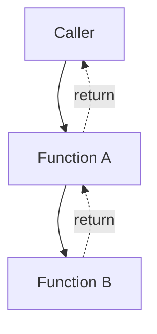

Real stack frames are considerably more complicated than this. Their exact shape depends on the architecture, ABI, compiler, optimization settings and the function itself. Even two conventional x86-64 targets can establish their frames differently.

The following is deliberately simplified, but gives an idea of the sort of machinery involved:

```asm
; x86-64 System V-style frame
push rbp
mov rbp, rsp
sub rsp, 32      ; Example local stack storage

; Function executes...

mov rsp, rbp
pop rbp
ret
```

The exact amount of stack space here is not important—it depends on what the function actually needs. Windows x64 also has concepts such as the caller-provided 32-byte shadow space, while System V has its own alignment and register rules. The important point is that a source-level function call eventually becomes a very particular arrangement of registers, stack state and ABI contracts.

For this project, the interesting part of that arrangement is the return address. Debuggers, profilers, unwinders and reverse-engineering tools can use return addresses to reconstruct how execution arrived at a particular function, which makes the ordinary call stack a useful source of information when analysing a program.

The original idea behind the project was therefore fairly simple:

1. Find the return-address slot.
2. Read the address.
3. Preserve a transformed copy somewhere else.
4. Remove the normal address from the stack.
5. Execute the protected region.
6. Recover the original address.
7. Restore it before returning.

The modern operation looks roughly like this:


There is an important distinction here: I am not simply XORing the return address *in place* and leaving the transformed pointer sitting exactly where a stack walker already expects to find one. Instead, I keep a masked copy separately and replace the conventional stack value with zero for the duration of the protected region.

The core operation is roughly:

```cpp
tmp = *ra_slot ^ xor_key;
__MEMORY_BARRIER_();

*ra_slot = 0;
```

and restoration later becomes:

```cpp
*ra_slot = tmp ^ xor_key;
__MEMORY_BARRIER_();
```

The XOR itself is not particularly interesting. XOR is its own inverse:

$$
(R \oplus K) \oplus K = R,
$$

so applying the same key again reconstructs the original address exactly.

The interesting part was everything surrounding those two operations. The XOR worked almost immediately; getting the compiler, ABI, operating system, architecture and various security mechanisms to consistently tolerate what I was doing became most of the project.

## Define the Undefined

There is a fairly fundamental problem with this idea: C++ does not provide a language feature like:

```cpp
hide_my_return_address_please();
```

As far as portable C++ is concerned, I am deliberately reaching into implementation details of the program's control flow. The language does not promise me a particular return-address location, that a frame pointer exists, that the address has been spilled to the stack at all, or that the compiler will preserve the surrounding machine state in the shape I happen to expect.

Strictly speaking, not everything in the library is "undefined behaviour" in the narrow language-lawyer meaning of the term. Some parts rely on documented compiler extensions, some on platform ABIs, and some on assumptions I explicitly constrain through the supported build environment. The broader problem remains the same, though: I am working outside the comfortable portable abstraction the language normally gives me.

Once you do that, the details hidden by the abstraction become your responsibility.

This is also where the project repeatedly started teaching me *why* those abstractions and constraints existed. It is easy to look at a compiler restriction, language rule or platform contract from above and assume that it is unnecessarily conservative. Sometimes it genuinely is, but quite often there are years of engineering buried underneath something that looks arbitrary when all you see is the rule.

Stack Obfuscator became a strange way of uncovering that engineering backwards. Instead of learning every contract first and then carefully staying within it, I would often cross one, encounter the failure mode, and only afterwards understand what that contract had been protecting me from.

In a sense, I kept independently rediscovering other people's problems.

## Making Cleanup Automatic

One design decision was there from the beginning: RAII.

The public API looks like this:

```cpp
void foo()
{
	OBFUSCATE_FUNCTION;

	// Protected body.
}
```

Internally, that macro creates an `ObfuscateFunction` object whose lifetime lasts for the surrounding scope:

```cpp
void foo()
{
	ObfuscateFunction __obfuscate__(return_address_slot);

	// Protected body.
}
```

Its constructor hides the return state, while its destructor restores it. This is one of the reasons I chose C++ for the project from the start rather than writing the whole thing in C.

I generally prefer C where I can use it. I like its simplicity, I like how little machinery it introduces on its own, and I do not see much value in reaching for an abstraction merely because the language happens to provide one. RAII, however, maps almost perfectly onto the problem I had here.

Consider a manual implementation:

```cpp
obfuscate();

if (condition)
	return;

restore();
```

The early return has already broken it. I could structure every function around a cleanup label, impose a rule that all exits manually restore the state, hide that convention inside more macros, or invent some other cleanup mechanism. Alternatively, I can use the lifetime semantics C++ already provides and make restoration happen as a consequence of the scope ending.

The same reasoning later applied to the template-heavy parts of the library. Once I needed compile-time signature reconstruction, calling-convention-specific types and perfect forwarding, C++ stopped being additional complexity for its own sake and became the language that better represented the problem.

I do not care very much whether an abstraction is considered "high level" or "low level". What matters to me is whether it models the thing I am trying to do more reliably than the alternative.

## Two Ways of Using It

The library grew around two related interfaces. `OBFUSCATE_FUNCTION` protects the surrounding function for the lifetime of its scope, while `SafeCall` wraps an individual call and is exposed through macros such as:

```cpp
OBFUSCATE_CDECL(void*, memcpy)(dst, src, size);
```

The reason for having both is fairly practical. Sometimes an entire function belongs inside the protected region; other times only one particular boundary matters, such as a license-validation routine, a security check or an important system call. `SafeCall` also gave the macro API one standardized route through which those individual calls could pass.

From the outside, a call such as:

```cpp
OBFUSCATE_STDCALL(void, SomeFunction)(arg1, arg2);
```

looks somewhat unusual, but the underlying trick is ordinary C++. The first macro expansion constructs a typed temporary wrapper, and that wrapper implements `operator()`. The second pair of parentheses therefore invokes the wrapper just like any other callable object.

Conceptually:

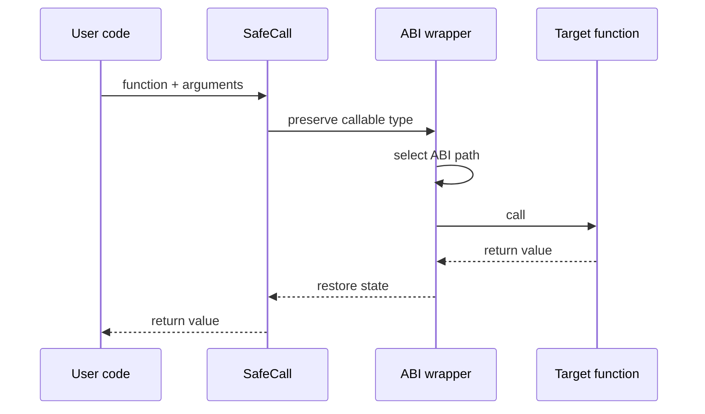

The entire point was to keep that complexity on my side of the interface. Somebody using the library should not need to know how I locate the return address, which calling convention a specialization generates, or how any of the compiler-specific machinery underneath it works.

Unfortunately for me, that machinery eventually became most of the project.

## The First Compiler Problem

MSVC is surprisingly accommodating if you want to ask a rather questionable question:

> Where is my return address?

It provides `_AddressOfReturnAddress()`, which meant the original Windows/MSVC proof of concept could lean on a compiler-supported mechanism rather than reconstructing the frame manually.

GCC and Clang were where things became more complicated.

When I started adding Linux support for my friend's project, I remember spending quite a while reading through their builtin documentation looking for an equivalent I trusted. I actually found `__builtin_frame_address` fairly early, but for whatever reason — pardon my French — my dumb ass was convinced that relying on it was too brittle and that I would be better off implementing the operation more explicitly myself.

So I did.

On x86-64, the core of that implementation was simply reading `rbp` through inline assembly:

```cpp
__asm__ __volatile__(
	"movq %%rbp, %0"
	: "=r"(frame_ptr)
);
```

I wrote equivalent paths for the other targets and then tried to validate the result heuristically. A believable frame pointer should be above the current stack pointer on the targets I cared about, should not be absurdly far away, and should have sensible pointer alignment:

```text
frame pointer > stack pointer
frame pointer < stack pointer + 1 MiB
frame pointer is correctly aligned
```

On the surface, this felt more robust to me than trusting a compiler builtin whose behaviour I was not entirely comfortable with. I was reading the register directly, checking the result myself and therefore, I thought, keeping control of the operation.

The problem was that I was checking whether the value *looked* like a frame pointer. I had not established that the compiler was actually using the register as one.

That distinction came back to haunt me.

## The Consequence

The failure eventually appeared in my friend's Linux build. His application would occasionally segfault, but not in a way that was remotely pleasant to debug. It could run correctly again and again, then suddenly fall over. A small change somewhere else could alter whether the problem appeared at all.

For quite a while the obvious parts of the obfuscator looked fine. The XOR worked, restoration worked, the stack addresses often looked plausible, and my sanity checks passed.

That last part was exactly the issue.

My checks established that the value in `rbp` could plausibly point into the stack. They did not establish that `rbp` was currently a frame pointer. When frame-pointer omission is enabled, the compiler is free to treat `rbp` as another general-purpose register and use it for unrelated state.

This:

```asm
movq %rbp, frame_ptr
```

therefore does not necessarily mean:

> Give me the current frame pointer.

It can just as easily mean:

> Give me whatever value register allocation happened to put in `rbp`.

I would then add an offset to that value and interpret the result as the location of a return address. Whether that succeeded depended on the machine code the compiler happened to generate around it.

That was why the crashes felt random. They were not actually random at all; they were consequences of register allocation and optimization decisions I was not controlling. One build could accidentally satisfy my assumption, while another source change could move enough state around for exactly the same code to start dereferencing nonsense.

This is the sort of low-level bug I find particularly unpleasant, like trying to sleep while a mosquito is in the room. A failure that occurs every time is at least honest with you; a failure whose trigger lives in an optimizer's register-allocation decisions is much harder to pin down.

Eventually I circled back to the builtin I had dismissed:

```cpp
volatile void** frame_ptr = static_cast<volatile void**>(
	__builtin_frame_address(0)
);

if (!frame_ptr)
	return nullptr;

return reinterpret_cast<void*>(
	const_cast<void**>(frame_ptr + 1)
);
```

By this point I trusted my original intuition that the hand-written version "looked safer" considerably less, so I did not simply swap the builtin in and move on. I tested it repeatedly, comparing the address returned by the old implementation, the builtin-derived frame, the actual return address and the contents of the calculated slot across different call depths and contexts. Some of that testing history is still sitting in the comments today.

The slightly annoying result was that the mechanism I had originally rejected as too brittle consistently behaved better than the lower-level replacement I had written because I thought it gave me more control.

In hindsight, this makes perfect sense. The compiler knows how it constructed the frame and which registers it decided to repurpose. Reading a register manually does not somehow give me more reliable information just because the operation occurs closer to the hardware.

Being closer to the machine is not automatically the same thing as understanding it better.

## And Then There's ARM

Even the compiler-supported frame mechanism does not make every surrounding assumption disappear. Frame-pointer omission still matters, tail-call optimization matters, and unusual prologues can change the physical shape of the call.

For GCC and Clang, conservative builds can therefore still use options such as:

```text
-fno-omit-frame-pointer
-fno-optimize-sibling-calls
```

when maintaining a conventional frame is important.

Then there is ARM64, where the problem changes more fundamentally.

On AArch64, a return address commonly begins its life in the link register, `x30`. A leaf function may never need to spill that value onto the stack at all. Even when `x29` is being used as a conventional frame pointer, there is no good reason to pretend the return state must therefore have the same representation as an x86 call frame.

I tested the implementation on a real ARM64 machine; I simply never had access to a 32-bit ARM target, which is why that architecture did not receive the same treatment. Once I looked closely at the AArch64 call model, I decided that I could not make the same generic return-address tampering guarantee I was making on the other supported targets.

The library therefore disables that behaviour conservatively on ARM64 unless the user explicitly forces it.

This became another useful correction to how I thought about portability. Portable software does not necessarily perform the exact same trick on every machine. Sometimes the most portable implementation is the one that understands where a feature does not map cleanly and refuses to pretend otherwise.

Still, I think ARM is pretty cool :)

## Calling Conventions

Then there were calling conventions, which ended up consuming an unreasonable amount of time for something that initially looked like a detail of the wrapper API.

The first symptom was vague: some Windows API functions worked perfectly, while others would access-violate. A very simple call such as `Sleep` could behave normally, but functions with more complicated parameters — particularly structures and other argument shapes where the underlying ABI became more visible — could fail.

It took me a long time to realize that the problem was not really the function I was calling. It was the agreement I had created between the caller and the callee.

At the C++ level, a function call looks deceptively simple:

```cpp
foo(a, b, c);
```

At the machine level, however, both sides need to agree on where those arguments are placed, which registers survive the call, how stack state is managed, how return values are represented, and how various special cases are encoded. The calling convention is part of that agreement, while the ABI defines the wider set of rules around it.

If my wrapper generates a call under one set of assumptions while the target function expects another, the source code can look completely sensible while the machine state underneath it is wrong.

This is particularly visible on 32-bit Windows, where conventions such as `cdecl`, `stdcall`, `fastcall`, `thiscall` and `vectorcall` can produce meaningfully different call mechanics. On 64-bit Windows, most of the historical conventions collapse into the unified Microsoft x64 ABI, although special cases such as `vectorcall` still exist. Linux x86-64 generally revolves around the System V AMD64 ABI, and GCC or Clang can also expose explicit Microsoft-ABI and System-V-ABI attributes where required.

I wanted the same wrapper to deal with all of these environments.

The early implementation made another subtle mistake: it reconstructed the function pointer from the argument types observed at the *call site*.

Conceptually:

```cpp
reinterpret_cast<Ret(__CDECL__*)(remove_reference_t<Args>...)>(f);
```

This feels reasonable until you remember that the expressions supplied by a caller do not necessarily have the same types as the parameters declared by the function.

Suppose the actual function is:

```cpp
void foo(std::size_t count, const void* data);
```

and it is invoked with:

```cpp
foo(10, some_char_pointer);
```

Normal C++ handles this without drama. The integer can be converted to `std::size_t`, and the pointer can be converted to `const void*` according to the declared function signature.

My wrapper, however, could inspect those arguments first and reconstruct something closer to:

```cpp
void (*)(int, char*);
```

before reinterpreting the real function as though that were its declaration.

For simple values, particularly where both types happen to be passed identically by the current ABI, this can appear to work perfectly. That was why calls such as `Sleep` did not immediately expose the problem.

Then a more complicated type crosses the boundary and the assumptions stop lining up.

That was essentially what I had been seeing with the Windows API.

## Mostly Worked

I think *mostly worked* is one of the most dangerous states low-level software can occupy. The compiler produces machine code, your tests pass, and the application runs for a week without crashing, so naturally you conclude that you understand what is happening. Then somebody passes the wrong type, builds under another ABI, enables an optimization, or otherwise finds a creative way to ruin your day.

The implementation did not suddenly become incorrect when that happened. It had always contained the bad assumption; I simply had not yet constructed the case that exposed it.

Calling conventions were one of the clearest examples of this. A large set of ordinary calls behaved correctly enough to convince me the abstraction was sound, while the actual contract underneath it was already wrong.

## Reconstructing the Real Type

Once I understood that, the direction of the solution became much clearer. Rather than asking:

> What argument types did the caller happen to give me?

the wrapper needed to ask:

> What is the function actually declared as?

The macro already has access to the original callable, so the modern implementation captures its actual type through `decltype(*name)` and decomposes that signature with template specialization.

Simplified:

```cpp
template <typename>
struct __fn_sig;

template <typename R, typename... P>
struct __fn_sig<R(P...)>
{
	using ret = R;
	using params = std::tuple<P...>;
};
```

Given:

```cpp
long foo(int, const char*);
```

the compiler can derive the return type and parameter list:

```cpp
R = long
P = <int, const char*>
```

entirely at compile time.

The wrapper can then rebuild the appropriate ABI-specific callable using the *declared* parameter types rather than whatever argument expressions happened to arrive at the call site. Normal C++ conversions therefore happen where they should have happened all along: when the target function is actually invoked.

This removed an entire category of calls where the implementation could happen to work merely because two different types were coincidentally represented the same way by the ABI.

Explaining the solution now makes it sound relatively clean.

Finding it was not.

## The `if constexpr` Tree of Hell

Once I had the real signature, I still needed some way to express the different calling conventions across all of the compilers and targets I wanted to support.

I spent hours trying to find a clean generic representation for this. There is plenty of documentation about individual calling conventions, plenty about templates, and plenty about compiler attributes, but I could not find somebody solving the particular combination of problems I had created for myself.

So I tried a lot of approaches.

Some looked perfectly reasonable to me and simply would not compile under one of the target configurations. Others compiled without complaint and then failed at runtime, which was substantially worse. Some worked for one convention but could not be generalized to another.

The result was the large `if constexpr` and specialization structure that still exists in the header.

I tried fairly hard not to write it that way.

The fundamental problem is that standard C++ does not give me one portable first-class concept called:

```cpp
calling_convention
```

that I can apply generically to an arbitrary function type. These conventions are exposed through different compiler-specific keywords, attributes and type-system rules, and not every syntax exists on every compiler or architecture.

There is no universal abstraction like:

```cpp
using callable = apply_calling_convention<
	convention,
	R(P...)
>;
```

which MSVC, GCC and Clang all interpret consistently across the configurations I support.

Eventually the cases have to appear somewhere.

I could have pushed more of the repetition into preprocessor metaprogramming, but that would mostly exchange visible repetition for another layer of indirection that was even harder to understand. I preferred making the supported cases explicit.

The implementation therefore contains compile-time branches for the calling convention, separate handling where `void` and value-returning paths differ, and target-specific specializations where the compiler requires them.

This creates syntactically dense source code, but importantly it does **not** imply a giant runtime decision tree. The calling convention is a template parameter, so by the time machine code is generated the compiler already knows which path applies and can discard the rest.

The complexity primarily exists for the compiler to resolve, not for the program to repeatedly evaluate while running.

That was the least bad solution I could make behave reliably.

## Template Metaprogramming as a Portability Tool

This is also why there is so much template metaprogramming throughout the library.

Some of it looks slightly absurd in isolation. I reimplemented small pieces of machinery such as:

```text
remove_reference
is_same
is_lvalue_reference
forward
```

even though the standard library already provides all of them.

In ordinary user-mode C++, I could simply write:

```cpp
std::remove_reference_t<T>
std::is_same_v<A, B>
std::forward<T>(value)
```

and move on.

Kernel mode changes the equation. I wanted the core implementation to remain usable without assuming the same standard-library and runtime environment available to a normal application, and the subset of type machinery I actually needed was very small. For those pieces, implementing the required behaviour directly was easier than pulling another dependency into the kernel path.

Removing a reference, for example, is fundamentally only the distinction:

```text
T   -> T
T&  -> T
T&& -> T
```

There is no reason for that information to survive into runtime; it is entirely a property of the type system and can disappear during compilation.

Perfect forwarding matters for the same reason. `SafeCall` should change as little about the original function invocation as possible. An lvalue should remain an lvalue, an rvalue should remain movable, and a reference should not quietly become a copy merely because it passed through one of my wrappers.

The desired path is therefore:

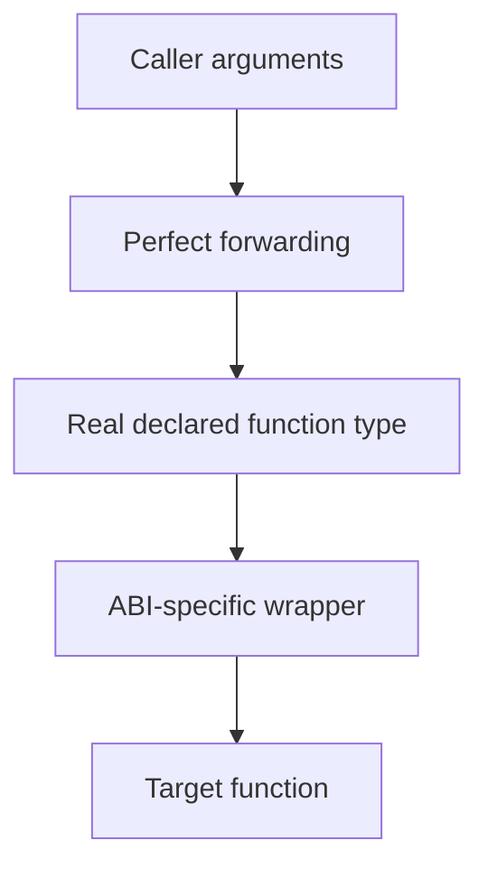

rather than:

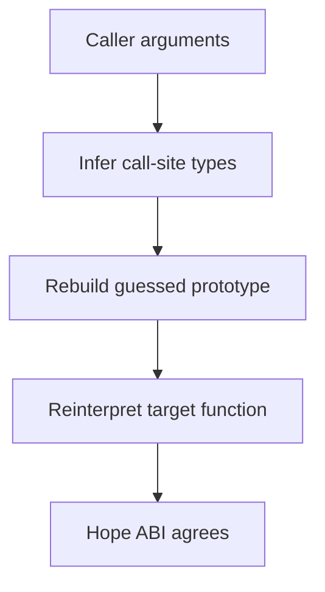

The old implementation was uncomfortably close to the second diagram. The current one follows the first, but getting there required substantially more compile-time machinery than I originally expected.

That is another recurring pattern in this project: the public operation became simpler as the implementation learned more about the system underneath it.

## Speaking Several Compiler Dialects

Calling conventions were not the only place where the compilers disagreed. MSVC, GCC and Clang often expose the same underlying capability through completely different syntax. Force inlining differs, calling-convention annotations differ, control-flow protections and stack-protector controls differ, sanitizer suppression differs, and even something as fundamental as expressing a memory barrier depends on the compiler and architecture underneath it.

Rather than scatter those differences throughout the implementation, I created a small internal vocabulary:

```text
__FORCE_INLINE_
__NO_STACK_PROTECT_
__NO_CFG_
__MEMORY_BARRIER_
__CDECL__
__STDCALL__
...
```

Each of these then maps onto whatever mechanism exists in the current environment. The rest of the implementation can therefore express what it *needs* rather than continuously asking which compiler happens to be compiling it. Code that needs an ordering barrier can simply ask for `__MEMORY_BARRIER_`; the platform layer decides whether that means `KeMemoryBarrier()`, an `mfence`, an AArch64 `dmb`, or something else entirely.

This distinction became increasingly useful as the portability matrix grew. Without it, every interesting operation would eventually turn into another nested block of checks for compiler, platform and architecture, and the actual algorithm would disappear underneath them.

There is a cost to doing this inside a header, however. Preprocessor macros do not have a nice namespace that disappears when I am finished with them, so the private implementation macros are explicitly undefined again at the end of the file. Leaving dozens of generic-looking helper names inside somebody else's translation unit would be a fairly unpleasant thing for a library to do.

One part of this I would change now is the naming. I deliberately used ugly double-underscore-style identifiers because I wanted the probability of colliding with somebody else's code to be effectively zero. The intention makes sense, but identifiers of that form are reserved to the language implementation in C++, so I solved one namespace problem by stepping into somebody else's reserved namespace instead. It worked, but there are cleaner ways I would express the same intention today. But you know what they say, the more underscores your code has, the faster it is!

## From a Hardcoded Key to Best Effort

The earliest proof of concept used a hardcoded XOR key. This was terrible security, and I knew that from the beginning, but at that stage it was also completely adequate. I was trying to answer one question:

> Can I remove a return address, preserve it in another representation and restore it without breaking execution?

A fixed key was enough to prove that. There is not much value in judging every shortcut in a prototype according to the standards of the finished system; a proof of concept should first prove the concept.

The problem was that the project did not remain a proof of concept.

Once other people might actually use it, the hardcoded key became one of the obvious things to replace. User mode came first, where I could seed a thread-local `std::mt19937_64` through `std::random_device` and keep the generator isolated between threads. Kernel mode was less convenient, so I later built a separate generator whose state I could maintain myself.

Neither path is something I would advertise as a cryptographically secure random-number generator, and realizing what that distinction actually meant sent me down another rabbit hole.

At first the requirement was simply "make the key random". Then I started thinking about reuse, so I added rotation. Then I considered pathological outputs and added validation. That led into initialization failures, fallback behaviour, generator-state observation, correlations between transformed addresses, authentication, and eventually the question of whether every operation should use fresh operating-system-provided cryptographic randomness.

Every improvement exposed another thing I could improve.

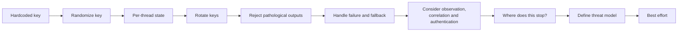

Eventually I had to decide where the scope ended: what were we actually trying to defend against? A serious cryptographic construction has a much higher standard than making reverse engineering inconvenient, while this library still has much easier ways to bypass it than attacking the XOR representation itself. The key has to exist somewhere, the transformed state has to exist somewhere, and the real return address eventually has to be reconstructed before the processor can use it.

Trying to make this one part cryptographically perfect would therefore have strengthened it far beyond the system surrounding it, while adding runtime cost, platform dependencies and substantial complexity.

So I drew the boundary at best effort.

That does not mean I stopped caring about the keying system. I still wanted sensible generation, per-thread state, rotation, validation and visible failure behaviour. I simply stopped pretending that a small anti-analysis primitive should gradually turn into a complete cryptographic protocol.

## Rotation and Validation

Keys currently rotate after 32 uses by default. There is no theorem behind that number; it came from a deliberately pessimistic usage model where somebody might apply the obfuscator around many functions and hit it extremely frequently on one thread. Generating a completely new key for every protected operation would then make key generation part of a very hot path.

In more realistic use, the library is probably protecting selected paths such as license validation or sensitive security routines. Still, I wanted the default to remain reasonable under heavier use, and the interval is configurable for somebody with a different threat model or performance budget.

There is also a concrete reason not to reuse one XOR key forever. If:

$$
T_1 = R_1 \oplus K
$$

and:

$$
T_2 = R_2 \oplus K,
$$

then:

$$
T_1 \oplus T_2 = R_1 \oplus R_2.
$$

The key disappears. This does not magically reveal both addresses, but it illustrates why repeated XOR with one key should not be confused with strong encryption. Rotation limits that reuse without forcing key generation onto every invocation.

The generator also rejects a few obviously undesirable outputs. Zero is useless because XORing by zero changes nothing, repeated-byte patterns are rejected, and where an efficient population-count operation is available I reject values with unusually few or many set bits.

These are sanity checks, not an entropy proof.

Writing this entry actually exposed an old mistake here. One comment claimed that an earlier `20 <= popcount <= 44` range rejected roughly 90% of uniformly random 64-bit values. It did not even come close; roughly 99.84% of values still passed.

The implementation was fine for what the check was actually meant to do, but the explanation beside it was wrong.

I like finding things like this when revisiting old projects. Code can work for years while a comment quietly preserves reasoning you would no longer defend. Recording the project gives me an excuse to attack the explanation as well as the implementation.

## Observability

As the library moved from something only I used to something somebody else might depend on, silent failure became much more important.

During development I did not particularly need a formal status system. If something went wrong I could print addresses, dump internal state, step through the relevant path and usually work out where the problem was. Even the particularly annoying failures were still *my* failures, inside code I understood.

That changes when somebody else writes one macro and assumes the protection is active.

If key generation falls back to a weaker path, if the supplied function is invalid, or if the current platform cannot safely support return-address tampering, I do not want the library to quietly continue while the user believes everything succeeded. That would be considerably worse than simply refusing to perform the operation.

So I added an internal status system:

```cpp
enum class ObfuscateStatus : UINT8
{
	SUCCEEDED,
	INITIALIZED,
	PENDING_CALL,
	INITIALIZED_TLS,
	UNINITIALIZED_TLS,
	INVALID_ENCRYPTION,
	INVALID_FUNCTION_ADDRESS,
	RA_TAMPER_NOT_ALLOWED,
	WEAK_ENCRYPTION_FALLBACK,
	CORRUPT_KEY_OR_STACK_ADDR,
	INVALID_CALLING_CONVENTION,
	UNINITIALIZED_STACK_CLEANUP,
};
```

with the latest state exposed through:

```cpp
OBFUSCATOR_LAST_STATE
```

In user mode that state is itself thread-local, so one thread does not overwrite the diagnostic state another thread is about to inspect.

This was not primarily a debugging feature for me; I had already been debugging the library without it. It was part of making the behaviour understandable to somebody who did not write the implementation. The library should either do what it promised or give the caller enough information to know that it did not.

The random Linux segfaults had made this particularly obvious to me. Once somebody else is depending on your low-level assumptions, waiting for their machine to be the thing that reveals a missing one is a very poor compatibility strategy.

## Security Mechanisms Fighting Security Mechanisms

Some of the stranger compatibility work came from other security features.

At one point I went down a tangent into stack canaries and implemented some related protection before deciding that it was outside the scope of the project. The tangent was still useful, because it pushed me further into the mechanisms modern systems use to defend control flow.

I was already accounting for Control Flow Guard, and from there shadow stacks were an obvious concern. A hardware-backed shadow stack keeps a protected copy of return information separately from the conventional program stack. Its purpose is almost perfectly opposed to what the library is trying to do: I am intentionally changing ordinary return state, while the mitigation exists specifically to detect unexpected changes to return state.

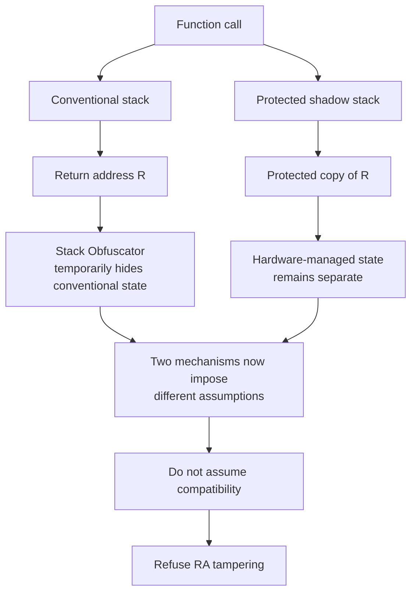

On my own machine this never initially appeared as a mysterious runtime failure because the relevant shadow-stack configuration was not enabled. I found the problem by reasoning through the environment instead.

By this point that distinction mattered to me. Earlier in the project I would often implement something, see that it worked, and move on. After spending so long chasing failures such as the Linux frame-pointer bug, I became much more interested in finding the incompatible assumption *before* somebody happened to run the library under the exact configuration that exposed it.

The current design therefore checks whether return-address tampering is compatible with the active mitigation state. If it is not, the library does not try to prove that its own security feature is somehow more important than the platform's. It refuses the operation and exposes `RA_TAMPER_NOT_ALLOWED`.

That is one of the places where I think my approach to the project visibly matured. The PoC mindset was essentially:

> I know roughly what the machine is doing, so I will change it.

The later question became:

> Which layers currently believe I am following their contracts, and what happens if I violate them?

Those layers include the language, compiler, ABI, operating system, hardware and the security mechanisms surrounding the program. If two of those mechanisms fundamentally disagree about what valid execution looks like, blindly forcing them together does not make the result more secure. It usually just makes it less reliable.

## Memory Does Not Necessarily Happen in Source Order

Ordering was another assumption I worried about fairly early.

C++ source naturally encourages you to imagine operations happening in the order they are written, but an optimizing compiler does not have to preserve that physical sequence when it can prove that a transformation leaves the observable program unchanged. Modern processors introduce another layer of ordering underneath that.

Normally this is exactly what I want. Optimizers can eliminate work, move operations, propagate values and produce substantially better machine code than a literal translation of my source.

Stack Obfuscator is awkward because the physical sequence itself is part of correctness:

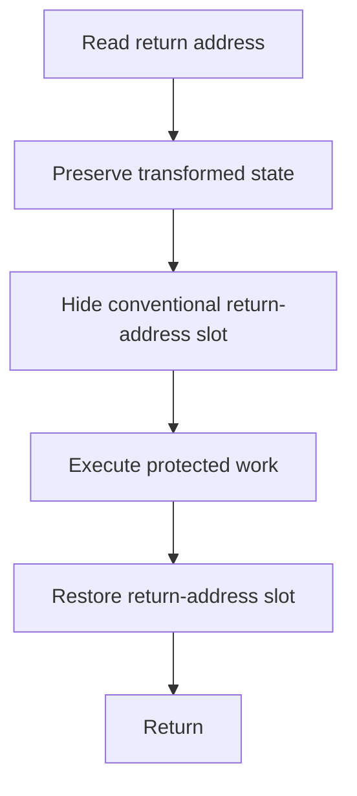

The transformed state has to exist before I destroy the conventional representation, the stack slot must remain hidden throughout the protected region, and restoration has to complete before execution returns through it.

By this point I had spent quite a lot of time studying GCC optimization and the assumptions compilers can safely derive. Stepping outside the language's normal model does not make the optimizer politely stop reasoning about your code; it can make a perfectly valid transformation according to the model it understands while breaking the physical sequence you happen to depend on.

Barriers are expensive, so I did not want to add them merely because the code looked dangerous. I deliberately tried to construct conditions where optimization could violate my assumptions, and eventually I made it break.

The exact barrier differs by environment: Windows kernel mode has `KeMemoryBarrier()`, MSVC has its own compiler and architecture mechanisms, GCC and Clang can use memory clobbers and architecture fences, and AArch64 has its own ordering instructions. The portability layer hides those differences so the algorithm can ask for the ordering property rather than a particular instruction.

This does not turn implementation-dependent behaviour into portable ISO C++. It simply constrains a class of transformations that I know can invalidate the algorithm.

There is a performance cost, but there is not much value in optimizing an implementation into occasionally being wrong. I was comfortable accepting weaker key rotation for performance because that was a deliberate security trade-off. Removing an ordering requirement would instead compromise correctness.

Those are different compromises.

> Optimize aggressively around correctness, not through it.

## And Then There Was Kernel Mode

Kernel mode was probably the clearest demonstration of how much complexity an ordinary programming environment quietly gives you.

In user mode, per-thread state is pretty boring:

```cpp
thread_local ThreadState state;
```

And great that it is so!

That looks almost like the end of the problem. Each thread gets its own state and the compiler takes care of the rest.

At first I thought about `thread_local` in roughly those terms: it was a language feature that told the compiler I wanted one value per thread. Then I became curious about what the keyword was actually doing underneath that abstraction.

It turns out there is quite a lot underneath it.

The executable needs TLS metadata, the compiler emits particular access patterns, the loader and runtime participate in initialization, the operating system maintains per-thread structures, and the exact machinery differs between platforms. `thread_local` is simple to *use* precisely because several other layers have already agreed on how to implement it.

The convenient mechanism I had used in user mode did not simply exist in the same form in Windows kernel mode.

So I started digging.

## The TEB Rabbit Hole

I looked for an obvious kernel equivalent and found nothing that fitted what I wanted. This was starting to feel familiar: much like the calling-convention work, I kept expecting there to be some clean mechanism somebody had already documented for exactly my use case, and eventually I ran out of obvious places to look.

So I started tracing Windows structures.

One structure led to another until I eventually reached the Thread Environment Block, or TEB, and found a [write-up](https://www.geoffchappell.com/studies/windows/km/ntoskrnl/inc/api/pebteb/teb/index.htm) documenting the offsets of its ordinary TLS slot array.

That gave me this:

```cpp
#ifdef _M_X64
#define __TLS_SLOTS_OFFSET 0x1480
#else
#define __TLS_SLOTS_OFFSET 0x0E10
#endif

#define __TLS_SLOTS_SIZE (0x40 * sizeof(PVOID))
```

which eventually led to:

```cpp
__forceinline ThreadState* getThreadState(void*) noexcept
{
	if (!__ALLOW_TLS_OVERWRITE)
		return nullptr;

	static const PVOID _TLS_LOCATION = (PVOID)(
		(ULONG_PTR)PsGetCurrentThreadTeb() + __TLS_SLOTS_OFFSET
	);

	return (ThreadState*)_TLS_LOCATION;
}
```

And the really strange thing is that it worked.

Not "it worked just long enough for me to take a screenshot before the machine crashed". It simply behaved the way I expected. I used it, tested the rest of the project, saw nothing obviously exploding, and moved on.

This is probably one of the most interesting mistakes in the project precisely because there was no dramatic failure forcing me to confront it.

## When Wrong Code Behaves Perfectly

It was only much later, after I understood the environment better, that I came back and properly considered what I had built.

I was reaching from kernel mode into a user thread's TEB, depending on a particular layout and treating ordinary user-mode TLS storage as scratch space for my own kernel-side state. I did not own that memory or its lifetime, and I could not assume every thread or kernel execution context satisfied the conditions under which that state was valid and safe to access.

There was also a separate bug sitting in the implementation:

```cpp
static const PVOID _TLS_LOCATION = ...
```

That local static is initialized once, meaning a function intended to retrieve state associated with the *current* thread could cache the TEB-relative address observed during its first initialization. I remember noticing this too, but by then it did not really matter. Fixing that line would only have repaired one bug inside an access model I no longer trusted in the first place.

What I find more interesting is that none of this announced itself through some spectacular crash. Honestly, to this day I have no idea how that managed to work at all. Ten times out of ten I would have expected an access violation, so if anyone knows, please tell me!

There is a useful distinction here:

> **Working code is not necessarily correct code.**

Sometimes the most dangerous code is precisely the code that politely allows you to remain wrong.

This also became one of the clearest examples of the broader learning process I talked about near the beginning. I questioned an abstraction, dug underneath it, found a route around it, and got the result I wanted. Only later did I understand why the abstraction had been there.

`thread_local` had initially looked almost trivial: each thread gets its own variable, so why should this be difficult? By the end of the detour I had independently run into a large part of the problem TLS implementations themselves have to solve: how thread identity maps onto storage, who owns that storage, when it exists, how long it lives, and how initialization and cleanup are attached to the lifetime of the thread.

The keyword was simple because somebody else had already solved those problems.

Once I stepped around the keyword, those problems became mine.

## Building My Own Thread State

Once I abandoned the TEB approach, I needed an actual kernel-side model for the state the user-mode implementation could keep through `thread_local`.

The current state looks roughly like this:

```cpp
struct ThreadState
{
	UINT64			s[4];
	UINT64			current_key;
	BOOLEAN			initialized;
	ObfuscateStatus	last_state;
	UINT32			max_key_uses;
	UINT32			key_uses;
};
```

It contains the generator state, current key, initialization flag, diagnostic state and key-use counters associated with one thread.

Rather than pretending this is ordinary compiler TLS, the kernel implementation explicitly maps the current `PKTHREAD` onto one of these structures. The mapping is divided across 64 buckets, each with its own linked list and spinlock:

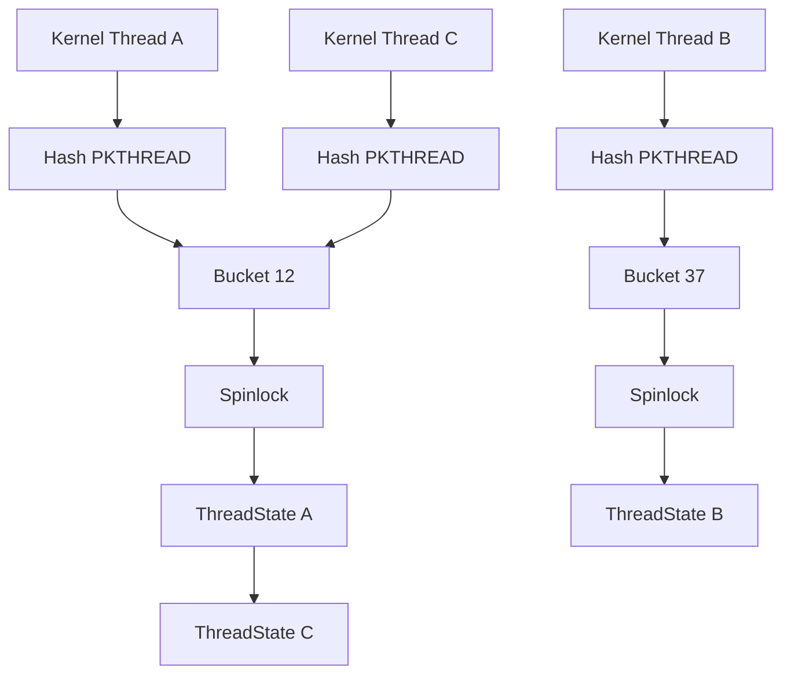

It is effectively a tiny thread-state system built specifically for the needs of the library. Given a kernel thread, find the corresponding Stack Obfuscator state.

I knew from the beginning of this redesign that I did not want one large globally locked list. That would force completely unrelated threads to serialize on the same lock whenever they touched their key or diagnostic state. Splitting the map across buckets makes contention local instead.

Sixty-four was not derived from endless benchmarking. It is simply a cheap power-of-two spread that was comfortably sufficient for the thread counts I expected. The thread pointer is mixed before the bucket mask is applied because aligned kernel pointers contain predictable low zero bits; directly masking them would otherwise produce a fairly poor distribution.

Not every constant needs a paper behind it. Sometimes the engineering question is simply whether something is cheap, predictable, and comfortably sufficient for the workload it is supposed to handle.

## Races You Create by Avoiding Other Races

Creating thread state introduces another synchronization problem.

The simplest version would hold the bucket lock, search for the current thread, allocate state if it is missing, insert it, then release the lock. I did not want to perform the allocation while holding a spinlock, so the implementation has to introduce a window where the lock is deliberately released.

That creates another race.

The sequence therefore looks like this:

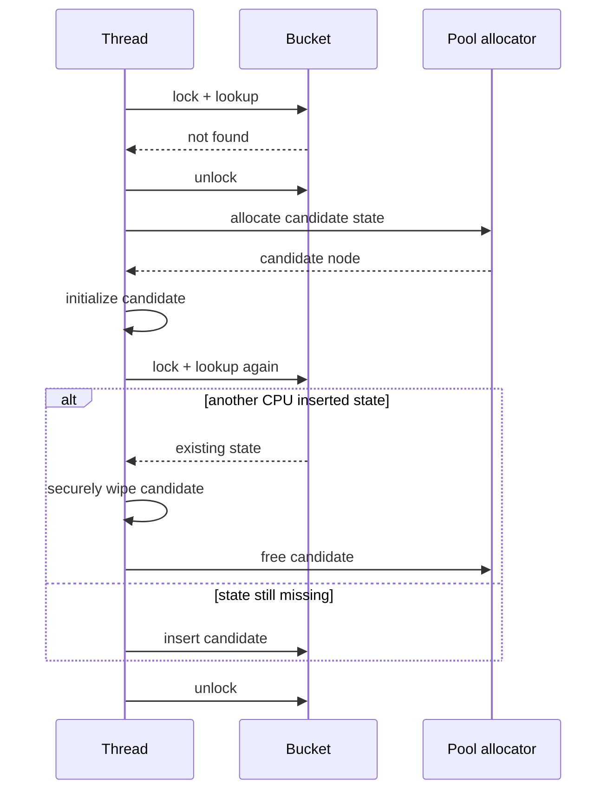

The second lookup is important. Another processor can create state for the same thread between my first lookup and the eventual insertion. If that happens, the freshly allocated candidate is no longer needed, so its state is wiped and the allocation is freed. Otherwise it becomes the thread's new state.

This is substantially more complicated than:

```cpp
thread_local ThreadState state;
```

and that is precisely what I find interesting about it. You do not always notice how much work an abstraction is doing on your behalf until you enter an environment where you need to rebuild part of it yourself.

## Kernel Lifecycle

Manually allocating thread-associated state also means manually deciding when that state stops existing.

If a thread exits and the corresponding node remains in my map forever, I have created a kernel memory leak. So thread lifecycle handling was part of this replacement design from the beginning. The library uses the kernel's thread notification mechanism for lifecycle management and purges any remaining state when the driver shuts down.

The broad lifecycle looks like this:

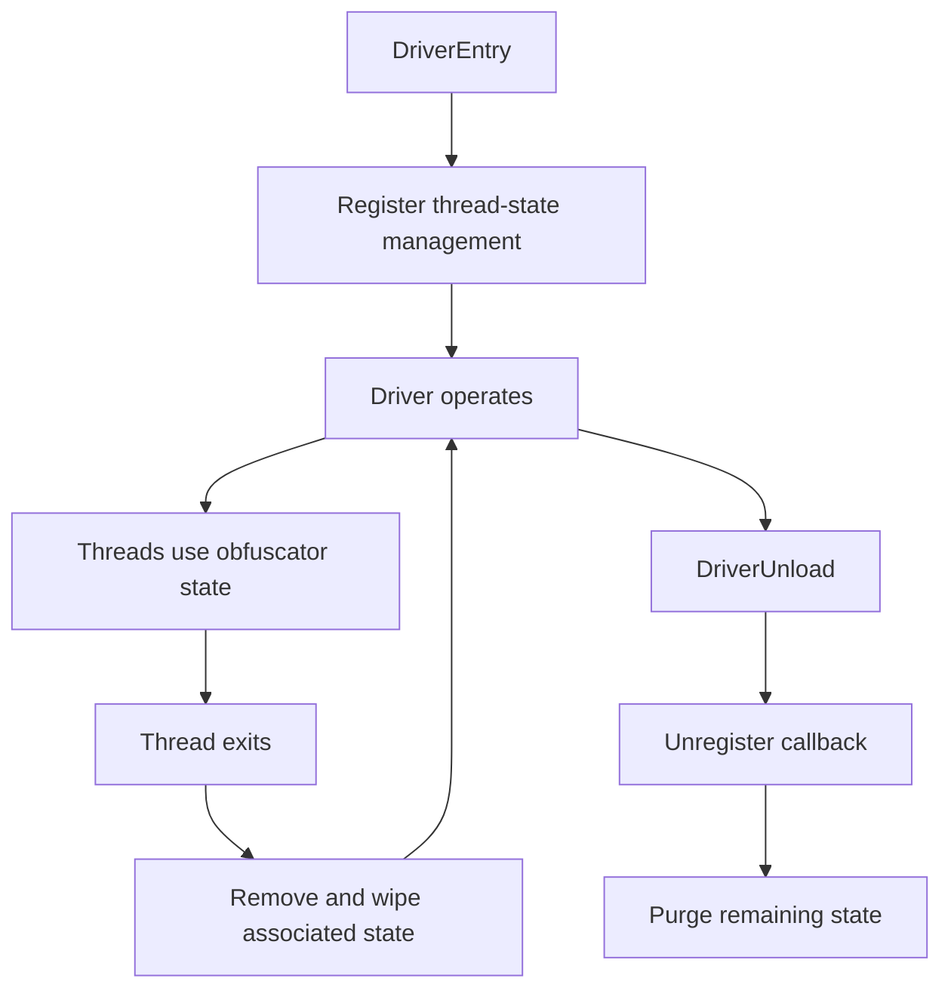

This is not the glamorous part of writing a security primitive, but it is one of the distinctions between a proof of concept and something I would actually be comfortable letting another person load into a kernel.

## Being Intentional About State

Some smaller habits in this code came from reading programming standards outside normal application development, particularly NASA's coding guidance. One thing I liked was the emphasis on making intent visible even when the compiler did not strictly need it.

I have many, many thoughts on this matter, and I will talk about it more in another entry.

Still, this carried into the project. Temporary kernel state containing key material is explicitly wiped before being discarded, and intentionally ignored values or paths are made visibly intentional rather than left looking forgotten.

The generated machine code may sometimes be identical either way, but the reasoning is not. Especially in security-oriented code, I find there is a useful difference between:

> The programmer forgot about this.

and:

> The programmer considered this and deliberately chose what should happen.

## Hard Failure

Failure behaviour was another part of the project I spent considerably more time thinking about than I expected.

Suppose the library reaches a condition it considers structurally untrustworthy. One option is to fail gracefully: return an error, set some state and allow the process to continue. That is normally the friendliest thing a library can do.

I was less comfortable with that model here.

The library is deliberately manipulating control state below the level where ordinary C++ expects code to operate. If that state becomes corrupted, there is no guarantee the consequences remain nicely isolated to one local variable that I can inspect and recover from. I tend to think of this somewhat like a hardware failure: bad state can propagate while everything surrounding it continues to look superficially reasonable.

There is also the adversarial case. If somebody has successfully tampered with the mechanism, I cannot necessarily assume that a value returned through the same compromised execution path is trustworthy merely because it claims everything is fine.

After debating this for quite a while, I chose fairly aggressive failure paths for the conditions the library treats as unrecoverable. Depending on the environment, that can mean a fast fail, terminating the process, or invoking a kernel bug check.

This is worth distinguishing from the security mechanism itself. Hard failure does not somehow defeat an attacker, nor is crashing the system a clever anti-tamper strategy. What it gives me is a defined boundary for a class of failure I no longer trust myself to recover from safely.

The status system covers ordinary degradation and conditions the caller can reasonably observe. The hard path covers the much narrower case where my assumption is:

> I no longer trust the state from which graceful recovery would have to happen.

## What the Verification Does Not Do

It is also worth being precise about what the current validation guarantees.

The library does **not** cryptographically authenticate every reconstructed return address. Its checks can detect structural failures the implementation knows how to recognize, but they cannot prove that a valid-looking restored address has not been maliciously substituted.

Doing that properly would require additional integrity machinery — something like a MAC, more keying and storage, and another set of lifecycle and failure rules. It could strengthen that part of the threat model, but it would also push the project further toward becoming an entire anti-reversal runtime.

That is beyond the boundary I chose for it.

## Testing Something That Should Not Work

There was never one beautiful formal test suite for this project. Instead I wrote an enormous number of targeted experiments around whichever assumption I happened to be working on.

Across the project's lifetime I probably wrote tens or hundreds of these small tests. I tried different compilers and optimization settings, Windows and Linux, kernel and user mode, x86-64 and ARM64, different calling conventions, argument shapes, structures, return types, nested calls, call depths, multithreading, frame-address behaviour, key state and failure paths. Often the entire purpose of a program was simply to answer one question about one assumption and then disappear once I had the answer.

I would record the values I expected, compare them with what the machine was actually doing, and then construct another test designed to attack the next weak point in my reasoning.

The GCC frame-pointer problem is a good example. I did not eventually choose `__builtin_frame_address` because the code looked nicer. I compared its result against the older implementation, the real return address and the value contained at the calculated location across multiple call depths and configurations. The comments in the header still contain some of that testing history.

There is obviously a limit to what this proves. One hundred passing tests do not transform undefined behaviour into a portable language guarantee. But systems software often cannot obtain the sort of universal guarantee ordinary language-level code enjoys. What I *can* do is reduce the unsupported assumptions, rely on documented compiler or ABI mechanisms wherever possible, define the target configurations explicitly, and then test those configurations aggressively.

That combination turns an impossible universal promise into a practical engineering contract:

> Under these environments, with these assumptions, I know why this works, and I have repeatedly tried to prove myself wrong.

That is a much stronger position than simply observing that the demo happened not to crash.

## What This Actually Protects

Security software has a bad habit of using words like *secure*, *protected*, *encrypted* and *impossible to reverse* with considerably more confidence than they deserve.

The library does not make a program impossible to analyse. A disassembler can still disassemble it, a determined analyst can still inspect its machine code, and an attacker with arbitrary visibility over registers and memory can eventually understand what the library is doing.

The key has to exist somewhere. The transformed return state has to exist somewhere. The real address has to be reconstructed before the processor can return to it. Client-side software cannot make those physical facts disappear.

What the library changes is the path of least resistance.

Without it, an analyst may be able to pause execution, inspect an ordinary stack and immediately recover a useful call chain. With the primitive active, the process can instead become something closer to:

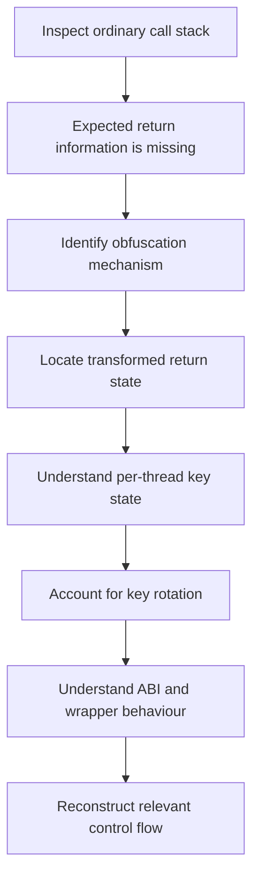

None of these steps is impossible. There are simply more of them.

That distinction is the real security model.

Used alone, this is limited protection. Used alongside other techniques — string and/or import protection, integrity checks, anti-debugging, virtualization and so on — each layer adds another problem an analyst has to solve before they have a coherent picture of the program.

The project was always meant to be one of those layers, not the entire wall.

## What I Would Do Differently

There are plenty of things in this header I would not write the same way today. Some private identifiers use names reserved by the implementation, some comments contain reasoning I can now demonstrate was wrong, the calling-convention machinery is extremely dense, and the original TEB implementation was certainly not something I would keep.

I would also revisit the template and `if constexpr` machinery to see whether newer language or compiler facilities could express some of it more cleanly. At the time I tried a lot of alternatives, and the structure that survived was the one I could make compile and behave reliably across the environments I cared about.

That does not make me dislike the project. If anything, those mistakes are part of why I wanted to record it.

It would be easy to clean everything up afterwards and present a neat story where every decision was obvious from the beginning. As with most of my work, that is not what happened. I rejected the compiler builtin that eventually became the solution, built a more brittle replacement, used TEB TLS slots from kernel mode because they appeared to work, reconstructed function types incorrectly, and kept hardening the key system until I had to consciously define where its security model ended.

The project is more interesting to me with that history intact.

## Where the Complexity Went

One of the broader engineering lessons was that none of my design goals came for free.

Making the library header-only simplified distribution but concentrated platform-specific machinery into one dense file. A small public API pushed complexity inward into templates and macros. Portability meant learning several compiler dialects and ABIs. Kernel support removed conveniences such as ordinary thread-local storage. Robustness added memory barriers, lifecycle handling, mitigation checks and observability, while performance limited how aggressively I could harden the keying system.

The complexity never disappeared. I only got to decide where it lived.

I deliberately buried most of it underneath an interface where somebody else could write:

```cpp
OBFUSCATE_FUNCTION;
```

or:

```cpp
OBFUSCATE_CDECL(void*, memcpy)(dst, src, size);
```

and move on.

Those few characters sit on top of compiler detection, ABI handling, return-address discovery, type reconstruction, calling conventions, key state, ordering constraints, mitigation checks and, in the Windows kernel, an entire per-thread state-management system.

Even so, the original XOR in the middle of all of this barely changed.

## What I Think of It Now

There were two points where the project crossed a line for me. It first became *real* when somebody else wanted to depend on it; my friend's Linux requirement was what pushed it beyond a comfortable MSVC proof of concept. It felt *finished* much later, when I had attacked the supported configurations from enough directions that I genuinely trusted what I claimed to support.

As of writing this, it is somehow also my most-starred GitHub repository, at a humble thirty stars, and I know of a few people who have used it as part of real production security solutions.

That is a nice outcome for something that began with a hardcoded XOR key and a few lines of C++.

But the part I value most is what happened between those two versions.

The first implementation answered:

> Can this work?

The rest of the project forced me to ask:

> Why does this work?

then:

> Under which conditions does this work?

and eventually:

> How do I make sure somebody else knows when those conditions are not true?

Those are much better questions.

A frightening amount of low-level software can survive in a state of *mostly worked*. Your demo passes and nothing obviously corrupts, then an optimization changes, another register gets allocated, a structure crosses an ABI boundary, another thread arrives or a mitigation is enabled, and suddenly the implementation appears to fail randomly.

Usually it is not random.

It is the deterministic consequence of a contract you did not know existed.

The project made me substantially better at looking for those contracts. I still use that way of thinking in compilers, kernels, hardware, concurrency and other awkward parts of systems.

## When Abstractions Stop Being Words

If you've read some of my other work, you'll know how often I come back to abstractions, and how strongly I feel about them.

Looking back, the clearest pattern in this project is how every apparently simple abstraction eventually turned into a collection of agreements underneath it.

`thread_local` became compiler support, executable metadata, runtime behaviour and operating-system thread structures. A function call became an ABI, registers and calling conventions. A frame pointer became an optimization decision. A return address became architecture-dependent state that might live on a stack, in a register or alongside a hardware-protected shadow copy. Source ordering became a compiler and processor ordering problem.

The moment I deliberately stepped around one abstraction, I inherited whatever implementation details it had been hiding.

This connects to something broader in how I have learned engineering. I have a tendency to challenge rules before I fully understand why they exist.

Why can I not simply read the frame-pointer register myself? Why does `thread_local` need so much machinery? Why can I not reconstruct a function pointer from whatever arguments I already have? Why do calling conventions need all of these awkward compiler-specific representations? Why do I need a barrier when I already wrote the operations in the correct order?

Several times in this project I answered those questions by crossing the boundary and seeing what happened.

Eventually I ran into the same problems the people defining those contracts had already encountered. The frame pointer stopped actually being a frame pointer. The apparent function signature stopped matching the ABI. Source order stopped guaranteeing the physical sequence I needed. Thread-local storage stopped being a keyword and became a problem of identity, ownership, synchronization and lifetime.

I think there is something valuable about learning this way.

That does not mean every convention should be ignored until it explodes. Engineering knowledge exists precisely so that we do not all need to rediscover every failure from first principles. But there is a difference between following a contract because the documentation says so and understanding the underlying system well enough that you could explain why the contract exists.

Sometimes I found that a rule could safely be bent for an environment I controlled. Other times I effectively reinvented the rule after discovering what happened without it.

I want to write about this more directly another time, particularly around programming-language semantics. Stack Obfuscator is only one example, but it was one of the projects where I practised that way of learning most aggressively.

To me, low-level programming is therefore not simply programming with fewer abstractions. It is understanding which contracts those abstractions represent, knowing when you have a legitimate reason to cross them, and accepting responsibility for everything they were previously doing on your behalf.

I believe this is powerful because it gives you a way to challenge assumptions that may otherwise be taken for granted, sometimes for decades. Not because those assumptions are necessarily wrong, but because understanding what holds them up gives you a much better position from which to decide whether they still apply.

Thinking in systems once more, I think the same structure appears far beyond software. Most of the systems we interact with — technical or otherwise — are built on layers of assumptions, abstractions and conventions that somebody established before us. Practising the habit of questioning those layers in one field carries surprisingly well into another.

This is something I feel strongly about, and it is probably why I keep coming back to abstractions so often. They are not just conveniences that hide complexity; they are records of problems somebody already had to solve. Learning when to trust them, when to question them, and what responsibility you inherit when you step around them is one of the most valuable things this project taught me.

Normally I end these off with:

> Anyway, thank you for reading through!

But seeing how absurdly long this entry has turned out to be, if you've read this far, thank you. Really. It means a lot to me.

Here is the [repository](https://github.com/Arty3/Stack-Obfuscator).

<details>
<summary><b>Full source at the time of writing</b></summary>

As mentioned before, some comments require correcting.

```cpp
/* ************************************************************************** */

/*
	- License: MIT LICENSE
	- Author: https://github.com/Arty3

	- Requires:
		- C++20 or above,
		- MSVC / GCC / Clang
		- Windows 10 or above, alternatively Linux

	- Notes:
		- GCC does not support vector calls for
		  some ungodly reason, so use clang instead
*/

#pragma once

#if defined(_MSC_VER)
#define __COMPILER_MSVC_
#elif defined(__clang__) && defined(__GNUC__)
#define __COMPILER_CLANG_
#pragma clang diagnostic ignored "-Wignored-attributes"
#elif defined(__GNUC__) && defined(__GNUC_PATCHLEVEL__)
#define __COMPILER_GCC_
#pragma GCC diagnostic ignored "-Wattributes"
#pragma GCC diagnostic ignored "-Wignored-attributes"
#else
#error "Unsupported compiler. This translation unit requires MSVC, Clang or GCC."
#endif

#if defined(_WIN32) || defined(_WIN64)
#define __PLATFORM_WINDOWS_
#elif defined(__linux__)
#define __PLATFORM_LINUX_
#else
#error "Unsupported platform. This translation unit requires Windows or Linux."
#endif

#if defined(__PLATFORM_WINDOWS_) && defined(_KERNEL_MODE)
#define __WINDOWS_KERNEL_
#if !defined(__COMPILER_MSVC_)
#error "Windows kernel mode is only supported by MSVC."
#endif
#endif

#if defined(__COMPILER_CLANG_) || defined(__COMPILER_GCC_)
#if !defined(__has_builtin)
#define __has_builtin(x) 0
#endif
#if !defined(__has_feature)
#define __has_feature(x) 0
#endif
#endif

#if defined(__PLATFORM_WINDOWS_)
#if defined(_M_X64) || defined(_M_AMD64)
#define __ARCH_X64_
#elif defined(_M_IX86)
#define __ARCH_X86_
#if defined(__COMPILER_MSVC_)
#pragma message("warning: 32-bit architecture lacks support.")
#else
#warning "32-bit architecture lacks support."
#endif
#elif defined(_M_ARM64)
#define __ARCH_ARM64_
#endif
#elif defined(__PLATFORM_LINUX_)
#if defined(__x86_64__) || defined(__amd64__)
#define __ARCH_X64_
#elif defined(__i386__)
#define __ARCH_X86_
#if defined(__COMPILER_MSVC_)
#pragma message("warning: 32-bit architecture lacks support.")
#else
#warning "32-bit architecture lacks support."
#endif
#elif defined(__aarch64__)
#define __ARCH_ARM64_
#endif
#else
#error "Unsupported architecture: This translation unit requires x86 or x86-64."
#endif

#if defined(__COMPILER_MSVC_)
#if defined(_MSVC_LANG) && _MSVC_LANG < 202002L
#error "This translation unit requires C++20 or above."
#endif
#elif defined(__COMPILER_CLANG_) || defined(__COMPILER_GCC_)
#if __cplusplus < 202002L
#error "This translation unit requires C++20 or above."
#endif
#endif

#if defined(__WINDOWS_KERNEL_)
#include <Intrin.h>
#include <ntifs.h>
#elif defined(__PLATFORM_WINDOWS_)
#include <Windows.h>
#include <Intrin.h>
#include <random>
#include <tuple>
#if NTDDI_VERSION < NTDDI_WIN10_VB
#error "This translation unit requires Windows 10 or above."
#endif
#elif defined(__PLATFORM_LINUX_)
#include <signal.h>
#include <unistd.h>
#include <cstdint>
#include <random>
#include <tuple>
#endif

#if !defined(OBFUSCATOR_ENABLE_RA_TAMPER)
#define OBFUSCATOR_ENABLE_RA_TAMPER 1
#endif

/* AArch64: default to NO tamper unless explicitly forced */
#if defined(__ARCH_ARM64_)
#if !defined(OBFUSCATOR_ARM64_FORCE_TAMPER)
#define OBFUSCATOR_ARM64_FORCE_TAMPER 0
#endif
#else
#define OBFUSCATOR_ARM64_FORCE_TAMPER 1
#endif

#if defined(__ARCH_ARM64_) && defined(__COMPILER_CLANG_)
#if __has_feature(shadow_call_stack)
#define __NO_SCS_	__attribute__((no_sanitize("shadow-call-stack")))
#else
#define __NO_SCS_
#endif
#else
#define __NO_SCS_
#endif

/* To clarify, the weird naming convention: __SYMBOL_
 * is to avoid polluting the global macro namespace,
 * since when we include the header, we can't scope
 * these macros away, so best to name them poorly */

#if defined(__COMPILER_MSVC_)
#define __FORCE_INLINE_		__forceinline
#define __NO_INLINE_		__declspec(noinline)
#define __NO_STACK_PROTECT_	__declspec(safebuffers)
#define __NO_CFG_			__declspec(guard(nocf))
#define __ALIGN_(x)			__declspec(align(x))
#define __RESTRICT_			__restrict
#define __DISCARD_BRANCH_	__assume(0)
#elif defined(__COMPILER_GCC_) || defined(__COMPILER_CLANG_)
#define __FORCE_INLINE_		__attribute__((always_inline)) inline
#define __NO_INLINE_		__attribute__((noinline))
#define __NO_STACK_PROTECT_	__attribute__((no_stack_protector))
#define __DEPRECATED_(x)	__attribute__((deprecated(x)))
#if defined(__COMPILER_CLANG_) && defined(__has_feature) && __has_feature(cfi)
#define __NO_CFG_			__attribute__((no_sanitize("cfi")))
#elif (defined(__COMPILER_CLANG_) && __clang_major__ >= 7) \
	|| (defined(__COMPILER_GCC_) && __GNUC__ >= 9)
#define __NO_CFG_			__attribute__((nocf_check))
#else
#define __NO_CFG_
#endif
#define __ALIGN_(x)			__attribute__((aligned(x)))
#define __RESTRICT_			__restrict__
#define __DISCARD_BRANCH_	__builtin_unreachable()
#endif

#if !defined(__WINDOWS_KERNEL_)
#define __UNLIKELY_		[[unlikely]]
#define __LIKELY_		[[likely]]
#define __MAYBE_UNUSED_	[[maybe_unused]]
#else
#define __UNLIKELY_
#define __LIKELY_
#define __MAYBE_UNUSED_
#endif

#if defined(__WINDOWS_KERNEL_)
#define __MEMORY_BARRIER_()	KeMemoryBarrier()
#elif defined(__ARCH_ARM64_) && defined(__COMPILER_MSVC_)
#define __MEMORY_BARRIER_()	__dmb(_ARM64_BARRIER_SY)
#elif defined(__PLATFORM_WINDOWS_) && defined(__COMPILER_MSVC_)
#define __MEMORY_BARRIER_()	do { _ReadWriteBarrier(); _mm_mfence(); _ReadWriteBarrier(); } while (0)
#elif defined(__ARCH_ARM64_) && (defined(__COMPILER_GCC_) || defined(__COMPILER_CLANG_))
#define __MEMORY_BARRIER_()	__asm__ __volatile__("dmb sy" ::: "memory")
#elif (defined(__COMPILER_GCC_) || defined(__COMPILER_CLANG_)) && (defined(__ARCH_X64_) || defined(__ARCH_X86_))
#define __MEMORY_BARRIER_()	__asm__ __volatile__("mfence" ::: "memory")
#elif defined(__COMPILER_GCC_) || defined(__COMPILER_CLANG_)
#define __MEMORY_BARRIER_()	__sync_synchronize()
#else
#define __MEMORY_BARRIER_()	do { } while(0)
#endif

#if defined(__COMPILER_MSVC_)
#define __CDECL__		__cdecl
#define __STDCALL__		__stdcall
#define __VECTORCALL__	__vectorcall
#define __FASTCALL__	__fastcall
#define __THISCALL__	__thiscall
#else
#if defined(__COMPILER_CLANG_)
#define __VECTORCALL__	__attribute__((vectorcall))
#else
/* GCC doesnt support vector calls */
#define __VECTORCALL__
#endif
#if defined(__COMPILER_GCC_) && !defined(__ARCH_X86_)
#define __CDECL__
#define __STDCALL__
#define __FASTCALL__
#define __THISCALL__
#else
#define __CDECL__		__attribute__((cdecl))
#define __STDCALL__		__attribute__((stdcall))
#define __FASTCALL__	__attribute__((fastcall))
#define __THISCALL__	__attribute__((thiscall))
#endif
#define __MS_ABI__		__attribute__((ms_abi))
#define __SYSV_ABI__	__attribute__((sysv_abi))
#endif

namespace __RA
{
static __FORCE_INLINE_
bool __ra_tamper_allowed_cached(void) noexcept
{
#if !OBFUSCATOR_ENABLE_RA_TAMPER
	return false;
#endif
#if defined(__ARCH_ARM64_) && !OBFUSCATOR_ARM64_FORCE_TAMPER
	return false;
#endif
#if defined(__PLATFORM_WINDOWS_) && !defined(__WINDOWS_KERNEL_)
	using getpol_fn = BOOL (__STDCALL__*)(HANDLE, PROCESS_MITIGATION_POLICY, PVOID, SIZE_T);

	static int cached = -1;
	if (cached >= 0) __LIKELY_
		return cached != 0;

	HMODULE k32 = GetModuleHandleW(L"kernel32.dll");

	PROCESS_MITIGATION_USER_SHADOW_STACK_POLICY pol{};
	getpol_fn getpol;

	if (!k32) __UNLIKELY_
		goto __RA_FAIL;

	getpol = reinterpret_cast<getpol_fn>(
		GetProcAddress(k32, "GetProcessMitigationPolicy")
	);

	if (!getpol) __UNLIKELY_
		goto __RA_FAIL;

	if (!getpol(GetCurrentProcess(),
		ProcessUserShadowStackPolicy,
		&pol, sizeof(pol))) __UNLIKELY_
		goto __RA_FAIL;

	cached = pol.EnableUserShadowStack ? 0 : 1;
	return cached != 0;

__RA_FAIL:
	cached = 0;
	return false;
#else
	return true;
#endif
}
}

#if defined(__COMPILER_MSVC_)
#define __RETURN_ADDR_PTR_()	_AddressOfReturnAddress()
#elif defined(__COMPILER_CLANG_) || defined(__COMPILER_GCC_)
namespace __STACK_FRAGILE__
{
	__DEPRECATED_("Unstable and brittle check")
	static __FORCE_INLINE_
	int __probably_has_frame_ptr(volatile void** frame_ptr)
	{
		const uintptr_t fp = reinterpret_cast<uintptr_t>(frame_ptr);
		volatile uintptr_t sp;

#if defined(__ARCH_X64_)
		__asm__ __volatile__("movq %%rsp, %0" : "=r" (sp));
#elif defined(__ARCH_X86_)
		__asm__ __volatile__("movl %%esp, %0" : "=r" (sp));
#elif defined(__ARCH_ARM64_)
		__asm__ __volatile__("mov %0, sp" : "=r" (sp));
#else
#error "Unsupported architecture for return address pointer"
#endif
		/* Frame pointer should be above stack pointer, reasonable and aligned */
		return fp > sp && fp < sp + 0x100000 &&
			  (fp & (sizeof(void*) - 1)) == 0;
	}

	__DEPRECATED_("Compiler builtin is more reliable")
	static __FORCE_INLINE_
	void* __get_return_address_ptr(void)
	{
#if defined(_DEBUG) || defined(__DEBUG) || defined(__DEBUG__) \
					|| defined(DEBUG) && !defined(NDEBUG)
		static int checked = 0;
#endif
		volatile void** frame_ptr;
#if defined(__ARCH_X64_)
		__asm__ __volatile__("movq %%rbp, %0" : "=r" (frame_ptr));
#elif defined(__ARCH_X86_)
		__asm__ __volatile__("movl %%ebp, %0" : "=r" (frame_ptr));
#elif defined(__ARCH_ARM64_)
		__asm__ __volatile__("mov %0, x29" : "=r" (frame_ptr));
#else
#error "Unsupported architecture for return address pointer"
#endif
		if (!frame_ptr) __UNLIKELY_
			return nullptr;

#if defined(_DEBUG) || defined(__DEBUG) || defined(__DEBUG__) \
					|| defined(DEBUG) && !defined(NDEBUG)
		if (!checked)
		{
			/* -fno-omit-frame-pointer is no longer needed */
#if defined(__PLATFORM_LINUX_)
			if (!__STACK_FRAGILE__::__probably_has_frame_ptr(frame_ptr)) __UNLIKELY_
				static_cast<void>(write(
					STDERR_FILENO,
					"WARNING: Frame pointer appears invalid (-fno-omit-frame-pointer)\n",
					65 * sizeof(char)
				));
			checked = 1;
#endif
		}
#endif
		/* Return address is at [rbp+8] on 64-bit and [edp+4] on 32-bit */
		return reinterpret_cast<void*>(const_cast<void**>(frame_ptr + 1));
	}

	static __FORCE_INLINE_
	void* __get_return_address_ptr_new(void)
	{
		volatile void** frame_ptr = static_cast<volatile void**>(
										__builtin_frame_address(0));

		if (!frame_ptr) __UNLIKELY_
			return nullptr;

		/* Works for both 64 and 32 bit architectures:
		 * on 64-bit frame_ptr + 1 points to [rbp+8]
		 * on 32-bit frame_ptr + 1 points to [edp+4]
		 *
		 * The function is portable across architectures,
		 * adding 1 to frame_ptr results in 4 bytes
		 * on a 32-bit architecture, while on 64-bit
		 * adding 1 results in an 8 byte offset.
		 * This is because `+ 1` is `+ sizeof(void*)`
		 *
		 * Compiler builtin don't seem to really
		 * reproduce correct behavior, not sure
		 * why, maybe undefined behavior, but
		 * tests support this behavior:
		 * 
		 * Testing return address pointer functions...
		 * Main level:
		 *   Original:           0x7fffc13868c8
		 *   New:                0x7fffc13868c8
		 *   Match:              YES
		 *   Actual return addr: 0x6542453d0528
		 *   Pointed-to addr:    0x6542453d0528
		 *   Address valid:      YES
		 * 
		 * Level 1:
		 *   Original:           0x7fffc13868b8
		 *   New:                0x7fffc13868b8
		 *   Match:              YES
		 *   Actual return addr: 0x6542453d04dd
		 *   Pointed-to addr:    0x6542453d04dd
		 *   Address valid:      YES
		 * 
		 * Level 2:
		 *   Original:           0x7fffc13868b8
		 *   New:                0x7fffc13868b8
		 *   Match:              YES
		 *   Actual return addr: 0x6542453d04f2
		 *   Pointed-to addr:    0x6542453d04f2
		 *   Address valid:      YES
		 * 
		 * All tests passed!
		 *
		 * Important note:
		 * This behavior is not guaranteed when
		 * FPO/omit-frame-pointer is enabled,
		 * tail calls occur, or on AArch64 with
		 * aggressive prologues.
		 *
		 * Still, even with an omitted frame pointer
		 * it seems to work fine and consistently,
		 * the tests above were run without it.
		 *
		 * However, on AArch64 the link register (x30)
		 * might not be spilled on the stack at all
		 * for simple functions, even with a frame pointer.
		 * We still assume it's at [x29+8], but it might be
		 * incorrect. Since this pointer is being written
		 * to, special attention is required for this case.
		 *
		 * Ideally compile with:
		 *   -fno-omit-frame-pointer -fno-optimize-sibling-calls */

		return reinterpret_cast<void*>(const_cast<void**>(frame_ptr + 1));
	}
}

#define __RETURN_ADDR_PTR_() \
	__STACK_FRAGILE__::__get_return_address_ptr_new()

#endif

#if defined(__PLATFORM_LINUX_)
	typedef uint8_t		UINT8;
	typedef uint64_t	UINT64;
#endif

enum class CallingConvention : UINT8
{
	__CDECL,
#if defined(__PLATFORM_WINDOWS_)
	__STDCALL,
#endif
#if defined(__PLATFORM_WINDOWS_) && defined(_MANAGED)
	__CLRCALL,
#elif defined(__PLATFORM_WINDOWS_) && !defined(__COMPILER_GCC_) && !defined(_MANAGED)
	__VECTORCALL,
#endif
#if defined(__PLATFORM_WINDOWS_) && !defined(__ARCH_X64_) && !defined(__ARCH_ARM64_)
	__FASTCALL,
#endif
#if defined(__PLATFORM_WINDOWS_)
	__THISCALL,
#endif
#if defined(__PLATFORM_LINUX_)
	__MS_ABI,
#endif
#if defined(__COMPILER_GCC_) || defined(__COMPILER_CLANG_)
	__SYSV_ABI,
#endif
};

enum class ObfuscateStatus : UINT8
{
	SUCCEEDED,
	INITIALIZED,
	PENDING_CALL,
	INITIALIZED_TLS,
	UNINITIALIZED_TLS,
	INVALID_ENCRYPTION,
	INVALID_FUNCTION_ADDRESS,
	RA_TAMPER_NOT_ALLOWED,
	WEAK_ENCRYPTION_FALLBACK,
	CORRUPT_KEY_OR_STACK_ADDR,
	INVALID_CALLING_CONVENTION,
	UNINITIALIZED_STACK_CLEANUP,
};

#if defined(__WINDOWS_KERNEL_)
enum class LastThreadStatus : UINT8
{
	INIT_SUCCESS,
	INIT_FAILURE,
	THREAD_TERMINATED,
	THREAD_IS_CREATING,
	THREAD_IS_TERMINATING,
	UNINITIALIZED_GLOBAL
};
#endif

/* See the API section in README.md */

#define OBFUSCATE_FUNCTION	__StackObfuscator::detail::ObfuscateFunction \
								__obfuscate__(__RETURN_ADDR_PTR_())

/* Better practice to use the other macros instead. */
#define OBFUSCATE_CALL(ret_type, convention, name)		\
		(__StackObfuscator::detail::SafeCall<ret_type,	\
		convention, __StackObfuscator::detail::			\
		remove_reference_t<decltype(*name)>>(			\
		__StackObfuscator::detail::forward<				\
		decltype(name)>(name)))

#define OBFUSCATOR_LAST_STATE				__StackObfuscator::detail::__GET_LAST_STATE()

#define	OBFUSCATE_CDECL(ret, name)			OBFUSCATE_CALL(ret, CallingConvention::__CDECL,			name)
#if defined(__PLATFORM_WINDOWS_)
#define	OBFUSCATE_STDCALL(ret, name)		OBFUSCATE_CALL(ret, CallingConvention::__STDCALL,		name)
#endif
#if defined(__PLATFORM_WINDOWS_) && !defined(__ARCH_X64_) && !defined(__ARCH_ARM64_)
#define	OBFUSCATE_FASTCALL(ret, name)		OBFUSCATE_CALL(ret, CallingConvention::__FASTCALL,		name)
#endif
#if defined(__PLATFORM_WINDOWS_)
#define	OBFUSCATE_THISCALL(ret, name)		OBFUSCATE_CALL(ret, CallingConvention::__THISCALL,		name)
#endif
#if defined(__PLATFORM_WINDOWS_) && defined(_MANAGED)
#define	OBFUSCATE_CLRCALL(ret, name)		OBFUSCATE_CALL(ret, CallingConvention::__CLRCALL,		name)
#elif defined(__PLATFORM_WINDOWS_) && !defined(__COMPILER_GCC_) && !defined(_MANAGED)
#define	OBFUSCATE_VECTORCALL(ret, name)		OBFUSCATE_CALL(ret, CallingConvention::__VECTORCALL,	name)
#endif
#if defined(__PLATFORM_LINUX_) && !defined(__COMPILER_MSVC_)
#define OBFUSCATE_MICROSOFT_ABI(ret, name)	OBFUSCATE_CALL(ret, CallingConvention::__MS_ABI,		name)
#endif
#if defined(__COMPILER_GCC_) || defined(__COMPILER_CLANG_)
#define OBFUSCATE_LINUX_ABI(ret, name)		OBFUSCATE_CALL(ret, CallingConvention::__SYSV_ABI,		name)
#endif

#define __KEY_USES_ROTATION_DEFAULT 32

#if !defined(__WINDOWS_KERNEL_)
/* Number of obfuscation uses before key rotation (consider performance when adjusting) */
#define OBFUSCATOR_KEY_USES_BEFORE_ROTATION __StackObfuscator::detail::key_uses_before_rotation
#endif

#if defined(__WINDOWS_KERNEL_)
/* These need to be called very early: Ideally DriverEntry() */
#define REGISTER_OBFUSCATOR_THREAD_RESOURCE_MANAGEMENT		__StackObfuscator::detail::__RegisterThreadCleanup()
#define UNREGISTER_OBFUSCATOR_THREAD_RESOURCE_MANAGEMENT	__StackObfuscator::detail::__UnregisterThreadCleanup()
#define LAST_THREAD_STATE									__StackObfuscator::detail::__LAST_THREAD_STATE
#endif

/* Avoid using the implementation directly */
namespace __StackObfuscator
{
	inline namespace detail
	{
#if !defined(__WINDOWS_KERNEL_)
	static inline int thread_local key_uses_before_rotation = __KEY_USES_ROTATION_DEFAULT;
	static inline ObfuscateStatus thread_local __LAST_STATE = ObfuscateStatus::INITIALIZED;

	__FORCE_INLINE_
	void __SET_LAST_STATE(ObfuscateStatus status) noexcept
	{
		__LAST_STATE = status;
	}

	__FORCE_INLINE_
	ObfuscateStatus __GET_LAST_STATE(void) noexcept
	{
		return __LAST_STATE;
	}
#else
	typedef UINT64 uintptr_t;

	LastThreadStatus __LAST_THREAD_STATE = LastThreadStatus::UNINITIALIZED_GLOBAL;

	/* Important kernel mode memory alignment */
	struct DECLSPEC_ALIGN(64) ThreadState
	{
		UINT64				s[4];			/* Key related data		*/
		UINT64				current_key;	/* Thread local key		*/
		BOOLEAN				initialized;	/* Thread init state	*/
		::ObfuscateStatus	last_state;		/* Last internal state	*/
		UINT32				max_key_uses;	/* Maximum key uses     */
		UINT32				key_uses;		/* Encryption key uses  */
	};

	namespace __ThreadLocal
	{

	constexpr const ULONG TLS_BUCKETS = 64;

	struct StateNode
	{
		PKTHREAD	thread;
		ThreadState	state;
		StateNode*	next;
	};

	struct alignas(64) Bucket
	{
		KSPIN_LOCK	lock;
		StateNode*	head;
	};

	static Bucket			g_tlsBuckets[TLS_BUCKETS];
	static volatile LONG	g_tlsBucketsInit = 0;

	__FORCE_INLINE_
	ULONG ptr_hash(PVOID p) noexcept
	{
		const UINT64 x = (UINT64)(ULONG_PTR)p;
		UINT64 h = x ^ (x >> 33);
		h *= 0xff51afd7ed558ccdULL;
		h ^= h >> 33;
		return (ULONG)(h & (TLS_BUCKETS - 1));
	}

	__FORCE_INLINE_
	void __InitKernelTlsBuckets(void) noexcept
	{
		for (ULONG i = 0; i < TLS_BUCKETS; ++i)
		{
			KeInitializeSpinLock(&g_tlsBuckets[i].lock);
			g_tlsBuckets[i].head = nullptr;
		}
	}

	__FORCE_INLINE_
	void __FreeThreadState(PKTHREAD th) noexcept
	{
		auto& b = g_tlsBuckets[ptr_hash(th)];

		KIRQL oldIrql;
		KeAcquireSpinLock(&b.lock, &oldIrql);

		StateNode** prev	= &b.head;
		StateNode*  victim	= nullptr;

		for (StateNode* n = b.head; n; n = n->next)
		{
			if (n->thread == th)
			{
				*prev  = n->next;
				victim = n;
				break;
			}
			prev = &n->next;
		}

		KeReleaseSpinLock(&b.lock, oldIrql);

		if (victim) __LIKELY_
		{
			RtlSecureZeroMemory(&victim->state, sizeof(victim->state));
			ExFreePoolWithTag(victim, 'SfBO');
		}
	}

	__FORCE_INLINE_
	void __PurgeAllThreadStates(void) noexcept
	{
		for (ULONG i = 0; i < TLS_BUCKETS; ++i)
		{
			auto& b = g_tlsBuckets[i];

			KIRQL oldIrql;
			KeAcquireSpinLock(&b.lock, &oldIrql);

			StateNode* list	= b.head;
			b.head			= nullptr;

			KeReleaseSpinLock(&b.lock, oldIrql);

			while (list)
			{
				StateNode* next = list->next;

				RtlSecureZeroMemory(&list->state, sizeof(list->state));
				ExFreePoolWithTag(list, 'SfBO');

				list = next;
			}
		}
	}
	}

	__FORCE_INLINE_
	ThreadState* getThreadState(void) noexcept
	{
		if (!__ThreadLocal::g_tlsBucketsInit) __UNLIKELY_
			if (!InterlockedCompareExchange(&__ThreadLocal::g_tlsBucketsInit, 1, 0)) __LIKELY_
				__ThreadLocal::__InitKernelTlsBuckets();

		PKTHREAD th	= KeGetCurrentThread();
		auto& b		= __ThreadLocal::g_tlsBuckets[__ThreadLocal::ptr_hash(th)];

		KIRQL oldIrql;
		KeAcquireSpinLock(&b.lock, &oldIrql);

		for (__ThreadLocal::StateNode* n = b.head; n; n = n->next)
		{
			if (n->thread == th)
			{
				KeReleaseSpinLock(&b.lock, oldIrql);
				return &n->state;
			}
		}

		KeReleaseSpinLock(&b.lock, oldIrql);

		__ThreadLocal::StateNode* fresh = (__ThreadLocal::StateNode*)ExAllocatePoolZero(
			NonPagedPoolNx, sizeof(__ThreadLocal::StateNode), 'SfBO'
		);

		if (!fresh) __UNLIKELY_
			return nullptr;

		fresh->thread				= th;
		fresh->state.initialized	= FALSE;
		fresh->state.key_uses		= 0;
		fresh->state.max_key_uses	= __KEY_USES_ROTATION_DEFAULT;
		fresh->state.last_state		= ObfuscateStatus::INITIALIZED_TLS;

		KeyGenerator::initThreadStateKey(&fresh->state);
		fresh->state.initialized	= TRUE;

		KeAcquireSpinLock(&b.lock, &oldIrql);
		for (__ThreadLocal::StateNode* n = b.head; n; n = n->next)
		{
			if (n->thread == th)
			{
				ThreadState* s = &n->state;
				KeReleaseSpinLock(&b.lock, oldIrql);
				RtlSecureZeroMemory(&fresh->state, sizeof(fresh->state));
				ExFreePoolWithTag(fresh, 'SfBO');
				return s;
			}
		}

		fresh->next	= b.head;
		b.head		= fresh;

		KeReleaseSpinLock(&b.lock, oldIrql);
		return &fresh->state;
	}

	__FORCE_INLINE_
	void __SET_LAST_STATE(ObfuscateStatus status) noexcept
	{
		ThreadState* state = getThreadState();

		if (!state) __UNLIKELY_
			return;

		state->last_state = status;
	}

	__FORCE_INLINE_
	ObfuscateStatus __GET_LAST_STATE(void) noexcept
	{
		ThreadState* state = getThreadState();

		if (!state) __UNLIKELY_
			return ObfuscateStatus::UNINITIALIZED_TLS;

		return state->last_state;
	}
#endif
	template <class _Ty>
	struct remove_reference
	{
		using type = _Ty;
	};

	template <class _Ty>
	struct remove_reference<_Ty&>
	{
		using type = _Ty;
	};

	template <class _Ty>
	struct remove_reference<_Ty&&>
	{
		using type = _Ty;
	};

	template <class _Ty>
	using remove_reference_t = typename remove_reference<_Ty>::type;

	template <class>
	inline constexpr bool is_lvalue_reference_v = false;

	template <class _Ty>
	inline constexpr bool is_lvalue_reference_v<_Ty&> = true;

	template <class _Ty>
	constexpr _Ty&& forward(remove_reference_t<_Ty>& _Arg) noexcept
	{
		return static_cast<_Ty&&>(_Arg);
	}

	template <class _Ty>
	constexpr _Ty&& forward(remove_reference_t<_Ty>&& _Arg) noexcept
	{
		static_assert(
			!detail::is_lvalue_reference_v<_Ty>,
			"Cannot forward an lvalue reference"
		);
		return static_cast<_Ty&&>(_Arg);
	}

	template <typename T, typename U>
	static constexpr bool is_same = false;

	template <typename T>
	static constexpr bool is_same<T, T> = true;

#if !defined(__WINDOWS_KERNEL_)

	template <typename> struct __fn_sig;
	template <typename R, typename... P>
	struct __fn_sig<R(P...)>
	{
		using ret	 = R;
		using params = std::tuple<P...>;
	};

	template <typename Tp>
	using __tuple_index_seq = std::make_index_sequence<std::tuple_size_v<Tp>>;

#if defined(__COMPILER_MSVC_)
	template <typename R, typename... P> using __cdecl_ptr_t		= R(__CDECL__		*)(P...);
	template <typename R, typename... P> using __stdcall_ptr_t		= R(__STDCALL__		*)(P...);
	template <typename R, typename... P> using __vectorcall_ptr_t	= R(__VECTORCALL__	*)(P...);
	template <typename R, typename... P> using __fastcall_ptr_t		= R(__FASTCALL__	*)(P...);
	template <typename R, typename... P> using __thiscall_ptr_t		= R(__THISCALL__	*)(P...);

	template <CallingConvention CC, typename R, typename Tp> struct __rebind_fnptr;

	template <typename R, typename... P>
	struct __rebind_fnptr<CallingConvention::__CDECL, R, std::tuple<P...>>
	{
		using type = __cdecl_ptr_t<R, P...>;
	};

#if defined(__PLATFORM_WINDOWS_)
	template <typename R, typename... P>
	struct __rebind_fnptr<CallingConvention::__STDCALL, R, std::tuple<P...>>
	{
		using type = __stdcall_ptr_t<R, P...>; 
	};

	template <typename R, typename... P>
	struct __rebind_fnptr<CallingConvention::__THISCALL, R, std::tuple<P...>>
	{
		using type = __thiscall_ptr_t<R, P...>; 
	};

#if !defined(_MANAGED)
	template <typename R, typename... P>
	struct __rebind_fnptr<CallingConvention::__VECTORCALL, R, std::tuple<P...>>
	{
		using type = __vectorcall_ptr_t<R, P...>; 
	};
#endif

#if defined(__ARCH_X86_)
	template <typename R, typename... P>
	struct __rebind_fnptr<CallingConvention::__FASTCALL, R, std::tuple<P...>>
	{
		using type = __fastcall_ptr_t<R, P...>; 
	};
#endif

#endif
#endif

	template <typename Fn, typename Tp, std::size_t... I, typename... A>
	__FORCE_INLINE_
	auto __invoke_declared(Fn&& fn, std::index_sequence<I...>, A&&... a)
		noexcept(noexcept(std::forward<Fn>(fn)(static_cast<std::tuple_element_t<I, Tp>>(detail::forward<A>(a))...)))
		-> decltype(fn(static_cast<std::tuple_element_t<I, Tp>>(detail::forward<A>(a))...))
	{
		static_assert(std::tuple_size_v<Tp> == sizeof...(I), "Index pack must match tuple arity");
		return detail::forward<Fn>(fn)(static_cast<std::tuple_element_t<I, Tp>>(detail::forward<A>(a))...);
	}

#else

template <typename> struct __km_sig;

template <typename R, typename... P>
struct __km_sig<R(P...)>
{
	using ret = R;

	template <typename Fn, typename... A>
	static __FORCE_INLINE_
	R invoke(Fn fn, A&&... a) noexcept
	{
		return fn(static_cast<P>(detail::forward<A>(a))...);
	}
};

template <CallingConvention CC, typename Sig> struct __km_rebind;

template <typename R, typename... P>
struct __km_rebind<CallingConvention::__CDECL, R(P...)>
{
	using type = R(__CDECL__*)(P...);
};

template <typename R, typename... P>
struct __km_rebind<CallingConvention::__STDCALL, R(P...)>
{
	using type = R(__STDCALL__*)(P...);
};

template <typename R, typename... P>
struct __km_rebind<CallingConvention::__THISCALL, R(P...)>
{
	using type = R(__THISCALL__*)(P...);
};

#if !defined(_MANAGED)
template <typename R, typename... P>
struct __km_rebind<CallingConvention::__VECTORCALL, R(P...)>
{
	using type = R(__VECTORCALL__*)(P...);
};
#endif

#if defined(__ARCH_X86_)
template <typename R, typename... P>
struct __km_rebind<CallingConvention::__FASTCALL, R(P...)>
{
	using type = R(__FASTCALL__*)(P...);
};
#endif

#endif

	/* Encryption is done manually in kernel mode due to lack of STL
	 * Using xoshiro256 encryption implementation for fast generation,
	 * good statistical properties and suitable for cryptographic keys. */

	class KeyGenerator
	{
	private:
#if defined(__WINDOWS_KERNEL_)
		static __FORCE_INLINE_
		UINT64 rotl(const UINT64 x, int k) noexcept
		{
			return (x << k) | (x >> (64 - k));
		}

		static __FORCE_INLINE_
		void addEntropy(ThreadState* state) noexcept
		{
			if (!state)
				return;

			state->s[0] ^= __rdtsc();
			state->s[1] ^= KeQueryPerformanceCounter(nullptr).QuadPart;
		}

		static __FORCE_INLINE_
		UINT64 next(ThreadState* __RESTRICT_ state) noexcept
		{
			const UINT64 result	= rotl(state->s[1] * 5, 7) * 9;
			const UINT64 t		= state->s[1] << 17;

			state->s[2] ^= state->s[0];
			state->s[3] ^= state->s[1];
			state->s[1] ^= state->s[2];
			state->s[0] ^= state->s[3];

			state->s[2] ^= t;
			state->s[3] = rotl(state->s[3], 45);

			addEntropy(state);

			return result;
		}

		static __FORCE_INLINE_
		void generateNewKey(ThreadState* __RESTRICT_ state) noexcept
		{
			constexpr const int MAX_ATTEMPTS = 100;
			int attempts = 0;

			do
			{
				for (int i = 0; i < 4; ++i)
					next(state);

				state->current_key = next(state);
				++attempts;
			}	while (!__verify_entropy_quality(state->current_key)
						&& attempts < MAX_ATTEMPTS);

			__MEMORY_BARRIER_();
			
			if (!__verify_entropy_quality(state->current_key)) __UNLIKELY_
			{
				state->current_key = next(state) ^ __rdtsc() ^ (UINT64)state;
				__SET_LAST_STATE(ObfuscateStatus::WEAK_ENCRYPTION_FALLBACK);
			}
		}
#else
		using distribution = std::uniform_int_distribution<uintptr_t>;

		static inline thread_local uintptr_t		current_key;
		static inline thread_local bool				initialized;
		static inline thread_local std::mt19937_64	thread_gen;
		static inline thread_local distribution		thread_dis;

		static __FORCE_INLINE_
		void initThreadLocal(void) noexcept
		{
			if (initialized) __UNLIKELY_
				return;

			std::random_device rd;
			thread_gen.seed(rd());
			__MEMORY_BARRIER_();
			initialized = true;
		}
#endif
		static __FORCE_INLINE_
		bool __verify_entropy_quality(UINT64 key) noexcept
		{
			if (!key) __UNLIKELY_
				return false;

			UINT8 first_byte = (UINT8)(key & 0xFF);
			bool all_same = true;
			for (int i = 1; i < 8; ++i)
			{
				if (((key >> (i * 8)) & 0XFF) != first_byte)
				{
					all_same = false;
					break;
				}
			}

			if (all_same) __UNLIKELY_
				return false;

			/* Used to be `20 <= popcnt <= 44`,
			 * but in an effort to reduce
			 * MAX_ATTEMPTS pressure, I lowered
			 * the bounds to 16 and 48.
			 * with 20 and 44, it would reject
			 * ~90% of uniformly random keys,
			 * which caused many retries. */

#if defined(__COMPILER_MSVC_)
			const auto popcount = __popcnt64(key);
			return popcount >= 16 && popcount <= 48;
#else
#if defined(__has_builtin) && __has_builtin(__builtin_popcountll)
			const auto popcount = __builtin_popcountll(key);
			return popcount >= 16 && popcount <= 48;
#else
			/* For old CPUs without popcount: 
			 * check if upper and lower
			 * halves are different */
			uint32_t upper = (uint32_t)(key >> 32);
			uint32_t lower = (uint32_t)(key & 0xFFFFFFFF);
			
			if (upper == lower) __UNLIKELY_
				return false;

			if (upper == lower + 1 || upper == lower - 1) __UNLIKELY_
				return false;
				
			__SET_LAST_STATE(ObfuscateStatus::WEAK_ENCRYPTION_FALLBACK);

			return true;
#endif
#endif
		}
	public:
#if defined(__WINDOWS_KERNEL_)
		static __FORCE_INLINE_
		void initThreadStateKey(ThreadState* __RESTRICT_ state) noexcept
		{
			if (state->initialized) __UNLIKELY_
				return;

			LARGE_INTEGER time;
			KeQuerySystemTime(&time);

			state->s[0] = time.QuadPart;
			state->s[1] = __rdtsc();
			state->s[2] = (UINT64)PsGetCurrentProcess();
			state->s[3] = (UINT64)PsGetCurrentThread();

			__MEMORY_BARRIER_();

			constexpr const int KEY_GEN_ROUNDS = 32;
			for (int i = 0; i < KEY_GEN_ROUNDS; ++i)
				next(state);

			__MEMORY_BARRIER_();

			generateNewKey(state);
		}

		static __FORCE_INLINE_
		UINT64 getKey(void) noexcept
		{
			ThreadState* state = getThreadState();

			if (!state) __UNLIKELY_
				return 0;

			if (state->key_uses >= state->max_key_uses) __UNLIKELY_
			{
				generateNewKey(state);
				state->key_uses = 0;
			}

			++state->key_uses;

			return state->current_key;
		}
#else
		static __FORCE_INLINE_
		uintptr_t getKey(void) noexcept
		{
			static thread_local int __uses = 0;

			if (__uses >= key_uses_before_rotation) __UNLIKELY_
			{
				__uses = 0;
				current_key = 0;
			}

			if (current_key) __LIKELY_
			{
				++__uses;
				return current_key;
			}

			initThreadLocal();

			constexpr const int MAX_ATTEMPTS = 100;
			int attempts = 0;

			do
			{
				current_key = thread_dis(thread_gen);
				++attempts;
			}	while (!__verify_entropy_quality(current_key)
						&& attempts < MAX_ATTEMPTS);

			__MEMORY_BARRIER_();
			
			if (!__verify_entropy_quality(current_key))
			{
				current_key = thread_dis(thread_gen);
				__SET_LAST_STATE(ObfuscateStatus::WEAK_ENCRYPTION_FALLBACK);
			}

			++__uses;

			return current_key;
		}
#endif
	};

#if defined(__WINDOWS_KERNEL_)
	VOID __ThreadNotifyCallback(HANDLE ProcessId, HANDLE ThreadId, BOOLEAN Create) noexcept
	{
		UNREFERENCED_PARAMETER(ProcessId);
		UNREFERENCED_PARAMETER(ThreadId);

		if (Create)
		{
			__LAST_THREAD_STATE = LastThreadStatus::THREAD_IS_CREATING;
			/* Lazy initialization, doing it here is cheap */
			(void)getThreadState();
		}
		else
		{
			__ThreadLocal::__FreeThreadState(KeGetCurrentThread());
			__LAST_THREAD_STATE = LastThreadStatus::THREAD_TERMINATED;
		}
	}

	__FORCE_INLINE_
	NTSTATUS __RegisterThreadCleanup(void) noexcept
	{
		__ThreadLocal::__InitKernelTlsBuckets();
		return PsSetCreateThreadNotifyRoutine(__ThreadNotifyCallback);
	}

	__FORCE_INLINE_
	NTSTATUS __UnregisterThreadCleanup(void) noexcept
	{
		const NTSTATUS st = PsRemoveCreateThreadNotifyRoutine(__ThreadNotifyCallback);
		__ThreadLocal::__PurgeAllThreadStates();
		return st;
	}
#endif

	/* Doesn't protect against value manipulation */
	static __FORCE_INLINE_
	void __verify_return_addr(void* addr)
	{
		/* We know the addr should never be 0x0 */
		if (!addr) __UNLIKELY_
		{
			__SET_LAST_STATE(ObfuscateStatus::CORRUPT_KEY_OR_STACK_ADDR);
#if defined(__WINDOWS_KERNEL_)
			KeBugCheckEx(
				CRITICAL_STRUCTURE_CORRUPTION,
				(ULONG_PTR)_ReturnAddress(),
				(ULONG_PTR)0xC0000000,
				(ULONG_PTR)addr, 0
			);
#elif defined(__PLATFORM_WINDOWS_)
			__fastfail(FAST_FAIL_STACK_COOKIE_CHECK_FAILURE);
#elif defined(__PLATFORM_LINUX_)
			kill(getpid(), SIGKILL);
			__builtin_unreachable();
#endif
		}
	}

	class __NO_SCS_ ObfuscateFunction
	{
	private:
		const uintptr_t		xor_key;
		volatile uintptr_t*	ra_slot		= nullptr;
		bool				initialized	= false;
		uintptr_t			tmp			= 0;

	public:
		__NO_CFG_ __FORCE_INLINE_
		ObfuscateFunction(void* ret_addr) noexcept
			: xor_key(KeyGenerator::getKey())
		{
			if (!ret_addr) __UNLIKELY_
			{
				__SET_LAST_STATE(ObfuscateStatus::INVALID_FUNCTION_ADDRESS);
				return;
			}

			if (!xor_key) __UNLIKELY_
			{
				__SET_LAST_STATE(ObfuscateStatus::INVALID_ENCRYPTION);
				return;
			}

			if (!__RA::__ra_tamper_allowed_cached()) __UNLIKELY_
			{
				__SET_LAST_STATE(ObfuscateStatus::RA_TAMPER_NOT_ALLOWED);
				return;
			}

			ra_slot = reinterpret_cast<volatile uintptr_t*>(ret_addr);

			tmp = *ra_slot ^ xor_key;
			__MEMORY_BARRIER_();
			*ra_slot = 0;

			initialized = true;
			__SET_LAST_STATE(ObfuscateStatus::SUCCEEDED);
		}

		__NO_CFG_ __FORCE_INLINE_
		~ObfuscateFunction(void) noexcept
		{
			if (!initialized) __UNLIKELY_
			{
				ObfuscateStatus status = __GET_LAST_STATE();

				if (status != ObfuscateStatus::INVALID_FUNCTION_ADDRESS &&
					status != ObfuscateStatus::INVALID_ENCRYPTION) __UNLIKELY_
					__SET_LAST_STATE(ObfuscateStatus::UNINITIALIZED_STACK_CLEANUP);

				return;
			}

			if (!__RA::__ra_tamper_allowed_cached()) __UNLIKELY_
			{
				__SET_LAST_STATE(ObfuscateStatus::RA_TAMPER_NOT_ALLOWED);
				return;
			}

			if (!xor_key) __UNLIKELY_
			{
				__SET_LAST_STATE(ObfuscateStatus::INVALID_ENCRYPTION);
				return;
			}

			*ra_slot = tmp ^ xor_key;

			__MEMORY_BARRIER_();
			__verify_return_addr(const_cast<void*>(
				reinterpret_cast<volatile void*>(ra_slot))
			);

			__SET_LAST_STATE(ObfuscateStatus::SUCCEEDED);
		}
	};

	template <CallingConvention cc, typename RetType, typename Callable, typename... Args>
	__NO_CFG_ __NO_SCS_ __NO_STACK_PROTECT_
	RetType ShellCodeManager(Callable* f, Args&&... args) noexcept
	{
		static_assert(!detail::is_same<Callable, void>,
			"Callable must be a real function type, did you pass a void* generic?"
		);

		OBFUSCATE_FUNCTION;

		const uintptr_t	xor_key = KeyGenerator::getKey();

		if (!xor_key) __UNLIKELY_
		{
			__SET_LAST_STATE(ObfuscateStatus::INVALID_ENCRYPTION);

			if constexpr (detail::is_same<RetType, void>)
				return;

			return RetType();
		}

		void* ret_addr = nullptr;
		uintptr_t tmp  = 0;

		bool ra_allowed = __RA::__ra_tamper_allowed_cached();

		if (ra_allowed) __LIKELY_
		{
			ret_addr = __RETURN_ADDR_PTR_();
			if (ret_addr) __LIKELY_
			{
				auto* ra = reinterpret_cast<volatile uintptr_t*>(ret_addr);
				__MEMORY_BARRIER_();
				tmp = *ra ^ xor_key;
				__MEMORY_BARRIER_();
				*ra = 0;
			}
			else
				ra_allowed = false;
		}

		struct __restore_t
		{
			volatile uintptr_t*	ra_slot;
			uintptr_t			tmp;
			uintptr_t			xor_key;
			bool				ra_allowed;

			__FORCE_INLINE_ __NO_SCS_
			void operator()() const noexcept
			{
				if (!ra_allowed || !ra_slot) __UNLIKELY_
					return;

				*ra_slot = tmp ^ xor_key;
				__MEMORY_BARRIER_();
				__verify_return_addr(const_cast<void*>(
					reinterpret_cast<volatile void*>(ra_slot))
				);
			}
		};

		volatile uintptr_t* ra_slot = ra_allowed && ret_addr
			? reinterpret_cast<volatile uintptr_t*>(ret_addr)
			: nullptr;

		__MAYBE_UNUSED_ __restore_t __restore{ ra_slot, tmp, xor_key, ra_allowed };

		/* The purpose of the restructuring is to keep the callee's true prototype when calling.
		 *
		 * Historically this code did this:
		 *     auto function = reinterpret_cast<Ret(__CDECL__*)(remove_reference_t<Args>...)>(f);
		 * which rebuilds a prototype from the call-site argument types (Args...).
		 *
		 * The old approach was incorrect and could've been undefined behavior:
		 *   - The rebuilt signature may not match the real function's signature
		 *   due to scalars. (e.g. size_t vs int, const void* vs const char*, etc.).
		 *   - This results in a warning: -Wcast-function-type because the cast
		 *   lies about the function type and calling convention.
		 *   - Even if the ABI happens to pass the same bits, it is not guaranteed.
		 *
		 * Therefore, I now instead made it to preserve the original function type
		 * so the call is performed with the actual prototype. Then normal C++
		 * conversions apply at the call-site (e.g., int->size_t, const char[N] -> const char*,
		 * and const void* where needed) without any undefined behavior or warnings.
		 *
		 * On GCC/Clang we therefore avoid any reinterpret_cast and maintain the
		 * exact pointer type, which removes warnings and is ABI safe.
		 *
		 * On MSVC, calling conventions are encoded in the type. To ensure the intended
		 * Calling convention is stamped into the pointer type, we rebind the function
		 * pointer by type, not by call-site argument deduction. That keeps real parameter
		 * and return types while adding the desired calling convention to the type.
		 *
		 * When I originally made this, I intended to do this, but I could not for the
		 * life of me figure out how. There was nothing online that I could find at the time,
		 * and I was not advanced enough in the language to figure it out. I had tried many
		 * approaches, but in the end I wasn't able, and kept the undefined behavior approach
		 * since if we used the correct ABI macro, the undefined behavior proved reliable and
		 * consistent. And while in practice that would always work to be fair, this is better. */

		if constexpr (cc == CallingConvention::__CDECL)
		{
#if defined(__WINDOWS_KERNEL_)
			using traits	= __km_sig<Callable>;
			using Ret		= typename traits::ret;

			using fnptr_t	= typename __km_rebind<CallingConvention::__CDECL, Callable>::type;
			auto function	= reinterpret_cast<fnptr_t>(f);
#else
			using traits	= __fn_sig<Callable>;
			using Ret		= typename traits::ret;
#if defined(__COMPILER_MSVC_)
			using Params	= typename traits::params;
			using fnptr_t	= typename __rebind_fnptr<CallingConvention::__CDECL, Ret, Params>::type;
			auto function	= reinterpret_cast<fnptr_t>(f);
#else
			auto function	= f;
#endif
#endif
			if constexpr (detail::is_same<Ret, void>)
			{
#if defined(__WINDOWS_KERNEL_)
				traits::invoke(function, detail::forward<Args>(args)...);
#else
				function(detail::forward<Args>(args)...);
#endif
				__MEMORY_BARRIER_();
				__restore();
				__SET_LAST_STATE(ra_allowed ? ObfuscateStatus::SUCCEEDED
											: ObfuscateStatus::RA_TAMPER_NOT_ALLOWED);
				return;
			}
			else
			{
#if defined(__WINDOWS_KERNEL_)
				Ret ret = traits::invoke(function, detail::forward<Args>(args)...);
#else
				Ret ret = function(detail::forward<Args>(args)...);
#endif
				__MEMORY_BARRIER_();
				__restore();
				__SET_LAST_STATE(ra_allowed ? ObfuscateStatus::SUCCEEDED
											: ObfuscateStatus::RA_TAMPER_NOT_ALLOWED);
				return ret;
			}
		}
#if defined(__PLATFORM_WINDOWS_)
		else if constexpr (cc == CallingConvention::__STDCALL)
		{
#if defined(__WINDOWS_KERNEL_)
			using traits	= __km_sig<Callable>;
			using Ret		= typename traits::ret;

			using fnptr_t	= typename __km_rebind<CallingConvention::__STDCALL, Callable>::type;
			auto function	= reinterpret_cast<fnptr_t>(f);
#else
			using traits	= __fn_sig<Callable>;
			using Ret		= typename traits::ret;
#if defined(__COMPILER_MSVC_)
			using Params	= typename traits::params;
			using fnptr_t	= typename __rebind_fnptr<CallingConvention::__STDCALL, Ret, Params>::type;
			auto function	= reinterpret_cast<fnptr_t>(f);
#else
			auto function	= f;
#endif
#endif
			if constexpr (detail::is_same<Ret, void>)
			{
#if defined(__WINDOWS_KERNEL_)
				traits::invoke(function, detail::forward<Args>(args)...);
#else
				function(detail::forward<Args>(args)...);
#endif
				__MEMORY_BARRIER_();
				__restore();
				__SET_LAST_STATE(ra_allowed ? ObfuscateStatus::SUCCEEDED
											: ObfuscateStatus::RA_TAMPER_NOT_ALLOWED);
				return;
			}
			else
			{
#if defined(__WINDOWS_KERNEL_)
				Ret ret = traits::invoke(function, detail::forward<Args>(args)...);
#else
				Ret ret = function(detail::forward<Args>(args)...);
#endif
				__MEMORY_BARRIER_();
				__restore();
				__SET_LAST_STATE(ra_allowed ? ObfuscateStatus::SUCCEEDED
											: ObfuscateStatus::RA_TAMPER_NOT_ALLOWED);
				return ret;
			}
		}
#endif
#if defined(__PLATFORM_WINDOWS_) && defined(_MANAGED)
		else if constexpr (cc == CallingConvention::__CLRCALL)
		{
#if defined(__WINDOWS_KERNEL_)
			using traits	= __km_sig<Callable>;
			using Ret		= typename traits::ret;

			using fnptr_t	= typename __km_rebind<CallingConvention::__CLRCALL, Callable>::type;
			auto function	= reinterpret_cast<fnptr_t>(f);
#else
			using traits	= __fn_sig<Callable>;
			using Ret		= typename traits::ret;
#if defined(__COMPILER_MSVC_)
			using Params	= typename traits::params;
			using fnptr_t	= typename __rebind_fnptr<CallingConvention::__CLRCALL, Ret, Params>::type;
			auto function	= reinterpret_cast<fnptr_t>(f);
#else
			auto function	= f;
#endif
#endif
			if constexpr (detail::is_same<Ret, void>)
			{
#if defined(__WINDOWS_KERNEL_)
				traits::invoke(function, detail::forward<Args>(args)...);
#else
				function(detail::forward<Args>(args)...);
#endif
				__MEMORY_BARRIER_();
				__restore();
				__SET_LAST_STATE(ra_allowed ? ObfuscateStatus::SUCCEEDED
											: ObfuscateStatus::RA_TAMPER_NOT_ALLOWED);
				return;
			}
			else
			{
#if defined(__WINDOWS_KERNEL_)
				Ret ret = traits::invoke(function, detail::forward<Args>(args)...);
#else
				Ret ret = function(detail::forward<Args>(args)...);
#endif
				__MEMORY_BARRIER_();
				__restore();
				__SET_LAST_STATE(ra_allowed ? ObfuscateStatus::SUCCEEDED
											: ObfuscateStatus::RA_TAMPER_NOT_ALLOWED);
				return ret;
			}
		}
#elif defined(__PLATFORM_WINDOWS_) && !defined(__COMPILER_GCC_) && !defined(_MANAGED)
		else if constexpr (cc == CallingConvention::__VECTORCALL)
		{
#if defined(__WINDOWS_KERNEL_)
			using traits	= __km_sig<Callable>;
			using Ret		= typename traits::ret;

			using fnptr_t	= typename __km_rebind<CallingConvention::__VECTORCALL, Callable>::type;
			auto function	= reinterpret_cast<fnptr_t>(f);
#else
			using traits	= __fn_sig<Callable>;
			using Ret		= typename traits::ret;
#if defined(__COMPILER_MSVC_)
			using Params	= typename traits::params;
			using fnptr_t	= typename __rebind_fnptr<CallingConvention::__VECTORCALL, Ret, Params>::type;
			auto function	= reinterpret_cast<fnptr_t>(f);
#else
			auto function	= f;
#endif
#endif
			if constexpr (detail::is_same<Ret, void>)
			{
#if defined(__WINDOWS_KERNEL_)
				traits::invoke(function, detail::forward<Args>(args)...);
#else
				function(detail::forward<Args>(args)...);
#endif
				__MEMORY_BARRIER_();
				__restore();
				__SET_LAST_STATE(ra_allowed ? ObfuscateStatus::SUCCEEDED
											: ObfuscateStatus::RA_TAMPER_NOT_ALLOWED);
				return;
			}
			else
			{
#if defined(__WINDOWS_KERNEL_)
				Ret ret = traits::invoke(function, detail::forward<Args>(args)...);
#else
				Ret ret = function(detail::forward<Args>(args)...);
#endif
				__MEMORY_BARRIER_();
				__restore();
				__SET_LAST_STATE(ra_allowed ? ObfuscateStatus::SUCCEEDED
											: ObfuscateStatus::RA_TAMPER_NOT_ALLOWED);
				return ret;
			}
		}
#endif
#if defined(__PLATFORM_WINDOWS_) && !defined(__ARCH_X64_) && !defined(__ARCH_ARM64_)
		else if constexpr (cc == CallingConvention::__FASTCALL)
		{
#if defined(__WINDOWS_KERNEL_)
			using traits	= __km_sig<Callable>;
			using Ret		= typename traits::ret;

			using fnptr_t	= typename __km_rebind<CallingConvention::__FASTCALL, Callable>::type;
			auto function	= reinterpret_cast<fnptr_t>(f);
#else
			using traits	= __fn_sig<Callable>;
			using Ret		= typename traits::ret;
#if defined(__COMPILER_MSVC_)
			using Params	= typename traits::params;
			using fnptr_t	= typename __rebind_fnptr<CallingConvention::__FASTCALL, Ret, Params>::type;
			auto function	= reinterpret_cast<fnptr_t>(f);
#else
			auto function	= f;
#endif
#endif
			if constexpr (detail::is_same<Ret, void>)
			{
#if defined(__WINDOWS_KERNEL_)
				traits::invoke(function, detail::forward<Args>(args)...);
#else
				function(detail::forward<Args>(args)...);
#endif
				__MEMORY_BARRIER_();
				__restore();
				__SET_LAST_STATE(ra_allowed ? ObfuscateStatus::SUCCEEDED
											: ObfuscateStatus::RA_TAMPER_NOT_ALLOWED);
				return;
			}
			else
			{
#if defined(__WINDOWS_KERNEL_)
				Ret ret = traits::invoke(function, detail::forward<Args>(args)...);
#else
				Ret ret = function(detail::forward<Args>(args)...);
#endif
				__MEMORY_BARRIER_();
				__restore();
				__SET_LAST_STATE(ra_allowed ? ObfuscateStatus::SUCCEEDED
											: ObfuscateStatus::RA_TAMPER_NOT_ALLOWED);
				return ret;
			}
		}
#endif
#if defined(__PLATFORM_WINDOWS_)
		else if constexpr (cc == CallingConvention::__THISCALL)
		{
#if defined(__WINDOWS_KERNEL_)
			using traits	= __km_sig<Callable>;
			using Ret		= typename traits::ret;

			using fnptr_t	= typename __km_rebind<CallingConvention::__THISCALL, Callable>::type;
			auto function	= reinterpret_cast<fnptr_t>(f);
#else
			using traits	= __fn_sig<Callable>;
			using Ret		= typename traits::ret;
#if defined(__COMPILER_MSVC_)
			using Params	= typename traits::params;
			using fnptr_t	= typename __rebind_fnptr<CallingConvention::__THISCALL, Ret, Params>::type;
			auto function	= reinterpret_cast<fnptr_t>(f);
#else
			auto function	= f;
#endif
#endif
			if constexpr (detail::is_same<Ret, void>)
			{
#if defined(__WINDOWS_KERNEL_)
				traits::invoke(function, detail::forward<Args>(args)...);
#else
				function(detail::forward<Args>(args)...);
#endif
				__MEMORY_BARRIER_();
				__restore();
				__SET_LAST_STATE(ra_allowed ? ObfuscateStatus::SUCCEEDED
											: ObfuscateStatus::RA_TAMPER_NOT_ALLOWED);
				return;
			}
			else
			{
#if defined(__WINDOWS_KERNEL_)
				Ret ret = traits::invoke(function, detail::forward<Args>(args)...);
#else
				Ret ret = function(detail::forward<Args>(args)...);
#endif
				__MEMORY_BARRIER_();
				__restore();
				__SET_LAST_STATE(ra_allowed ? ObfuscateStatus::SUCCEEDED
											: ObfuscateStatus::RA_TAMPER_NOT_ALLOWED);
				return ret;
			}
		}
#endif
#if defined(__PLATFORM_LINUX_) && !defined(__COMPILER_MSVC_)
		else if constexpr (cc == CallingConvention::__MS_ABI)
		{
#if defined(__WINDOWS_KERNEL_)
			using traits	= __km_sig<Callable>;
			using Ret		= typename traits::ret;

			using fnptr_t	= typename __km_rebind<CallingConvention::__MS_ABI, Callable>::type;
			auto function	= reinterpret_cast<fnptr_t>(f);
#else
			using traits	= __fn_sig<Callable>;
			using Ret		= typename traits::ret;
#if defined(__COMPILER_MSVC_)
			using Params	= typename traits::params;
			using fnptr_t	= typename __rebind_fnptr<CallingConvention::__MS_ABI, Ret, Params>::type;
			auto function	= reinterpret_cast<fnptr_t>(f);
#else
			auto function	= f;
#endif
#endif
			if constexpr (detail::is_same<Ret, void>)
			{
#if defined(__WINDOWS_KERNEL_)
				traits::invoke(function, detail::forward<Args>(args)...);
#else
				function(detail::forward<Args>(args)...);
#endif
				__MEMORY_BARRIER_();
				__restore();
				__SET_LAST_STATE(ra_allowed ? ObfuscateStatus::SUCCEEDED
											: ObfuscateStatus::RA_TAMPER_NOT_ALLOWED);
				return;
			}
			else
			{
#if defined(__WINDOWS_KERNEL_)
				Ret ret = traits::invoke(function, detail::forward<Args>(args)...);
#else
				Ret ret = function(detail::forward<Args>(args)...);
#endif
				__MEMORY_BARRIER_();
				__restore();
				__SET_LAST_STATE(ra_allowed ? ObfuscateStatus::SUCCEEDED
											: ObfuscateStatus::RA_TAMPER_NOT_ALLOWED);
				return ret;
			}
		}
#endif
#if defined(__COMPILER_GCC_) || defined(__COMPILER_CLANG_)
		else if constexpr (cc == CallingConvention::__SYSV_ABI)
		{
#if defined(__WINDOWS_KERNEL_)
			using traits	= __km_sig<Callable>;
			using Ret		= typename traits::ret;

			using fnptr_t	= typename __km_rebind<CallingConvention::__SYSV_ABI, Callable>::type;
			auto function	= reinterpret_cast<fnptr_t>(f);
#else
			using traits	= __fn_sig<Callable>;
			using Ret		= typename traits::ret;
#if defined(__COMPILER_MSVC_)
			using Params	= typename traits::params;
			using fnptr_t	= typename __rebind_fnptr<CallingConvention::__SYSV_ABI, Ret, Params>::type;
			auto function	= reinterpret_cast<fnptr_t>(f);
#else
			auto function	= f;
#endif
#endif
			if constexpr (detail::is_same<Ret, void>)
			{
#if defined(__WINDOWS_KERNEL_)
				traits::invoke(function, detail::forward<Args>(args)...);
#else
				function(detail::forward<Args>(args)...);
#endif
				__MEMORY_BARRIER_();
				__restore();
				__SET_LAST_STATE(ra_allowed ? ObfuscateStatus::SUCCEEDED
											: ObfuscateStatus::RA_TAMPER_NOT_ALLOWED);
				return;
			}
			else
			{
#if defined(__WINDOWS_KERNEL_)
				Ret ret = traits::invoke(function, detail::forward<Args>(args)...);
#else
				Ret ret = function(detail::forward<Args>(args)...);
#endif
				__MEMORY_BARRIER_();
				__restore();
				__SET_LAST_STATE(ra_allowed ? ObfuscateStatus::SUCCEEDED
											: ObfuscateStatus::RA_TAMPER_NOT_ALLOWED);
				return ret;
			}
		}
#endif

		__SET_LAST_STATE(ObfuscateStatus::INVALID_CALLING_CONVENTION);

		__MEMORY_BARRIER_();
		__restore();

		if constexpr (!detail::is_same<RetType, void>)
			return RetType();
	}

	template<typename RetType, CallingConvention cc, class Callable>
	class SafeCall
	{
	private:
		Callable* f;

	public:
		__FORCE_INLINE_
		SafeCall(Callable* f) noexcept : f(f)
		{
			OBFUSCATE_FUNCTION;
			__SET_LAST_STATE(ObfuscateStatus::PENDING_CALL);
		}

		template<typename... Args>
		__FORCE_INLINE_
		RetType operator()(Args&&... args) noexcept
		{
			OBFUSCATE_FUNCTION;

			if (!f) __UNLIKELY_
			{
				__SET_LAST_STATE(ObfuscateStatus::INVALID_FUNCTION_ADDRESS);

				if constexpr (detail::is_same<RetType, void>)
					return;

				return RetType();
			}

			return ShellCodeManager<cc, RetType, Callable, Args...>(
									f, detail::forward<Args>(args)...);
		}
	};
	}
}

/* Undefine implementation macros to keep global namespace clean */

#ifdef __COMPILER_MSVC_
#undef __COMPILER_MSVC_
#endif
#ifdef __COMPILER_CLANG_
#undef __COMPILER_CLANG_
#endif
#ifdef __COMPILER_GCC_
#undef __COMPILER_GCC_
#endif
#ifdef __PLATFORM_WINDOWS_
#undef __PLATFORM_WINDOWS_
#endif
#ifdef __PLATFORM_LINUX_
#undef __PLATFORM_LINUX_
#endif
#ifdef __WINDOWS_KERNEL_
#undef __WINDOWS_KERNEL_
#endif
#ifdef __ARCH_X64_
#undef __ARCH_X64_
#endif
#ifdef __ARCH_X86_
#undef __ARCH_X86_
#endif
#ifdef __ARCH_ARM64_
#undef __ARCH_ARM64_
#endif
#ifdef __FORCE_INLINE_
#undef __FORCE_INLINE_
#endif
#ifdef __NO_INLINE_
#undef __NO_INLINE_
#endif
#ifdef __NO_STACK_PROTECT_
#undef __NO_STACK_PROTECT_
#endif
#ifdef __NO_CFG_
#undef __NO_CFG_
#endif
#ifdef __ALIGN_
#undef __ALIGN_
#endif
#ifdef __RESTRICT_
#undef __RESTRICT_
#endif
#ifdef __DEPRECATED_
#undef __DEPRECATED_
#endif
#ifdef __NO_SCS_
#undef __NO_SCS_
#endif
#ifdef __UNLIKELY_
#undef __UNLIKELY_
#endif
#ifdef __LIKELY_
#undef __LIKELY_
#endif
#ifdef __MAYBE_UNUSED_
#undef __MAYBE_UNUSED_
#endif
#ifdef __DISCARD_BRANCH_
#undef __DISCARD_BRANCH_
#endif
#ifdef __MEMORY_BARRIER_
#undef __MEMORY_BARRIER_
#endif
#ifdef __CDECL__
#undef __CDECL__
#endif
#ifdef __STDCALL__
#undef __STDCALL__
#endif
#ifdef __VECTORCALL__
#undef __VECTORCALL__
#endif
#ifdef __FASTCALL__
#undef __FASTCALL__
#endif
#ifdef __THISCALL__
#undef __THISCALL__
#endif
#ifdef __MS_ABI__
#undef __MS_ABI__
#endif
#ifdef __SYSV_ABI__
#undef __SYSV_ABI__
#endif
#ifdef __KEY_USES_ROTATION_DEFAULT
#undef __KEY_USES_ROTATION_DEFAULT
#endif
```

</details>
