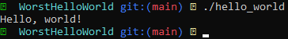

# Hello, World!

These words are probably some of the most familiar in programming.

"Hello, World!" is useful because printing a line of text is about the smallest program that still proves your source code can be parsed, compiled or interpreted, executed, and can interact with the outside world through output.

Whenever we learn a new language, framework, operating system, or really any new environment, one of the first things we tend to do is build the simplest end-to-end demonstration that works.

Conventionally, that is:

*Hello, World!*

Since this is the first entry I'm writing in this journal, I thought: why not start with the worst Hello World imaginable?

## Some History

I thought a little history might be interesting, so here we go.

The convention traces back mainly to Brian Kernighan. A version of the phrase appeared in his 1972 Bell Labs tutorial *A Tutorial Introduction to the Language B*, where an example printed `"hello, world."`

It became much more famous through Kernighan and Dennis Ritchie's 1978 book *The C Programming Language*, whose early example was essentially:

```c
main()
{
	printf("hello, world\n");
}
```

From there, the language we all know and love, C, became enormously influential. Its teaching conventions spread with it, and `"Hello, World!"` became part of programming culture.

## Hello World?

So there I was some years ago, scrolling through YouTube Shorts, as one does, when I came across this specific [short](https://youtube.com/shorts/pHqEuwjSdic?si=AHxhBfkxn0-Gionb).

*(Please appreciate how long it took me to find this again.)*

Other than the lovely singing, what caught my attention was the pattern across the programming languages.

Python is often treated as something close to the pinnacle of language simplicity. There is obviously a lot of nuance to that statement — Python can become very complicated very quickly — but for simple scripting, it is difficult to argue with.

So let's take the gold standard of `"Hello, World!"`, the Python approach:

```python
print("Hello, World!")
```

This is boring.

Or at least, that's what I thought.

Because naturally, the first thing that popped into my head was:

*I can probably ruin this way further.*

## Abstraction Inception

An abstraction is, broadly speaking, a generalization that hides some underlying complexity.

They are everywhere, and they are one of the main ways we make complicated systems understandable within the fairly limited framework of the human brain.

Programming languages themselves are abstractions.

At the lowest level, computers ultimately operate on bits and instructions. Manually working at that level for every task would be spectacularly inefficient, so over time we built increasingly convenient layers on top of it: assembly languages, higher-level languages, standard libraries, runtimes, frameworks, and so on.

The issue is that computers aren't smart.

I'm sure you've heard this before from your fifth-grade IT teacher, but it is fundamentally true: every operation a computer performs has to ultimately be expressed in terms that the machine understands.

Alright then, let's instruct it:

> *Put a `1` here. A `0` there. Another `0` there...*

Not a great experience.

Abstractions solve exactly this problem.

In modern software, a single operation you write can eventually expand into hundreds or thousands of lower-level operations. What you wrote is an abstraction sitting on top of another abstraction, which sits on top of another abstraction, with each layer eventually translating into something more concrete.

Sound familiar?

<div align="center">
	
</div>

This is exactly why Python comes so neatly wrapped for us. Once you lift the hood, you quickly realize just how much heavy lifting is being done underneath.

But this is a good thing.

It is what allows us to have neat little one-line Hello Worlds.

So the recipe for disaster is simple:

*The more abstractions we strip away, the more complicated — and therefore worse — our Hello World becomes.*

Yes, that is a drastic oversimplification.

For our purposes, however, it works perfectly.

## The Worst Hello World

Alright, let's build it.

We'll start with the full source code and dissect the mess afterwards.

```c
#if !defined(__clang__)
#error "Compile with clang >:("
#endif
#ifdef __cplusplus
typedef unsigned long pthread_t;
extern "C" {
#endif
#if !defined(__x86_64__) || __SIZEOF_POINTER__ != 8
#error "x86_64 Architecture required"
#endif

#ifndef _SSIZE_T
#define _SSIZE_T
typedef __typeof__(long signed int) ssize_t;
#endif
#ifndef _SIZE_T
#define _SIZE_T
typedef __typeof__(sizeof(int)) size_t;
#endif
#ifndef _UINTPTR_T
#define _UINTPTR_T
typedef __typeof__(sizeof(int)) uintptr_t;
#endif

#if !defined(__FEATURES)
# define __FEATURES
#define weak __attribute__((__weak__))
#define HIDDEN __attribute__((__visibility__("hidden")))
#define __weak_alias(old, new) \
	extern __typeof__(old) new __attribute__((__weak__, __alias__(#old)))
#if !defined(__always_inline)
# define __always_inline __attribute__((always_inline))
#endif
#endif

static HIDDEN __always_inline
uintptr_t	__get_tp(void)
{
	register uintptr_t	tp;
	__asm__ ("mov %%fs:0,%0" : "=r" (tp) );
	return tp;
}

struct __ptcb
{
	void (*__f)(void *);
	void *__x;
	struct __ptcb *__next;
};

struct __locale_map;

struct __locale_struct
{
	const struct __locale_map *_c[6];
};

typedef struct __locale_struct * locale_t;

struct __pthread
{
	struct __pthread *self;
#ifndef TLS_ABOVE_TP
	uintptr_t *dtv;
#endif
	struct __pthread *prev, *next;
	uintptr_t sysinfo;
#ifndef TLS_ABOVE_TP
#ifdef CANARY_PAD
	uintptr_t canary_pad;
#endif
	uintptr_t canary;
#endif
	int tid;
	int errno_val;
	volatile int detach_state;
	volatile int cancel;
	volatile unsigned char canceldisable, cancelasync;
	unsigned char tsd_used:1;
	unsigned char dlerror_flag:1;
	unsigned char *map_base;
	size_t map_size;
	void *stack;
	size_t stack_size;
	size_t guard_size;
	void *result;
	struct __ptcb *cancelbuf;
	void **tsd;
	struct
	{
		volatile void *volatile head;
		long off;
		volatile void *volatile pending;
	} robust_list;
	int h_errno_val;
	volatile int timer_id;
	locale_t locale;
	volatile int killlock[1];
	char *dlerror_buf;
	void *stdio_locks;
#ifdef TLS_ABOVE_TP
	uintptr_t canary;
	uintptr_t *dtv;
#endif
};

#if !defined(__EXIT_SUCCESS)
# define	__EXIT_SUCCESS	0
#endif
#if !defined(__EXIT_FAILURE)
# define	__EXIT_FAILURE	1
#endif

#ifndef __cplusplus
typedef struct __pthread * pthread_t;
#endif

#ifdef TLS_ABOVE_TP
#define __pthread_self() ((pthread_t)(__get_tp() \
	- sizeof(struct __pthread) - TP_OFFSET))
#else
#define __pthread_self() ((pthread_t)__get_tp())
#endif

#if !defined(errno) || !defined(_ERRNO)
HIDDEN __attribute__((const)) static
__always_inline int	*__errno_location(void)
{ return &__pthread_self()->errno_val; }
#define errno (*__errno_location())
#define _ERRNO
#endif

static HIDDEN __always_inline
long	__syscall_r(unsigned long __r)
{
	if (__r > -4096UL)
	{
		errno = -__r;
		return (-1);
	}
	return (__r);
}

static HIDDEN __always_inline long	__syscall3(
	long __n, long __a1, long __a2, long __a3)
{
	register unsigned long	r;
	__asm__ __volatile__ (
		"syscall" : "=a"(r) : "a"(__n), "D"(__a1),
		"S"(__a2), "d"(__a3) : "rcx", "r11", "memory");
	return (__syscall_r(r));
}

#if !defined(__NR_write)
#define __NR_write	1
#endif
#ifndef CHAR_BIT
#define CHAR_BIT	8
#endif

HIDDEN __attribute__((const)) static size_t	__bufsize(const char *__restrict__ s)
{
#if !defined (__BUFFER_ALIAS_TYPES)
#define	__BUFFER_ALIAS_TYPES
	typedef unsigned long int __attribute__ ((__may_alias__))	t_bytemask;
	typedef unsigned long int __attribute__ ((__may_alias__))	t_word;
#endif
	register const uintptr_t	s0 = (uintptr_t)s;
	register const t_word		*w = (const t_word *)(((uintptr_t)s) & \
									-((uintptr_t)(sizeof(t_word))));
	register const t_word		m = ((t_word)-1 / 0xff) * 0x7f;
	register t_bytemask			mask;
	register t_word				wi;

	if (!s || !*s)
		return (0);
	wi = *w;
	mask = ~(((wi & m) + m) | wi | m) >> (
			CHAR_BIT * (s0 % sizeof(t_word)));
	if (mask)
		return (__builtin_ctzl(mask) / CHAR_BIT);
	wi = *++w;
	while (!((wi - (((t_word)-1 / 0xff) * 0x01))
			& ~wi & (((t_word)-1 / 0xff) * 0x80)))
		wi = *++w;
	wi = (wi - ((t_word)-1 / 0xff) * 0x01) & ~wi & ((t_word)-1 / 0xff) * 0x80;
	wi = (__builtin_ctzl(wi) / CHAR_BIT);
	return (((const char *)w) + wi - s);
}

__weak_alias(__bufsize, __BUFSIZE);

static HIDDEN ssize_t	__write_impl(
	int __fd, const void *__restrict__ __buf, size_t __size
)
{
	return ((ssize_t)__syscall3(
		__NR_write, __fd, (long)__buf, (long)__size)
	);
}

__weak_alias(__write_impl, write);

#if !defined(__STDOUT_FILENO)
# define __STDOUT_FILENO	1
#endif

HIDDEN static void	*__memcpy_impl(
	void *__restrict__ dst,
	const void *__restrict__ src,
	size_t n)
{
	register unsigned char			*d = dst;
	register const unsigned char	*s = src;

	for (; (uintptr_t)s % 4 && n; --n) *d++ = *s++;

	typedef unsigned int __attribute__((__may_alias__)) _ui32;

	if ((uintptr_t)d % 4 == 0)
	{
		if (n & 8)
		{
			*(_ui32 *)(d + 0) = *(_ui32 *)(s + 0);
			*(_ui32 *)(d + 4) = *(_ui32 *)(s + 4);
			d += 8; s += 8;
		}
		if (n & 4)
		{
			*(_ui32 *)(d + 0) = *(_ui32 *)(s + 0);
			d += 4; s += 4;
		}
		if (n & 2)
		{
			*d++ = *s++;
			*d++ = *s++;
		}
		if (n & 1)
			*d = *s;
		return (dst);
	}
	for (; n; --n)
		*d++ = *s++;
	return (dst);
}

__weak_alias(__memcpy_impl, memcpy);

int	main(const int argc, char **argv, char *envp[])
{
	(void)(signed long)argc; (void)(unsigned char***)argv; (void)(void)envp;

	__attribute__((aligned(16)))
	const char _RAW[14] = {
		72, 101, 108, 108, 111, 44, 32,
		119, 111, 114, 108, 100, 33, 10
	};

	register const size_t _bytes = __BUFSIZE(_RAW);

	const char *_buf = (const char *)__builtin_alloca(_bytes);
	memcpy((void *)_buf, (const void *)_RAW, _bytes);

	register const ssize_t _written = write(
		__STDOUT_FILENO, _buf, _bytes);

	if (_written != (ssize_t)_bytes)
		return (__EXIT_FAILURE);
	
	return (__EXIT_SUCCESS);
}

#ifdef __cplusplus
}
#endif
```

There is obviously quite a lot going on here. If I saw this at work, I would probably just quit.

But hey, it works:



So let's actually try to figure out what is happening in this convoluted mess.

At its core, the entire thing is trying to perform one meaningful operation:

```c
write(1, "Hello, world!\n", 14);
```

That's basically it.

Everything else is scaffolding that reimplements pieces of libc so the program can eventually perform that operation without including a single standard header, plus a healthy layer of deliberate theatre on top.

A lot of the file is closely modelled after [musl libc](https://musl.libc.org/)'s internals.

Which, by the way, is a fantastic library and absolutely worth looking through.

If we strip all of that away, we're already about 90% of the way toward understanding the program.

But let's go through some of the shenanigans.

Fair warning: the next part gets technical.

### Thread-local `errno`

`__get_tp`, `__pthread_self`, and `__errno_location` exist largely so we can recreate something that libc would ordinarily do for us.

On x86-64 Linux, the `%fs` segment register is used as part of the thread-local storage mechanism. By reaching into the thread control structure, the program can find the thread's own `errno_val`.

That means this:

```c
errno = value;
```

eventually becomes something roughly equivalent to:

```text
%fs -> current thread -> errno_val
```

So `errno` here is genuinely thread-local, which is important for safety within our scope.

This is essentially the sort of machinery that normally sits invisibly inside libc.

### Raw Linux syscalls

Then we have:

```text
__syscall3
__syscall_r
```

`__syscall3` implements the x86-64 Linux syscall ABI directly.

The syscall number goes into `rax`, while the first three arguments go into:

```asm
rdi
rsi
rdx
```

Then we execute:

```asm
syscall
```

The instruction itself clobbers `rcx` and `r11`, which is why they appear in the inline assembly constraints.

Linux syscalls also don't behave exactly like normal C functions when errors occur. The kernel returns negative error numbers, generally in the `-1` through `-4095` range.

`__syscall_r` translates that into the convention C programmers are used to:

```c
return -1;
```

while also placing the actual error code into `errno`.

Again, this is normally something libc quietly handles for you.

We don't deserve such luxuries.

### Not `strlen`

Then there is:

```c
__bufsize
```

This is basically `strlen` wearing a fake moustache.

Rather than checking one byte at a time, it scans entire machine words and uses bit manipulation to detect whether one of those bytes contains zero.

The important expression is based around the classic zero-byte detection trick:

```c
(w - 0x010101...) & ~w & 0x808080...
```

This lets us determine whether any byte inside a machine word is zero without checking every character independently.

The implementation also contains some extra logic for handling an initially unaligned address.

We'll come back to why we need this.

### `memcpy`

Then:

```c
__memcpy_impl
```

This is just a tiny, questionable implementation of `memcpy`.

Nothing particularly profound here.

### `write`

And:

```c
__write_impl
```

is basically:

```c
__syscall3(__NR_write, ...);
```

It exists purely to expose our raw Linux syscall through something that looks like the familiar libc `write()` interface.

Finally, the `__weak_alias` macro re-exposes these implementations under ordinary-looking names:

```text
__write_impl   -> write
__memcpy_impl  -> memcpy
__bufsize      -> __BUFSIZE
```

So by the time we reach `main`, everything can pretend libc exists.

If any of this sounds interesting, I strongly recommend digging into libc implementations yourself.

If I explained every detail of what is happening here, this page would become significantly longer than it already is.

## Ruining the String

Then comes `main`.

This part is mostly theatre.

Leaving a perfectly readable:

```c
"Hello, world!"
```

inside the source code would introduce an unacceptable amount of simplicity.

So naturally, we have to get rid of it.

Let's dissect strings.

At a high level, a string is just an ordered collection of characters:

```text
'a', 'b', 'c' -> "abc"
```

But if we lift the hood one level further, those characters are represented by numbers.

Take ASCII, the character encoding most programmers will immediately recognize:

<div align="center">
	
</div>

It may look complicated at first, but the basic idea is extremely simple.

The character:

```text
'0'
```

has the ASCII value:

```text
48
```

Then:

```text
'1' -> 49
'2' -> 50
```

and so on.

If we convert:

```text
"Hello, world!\n"
```

into ASCII values, we get:

```text
72, 101, 108, 108, 111, 44, 32,
119, 111, 114, 108, 100, 33, 10
```

So instead of writing the actual string, we can hide it away as:

```c
_RAW = {
	72, 101, 108, 108, 111, 44, 32,
	119, 111, 114, 108, 100, 33, 10
};
```

Which is exactly what we do.

## Discovering the Length

Next, when writing data to stdout, we need to know how many bytes we intend to write.

To us, this is obvious:

```text
14
```

There are fourteen bytes, we could simply write that number directly. But that would be dangerously reasonable.

So instead, we "discover" it programmatically.

A conventional C string ends with a special null terminator:

```c
'\0'
```

This character has the numeric value:

```text
0
```

A basic `strlen` implementation therefore just walks through memory until it encounters that zero:

```c
size_t strlen(const char *s)
{
	if (!s)
		return 0;

	size_t count = 0;

	for (; *s; ++s)
		++count;

	return count;
}
```

That's essentially the whole concept.

Our implementation, however, is much more annoying.

Instead of testing one character at a time, `__bufsize` operates on machine words.

Conceptually, imagine checking several bytes at once:

```text
[ H ][ e ][ l ][ l ][ o ][ 0 ][ ? ][ ? ]
                         ^
                      found it
```

With some bit-manipulation magic, we can detect whether one of those bytes is zero without individually comparing every byte against zero.

That is the purpose of the SWAR-style zero-detection expression used inside `__bufsize`.

Real optimized `strlen` implementations use much more sophisticated versions of this general idea, often involving vector instructions and architecture-specific tricks.

Our version is mostly here because reading one byte at a time would be too simple.

## And the Rest?

The rest of the program is mostly mess with little practical application.

Decoration, essentially.

The entire exercise is deliberately taking functionality that is normally hidden behind:

```c
printf("Hello, World!\n");
```

or:

```python
print("Hello, World!")
```

and dragging pieces of the machinery underneath it back into view.

If a sufficiently clever compiler were allowed to optimize everything aggressively and prove that all this machinery is unnecessary, much of the nonsense would probably disappear.

Conceptually, we're still trying to arrive at:

```c
write(1, "Hello, world!\n", 14);
```

The difference is that we've taken the scenic route through programmatic hell.

There are two caveats worth mentioning, though:

1. `_RAW[14]` has no null terminator.
2. `__memcpy_impl` only behaves correctly for $n < 16$ (what this program expects).

Those would absolutely be real problems in a general-purpose implementation.

Within the extremely narrow and deliberately awful scope of this program, however, we get away with them.

The rest is mostly syntactic sugar, unnecessary machinery, or just garbage.

## Is It Really the Worst?

No.

I don't believe so.

I originally made this when I was still pretty new to this part of programming, and I'm pretty confident I could make it much worse now.

But if we zoom out far enough, our entire definition breaks down anyway.

If the "worst" implementation is simply the most convoluted and least readable one, then converting the whole thing directly into machine code would immediately make it worse.

But alright. Let's call that cheating.

Let's say it still has to be written in a programming language.

In that case, allow me to introduce you to Brainfuck:

```brainfuck
>++++++++[<+++++++++>-]<.
>++++[<+++++++>-]<+.
+++++++..
+++.
>>++++++[<+++++++>-]<++.
------------.
>++++++[<+++++++++>-]<+.
<.
+++.
------.
--------.
>>>++++[<++++++++>-]<+.
```

This is "Hello, World!" in Brainfuck.

This is a programming language.

An esoteric and deliberately ridiculous one, but a programming language nonetheless.

And I think it's safe to say it beats my Hello World.

But lets take this another step further:

```malbolge
b'BA@?>=<;:987654321r`oo,llH('&%
ed"c~w|{z9'Z%utsrqponmlkjihgfedc
ba`_^]\[ZYXWVUTSRQPONMLKJIHGFEDC
BA@#>~;|z8xwvuts10/.nm+*)i'&%fd
"ba`_^]yxwvXWsrqSonmPNjLKJIHGcb a
`BA]|[=YXW:8T654321MLKJ,+GF'E'CBA
$"~>}|{zy7654ts10/o-,+lj(hgfedc!
~}|^]yxwvYutsVTpRQPONMihgfHGcbaC_
^]@>Z<;:987SRQP21MLK-IHG*(D&%$#"
!=<;:zy765u321r/.-,+*)iX&%$dS!~}
|{zyxwvutsUDComlkjihgfedcFa`B1@
/[ZYXWVUTSRQPONM0K-zHGFEDCBA@?>=
<;{j87x543sb0/.-,+*)('&%$#"!b`0{
zyxZIutsrqSBQ@lkjihglldcba`B1j
```

This is Malbolge, yes, like the circle of hell; and yes, this outputs "Hello World".

Anyway, thank you for reading through!

As always, you can find the repository [here](https://github.com/Arty3/Worst-Hello-World/).
