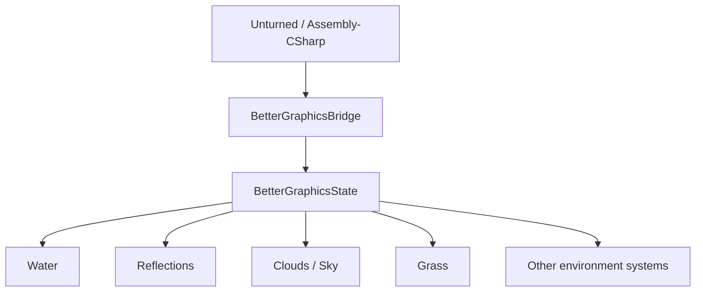
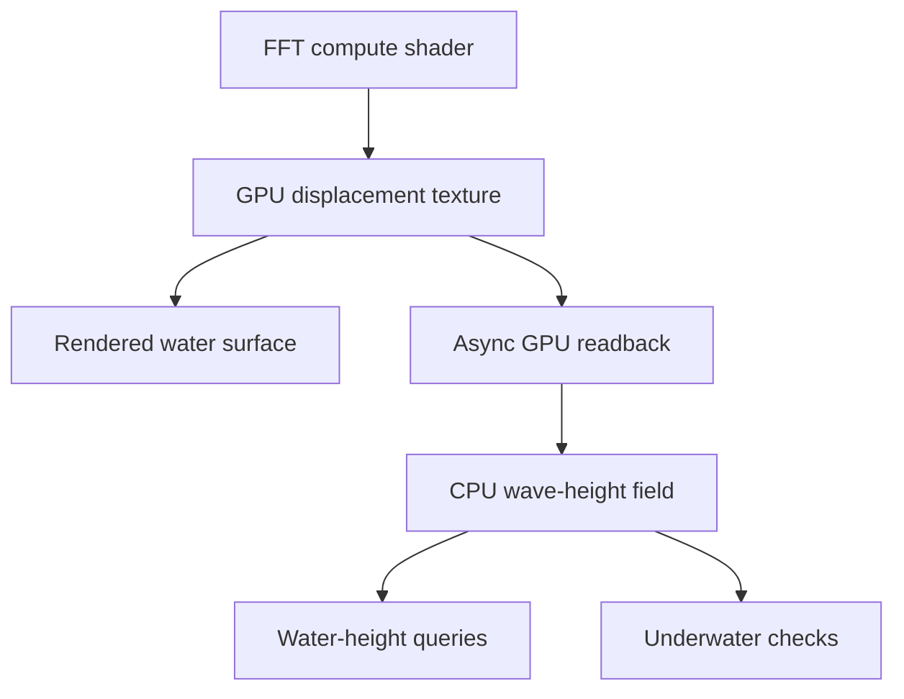
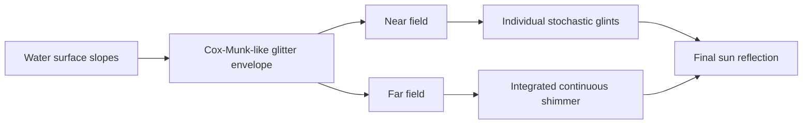

> [!IMPORTANT]
> This ended up being by far the longest entry I've written so far. As always, I try to keep the ideas and narrative understandable as I go, so hopefully there is still something interesting here for everyone :)

## A Week After Open Source

I have 4100 hours in Unturned. Yes, really!


Unturned is a free-to-play open world zombie survival sandbox game made by Smartly Dressed Games. Or at least, that is the official definition. To me, Unturned was, and is, much more. I hope that will become abundantly apparent later in the entry.

On July 7th, 2026, Nelson released the game's source code. I had known for months that it was coming, but when a friend told me it had finally happened I immediately went and checked Steam for an announcement to see for myself.

By that point, the last period where I could reasonably say I played the game consistently was probably around 2023, and even that is being generous. Since then I would occasionally launch it every few months, walk around for ten minutes, see what had changed, and close it again.

Still, the release meant considerably more to me than it probably would to most people.

I first started playing Unturned in 2017 and began playing it properly around 2019. For the next two or three years it became one of the games I played almost every day. A lot of my memories from that period are not particularly profound. They are mostly me and my friends laughing at stupid bugs, getting into arguments with random people, doing something absurd on a server, or spending an entire evening accomplishing nothing.

Unturned was a sandbox with a relatively small recurring community, so after a while you started seeing the same names everywhere. The players, groups, rivalries, server owners and developers became familiar, and the game started feeling less like something you queued into and more like a place you returned to.

Over time I ended up occupying quite a few different corners of that community. I primarily played PvP, and at one point I was considered one of the better players in the game, particularly as a sniper, usually recognised together with my main duo and group of friends. I traded skins and eventually accumulated one of the larger and more unusual collections around. Later I started writing plugins, which was how I originally learned C#, my second programming language, and eventually made a skins mod for other players to use.

Those projects deserve their own entries, but they also meant that I gradually stopped looking at Unturned purely as a player and started learning how the game actually worked.

That eventually included direct contact with Nelson, the creator of the game. Over the years I reported bugs to him, found and disclosed potential vulnerabilities, and received more feedback than I deserved while I was learning.

I want to especially thank him for his relentless dedication and effort in the community, even taking the time to answer my questions and those of countless other people. That level of engagement with a community is not especially common:


I mean, seriously, how did this guy ever put up with me. There are many more emails than that, and he has answered and engaged with every single one of them, and not just mine! Nelson, if you are ever reading this, I seriously respect that, and I'm beyond grateful.

Even before the official source release, Unturned being written in .NET meant the code was never particularly inaccessible anyway. Decompiling the game was easy, and projects such as the community-maintained [Unturned Datamining](https://github.com/Unturned-Datamining/Unturned-Datamining) repository already exposed most of it in a reasonably searchable form.

So the important part of the source release wasn't really that I could suddenly see some previously forbidden code. It was that working with it stopped being miserable.

I had actually thought about doing something similar to this project roughly two years earlier. The idea never got much further than that because I already knew from writing plugins how irritating it was to repeatedly dig through decompiled assemblies whenever I needed to understand another small part of the game. Doing that for something as invasive as a rendering overhaul sounded less like an interesting engineering challenge and more like self-inflicted punishment. There were other technical limitations as well, but effort was the main one. It was technically possible, just unpleasant enough that I had no desire to commit to it.

The proper source release changed that equation almost instantly.

There were plenty of directions I could have taken. Unturned has performance problems, old systems, and more than a decade of technical debt. Pathfinding becomes expensive as entity counts rise, large zombie populations can consume a significant amount of CPU time, and the game still carries architectural decisions from a very different era of Unity. There is no shortage of things that could be improved.

Graphics were simply more interesting to me, and they are also probably the most common criticism of the game. Unturned has retained roughly the same low-poly visual identity for most of its life. That identity is part of its charm, but technically the game has moved very little compared to what modern rendering can do. Players had made thousands of workshop mods, maps, plugins, items, vehicles and entire custom experiences, yet I had never seen anyone seriously try to overhaul the base rendering itself.

I wanted to know what would happen if someone did.

The closest comparison I had in my head was Minecraft with shaders. The first time you install a good shader pack, the underlying world has not changed. The blocks are still blocks, your old buildings are still there, and the game is still immediately recognisable, but suddenly the atmosphere is completely different. Water catches light properly, clouds have volume, grass moves, shadows stretch across things you have seen a thousand times, and familiar places become wonderful to look at again.

That was the feeling I wanted for Unturned. I did not want photorealism, and I did not want to replace the game's visual identity with something completely different. Making blocky characters stand on top of hyper-realistic terrain would have been fairly easy to make technically impressive and equally easy to make awful.

I wanted something more restrained: stylised but physically grounded, still obviously Unturned, but scenic, atmospheric and considerably more alive.

At this point I didn't have a concrete implementation plan. I had a mental image instead.

That is usually enough to get me into trouble.

This is what the vanilla game looks like, as a reference for what's to come:

<div align="left">
  
  
</div>

### Starting With the Sky

The first experiment was almost embarrassingly small. I started at night and replaced the sky with a simple field of glowing dots:


That was it. I was drawing "stars" into the sky and seeing whether the idea worked at all.

The stars were essentially yellow points scattered overhead, while the game's original cloud shapes were still sitting underneath them. Obviously this is very ugly, but it was enough to hook me into doing more. In retrospect, this was maybe a perfect first experiment. It was easy enough that I could spend more time being excited about seeing change in the scene than fighting an implementation.

From there, I removed the original clouds, brought some of the existing stars back into the composition, and started adding more atmospheric colour toward the horizon. The upper sky remained dark while the lower portion gradually shifted toward blue and teal, which gave it a sense of depth that the original flat sky lacked.


Honestly my idea here was to make a galaxy-like nebula thing. Instead it ended up looking like some kind of atmospheric effect, maybe an aurora, maybe weirdly coloured clouds, who knows, but as Bob Ross used to say, happy accidents. So I kept it.

The next step was making the stars stop looking like glowing dots slapped onto a background. I varied their size and intensity and softened the way they appeared until the sky felt more natural while still remaining stylised.


I deliberately left the moon alone. It was still the same simple Unturned moon, which was useful in a way because I could already see one of the problems that would follow me through the entire project. Improving one part of an image changes how every neighbouring part is perceived. The moon had not suddenly become worse, but against the new sky it was much easier to notice how simple it was — I mean, it looks like a ping pong ball for crying out loud.

Still, I had jokingly tried to turn the moon into some kind of "planet" just for the fun of it:


*Astrophysics.*

Sad accident. I didn't keep that.

Anyway, I was very excited. I had taken a part of a game I had known for years, changed very little, and immediately got a glimpse of the feeling I was looking for. Other people I showed it to seemed to share that reaction. Someone even offered me €50 to make them a custom sky, which was flattering considering I had been working on the thing for about half an hour.

More importantly, the game still looked like Unturned, which was the proof of concept I needed. I wasn't trying to make an impressive screenshot by replacing everything people recognised. I wanted to preserve that recognition and make the world around it feel new again.

Anyway, here is a quick before and after:

<div align="left">
  
  
</div>

With the night sky working reasonably well, I switched the game back to daytime and looked upward.

## Volumetric Clouds

I'm going to be upfront here: the vanilla clouds are probably the ugliest thing in the whole game, by far. There is no sugar coating this:


They are effectively flat shapes in the sky, which was exactly the sort of thing I wanted to move away from. Unlike the stars, though, I could not get very far by taking the existing idea and making it prettier. If I wanted clouds that had depth, changed shape as I moved around them, and caught light differently across their volume, I needed to actually render a volume.

I had worked with graphics before this project, but never really at this scale. In my studies, I had written CPU-based renderers for things like fractals, wireframes, and Doom-style raycasting.

Here's a cool fossil I found from that time period:

<div align="left">
  
  
</div>

Outside of that I had played with GLSL through a Minecraft clone and a procedural world generated almost entirely from sine-based noise. I understood what vertex and fragment shaders were, what noise functions did, and roughly how the graphics pipeline fit together, but there was still a fairly large gap between understanding those ideas individually and looking at something like volumetric clouds without it feeling like black magic.

As usual, the solution was to stop treating the end result as one mysterious thing and work downwards until it became a collection of smaller problems I could understand.

One of the resources that helped here was [Sebastian Lague](https://www.youtube.com/@SebastianLague)'s work on clouds — by the way, I think Sebastian's content is phenomenal, I can highly recommend checking it out.

Anyway, I did not end up using exactly the same implementation, but it pointed me towards ray marching, which is a surprisingly simple idea considering the things it can produce.

For every pixel on screen, I already know the camera origin

```math
\mathbf{o}\in\mathbb{R}^3
```

and can reconstruct a direction through that pixel

```math
\mathbf{d}\in\mathbb{R}^3,
\qquad
\|\mathbf{d}\|=1.
```

Any point along that ray can therefore be written as

```math
\mathbf{p}(t)=\mathbf{o}+t\mathbf{d}.
```

The cloud renderer defines a slab of space between a lower and upper altitude. If those planes are at $y_b$ and $y_t$, the ray intersects them at

```math
t_b=\frac{y_b-o_y}{d_y},
\qquad
t_t=\frac{y_t-o_y}{d_y}.
```

From those two values I can determine the section of the view ray which actually passes through the cloud layer. There is no reason to sample anything before the ray enters it or after it leaves, and opaque scene geometry can shorten the interval further. The basic ray march then becomes a numerical approximation: divide that interval into a finite number of steps, sample the cloud density at each one, and accumulate what happens as the ray passes through the volume.

That was enough to get the first version on screen:


... or maybe not.

Calling these clouds would be generous. They were more like large white smudges suspended in the sky.

Still, this was useful. I had proven that I could reconstruct a view ray, intersect it with a volume and put procedural density into that volume. The fact that the density looked terrible was now a much smaller problem than "how do I render clouds?"

The density itself was procedural. The basic building block was a small 3D value-noise function, where each integer lattice point is assigned a pseudo-random value and the values around the sample position are smoothly interpolated. I then combined several scales of that noise using fractal Brownian motion:

```math
f(\mathbf{p})
=
\sum_{i=0}^{n-1}
a_iN\left(\lambda_i\mathbf{p}\right),
```

where $N$ is the underlying value-noise function, $a_i$ decreases for each octave, and $\lambda_i$ increases. In my implementation there were only three octaves, with the frequency multiplied by roughly $2.03$ and the amplitude halved each time:

```hlsl
float fbm3(float3 p)
{
	float sum = 0.0;
	float amplitude = 0.5;

	for (int i = 0; i < 3; ++i)
	{
		sum += valueNoise3(p) * amplitude;
		p *= 2.03;
		amplitude *= 0.5;
	}

	return sum;
}
```

The lower-frequency field determined the broad coverage of the sky, while a higher-frequency field eroded that shape into smaller billows. Height was another part of the density function. For the original cumulus-like clouds I used a simple profile which peaked around the middle of the cloud layer and faded towards both boundaries. If

```math
h=
\operatorname{clamp}
\left(
\frac{y-y_b}{y_t-y_b},
0,1
\right),
```

then a convenient vertical profile is

```math
H(h)=4h(1-h).
```

This is zero at the top and bottom, one in the middle, and gives the volume a rounded vertical shape without requiring anything particularly sophisticated.

Combined with the horizontal noise field, a threshold controlling cloud coverage, and another noise field eroding the edges, the density was approximately

```math
\rho(\mathbf{p})
=
D
\left[
S(\mathbf{p})H(h)
-
E\left(1-F(\mathbf{p})\right)
\right]_+,
```

where $S$ represents the coarse cloud shape, $F$ the finer detail, $E$ controls erosion, $D$ controls overall density, and $[x]_+=\max(x,0)$.

That gave me the shape, but the white smudges were also missing most of what makes a cloud look three-dimensional. A density field tells me where the cloud exists, but not how light moves through it.

For a small segment of the camera ray with density $\rho_i$, length $\Delta t$, and extinction coefficient $\sigma$, the transmitted fraction can be approximated as

```math
T_i=e^{-\rho_i\sigma\Delta t}.
```

The transmittance along the full ray is then the product of these terms. Numerically, the renderer keeps a running value $T$. Each sample contributes some of its lighting according to how much light from that point can still reach the camera, then reduces the transmittance available to everything behind it:

```math
\mathbf{L}
\leftarrow
\mathbf{L}
+
T(1-T_i)\mathbf{L}_i,
```

```math
T\leftarrow TT_i.
```

The implementation is almost exactly that:

```hlsl
float stepTrans = exp(-density * _CloudAbsorption * dt);

accum += transmittance * (1.0 - stepTrans) * sampleLight;

transmittance *= stepTrans;
```

The final scene colour is then the original scene attenuated by the cloud volume, plus the light accumulated from the clouds themselves.

The remaining question was what `sampleLight` should actually be. A point deep inside a cloud should not receive the same sunlight as one sitting directly on its edge, so for every camera-ray sample with meaningful density I performed a second, much shorter march towards the sun. If the sample is at $\mathbf{p}$ and the sun direction is $\mathbf{s}$, I evaluate density at several points

```math
\mathbf{p}_j
=
\mathbf{p}
+
j\Delta l\,\mathbf{s},
```

and approximate the optical depth towards the light as

```math
\tau_l
\approx
\sigma_l
\sum_j
\rho(\mathbf{p}_j)\Delta l.
```

The amount of direct light reaching that cloud sample is then

```math
T_l=e^{-\tau_l}.
```

I kept this deliberately cheap. The final cloud renderer used only two light-march steps, and the density function itself had a cheaper path which kept the main cloud shape and detail erosion but skipped the wisps and some of the more expensive distance-dependent treatment. There was no point spending most of the frame accurately calculating shadows inside a cloud which would occupy a relatively small part of the final image.

The direction of that light also matters. Clouds do not scatter sunlight equally in every direction, and the bright edges visible when looking towards the sun are particularly important perceptually. For that I used the Henyey-Greenstein phase function,

```math
P(\cos\theta,g)
=
\frac{1-g^2}
{4\pi
\left(
1+g^2-2g\cos\theta
\right)^{3/2}},
```

where $\theta$ is the angle between the view ray and the light direction, and $g$ controls how strongly the scattering is biased forward or backward.

In practice I mixed this with a constant base term rather than treating it as a strictly physical atmospheric model. The goal was not to solve radiative transfer perfectly; it was to understand enough of it to reproduce the behaviour I wanted.

That distinction became increasingly important throughout the project. Physics was useful because it told me why something looked the way it did. Once I understood that, I was perfectly happy to cheat.

At this point I had almost all of the pieces in place, but the renderer still depended heavily on how well I sampled them. I think the parameter which finally pushed the whole thing over the edge was simply the number of ray-march steps.

A ray march is still only an approximation of an integral. With too few samples, thin structures disappear, density changes too abruptly between neighbouring points, and the result stops resembling the continuous field I am trying to render. I had spent all this time learning about density, extinction and light transport, only for one of the largest visual improvements to come from what was effectively just sampling it more.


And, somewhat unexpectedly, that was already almost it.

In the space of an afternoon I had gone from white smudges to something I was perhaps 95% happy with. Volumetric clouds had sounded considerably more frightening than they turned out to be.

The last 5% was much less cooperative.

First things first, the clouds were simply too close to the ground. Raising them a notch was fairly simple.

With that aside, the finished version used twenty view-ray steps. I experimented with reducing that to twelve, which noticeably improved performance, but the visual difference was obvious enough that I didn't think the trade was worthwhile. On my RTX 4080 Super the clouds generally cost somewhere around 20–30 FPS compared to the vanilla game, which was entirely acceptable for what I was trying to do. My rough target was that anything around an RTX 3070 or better should still manage at least 60 FPS, rather than trying to preserve Unturned's ability to run on your smart toaster.

If I had ever turned this into something intended for broad distribution, I probably would have exposed the step count, resolution and similar parameters as quality settings. For this project, twenty looked better, so twenty it was.

I also wanted the clouds themselves to move without looking like one giant texture sliding across the sky. The entire density field had a world-space drift, while the smaller-scale detail evolved separately over time.

There is a distinction here which seems obvious to me now but took some experimentation to get right: **translation is not evolution**.

If everything simply translates, the eye locks onto the smaller features and sees one rigid cloud-shaped object sliding across the sky. If everything only changes in place, the clouds boil without actually going anywhere. The final version did both, with the larger field travelling through the world while the finer structure evolved independently inside it.

Most of this was tuning rather than another fundamental change to the renderer. The one problem which consumed a genuinely disproportionate amount of time was much less exciting: at long distances, the edges became noisy.


This drove me slightly insane.

I spent hours trying to get rid of it. I no longer remember the exact sequence of fixes well enough to pretend that I do, which is one of the reasons I wanted to record this project while most of it was still relatively fresh. Fortunately, the source code is somewhat better at remembering than I am. One of the comments I eventually left in the shader reads:

```hlsl
// Cap the step size so distant clouds sample as cleanly as overhead ones
// (large dt + jitter = grain).
float dt = min((tExit - tEnter) / steps, 25.0);
```

The problem was at least partly a consequence of perspective. A fixed number of samples distributed across a much longer interval produces increasingly large gaps between them. I was also jittering the starting position of each ray to avoid obvious banding, so once those gaps became large enough the jitter itself began appearing as visible grain around distant boundaries.

Capping the maximum step distance stopped each individual sample from spanning an enormous section of the cloud field, which made the horizon considerably more stable. There was a trade-off: because the loop still had a fixed twenty iterations, a sufficiently long intersection could now stop before traversing the entire slab. I was effectively preferring stable local sampling of distant cloud structure over faithfully integrating every metre of an extremely long ray. The flatter cloud type would later receive some additional distance-dependent edge smoothing as well.

This is one of those places where the screenshots make the process look much cleaner than I remember it being. Getting the clouds from nothing to the previous screenshot had been surprisingly straightforward; chasing this comparatively tiny artefact afterwards took hours. I remember staring at it for far too long and eventually getting it into a state I was happy with, but most of the things I tried in between are simply gone.

The finished result looked like this:


There was no enormous architectural difference between this and the previous screenshot, which is almost the point. Most of what separated them was the kind of polishing work which can consume an absurd amount of time while producing a relatively small difference in a still image.

Looking back at them now, I think the main thing I would tweak is the variety. These are cumulus-style clouds — the big fluffy ones we see on a nice day — but I think the sparsity factor was a touch too low. Some thinner strips around the larger volumes probably would have helped a lot.

Once I was happy enough with the original cumulus-style clouds, I made a second cloud type using the same renderer rather than creating another system. Instead of the rounded height profile, the new preset used a broader and flatter density distribution with a lower cloud layer, producing something closer to an overcast or stratus formation. The underlying noise, ray marching, extinction and lighting were all the same; most of the difference came from parameters and from how the density field was shaped.


This became a general pattern in the project. I was much more interested in building systems whose parameters could express different environmental states than in writing a collection of unrelated effects. In the final cloud code, each new day rolls a different seed for the procedural field and chooses between the two broad cloud types, keeping that state for the day rather than having the sky randomly transform every few minutes. This was just a temporary implementation. Later, this would've turned into a cohesive weather system.

By the end of that afternoon, the clouds were more or less done. I never returned for some grand second rewrite, and the implementation in the repository is fundamentally the same strategy I arrived at during those first few hours.

That surprised me. The stars had been deliberately easy, but volumetric clouds were one of the first things in this project which I had expected to be genuinely intimidating. Instead, once I understood how to split the problem into density, ray marching, extinction and lighting, most of it fell into place remarkably quickly. The expensive part was not learning how to make clouds; it was convincing myself to stop touching the last few imperfections.

Considering how daunting shader work had seemed before this project, that was probably the first point where something changed in how I thought about it.

Shaders had gone from black magic to just hard, which is a much nicer category for something to be in.

## A Detour Into Temporal Anti-Aliasing

Before moving on to water, I noticed that the stars had started behaving strangely.

When I moved the camera, they would shimmer and jitter by a tiny amount. It was subtle enough that a screenshot could not really capture it, but in motion it made the entire night sky feel unstable. I started reducing the problem to increasingly simple test patterns to determine whether it was coming from my star generation, coordinate system, noise, projection, or something else.

<div align="left">
  
  
</div>

(These are screenshots from when I was trying to visually debug the rendering systems.)

After around half an hour I had simplified things far enough that the behaviour no longer made sense as a bug in my own star code. That narrowed the search considerably, and the actual cause turned out to be Unturned's temporal anti-aliasing.

TAA works by slightly perturbing the camera projection every frame. Rather than sampling every pixel from exactly the same position each time, the projection is shifted by a sub-pixel amount, producing a sequence of slightly different samples which can then be accumulated over time to recover information that a single frame would not contain.

Conceptually, if the normal projection matrix is $P$, TAA produces a sequence

```math
P_0,P_1,\ldots,P_n
```

with small offsets in the projection terms. The problem was that the main scene was being rendered with this jittered matrix, while my post-process reconstructed its view rays using a projection matrix captured from C# after Unity's post-processing system had already reset it. The scene and the stars were therefore reconstructing the same pixel from slightly different projections.

For a perspective projection, taking $Z=-1$, the horizontal clip-space relationship is

```math
x_{\mathrm{ndc}}
=
P_{00}X-P_{02}.
```

Rearranging gives

```math
X=
\frac{x_{\mathrm{ndc}}+P_{02}}{P_{00}},
```

and equivalently for $Y$,

```math
Y=
\frac{y_{\mathrm{ndc}}+P_{12}}{P_{11}}.
```

The important terms here are $P_{02}$ and $P_{12}$, because that is where the temporal projection jitter lives. Rather than passing an already-reset projection matrix from C#, I rebuilt the ray directly from Unity's live `unity_CameraProjection` inside the shader:

```hlsl
float2 ndc = output.texcoord * 2.0 - 1.0;

float3 viewRay = float3(
	(ndc.x + unity_CameraProjection[0][2])
		/ unity_CameraProjection[0][0],
	(ndc.y + unity_CameraProjection[1][2])
		/ unity_CameraProjection[1][1],
	-1.0
);
```

The camera-to-world rotation itself did not contain any temporal jitter, so that could still safely come from C#.

It was a relatively small fix, but I carried the lesson forward. Visual bugs are particularly easy to misdiagnose because the final pixel is the product of so many systems. The fact that the stars were moving did not mean the star renderer was moving them. Once I had reduced my own code far enough that it could no longer plausibly explain the behaviour, the useful question became what else in the rendering pipeline could.

A few days later, when the water renderer had grown into a pile of reflection, refraction, depth, foam and lighting terms interacting with one another, that experience became one of the reasons I built a much more deliberate visual debugging system.

With the jitter fixed, the sky was in a good enough place to move on. Before starting on water, though, I stopped writing graphics code for a moment.

## From Experiment to System

The night sky had taken around an hour. The clouds took an afternoon. Between the two, the original question had already been answered: yes, I could change the atmosphere of Unturned substantially without making it necessarily stop feeling like Unturned.

At that point, continuing to drop replacement code directly into the project would have been the easiest thing to do, but it would also have been a fairly good way to make the fork miserable to maintain. The source had only just been released and was going to continue changing upstream, so every unnecessary edit I made to the game's own files was another future merge conflict waiting for me.

On roughly the third day, I therefore stopped adding visible features for a while and reorganised the project.

Everything I was building moved under a separate `BetterGraphics` assembly. The rule was that the graphics engine should not know about Unturned unless it absolutely had to. It could use normal Unity surfaces such as the camera, `RenderSettings`, materials and shader globals, but game-specific types such as `WaterVolume`, `LevelLighting`, foliage data and the various internal managers would stay outside.

There was also a Unity-specific reason this boundary made sense. An assembly defined through an `.asmdef` cannot reference the predefined `Assembly-CSharp` assembly, which is where the game's code lives. `BetterGraphics` therefore could not directly reach Unturned's types even if I had wanted it to.

That constraint made the architecture fairly natural. I kept one deliberately boring bridge between the two sides.



`BetterGraphicsBridge` lives on the game side, where it can see `WaterVolume`, terrain data, player state and everything else owned by Unturned. It pushes only the information the graphics systems actually need into `BetterGraphicsState`, and in the other direction applies the handful of overrides required to replace vanilla behaviour, such as swapping the game's water shader or suppressing the old grass renderer. The graphics side contains the actual simulation and rendering logic.

I left myself a fairly explicit comment about what belonged in the bridge:

```csharp
// Keep it to overrides only: no simulation,
// no rendering, no engine logic.
```

That is more or less the entire philosophy. The state object became a small environment bus instead of letting the individual systems reach directly into the game for whatever they happened to need. Water could publish values that the underwater renderer needed, the bridge could push in the current sea colour, and a future wind system could drive clouds, foliage and particles without each of those systems having to know how the others worked.

The runtime engine itself was similarly small. Systems implemented a common interface,

```csharp
public interface IBetterGraphicsSystem
{
	int Order { get; }

	void Initialize();
	void Tick(float deltaTime);
	void Shutdown();
}
```

and the engine ticked them in dependency order.

Sky effects such as stars and clouds remained in Unity's post-processing pipeline and rendered themselves there rather than being part of that chain.

None of this made the screenshots prettier. I did it because the experiment had already worked, and if I was going to keep expanding it, I wanted the structure underneath it to survive that expansion.

It held up surprisingly well. When I eventually released the source for other community developers to inspect or use however they saw fit, one of them who had followed the project closely told me that what impressed him was how little of the original game code I had changed, and that the whole thing could fairly easily have been turned into a module:


I liked hearing that, particularly because the renderer had become considerably less self-contained conceptually by then. The next system alone would eventually involve procedural geometry, FFTs, reflection cameras, GPU compute, asynchronous readback, depth fields, optical absorption, refraction, caustics, buoyancy and enough debug visualisations that I assigned an entire function key to cycling through them.

I knew none of that when I reorganised the project. At that point I had simply looked at the water and decided that would be next.

## Starting Underwater

Water was the system I was most excited to work on, and also the one I expected to be the hardest.

My main references were Sea of Thieves and Subnautica 2:

<div align="left">
  
  
</div>

They approach water very differently, but share something I cared about much more than technical realism: the water feels like part of the world rather than a transparent plane with a texture moving over it. Sea of Thieves gets an enormous amount of character out of the shape and motion of its surface, while Subnautica 2 does particularly well underwater. Light moves across the seabed, the colour changes with depth, the surface above you feels like a boundary between two different media, and the whole thing has enough movement that even standing still and looking around is interesting.

The clouds had seemed technically intimidating and then turned out to be surprisingly manageable. Water would be very different. I knew roughly what I wanted it to feel like, but almost none of the reasons why the water I liked actually looked the way it did.

I assumed the surface would be the harder part, so naturally I started underneath it. The first thing I wanted was caustics:


> [!NOTE]
> To avoid confusion, the bubbles you see are part of the base game. Multiple people have asked me about this, so I thought I'd clarify.

Caustics are the moving bands of concentrated light visible on the bottom of a body of water. They exist because the water surface is not flat: every change in its normal changes how the incoming light refracts, causing neighbouring rays to converge or diverge as they travel through the water. Where they converge, the same amount of incoming energy is concentrated into a smaller area and the seabed becomes brighter.

At an air-water boundary, refraction is governed by Snell's law,

```math
n_1\sin\theta_1=n_2\sin\theta_2,
```

where $n_1$ and $n_2$ are the refractive indices of the two media, and $\theta_1$ and $\theta_2$ are the corresponding angles from the surface normal. For air into water, $n_1\approx1$ and $n_2\approx1.333$, so even with effectively parallel incoming sunlight, a changing surface normal produces a changing refracted direction.

A more physically complete caustic renderer could therefore take every point $\mathbf{x}$ on the water surface, refract the sunlight using the local normal, intersect the resulting ray with the seabed, and obtain a mapping

```math
\mathbf{b}=F(\mathbf{x})
```

from surface coordinates to points on the bottom. The brightness at the destination is related to how much that mapping compresses local area. Roughly,

```math
I(\mathbf{b})
\propto
\frac{1}
{\left|\det J_F(\mathbf{x})\right|},
```

where $J_F$ is the Jacobian of the mapping. When neighbouring surface points are mapped very close together, the determinant becomes small and the intensity rises. That is the focusing behaviour we visually recognise as a caustic.

I did not start by implementing that.

While researching Subnautica 2, what I found suggested that its caustics were not being calculated from the live water surface at all. The effect was based on a pre-rendered looping animation projected through the environment. I actually think this is a very sensible engineering decision. Caustics are expensive to simulate properly, and if a looped texture gives the player essentially the same perceptual result while letting a broader range of machines run the game, then there is a good argument that this is exactly what a production renderer should do.

Still, I found it slightly disappointing, because I wanted the water in this project to eventually feel like one coherent system. Playing back a recorded caustic animation felt a little too disconnected from that idea, so I decided to generate mine procedurally instead.

The first implementation was a tiled interference function rather than an actual physical ray simulation. The core idea was to repeatedly distort a 2D coordinate with trigonometric functions and accumulate the inverse distance of the resulting pattern. In simplified form, I was iterating something along the lines of

```math
\mathbf{i}_{k+1}
=
\mathbf{p}
+
\begin{bmatrix}
\cos(t_k-i_{k,x})+\sin(t_k+i_{k,y}) \\
\sin(t_k-i_{k,y})+\cos(t_k+i_{k,x})
\end{bmatrix},
```

then building an intensity from the warped coordinates before sharpening it into narrow filaments. The final implementation still contains the same basic idea:

```hlsl
float causticWeb(float2 uv, float time, float sharpness)
{
	float2 p = fmod(uv * TAU, TAU) - 250.0;
	float2 i = p;
	float c = 1.0;
	const float intensity = 0.005;

	for (int n = 0; n < 3; ++n)
	{
		float t = time * (1.0 - (3.5 / float(n + 1)));

		i = p + float2(
			cos(t - i.x) + sin(t + i.y),
			sin(t - i.y) + cos(t + i.x)
		);

		c += 1.0 / length(float2(
			p.x / (sin(i.x + t) / intensity),
			p.y / (cos(i.y + t) / intensity)
		));
	}

	c /= 3.0;
	c = 1.17 - pow(c, 1.4);

	return pow(abs(c), sharpness);
}
```

Two differently rotated versions of this field were eventually layered over one another, with a slowly evolving noise warp preventing the tile period from becoming too obvious. That produced something which behaved much more like moving focused light than a simple scrolling texture, while still being cheap enough to evaluate directly in the shader:


The first result was rough, but I liked it enough to continue. I experimented with making the pattern larger because Subnautica 2 uses quite broad, readable caustic shapes, but simply scaling mine up did not produce the same effect. Instead of becoming more dramatic, the pattern started looking like a large texture projected onto the world:


That became another useful reminder that copying the scale of an effect does not reproduce the reason the effect works. Subnautica's caustics exist inside a completely different lighting model, water volume, material system and visual composition. Increasing one parameter in mine could not reproduce the rest of that context.

I also quickly noticed that projecting caustics only onto the terrain broke the illusion as soon as anything else entered the water. If the seabed was covered in moving light while the player, vehicles and other objects remained uniformly lit, they looked like they had been composited into the scene afterwards, so I applied the same underwater treatment to them as well:


At this point the above-water and underwater rendering were still largely separate systems. I was treating the caustics as an underwater effect and the surface as another problem I would solve afterwards, but in hindsight that was already the wrong mental model. The two sides describe the same body of water, so eventually they would need to agree about the same light, surface motion, depth and wave field.

I would come back and unify them later. For now I had moving light on the seabed, which was enough reason to finally face the part I had been avoiding.

## A Few Sines and a Plane

Unturned's vanilla water geometry is extremely simple. It's effectively one extensive flat sheet, with vertices spaced far enough apart that there is no useful geometry available for small surface displacement.

I did not replace it immediately. For some reason, changing the actual water geometry felt like it might become a large integration problem, so my first surface experiment stayed as close to the existing setup as possible. I added a few sine waves and displaced what I could.

The result was horrible:


There is not much point being charitable about this screenshot. It looked like a blue sheet of plastic that somebody had slightly bent.

This was roughly where the project changed character for me.

Looking at this screenshot now, I can point at the geometry, surface normals, reflection, lighting, depth response and optical behaviour and give a fairly coherent explanation for why it does not look like water.

At the time, I just knew that something was very wrong.

Someone experienced with water rendering could probably have looked at it and immediately identified several of the things I was missing. I had none of that intuition yet. I was closer to a child trying to put the triangle through the circular hole: I had a collection of things which seemed vaguely water-shaped, several references pulling me in slightly different directions, and an image in my head which stubbornly refused to appear.

So I tried things. A lot of things.

Most of those attempts no longer exist, and I don't remember them well enough to reconstruct some neat historical sequence now. The actual loop was much messier. I would change something, rebuild, launch the game, wait a little over a minute for it to load, look at the river, decide whether it seemed any better, and then try something else. Sometimes I had a reasonable hypothesis. Sometimes I would spend time looking at Sea of Thieves, Subnautica or actual water trying to understand what my own image was missing. Sometimes I simply moved a value because I had no better idea.

There were also points where I would just sit looking at the same scene for the better part of an hour because I could tell that something was wrong and genuinely did not know what I should try next.

Realistically, I should've just looked deeper into articles online, tutorials, and maybe even papers. Thing is, I'm stubborn, like really stubborn. None of the online resources gave me what I wanted, and I really didn't want to sit through hours of reading archived papers and articles from 5000 B.C., nor watching YouTube videos asking me to subscribe and giving me a half-baked solution to something that might not even apply.

I never found this defeating. I wasn't angry at the renderer or bored by the repetition, and I never had some dramatic moment where I wanted to give up. This is exactly the sort of problem I tend to enjoy. Every dead end gave me slightly more information, and every now and then some tiny change would finally make one part of the image click into place.

In retrospect, I simply found this to be more enjoyable than online archeology.

> [!IMPORTANT]
> I want to clarify that the screenshots throughout this section make the progression look much more deliberate than it was. They are the checkpoints I happened to preserve. Between them were a very large number of states which either disappeared from the code a few minutes later or weren't interesting enough to screenshot in the first place. Once I reached a checkpoint, I spent significantly longer understanding what made it work, and perhaps what was next.

With that said, the mathematical idea behind this particular checkpoint was perfectly reasonable. A one-dimensional travelling sine wave can be written as

```math
h(\mathbf{x},t)
=
A\sin\left(
\mathbf{k}\cdot\mathbf{x}
-
\omega t
+
\phi
\right),
```

where $A$ is the amplitude, $\mathbf{k}$ determines the direction and spatial frequency, $\omega$ determines the temporal frequency, and $\phi$ is a phase offset. Summing several of these gives a more complicated height field,

```math
h(\mathbf{x},t)
=
\sum_{j=1}^{N}
A_j
\sin\left(
\mathbf{k}_j\cdot\mathbf{x}
-
\omega_jt
+
\phi_j
\right).
```

This can make a surface move, but I was beginning to learn how little "it moves like water" actually says about whether something looks like water. Even then, saying that it moves like water is a significant overstatement.

The first thing I latched onto was the surface normal. My original attempt had almost none of the smaller-scale variation which breaks a real water surface into highlights and distorted reflections, so adding more structure there seemed like an obvious place to start.

A height field $h(x,z)$ has tangent directions approximately given by

```math
\mathbf{t}_x=
\begin{bmatrix}
1\\
\frac{\partial h}{\partial x}\\
0
\end{bmatrix},
\qquad
\mathbf{t}_z=
\begin{bmatrix}
0\\
\frac{\partial h}{\partial z}\\
1
\end{bmatrix}.
```

Their cross product gives a normal proportional to

```math
\mathbf{n}
\propto
\begin{bmatrix}
-\frac{\partial h}{\partial x}\\
1\\
-\frac{\partial h}{\partial z}
\end{bmatrix},
```

which can then be normalised.

Rather than calculating a detailed height field at every fragment, I moved towards the common approach of sampling normal maps at different scales and offsets. At this point the implementation was still fairly simple: two independently moving samples already created much richer local variation than one repeated texture because their interference pattern continually changed over time.

The system in the final source is considerably more elaborate than what existed at this point, but the basic idea started here. Since the normal field becomes relevant throughout the rest of the renderer, it is probably easier to explain where it eventually ended up now rather than repeatedly reintroducing pieces of it later.

The important distinction is that I did **not** sit down after the screenshot above and calmly design everything which follows. It grew incrementally as I kept looking at the surface, deciding that something still felt wrong, and finding another thing to change.

The normal map itself was eventually generated from fractal noise. If $H(x,z)$ is the generated height field, I approximated its derivatives using finite differences,

```math
\frac{\partial H}{\partial x}
\approx
\frac{H(x+\varepsilon,z)-H(x,z)}
{\varepsilon},
```

```math
\frac{\partial H}{\partial z}
\approx
\frac{H(x,z+\varepsilon)-H(x,z)}
{\varepsilon},
```

then constructed the normal from those slopes. The final bake does essentially this, with the negation from the normal expression above folded into the subtraction order:

```hlsl
float h = fbmP(p, _Period);
float hx = fbmP(p + float2(e, 0.0), _Period);
float hz = fbmP(p + float2(0.0, e), _Period);

float3 n = normalize(float3(
	(h - hx) * _Strength / e,
	1.0,
	(h - hz) * _Strength / e
));
```

The baked texture only stores the horizontal tilt $n_x,n_z$. Because the normal represents a height field, its vertical component is always positive and can be reconstructed as

```math
n_y
=
\sqrt{
1-n_x^2-n_z^2
}.
```

That saves a channel in the texture and leaves the final strength of the normal as something I can adjust at runtime rather than having to rebake it.

By the final version I was sampling this field in three frequency bands. Each octave had its own scale, direction and drift rate, with the broadest layer carrying most of the weight and progressively finer layers adding chop on top. The exact scales eventually settled around $0.35$, $1$ and $3.1$ times the base ripple frequency.

Simply sampling three scales still looked too much like textures sliding over one another if they all moved in roughly the same way, so I gave every octave a slightly different heading around the dominant wind direction and a different translation rate.

This brought me back to the same distinction I had already run into with the clouds: **translation is not evolution**.

A field

```math
N(\mathbf{x}-\mathbf{v}t)
```

moves through the world, but its internal shapes never change. Every little ripple remains exactly the same ripple forever, just in a different position. What I wanted was both motion and deformation, so before sampling the octaves I warped the world coordinate using a slowly changing noise field

```math
\mathbf{q}(\mathbf{x},t)
=
\mathbf{x}
+
A_w
\begin{bmatrix}
N(\mathbf{x}s_w,tv_w) - \frac{1}{2}\\
N(\mathbf{x}s_w,tv_w+\phi) - \frac{1}{2}
\end{bmatrix},
```

where $s_w$ controls the scale of the warp, $v_w$ its rate of evolution, and $A_w$ its magnitude.

The implementation uses two samples from a 3D value-noise field, with time acting as the third coordinate:

```hlsl
float3 warpCoord =
	float3(
		worldXZ * _WsWarpScale,
		_Time.y * _WsWarpSpeed
	);

float2 warp =
	(
		float2(
			valueNoise3(warpCoord),
			valueNoise3(warpCoord + 37.1)
		)
		- 0.5
	)
	* _WsWarpAmount;
```

That warped coordinate is shared by all three octaves, but scaled relative to each octave's wavelength. This matters because a displacement of two metres means something completely different to a six-metre swell than it does to a sixty-centimetre ripple. Applying the same offset in world metres made the high-frequency layer boil around while barely affecting the low-frequency one.

The final samples looked roughly like

```hlsl
float2 p0 = worldXZ + warp * 1.00 + d0 * (t * 0.6);
float2 p1 = worldXZ + warp * 0.35 + d1 * t;
float2 p2 = worldXZ + warp * 0.11 + d2 * (t * -1.6);
```

with a downstream-advection path already present for a terrain flow field, although the final bake never actually populated that flow direction.

Combining the normals also needed some care. Averaging three normal vectors allows opposing tilts to cancel one another and unnaturally flatten the surface, so instead I combined the horizontal tilts additively while multiplying their upward components:

```math
\mathbf{t}
=
w_0\mathbf{t}_0
+
w_1\mathbf{t}_1
+
w_2\mathbf{t}_2,
```

```math
y
=
n_{0y}n_{1y}n_{2y},
```

and reconstructed the final normal as

```math
\mathbf{n}
=
\frac{
\begin{bmatrix}
t_x & y & t_z
\end{bmatrix}^{T}
}{
\left\|
\begin{bmatrix}
t_x & y & t_z
\end{bmatrix}^{T}
\right\|
}.
```

The source ended up referring to this as a whiteout-style blend. The practical result was that the broad swell could establish the direction of the surface while progressively finer structure sat on top of it without simply averaging the whole thing back towards flat.

Much later, when I unified the caustics with the surface, I reused the same domain warp there as well. If the caustic field represents light focused by these ripples, allowing the two fields to deform independently would make the bright pattern on the seabed slowly wander away from the surface supposedly producing it, which was exactly the kind of incoherence I was increasingly trying to remove.

That was where the normal system eventually ended up. At the point I was actually working through these first surface experiments, I was still discovering most of those problems one at a time.

The extra normal detail made the surface considerably more convincing, but it also made it almost completely white:


My first instinct was that I had simply overdone some reflection or specular term, and I spent a while pushing those values around without getting anywhere particularly useful. Switching the game to night made the actual problem much easier to see:


The surface was still brightly illuminated even though the world around it was dark. I had effectively created fake light.

Written down now, that sounds fairly obvious. At the time I was looking at a bright river after changing several parts of the shader and trying to work out which one of them had actually gone wrong.

A normal tells me which direction a surface patch faces, but it does not tell me how much incoming light exists in that direction. I could make the normal field as sophisticated as I wanted; if I fed it an illumination term which did not track the environment, the water would continue glowing on its own.

This was one of the first points where I started understanding that convincing water was not going to come from stacking independent tricks until the image happened to look right. Reflection affected colour, normals affected reflection, lighting affected both, and every new thing I added changed how I perceived everything already there.

Fixing the fake light at least got the surface into the broad category of "water".

Not particularly good water yet, but water-ish.

## Reflection

Once the fake lighting was fixed, reflection became much harder to ignore.

The sky probe was enough to suggest that the surface was reflective, but it could not actually reflect nearby terrain, trees, structures or anything else surrounding the river. A cubemap records the world from one point, while the reflection on a water surface needs to change depending on where the camera is standing.

For a flat water plane, planar reflection is fortunately much easier than general reflection. Let the water plane be

```math
\Pi:
\mathbf{n}\cdot\mathbf{x}+d=0,
```

with unit normal $\mathbf{n}$. A point $\mathbf{x}$ reflected across that plane becomes

```math
\mathbf{x}'
=
\mathbf{x}
-
2
\left(
\mathbf{n}\cdot\mathbf{x}+d
\right)
\mathbf{n}.
```

For a horizontal plane this is conceptually just mirroring the camera vertically through the surface. Instead of trying to somehow reconstruct the reflected world inside the water shader itself, I created a second camera, reflected the main camera's view across the water plane, rendered the result into a texture, and sampled that texture from the surface.

In the final implementation I reflected the view matrix rather than physically moving the reflection camera's transform. That kept the temporary mirrored position invisible to anything in the game which might inspect camera transforms during the frame.

The core of it looks like this:

```csharp
Vector3 normal = Vector3.up;
Vector3 position = new Vector3(0f, planeY, 0f);

float d = -Vector3.Dot(normal, position) - clipOffset;

Matrix4x4 reflection =
	CalculateReflectionMatrix(
		new Vector4(normal.x, normal.y, normal.z, d)
	);

reflectionCamera.worldToCameraMatrix =
	source.worldToCameraMatrix * reflection;
```

The reflection matrix is a standard Householder reflection. For a plane through the origin with unit normal $\mathbf{n}$, the linear part is

```math
R=I-2\mathbf{n}\mathbf{n}^{T}.
```

The additional translation terms account for a plane whose offset $d$ is non-zero.

On paper this part is pleasantly clean. Mirror a camera, render from it, put the texture onto the water.

In the game, naturally, it immediately broke in several different ways.

The first problem was clipping:


This screenshot is from much later, but the problem appeared almost immediately. I unfortunately don't have a clear earlier screenshot, and I don't remember every version of the fix anymore either. What I do remember is that this one followed me for quite a while.

I say *fix* loosely, mitigation is more appropriate. This is because even in the version of the project I eventually left behind, it isn't completely gone. I mitigated most of it, but this was one of those bugs I expected to return to during a later polishing pass which never happened.

The reflection camera has to render the world **above** the water surface while rejecting geometry underneath it. Otherwise the riverbed, submerged rocks, or even parts of the player can appear inside the reflected scene as though they were floating above the water.

The camera therefore needs an oblique near clip plane aligned with the surface. In camera space, if the plane is represented by

```math
\mathbf{q}
=
\begin{bmatrix}
a & b & c & d
\end{bmatrix}^{T},
```

the projection matrix can be modified so that this arbitrary plane becomes the near clipping boundary. Unity exposes this through `CalculateObliqueMatrix`, so once I transformed the water plane into the reflection camera's coordinate system I could use it directly:

```csharp
Vector4 clipPlane = CameraSpacePlane(
	reflectionCamera,
	position,
	normal,
	clipOffset
);

reflectionCamera.projectionMatrix =
	source.CalculateObliqueMatrix(clipPlane);
```

Getting the clip position wrong produced exactly the kind of artefacts visible in the screenshot: geometry disappearing where it should not, or submerged geometry leaking into the reflection.

The irritating part was that there wasn't one magic clip value which behaved perfectly everywhere. Near shore, putting the plane too far underneath the surface allowed submerged geometry through. Farther out, moving it too aggressively could start clipping geometry which should still have been visible.

The final implementation therefore varies the offset with depth rather than treating it as one constant. In shallow water the plane sits only around $0.05\,\mathrm{m}$ below the surface, while in deeper water it moves towards roughly $0.7\,\mathrm{m}$ below, with the transition happening over around $8\,\mathrm{m}$ of depth. I also keep a small clearance so the mirrored camera itself never ends up effectively sitting on top of its own clip plane.

It made the problem substantially better, though it didn't disappear. I suspect now that in the final version of the water, the bug persists largely due to the geometry I made for the water.

This is one of those little details which I think the final screenshots hide quite well. A renderer can look convincing in the views you choose while still containing several annoyances waiting just outside the frame.

The other early reflection bug was much less mathematical. The terrain underneath the grass rendered completely black:


At first this looked like something must be fundamentally wrong with the reflection camera. The geometry was there, the grass was there, but the terrain underneath it had somehow become a black void.

Funny enough, I hadn't even noticed it for two days or so. I just kept going, occasionally thinking, "something isn't quite right here...", while somehow missing the very obviously broken reflection.

In any case, it turned out to be a Unity-specific detail.

Unity's terrain splat rendering expects textures to be bound through its normal terrain render path. My manually rendered reflection camera was not receiving them correctly, so the reflection pass saw black terrain even though the main camera rendered it normally.

The workaround was to temporarily force each terrain to use its pre-baked basemap while the reflection camera rendered:

```csharp
for (int i = 0; i < terrains.Length; ++i)
{
	basemapCache[i] = terrains[i].basemapDistance;
	terrains[i].basemapDistance = 0f;
}

reflectionCamera.Render();

for (int i = 0; i < terrains.Length; ++i)
{
	terrains[i].basemapDistance = basemapCache[i];
}
```

It is not a particularly glamorous part of rendering water, but this sort of problem was becoming just as relevant as the shader mathematics themselves. Knowing how reflection works is one problem; persuading a twelve-year-old Unity project to render correctly from a camera it was never expecting is another.

That distinction became very normal over the next few days. I would learn some rendering principle, implement it, and then discover that the actual game had its own completely unrelated opinion about whether I was allowed to use it.

Once the reflection worked reliably enough, I distorted the reflected image using the surface normal so that it moved with the water rather than behaving like a perfect mirror. The basic reflected direction for a view vector $\mathbf{v}$ and unit surface normal $\mathbf{n}$ is

```math
\mathbf{r}
=
\mathbf{v}
-
2
\left(
\mathbf{v}\cdot\mathbf{n}
\right)
\mathbf{n},
```

although for the planar reflection texture I was really using the normal field to perturb the corresponding screen-space sample.

This already helped considerably. The environment was finally part of the water rather than just sitting around it.

Of course, reflection was only half the problem.

### Refraction

I also needed to see through the surface.

Because I already had the rendered scene available through Unity's `GrabPass`, a cheap form of refraction was possible entirely in screen space. If $\mathbf{u}$ is the current screen coordinate and $\mathbf{n}$ the water normal, I perturb the lookup approximately as

```math
\mathbf{u}'
=
\mathbf{u}
+
\alpha
\begin{bmatrix}
n_x\\
n_z
\end{bmatrix},
```

where $\alpha$ controls the refraction strength.

I also scale the effect by how much water actually exists underneath the fragment. Close to shore there may only be a few centimetres of water, and violently distorting the terrain there looks much more like heat haze than refraction:

```hlsl
float2 offset =
	n.xz
	* (
		_WsRefraction
		* saturate(flatDepth * 0.5)
	);

float2 ruv = suv + offset;
```

This is one of those places where the result I wanted was easier to describe visually than technically. Deep water can get away with a fair amount of distortion because the viewer already expects the world underneath it to be optically displaced. In a few centimetres of water over a riverbank, the exact same distortion immediately looks fake.

Screen-space refraction also has an obvious limitation. After moving the sample, I might land on an object which is actually **in front of** the water. A rock on the riverbank could then be dragged sideways into the surface simply because the distorted UV happened to point at it.

The depth buffer gave me a cheap way to reject that case. I sample scene depth at the distorted coordinate and compare it against the depth of the water fragment:

```hlsl
float rZ =
	LinearEyeDepth(
		SAMPLE_DEPTH_TEXTURE(
			_CameraDepthTexture,
			ruv
		)
	);

if (rZ < i.screenPos.w)
{
	ruv = suv;
	rZ = flatZ;
}
```

If the distorted sample lies closer to the camera than the surface itself, it cannot plausibly be something seen **through** that water, so I fall back to the undistorted sample.

The distance

```math
d_v
=
\max(
0,
z_{scene}-z_{water}
)
```

then becomes the optical path used later by the absorption model.

This distinction between the distance travelled **through** the water and the actual vertical depth underneath the surface became surprisingly important. A shallow sandbar viewed at a grazing angle can have a long view path while still being physically shallow. Refraction and absorption care about the distance the light actually travels through the medium, while shore waves, foam and wave damping care much more about the vertical depth of the water itself.

At this stage I was beginning to accumulate several of these quantities without yet having a particularly elegant mental model for how they all fit together. There was the flat depth under the surface, the view-space distance through the water, the reflected scene, the refracted scene, the normal field, the lighting, and a growing collection of parameters controlling how much each one mattered.

The shader still worked, but it was becoming increasingly easy to change one number and accidentally hide a problem somewhere else.

There was another reason I composited the result myself rather than relying on normal transparent blending. A conventional alpha blend has one scalar $\alpha$ shared across RGB:

```math
\mathbf{C}
=
\alpha\mathbf{C}_{water}
+
(1-\alpha)\mathbf{C}_{background}.
```

That cannot express red disappearing faster than green and blue.

Once I started treating transmittance as a vector

```math
\mathbf{T}
=
\begin{bmatrix}
T_r&T_g&T_b
\end{bmatrix}^{T},
```

I needed the background as an actual texture so that each channel could be attenuated independently.

At the time this was mostly groundwork. It would become much more important once I finally stopped treating the water as something which should simply be coloured blue.

### Roughness at a Distance

The planar reflection had another problem which only became obvious at distance.

Close to the camera, I could resolve small changes in the water normal, so distorting a sharp reflected shoreline made sense. Farther away, those same ripples became smaller than a pixel. Leaving the reflection perfectly sharp did not preserve detail; it turned unresolved detail into aliasing and made the distant water look like an implausibly clean mirror.

At that point, the detail I could no longer resolve was better represented as **roughness**.

I used eye distance as a proxy,

```math
r(d)
=
\operatorname{clamp}
\left(
\frac{d-d_n}
{d_f-d_n},
0,1
\right),
```

where $d_n$ is the distance at which the roughness begins and $d_f$ where it reaches its maximum.

The planar reflection render target has a mip chain, so instead of always reading its sharpest level I sample

```math
\lambda
=
r(d)\lambda_{\max}.
```

A coarser mip is effectively a prefiltered version of the reflected scene, allowing unresolved ripple detail to turn into progressively blurred reflection instead:

```hlsl
float roughness =
	saturate(
		(
			i.screenPos.w
			- _WsRoughNear
		)
		/ max(
			_WsRoughFar
			- _WsRoughNear,
			1.0
		)
	);

float3 planar =
	tex2Dlod(
		_WsReflectionTex,
		float4(
			saturate(rsuv),
			0.0,
			roughness
				* _WsPlanarMaxLod
		)
	).rgb;
```

I generated the mip chain manually after every mirrored-camera render.

Interestingly, I kept the source reflection itself at full resolution.

Rendering it at half resolution sounds like an obvious optimisation because the water distorts and blurs it anyway, and I did try that. The problem is that the distortion happens **after** the reflection has been rendered. Fine, high-contrast geometry such as a shoreline simply did not contain enough source samples at half resolution to survive a different UV offset on every water pixel, and the result became speckled.

Keeping a sharp source and selecting progressively coarser mips worked much better: preserve the information first, then deliberately throw it away according to the apparent roughness of the surface.

This is another example of something which sounds obvious after the fact but was mostly learned by trying it and looking at the result. A lot of the project worked like that. I did not have a mental library of standard water-rendering solutions to reach into, so even fairly conventional techniques arrived as answers to problems I had already made for myself.

By this point the result was finally beginning to resemble water:


It was still far too glossy, the colour was wrong, and much too flat, but for the first time I could look at it without having to explain to myself what it was supposed to be.

Naturally, I immediately started tuning the wrong thing.

## Debugging the Final Pixel

The water still felt like a shiny sheet, so I assumed the direct sunlight was not prominent enough and dramatically increased the specular reflection:


This did not help very much.

If anything, I had simply produced a shinier shiny sheet that just read wrong.

The problem was that the final pixel had already become the result of several independent terms interacting with one another. The background was being refracted, the sky was being reflected, normals were distorting both, caustics existed underneath, colour was being mixed in, and direct light was sitting on top.

Looking at the final image and moving random sliders was quickly becoming a terrible debugging strategy.

This was also where the difference between understanding the renderer now and understanding it while I was building it became particularly obvious.

Looking back at the shader today, I can separate those terms fairly naturally. At the time I mostly had one image in front of me and an increasingly vague sense that some part of it was wrong. The difficulty was not always implementing a fix; often it was identifying which system deserved to be changed in the first place.

The star problem had already taught me the value of reducing a visual failure until only the responsible component remained, so I formalised that approach in the water renderer.

I bound the debug modes to my `F9` key, with every press replacing the final composite with another intermediate stage.

For instance, here is the distortion pass:


Early on this mostly existed so I could inspect things such as refraction and reflection separately. As the renderer grew, so did the debug cycle. By the end of the project there were fourteen views:

1. Refracted bed
2. View-path transmittance
3. Downward transmittance
4. In-scattering
5. Water body
6. Fresnel
7. Reflected scene
8. Reflection weight
9. Sun specular
10. Vertical depth
11. View-path depth
12. Foam
13. Raw planar reflection
14. Flow field

There was nothing sophisticated about the implementation, which was the point. I wanted to remove as much interpretation as possible between the value I was debugging and what appeared on screen.

It ended up being one of the most useful pieces of tooling in the entire project.

By this point I was spending day after day iterating on the water, often for most of the day, and without those views it would have been very easy to tune one system around a bug in another.

Some of the comments still preserve cases where I managed to do exactly that anyway.

At one point, for example, I changed reflection and Fresnel parameters because the water looked too pale and reflective in the wrong places. Later I discovered that unrelated depth and foam bugs were contaminating the image, meaning I had been adjusting the surface response to compensate for broken inputs.

Once those underlying problems were fixed, the physically more reasonable values worked again.

That is a particularly nasty failure mode in graphics because there is rarely one objectively incorrect image. If a bug makes the water too bright, I can usually reduce some unrelated parameter until the screenshot looks acceptable. The renderer then appears fixed while the bug has simply been encoded into the art direction.

I think this was the point where I stopped trusting the final image as evidence that the implementation underneath it was sane.

The debug views made that considerably harder to do accidentally.

They also changed the way I was approaching the problem more broadly. At the beginning I was mostly looking at the water as one thing. By now I had started decomposing that vague feeling of *this looks wrong* into smaller questions I could test separately.

I still did not usually know the answer. I was just getting better at asking the renderer questions it could answer.

## It Still Looked Like a Sheet

Even after the normal maps, reflections, colour work and a growing collection of smaller adjustments, one problem kept bothering me: the water still looked fundamentally two-dimensional.


The normals could make light move as though the surface had structure, but the silhouette itself did not move. Looking across the water, every point still sat on essentially the same plane. There was no real sense of a body of water rising and falling underneath the shading.

At this point my earlier hesitation about replacing the geometry became increasingly difficult to justify.

I had spent several days building complicated systems around a mesh whose vertices were separated by something on the order of a hundred metres, while somehow convincing myself that replacing the geometry would be a large engineering commitment.

By then I was already rendering the entire world from a second mirrored camera and calculating procedural caustics for fun, so this was becoming a slightly ridiculous place to draw the line.

I stopped treating the original mesh as something I had to preserve and generated enough denser replacement geometry to finally let the surface itself move.

At this stage I was still treating that geometry as a relatively local solution rather than something designed properly for the entire map, but it was enough to start experimenting with actual geometric waves.

Sea of Thieves was still my main reference for the shape and motion I wanted, of course, minus the tsunami-level waves. While looking through wave simulations, tutorials and breakdowns online, I kept seeing Gerstner waves mentioned in connection with it.

I never independently verified whether that was actually how Sea of Thieves implemented its ocean, but the repeated association was where the idea came from for me, so Gerstner waves became the first thing I tried once I had enough geometry to displace properly.

A normal sine wave changes only the vertical position:

```math
y'
=
y
+
A\sin\theta,
```

where

```math
\theta
=
\mathbf{k}\cdot\mathbf{x}
-
\omega t.
```

A Gerstner wave also moves points horizontally. For a horizontal unit direction $\mathbf{d}$, amplitude $A$, wavenumber $k$ and steepness $Q$, one common form is

```math
\mathbf{x}'_{xz}
=
\mathbf{x}_{xz}
+
QA\mathbf{d}\cos\theta,
```

```math
y'
=
y
+
A\sin\theta.
```

That horizontal displacement is what gives the wave its rounded trough and sharper crest rather than simply moving a flat grid up and down.

I combined several waves at different wavelengths, amplitudes and directions. The final Gerstner table ranged from long $70\,\mathrm{m}$ swells down to roughly $6\,\mathrm{m}$ waves, with the directions fanned slightly around the dominant heading rather than having everything move in perfect parallel.

Conceptually, the combined displacement was

```math
\mathbf{P}'(\mathbf{x},t)
=
\mathbf{P}
+
\sum_{j=1}^{N}
\begin{bmatrix}
Q_jA_jd_{j,x}\cos\theta_j\\
A_j\sin\theta_j\\
Q_jA_jd_{j,z}\cos\theta_j
\end{bmatrix}.
```

For the first time, the surface itself had a convincing sense of volume rather than relying entirely on shading to imply it.

It was still nowhere near where I wanted it, but this was already a substantial improvement over trying to create all of that structure through normals alone.

Around this point I sent a screenshot in a group chat and wrote:

> *this is probably as good as its gonna get without a lighting engine*


In hindsight, this is one of my favourite comments from the entire project because I was spectacularly wrong.

I had already spent a significant amount of time on the water, and I think I was looking for a convenient boundary. The renderer had started as one system inside a graphics experiment and was rapidly becoming the project. If I could blame whatever still felt wrong on Unturned's lighting, then the result was reasonable enough to call finished and I could finally move on to something else.

The problem was that the excuse did not survive very long once I tried to articulate what was actually bothering me.

The reflections and colour were still wrong. Light was disappearing through the water incorrectly. The waves finally had geometry, but their motion still felt too simple. Above and below the surface were still largely disconnected systems, and the water behaved too similarly regardless of depth, time of day or distance from shore.

None of that was really a lighting-engine problem.

I had simply reached the point where the easy visual approximations had run out.

Until then, a surprising amount of progress had come from identifying one obvious missing cue and adding it. Reflection. Refraction. More normal detail. Real geometry. Each step produced a large visible improvement.

Now I could still tell the result was wrong, but the next missing piece was no longer sitting in front of me with a convenient name attached to it.

This was the part of the process I remember most clearly.

I would stare at the water and know I wasn't happy with it, but there was no checklist telling me what came next. I would look at references, look at real water, go back to mine, change something, reload the game, stare at it again and try to work out whether I had actually moved closer.

Sometimes I found a real problem. Other times I just made different bad water.

Getting another meaningful improvement now meant learning more about why real water looked the way it did rather than continuing to add things which merely sounded water-related.

That ended up taking roughly three times as long as everything I had done up to this point.

## The Water Wasn't Blue

One of the more useful things I did next had nothing to do with shaders.

I changed map.

Until then I had mostly been working around smaller bodies of water, where it was difficult to judge what the renderer looked like as a whole. Moving to a map with a much larger body of water immediately changed how I saw it. For the first time there was enough water in front of me that the surface, clouds and sky occupied most of the image together:


It still wasn't particularly good. The colour was clearly wrong and the water remained too uniform, but this was the first time I could start seeing the composition I had been imagining rather than evaluating one shader against the rest of vanilla Unturned.

By changing map, the most obvious problem also suddenly became apparent to me: The water was very blue, and somehow, that never clicked with me until this point.

I had deliberately kept a connection to the game's original water settings. Unturned maps already contain an authored sea colour, and throwing that away entirely would have been a strange choice. Different maps use different water hues, and that colour is also affected by the game's time-of-day system. Preserving it gave the renderer some connection to the visual identity the map author had intended. In other words, the map's water colour was directly affecting my final water colour hue.

The problem was that I had been treating that colour far too literally.

During the day I could mostly get away with it. The water was somewhat too blue, but blue water does not immediately look suspicious.

Then I changed the time to sunset:


The mistake became painfully obvious.

The entire sky had turned orange and red while the water continued glowing blue underneath its surface.

I had effectively treated *water is blue* as a material property.

That is a very convenient mental shortcut, and also not how water works.

Water is mostly transparent. The colour we perceive comes from light entering it, travelling through the medium, being absorbed and scattered over distance, reflecting from the surface, interacting with whatever lies underneath, and eventually reaching the eye.

At the time I somewhat loosely described what I started doing next as "ray tracing the light through the water."

That is not really what it was. I wasn't tracing arbitrary paths through the scene. What I was doing was finally starting to model some of the relevant paths through the water rather than painting a colour onto its surface.

The first important part is Beer-Lambert attenuation.

If light of intensity $L_0$ travels through a homogeneous absorbing medium for a distance $s$, then the surviving light is

```math
L(s)=L_0e^{-\sigma s},
```

where $\sigma$ is the extinction coefficient of the medium.

For RGB rendering I can apply this independently to each channel:

```math
\mathbf{T}(s)
=
\begin{bmatrix}
e^{-\sigma_r s}\\
e^{-\sigma_g s}\\
e^{-\sigma_b s}
\end{bmatrix}.
```

The three coefficients are not equal.

Water absorbs red light more strongly than blue, so as the optical path becomes longer, red disappears first, then green, while blue survives considerably farther. Instead of explicitly interpolating between a "shallow colour" and a "deep colour", the gradient can therefore emerge from the different rates of extinction.

The values I eventually used were

```csharp
public static readonly Vector3 WATER_EXTINCTION = new Vector3(0.22f, 0.11f, 0.07f);
```

These were not intended to be laboratory measurements of perfectly pure ocean water. Unturned's bodies of water are relatively small, often murky, and only reach somewhere around a few tens of metres deep and then just stay there, so I tuned the ratios for the visual scale I was actually working with.

What mattered to me was preserving the behaviour: red should disappear significantly faster than green, and green faster than blue.

There are also two separate distances involved when looking down through water.

Sunlight first travels from the surface down to the bed, and whatever reflects or scatters from the bed then travels back through the water towards the camera.

If the downward path has length $d_b$ and the view path has length $d_v$, then a simplified contribution from the bed is

```math
\mathbf{L}_{bed}
=
\mathbf{L}_0
\odot
e^{-\boldsymbol{\sigma}d_b}
\odot
\mathbf{A}_{bed}
\odot
e^{-\boldsymbol{\sigma}d_v},
```

where $\mathbf{A}_{bed}$ is the colour of the terrain below the water and $\odot$ denotes component-wise multiplication.

The shader keeps those two attenuation terms separate:

```hlsl
float3 transmittance = exp(-waterDepth * _EnvWaterExtinction);

float3 downwardTransmittance = exp(-bedDepth * _EnvWaterExtinction);

float3 litBed = behind * downwardTransmittance;
```

That separation mattered much more than I initially expected.

Earlier versions only attenuated the path from the bed back towards the eye, which meant bright sand could remain implausibly bright several metres underwater.

The light illuminating it had somehow reached the bottom without passing through any water first.

The body of water itself also contributes light. Even perfectly transparent water would not simply reveal a progressively darker version of whatever lies underneath. Some incoming light is scattered back towards the viewer by the medium itself.

I used a single-scattering-inspired depth term rather than trying to integrate a full participating-medium model. If $\mathbf{a}$ is a tuned per-channel scattering colour, I approximate the contribution of the water body as

```math
\mathbf{L}_{scatter}(d)
=
\mathbf{a}
\odot
\mathbf{L}
\odot
\left(
1-e^{-2\boldsymbol{\sigma}d}
\right).
```

The factor of two roughly represents light travelling down into the water before returning towards the viewer. The absolute scattering scale is deliberately folded into $\mathbf{a}$ rather than treating it as a measured optical coefficient.

In the shader this became:

```hlsl
float3 inScatter = _EnvWaterInScatter * _EnvWaterLight
	* (1.0 - exp(-2.0 * _EnvWaterExtinction * bedDepth));

float3 col = litBed * transmittance + inScatter;
```

This was one of the changes which made the water stop feeling like a coloured transparent surface and start feeling more like a volume.

More importantly, the colour of that volume could no longer be independent from the light illuminating it.

That sounds like a fairly small conceptual change.

Visually, it changed almost everything.

### Sunset

At midday, the incoming light contains plenty of blue, green and red. Water preferentially removes the red over distance, which naturally leaves the familiar blue-green appearance.

At sunset, the situation is already different before the light ever reaches the water.

Sunlight arriving at a low angle passes through substantially more atmosphere, and shorter wavelengths are scattered away with more strength. By the time that light reaches the water, the direct and surrounding illumination has become much warmer, so there is much less blue light available for the water to preserve in the first place.

Rather than deriving the water colour from a fixed blue value, I therefore started deriving the incoming illumination from the game's sky.

The system combines Unturned's current sun and sky colours into an environmental light hue:

```csharp
colour lightHue = sun * LIGHT_SUN_WEIGHT + sky * LIGHT_SKY_WEIGHT;
float maxC = Mathf.Max(lightHue.r, Mathf.Max(lightHue.g, lightHue.b));
lightHue = maxC > 1e-3f ? lightHue * (1f / maxC) : colour.white;
```

I kept colour and brightness separate. The hue should become warmer as the sun drops, while the total amount of incoming light should decrease as well.

For that second part I added a crude brightness ramp inspired by the longer atmospheric path at low sun angles.

If $e$ represents the normalised elevation of the sun, I ramp the incoming brightness down as it approaches the horizon:

```csharp
float airMassDim = Mathf.Lerp(
	LOW_SUN_TRANSMITTANCE,
	1f,
	Mathf.Clamp01(
		sunElevation / LOW_SUN_ELEVATION
	)
);

colour light = lightHue * DayScale * airMassDim;
```

This is obviously not a full atmospheric scattering model.

It did not need to be.

The behaviour I actually wanted was much narrower: at dusk, the water body itself should become both dimmer and warmer.

That also had a useful secondary effect. I did not need to artificially tell the reflection system that sunsets should be more reflective. As the transmitted and scattered body light became darker, the still-bright reflection naturally occupied a larger proportion of the final pixel.


These screenshots were one of the biggest jumps in the entire water renderer.

During the day, shallow water could remain relatively transparent while deeper parts gradually absorbed the warmer channels and accumulated more blue-green scattered light. At sunset the sea stopped stubbornly remaining blue and instead became substantially more reflective, even too much so, carrying the red sky across its surface while the body underneath darkened.

For once, I wasn't choosing a colour, I was choosing behaviour, and the colour fell out of it.

This is probably one of the coolest feelings ever, where suddenly the mechanism clicks, and the system gives you a satisfying result that feels right. Almost like magic.

I still kept Unturned's authored sea colour, but its role changed. Instead of defining what colour the water was, it became a tint applied more heavily to deeper water.

That preserved some of the identity of individual maps without allowing one authored colour to override the optical model completely.

This compromise ended up matching the broader philosophy of the project fairly well.

I wasn't trying to replace every authored decision with physics. I wanted the physics to establish a coherent baseline, then preserve enough of the original art direction that the result still belonged to the game.

### Fresnel, Again

Reflection also needed to follow the viewing angle.

A flat air-water interface reflects surprisingly little light when viewed straight on and increasingly more as the viewing angle becomes shallow. For two materials with refractive indices $n_1$ and $n_2$, the normal-incidence reflectance is approximately

```math
F_0
=
\left(
\frac{n_1-n_2}
{n_1+n_2}
\right)^2.
```

For air and water,

```math
F_0
\approx
\left(
\frac{1-1.333}
{1+1.333}
\right)^2
\approx
0.020.
```

So only around two percent of the incoming light is reflected by a perfectly flat surface when viewed head-on.

A useful approximation for the angular behaviour is Schlick's approximation,

```math
F(\theta)
=
F_0
+
(1-F_0)
(1-\cos\theta)^5.
```

My implementation wasn't a literal physically exact Schlick term. I used the same fifth-power shape, then combined it with a small reflection floor and an authored reflection strength:

```hlsl
float fresnel =
	pow(
		1.0 - saturate(dot(nFresnel, viewDir)),
		_WsFresnelPower
	);

float reflAmount =
	saturate(
		_WsReflectionBase
		+ fresnel * _WsReflectionStrength
	);
```

with

```csharp
private const float FRESNEL_POWER = 5f;
private const float REFLECTION_STRENGTH = 0.8f;
private const float REFLECTION_BASE = 0.04f;
```

The small floor was deliberate. With pure Fresnel the reflection could disappear almost completely whenever an individual wave face happened to turn towards the camera, which made the reflected world seem to blink on and off as the waves moved.

Keeping a small amount of reflection everywhere and allowing the surface normals to distort it looked considerably more coherent.

There is a slightly embarrassing bit of history hidden in those constants.

Earlier, `FRESNEL_POWER` had been `7` and the reflection strength was only around `0.3`, because I had tuned both while trying to fix water which looked too pale and reflective in the wrong places.

Eventually the debug views showed that the actual problems were somewhere else entirely: my computed bed depth had become zero, and foam coverage was effectively affecting the whole surface.

I had been using reflection parameters to compensate for two bugs which had nothing to do with reflection.

Once those were fixed, the much more sensible exponent of `5` and stronger reflection worked perfectly well.

This is probably one of the clearest examples of what the debugging process felt like.

I did not always fail because an idea was bad. Quite often I failed because I was solving the wrong problem.

Graphics programming has a slightly dangerous property here. If a bug makes the final image too bright, there is almost always another unrelated parameter capable of making it darker. With enough tuning, a broken renderer can become visually plausible while every constant quietly learns to compensate for every other mistake.

That was exactly why the debug modes had become so valuable.

They weren't making me more experienced at water rendering overnight, but they were at least giving me a way to compensate for the fact that I wasn't.

## Seeing the Composition

After several more rounds of these changes, the water reached a point where I was genuinely happy with the direction.


It was still unfinished. The underwater renderer remained too disconnected from the surface, the waves were going to change again, the sunlight reflection still bothered me, and there were many smaller problems I no longer remember individually.

Even so, the results now read immediately closer to water rather than as a collection of water effects.

That difference mattered a lot to me.

For several days I had mostly been looking at what was wrong. Every improvement just exposed another thing which bothered me, so there was rarely a point where the renderer felt "done" enough for me to appreciate the overall change.

These screenshots were one of the first times I could stop inspecting individual pieces and simply look at the image.

At this point I decided to show it in the main Unturned Community Discord:


The reaction was overwhelmingly positive. The screenshots accumulated dozens of positive reactions, and people seemed genuinely excited by the idea, which naturally made me considerably more excited about continuing it.

In retrospect, I think there is an important reason these screenshots worked so well as a showcase beyond the water itself simply getting better.

Most of the image was already part of the overhaul.

Looking across a large body of water, the dominant elements are the water and the sky, and by this point both were moving in roughly the same visual direction. The remaining vanilla terrain and objects occupied relatively little of the frame, so for the first time other people could see a meaningful slice of the image I had been carrying in my head from the beginning.

The water wasn't being evaluated in isolation anymore. It had enough of the world around it to make sense.

That distinction would matter later.

For now, though, the response felt like fairly strong evidence that the original idea was working.

Naturally, I responded by making the water considerably more complicated.

## Replacing the Plane

The denser geometry I had introduced for the Gerstner experiment proved that replacing the original plane was not actually difficult.

It was not yet a good solution for rendering detailed waves across an entire map, though.

Unturned's original water surfaces were effectively enormous flat planes with vertices spaced on the order of a hundred metres apart. No displacement function, however sophisticated, can create a detailed wave surface if there are no vertices available to move.

Uniformly subdividing the entire thing to the density I wanted would solve that problem, but it would also waste an absurd amount of geometry in the distance.

What I actually needed was dense geometry around the camera which became progressively cheaper farther away, so I built the replacement surface as a clipmap: a set of concentric square LOD rings centred around the player.

The inner region has the smallest vertex spacing, while each successive ring doubles the cell size.

My implementation used $32$ cells per side, a finest spacing of $0.5\,\mathrm{m}$, and eight LOD levels:

```csharp
private const int CELLS_PER_SIDE = 32;
private const float LEVEL0_CELL = 0.5f;
private const int LEVELS = 8;
```

Each level covers a hollow square around the finer level inside it, which means the dense geometry is concentrated where the player can actually resolve it.

Simply moving that grid continuously with the camera causes another problem. Every vertex then moves continuously through world space as well, and once those vertices are displaced by waves, the entire surface appears to crawl and shimmer underneath the player.

I avoided that by snapping the clipmap origin to the finest grid spacing:

```csharp
float snappedX = Mathf.Round(eye.x / LEVEL0_CELL) * LEVEL0_CELL;
float snappedZ = Mathf.Round(eye.z / LEVEL0_CELL) * LEVEL0_CELL;
```

The clipmap origin therefore remains stationary until the camera crosses a $0.5\,\mathrm{m}$ cell boundary. The waves themselves still move, of course; what this prevents is the underlying sampling grid continuously sliding through world space underneath them.

At larger distances even that half-metre shift is far below the local vertex spacing, so the surface can follow the player without the geometry itself visibly crawling.

The boundaries between LOD levels need some care as well.

A fine ring contains vertices where its coarser neighbour does not, and once those vertices are displaced vertically the resulting T-junctions can form visible cracks.

Rather than manually stitching every pair of ring resolutions, I morph the outer edge of each fine level towards the coarser grid:

```math
\mathbf{x}_{morph}
=
(1-a)\mathbf{x}
+
a\,
\operatorname{round}
\left(
\frac{\mathbf{x}}{2s}
\right)
2s,
```

where $s$ is the current cell size and $a$ smoothly approaches $1$ over the outer portion of the ring.

As the boundary approaches the next level, its vertices therefore collapse onto the positions used by the coarser grid.

The geometry itself is built once. During gameplay I only reposition the clipmap around the camera and displace its vertices in the shader.

In the end, this was considerably easier than whatever problem I had imagined before doing it.

That happened often enough during this project that I probably should have stopped being surprised by it.

Some things which sounded intimidating collapsed immediately once I actually tried them.

Other things which sounded like a tiny visual detail consumed half a day.

The difficulty was rarely where I expected it to be.

### Where Is the Water?

Replacing the original geometry introduced another question.

If the new clipmap covers the whole region around the player, how does it know where water is actually supposed to exist?

The original meshes already contained that information, so rather than throw them away I rendered the old water planes from above into a mask containing coverage and surface height.

The original geometry stopped being the surface I rendered and instead became **data describing where the replacement renderer was allowed to exist**:


I quite liked this solution because it meant I did not need to rebuild the map's authored water layout at all. The old renderer became a map for the new one.

It was particularly useful because Unturned maps do something slightly strange from the perspective of the replacement renderer. Large parts of a map can effectively contain one continuous sheet of water with terrain placed over it, so the water continues underneath islands and land even though the player never sees it.

The original renderer did not care because the ground simply occluded the flat plane.

Once waves started displacing the replacement geometry, though, blindly treating that entire underlying sheet as open water created all sorts of edge cases around coastlines.

Knowing whether water existed was therefore not enough.

I also needed to know how deep it was and how close a point was to shore.

My first attempt was to derive that information from the rendered terrain, but Unity Terrain did not behave properly through the replacement pass I was using.

Its collider did.

So instead I baked a second field by raycasting downward over a coarse $256\times256$ grid covering the water footprint and measuring the distance from the flat water surface to the terrain underneath each sample.

That gave me the depth information I needed.

From there, I also started thinking about **fetch**: roughly, how much open-water distance the wind has had to transfer energy into the surface before reaching a particular point.

Real wind-driven waves do not suddenly appear at full size the moment water becomes deep enough. A sheltered patch close to land can remain relatively calm even if it becomes deep quickly, while water exposed to wind over a longer distance has more room to develop larger waves.

I wasn't trying to reproduce coastal oceanography in Unturned of all things, but the idea gave me a useful way to stop every body of water from behaving like the exact same infinite ocean.

I approximated it with a distance transform.

Land and very shallow water became seeds with distance zero, and every water cell stored its approximate distance from the nearest seed.

The final swell factor was then based on both depth and fetch:

```math
S
=
D(d)
F(f),
```

where $D(d)$ is a smooth depth ramp and $F(f)$ is a smooth ramp with distance from shore.

In code:

```csharp
float depthFactor = Mathf.Clamp01(depth / SHORE_DEPTH_BAND);

float fetch = Mathf.Clamp01(dist[i] * metresPerPixel / FETCH_DISTANCE);

fetch = fetch * fetch * (3f - 2f * fetch);

float shoreCalm = 1f - depthFactor * fetch;
```

With `SHORE_DEPTH_BAND = 8 m` and `FETCH_DISTANCE = 90 m`, waves only reached full strength once the water was both sufficiently deep **and** sufficiently far from shore.

It did not turn Unturned's lakes and rivers into physically simulated coastlines, but it did stop all of them from behaving like the same patch of open sea.

I also started plumbing the same field for river current.

The shader already knew how to interpret its RG channels as a flow direction, align and advect the ripple field downstream, and suppress some of the wind swell where that flow became strong.

That part never actually became functional, though.

The terrain-slope bake which was supposed to populate those channels was never finished. In the version I left behind, the CPU bake only writes the B channel containing `shoreCalm`; RG remain zero.

Fetch and shore damping were therefore real parts of the renderer.

Current was groundwork for a system I never finished.

This was another example of the project growing one question at a time.

I had started with "make the water move", and somehow ended up asking how far the wind had travelled over a body of water before reaching a particular wave.

By this point that no longer felt unusual.

## From Waves to a Spectrum

The Gerstner waves were working, which was almost the problem.

They were recognisably waves, the surface finally had actual geometry, and there was nothing obviously broken enough to force another solution. Still, whenever I looked at them for long enough I could start picking out the individual wave trains. They moved convincingly, but they still felt authored. Real water has a kind of statistical messiness to it which a handful of carefully chosen sine waves struggled to reproduce.

By this point I had already been reading quite a lot about how games such as Sea of Thieves approached their water, and spectral ocean simulation kept appearing. The classic reference here is Jerry Tessendorf's work, so I decided to try something based on that instead.

The change in perspective is fairly large.

With Gerstner waves, I explicitly describe a small collection of waves in world space and add them together.

With a spectral method, I instead describe how much energy exists at a large number of frequencies and let all of those frequencies combine into the surface.

A spatial water height field can be written as the superposition of many complex sinusoidal components:

```math
h(\mathbf{x},t)
=
\sum_{\mathbf{k}}
\tilde{h}(\mathbf{k},t)
e^{i\mathbf{k}\cdot\mathbf{x}},
```

where $\mathbf{k}$ is a two-dimensional wave vector and $\tilde{h}(\mathbf{k},t)$ is the complex amplitude of that frequency at time $t$.

The first question is therefore how much energy each frequency should contain.

I used a Phillips spectrum, which in simplified form is

```math
P(\mathbf{k})
=
A
\frac{
e^{-1/(kL)^2}
}{
k^4
}
\left(
\hat{\mathbf{k}}\cdot\hat{\mathbf{w}}
\right)^2
e^{-k^2l^2},
```

where $\mathbf{w}$ is the wind direction, $L=V^2/g$ depends on wind speed $V$, the $k^{-4}$ term establishes the broad spectral shape, and the exponential terms suppress wavelengths outside the useful range.

The implementation is quite close to that directly:

```hlsl
float phillips(float2 k)
{
	float kLen = length(k);

	if (kLen < 1e-4)
	{
		return 0.0;
	}

	float kLen2 = kLen * kLen;
	float L = _FFTWindSpeed * _FFTWindSpeed / G;
	float L2 = L * L;

	float kDotW = dot(normalize(k), _FFTWindDir);

	float directional = kDotW * kDotW;

	float l = L * 0.001;

	return
		4e-7
		* exp(-1.0 / (kLen2 * L2))
		/ (kLen2 * kLen2)
		* directional
		* exp(-kLen2 * l * l);
}
```

Each frequency receives a random initial complex amplitude drawn from a Gaussian distribution,

```math
\tilde{h}_0(\mathbf{k})
=
\frac{1}{\sqrt{2}}
\left(
\xi_r+i\xi_i
\right)
\sqrt{P(\mathbf{k})},
```

with $\xi_r,\xi_i\sim\mathcal{N}(0,1)$.

That initial spectrum only needs to be generated once.

Over time, each component evolves according to the deep-water dispersion relation

```math
\omega(\mathbf{k})
=
\sqrt{g|\mathbf{k}|},
```

giving

```math
\tilde{h}(\mathbf{k},t)
=
\tilde{h}_0(\mathbf{k})
e^{i\omega t}
+
\tilde{h}_0^*(-\mathbf{k})
e^{-i\omega t}.
```

The conjugate term enforces Hermitian symmetry, which ensures that transforming the spectrum back into spatial coordinates produces a real-valued surface.

In the compute shader:

```hlsl
float omega = sqrt(G * kLen);
float ot = omega * _FFTTime;
float2 ep = float2(cos(ot), sin(ot));
float2 em = float2(ep.x, -ep.y);
float2 h = cmul(h0, ep) + cmul(h0conj, em);
```

Once $\tilde{h}(\mathbf{k},t)$ exists, an inverse two-dimensional FFT reconstructs the spatial height field:


This was one of those moments where the project had drifted far enough that I had to stop and appreciate what I was actually doing.

A few days earlier I had been moving two normal maps over a flat blue plane.

Now I was writing a GPU FFT.

I implemented the transforms in a compute shader using a shared-memory Stockham FFT. The field was $256\times256$, so each dimension required

```math
\log_2 256=8
```

butterfly stages.

For a one-dimensional signal of length $N$, the inverse discrete Fourier transform is

```math
x_n
=
\frac{1}{N}
\sum_{k=0}^{N-1}
X_k
e^{i2\pi kn/N}.
```

That is the normalised mathematical convention.

My compute shader does not divide by $N$ during either FFT pass, so after both dimensions its output differs from the equation above by a constant scale factor. I simply absorb that scale into the spectrum and `_FFTAmplitude` tuning; nothing downstream relies on the Fourier coefficients having an absolute physical normalisation.

Evaluating the transform directly for every point of an $N\times N$ field would require each of the $N^2$ outputs to consider all $N^2$ frequency components, giving a cost on the order of

```math
O(N^4).
```

The Fourier transform is separable, however, so the two-dimensional transform can instead be performed across every row and then every column. Using an FFT for each reduces the cost to approximately

```math
O(N^2\log N).
```

For $N=256$, that difference is large enough that running the complete simulation every frame is perfectly reasonable.

A radix-2 FFT decomposes the transform into butterflies. Given two intermediate complex values $a$ and $b$ and a twiddle factor

```math
W_N^m
=
e^{i2\pi m/N}
```

for the inverse transform, the familiar butterfly produces combinations of the form

```math
a+W_N^m b
```

and

```math
a-W_N^m b.
```

The Stockham variant reorganises the indices at every stage so the data returns in the correct order automatically. That avoids a separate bit-reversal pass, which is useful on the GPU because an entire row or column can stay in group-shared memory while all eight stages run.

My implementation ping-pongs between two shared buffers:

```hlsl
groupshared float4 fftBuffer[2][SIZE];

float4 doFFT(uint idx, float4 input)
{
	fftBuffer[0][idx] = input;

	GroupMemoryBarrierWithGroupSync();

	uint src = 0;

	[unroll]
	for (uint step = 0; step < LOG_SIZE; ++step)
	{
		uint2 inIdx;
		float2 tw;

		butterflyValues(
			step,
			idx,
			inIdx,
			tw
		);

		float4 a = fftBuffer[src][inIdx.x];

		float4 b = fftBuffer[src][inIdx.y];

		fftBuffer[1 - src][idx] = a + cmul2(tw, b);

		GroupMemoryBarrierWithGroupSync();

		src = 1 - src;
	}

	return fftBuffer[src][idx];
}
```

One thread group handles an entire row for the horizontal pass, and another dispatch performs the same operation down every column:

```hlsl
[numthreads(SIZE, 1, 1)]
void HorizontalFFT(
	uint3 gtid : SV_GroupThreadID,
	uint3 gid : SV_GroupID
)
{
	uint row = gid.x;
	uint col = gtid.x;

	_FourierTarget[uint2(col, row)] =
		doFFT(
			col,
			_FourierTarget[
				uint2(col, row)
			]
		);
}
```

The vertical pass is the same operation with the axes exchanged.

I also packed the displacement fields so I did not need three completely separate transforms for height, $D_x$ and $D_z$.

If two spectra $A$ and $B$ both correspond to real spatial fields, they have Hermitian symmetry and can be packed as

```math
C=A+iB.
```

The inverse transform then gives

```math
\mathcal{F}^{-1}\{C\}
=
a+ib,
```

with the real component containing one field and the imaginary component the other.

I use this once to pack height and $D_x$ together, while $D_z$ occupies the second complex pair in the same `float4`. The FFT routine can therefore process both complex values simultaneously:

```hlsl
float2 fieldA =
	h
	+ float2(
		-Dx.y,
		Dx.x
	);

float2 fieldB = Dz;

_FourierTarget[id.xy] = float4(fieldA, fieldB);
```

One RGBA texture can therefore carry the complete three-dimensional displacement using two complex inverse transforms rather than three independent ones.

There was one final indexing detail.

`waveVector()` stores the spectrum with $\mathbf{k}=0$ at the centre of the texture rather than at index zero. Centre-shifting a discrete spectrum introduces a checkerboard modulation in the corresponding spatial field, so after the two FFT passes I multiply by

```math
(-1)^{x+y}
```

to undo that shift.

The resulting field contains the height and both horizontal displacement components, while finite differences over neighbouring heights produce the slope used for the large-scale wave normal.

None of this FFT machinery is particularly novel. It is a fairly conventional spectral ocean implementation.

Still, getting to the point where it was just another compute pass in a project I had started a few days earlier was satisfying in its own right.

More importantly, once the displacement existed as a texture, every clipmap vertex could sample the same continuous, evolving field.

Then I turned it on.

It looked terrible.

The surface was complete chaos.

I had gone from several obviously authored wave trains to an entire spectrum of them, and unsurprisingly the default parameters did not magically correspond to the scale of an Unturned "sea". The waves were too violent, too dense, too large in some places and generally much closer to "storm in the North Atlantic" than anything which belonged between two low-poly riverbanks.

This was another part of the process where the clean explanation above is slightly deceptive.

Writing down the Phillips spectrum and the FFT makes the change sound almost deterministic: implement the equations, get better water.

In practice, implementing the equations mostly gave me a new collection of ways for the water to look wrong.

I spent quite a while moving between wind speed, amplitude, horizontal displacement, spectral scaling and shore damping trying to understand which combination actually produced the character I wanted. The implementation gave me a physically motivated space to search through, but it did not choose the answer for me.

Eventually the surface settled into something useful.

Even in the rough versions, though, I could tell that the experiment had answered the important question. The simulation was not particularly expensive, and the movement had a density and irregularity which the Gerstner waves never quite reached.

So I kept it.

In retrospect, the decision to keep it is a bit bold. For something like Unturned, Gerstner waves would probably have been a much more reasonable choice. For the larger plan I was pursuing, though, they simply didn't cut it.

### Choppiness

The spectral height field on its own only moves vertices vertically.

As with the Gerstner waves, convincing crests benefit from horizontal displacement as well.

For a Fourier component with direction $\hat{\mathbf{k}}$, horizontal displacement can be derived from the height spectrum approximately as

```math
\tilde{\mathbf{D}}(\mathbf{k},t)
=
-i
\frac{\mathbf{k}}{|\mathbf{k}|}
\tilde{h}(\mathbf{k},t).
```

I calculate both horizontal components in the same spectral pass:

```hlsl
float2 kdir = kLen > 1e-6 ? k / kLen : float2(0.0, 0.0);

float2 Dx = cmul(h, float2(0.0, -kdir.x));
float2 Dz = cmul(h, float2(0.0, -kdir.y));
```

After the inverse FFT, the complete displacement becomes

```math
\mathbf{D}
=
\begin{bmatrix}
\lambda D_x\\
h\\
\lambda D_z
\end{bmatrix},
```

where $\lambda$ controls how strongly the horizontal components are applied.

The final implementation used $\lambda=0.7$ with an overall height amplitude of $0.8$.

Horizontal displacement did more than make the waves look sharper.

Once neighbouring points start moving towards one another, the mapping from the original flat grid to the displaced surface begins to compress, and eventually it can fold.

That gives a useful signal for detecting breaking crests.

If the horizontal mapping is

```math
\mathbf{x}'
=
\mathbf{x}
+
\mathbf{D}_{xz}(\mathbf{x}),
```

then its Jacobian is

```math
J
=
\begin{bmatrix}
1+\frac{\partial D_x}{\partial x}
&
\frac{\partial D_x}{\partial z}
\\
\frac{\partial D_z}{\partial x}
&
1+\frac{\partial D_z}{\partial z}
\end{bmatrix}.
```

Its determinant,

```math
\det J
=
\left(
1+\frac{\partial D_x}{\partial x}
\right)
\left(
1+\frac{\partial D_z}{\partial z}
\right)
-
\frac{\partial D_x}{\partial z}
\frac{\partial D_z}{\partial x},
```

falls as the surface compresses and can approach zero or become negative near an overturning crest.

I used that as the basis for foam:

```hlsl
float jacobian =
	(1.0 + dDx_dx)
	* (1.0 + dDz_dz)
	- dDx_dz * dDz_dx;

float instFoam =
	saturate(
		(_FFTFoamThreshold - jacobian)
		* _FFTFoamStrength
	);
```

Rather than letting the foam disappear on exactly the same frame which generated it, I stored the value in a persistent texture and decayed it gradually:

```hlsl
float foam =
	max(
		_FoamMap[id.xy] * _FFTFoamDecay,
		instFoam
	);

_FoamMap[id.xy] = foam;
```

This lets foam linger briefly after a crest has generated it instead of flashing white for one frame and disappearing again.

I never tuned the open-water whitecaps to the point where they became a particularly dominant part of the final image, but I liked that the information came from the wave geometry itself rather than from another unrelated scrolling texture.

That was becoming increasingly important to me.

Earlier in the project I had mostly been collecting convincing effects. By now I was much more interested in whether those effects could explain one another.

### The Shoreline

The FFT foam handled breaking crests in open water, but the shoreline needed something different.

Simply fading foam in as depth approached zero looked exactly like what it was: a white stain painted around the perimeter of the water.

What makes a shoreline read as moving water is that the boundary itself advances and retreats. Thin irregular lines run up the ground, break apart and drain back again.

I already had the vertical bed depth $d_b$, so instead of moving every shoreline effect independently, I made them all disagree with that measured depth in the same controlled way.

The first perturbation was a travelling edge wave,

```math
d_e
=
\max
\left(
0,
d_b
-
A_e
\sin(
k_e\mathbf{w}\cdot\mathbf{x}
-
\omega_e t
)
\right),
```

where $\mathbf{w}$ is the dominant wind direction.

Subtracting the wave from the measured depth effectively says that a crest contains slightly more water at that point, allowing it to run farther up shallow terrain.

In the shader:

```hlsl
float edgeWave =
	sin(
		dot(
			i.worldPos.xz,
			windDir()
		)
		* _WsEdgeWaveScale
		- _Time.y
		* _WsEdgeWaveSpeed
	);

float edgeDepth =
	max(
		0.0,
		bedDepth
		- edgeWave
		* _WsEdgeWaveAmount
	);
```

A basic shoreline weight then falls from one at the edge towards zero offshore:

```math
S(d_e)
=
1-
\operatorname{clamp}
\left(
fd_e,
0,1
\right),
```

where $f$ is `_WsFoamFade`, effectively controlling the inverse width of the near-shore band.

I added a second, slower surge to make the whole waterline run up and drain back.

Importantly, this multiplies the existing shore weight rather than being added to it:

```hlsl
float surge =
	sin(
		_Time.y
			* _WsShoreSurgeSpeed
		+ dot(
			i.worldPos.xz,
			windDir()
		)
		* _WsShoreSurgeScale
	);

shoreT =
	saturate(
		shoreT
		* (
			1.0
			+ surge
			* _WsShoreSurgeAmount
		)
	);
```

Adding the surge instead would produce foam even where $S=0$, causing isolated white speckles to appear in open water.

The actual foam edge uses moving procedural noise as a threshold, giving the boundary some irregularity instead of leaving a mathematically clean contour.

I used a smooth threshold rather than a hard `step`, since a binary cutoff at that scale aliased badly:

```hlsl
float fn =
	valueNoise2(
		i.worldPos.xz
			* _WsFoamNoiseScale
		- windDir()
			* (_Time.y * 0.2)
	);

float foam =
	smoothstep(
		fn - FOAM_EDGE,
		fn + FOAM_EDGE,
		shoreT
			* _WsFoamStrength
	);
```

There is also a second kind of shoreline wave.

Instead of phasing it in world coordinates, I phase it by **bed depth**:

```math
W_s
=
\sin(
k_s d_e
-
\omega_s t
).
```

Depth contours naturally tend to follow the shape of the coast, so this produces bands which wrap around bays and move towards shore.

I had tried phasing similar effects using camera-related distance before, and the result was immediately wrong. The waves appeared to follow me around — kinda creepy, changing shape whenever I turned the camera.

Bed depth was the coordinate system which actually belonged to the thing I was trying to model.

The renderer finally takes the maximum of this shoreline foam and the Jacobian-derived FFT whitecaps. Near the coast the depth-driven system dominates, while farther out the spectral field can generate its own breaking crests.

The water itself also dissolves into the underlying scene over the final few centimetres,

```hlsl
col =
	lerp(
		behind,
		col,
		saturate(
			edgeDepth
			* _WsEdgeFade
		)
	);
```

rather than simply ending wherever the replacement mesh happens to stop.

None of these individual tricks is particularly exotic.

What mattered was that the waterline, foam and shore waves all came from the same perturbed depth.

If every effect independently guessed where the shoreline was, they separated from one another as soon as I made them move. Once they all depended on the same underlying quantity, the whole thing became much easier to believe.

That principle would keep coming back.

One more side note: you've just read quite a lot of work revolving around foam. Ahem — so foam isn't actually very visible in the final render. The foam itself is somewhat translucent, and because of the scale of the game I kept the surface chaos fairly low to avoid producing natural disasters. The waves therefore rarely become strong enough to generate much meaningful foam. If you have a keen eye, you might catch a glimpse of something that slightly resembles it. That is probably it.

## The Same Waves Had to Exist for the Game

Moving the simulation onto the GPU introduced another problem which had nothing to do with rendering.

The player and the physics engine still lived on the CPU.

If a boat remained at the original flat water height while the rendered surface rose and fell around it, the illusion disappeared immediately.

Large waves made this particularly obvious, so at one point I temporarily exaggerated the amplitude to see what happened:


> [!NOTE]
> The ship in the screenshot is a static map object; it isn't a vehicle that would ever react to the environment or move. I simply thought it was a funny sight to see.

Besides being entertaining, it gave me a useful test environment for buoyancy.

The FFT displacement texture already contained the open-water vertical wave field used by the renderer, so I asynchronously copied that field back from the GPU:

```csharp
private AsyncGPUReadbackRequest readback;
private bool readbackPending;
private colour[] cpuField;
```

Each completed readback became the CPU's latest copy of the FFT height field.

By sampling it bilinearly, gameplay code could recover approximately the same vertical wave height which was visible on screen.

Approximately is important here.

This was the open-water FFT field rather than an exact reconstruction of the final rendered surface. The CPU sampler did not reproduce the clipmap's per-vertex shore damping, nor did it invert the FFT's horizontal choppy displacement to determine the exact displaced surface point corresponding to a world $XZ$ coordinate.



The readback naturally lagged by roughly one or two frames, but for waves at this scale that was not perceptually important.

For gameplay integration I patched the game's existing water-height path so systems such as vehicle buoyancy and swimming could query the moving surface rather than the original flat plane.

There is also a separate spring-damper buoyancy implementation still sitting in `BetterGraphicsBridge`, but it is disabled by default. Running it alongside the patched game physics would apply buoyancy twice.

Vehicles worked surprisingly well with this.

Player interaction still had some rough edges when I stopped, but the important part was that gameplay could now respond to the same evolving wave field instead of pretending the rendered surface was flat.

Unturned's vehicles are notoriously janky, that's what makes them fun, but jet skis in particular are on a whole other level. So I thought to test its interaction with my new ocean, and I am really happy I recorded it:

> https://youtu.be/HckZm12G3i4

This is where the project started escaping the renderer in a way I had not really anticipated.

I had begun by trying to make water *look* different.

Now the world itself had to agree that the water was different.

Once I gave the surface real height, buoyancy needed that height. Underwater checks needed it. Reflections needed to respect the moving boundary. Caustics, shore behaviour and eventually the view from underneath all needed to describe the same thing.

Every visual improvement was quietly removing another place where the old game could continue pretending the water was a flat plane.

## One Body of Water

By this point I had accumulated two render paths which happened to meet at the waterline.

Above the surface, the renderer had become fairly sophisticated: FFT displacement, reflections, depth-aware colour, refraction, caustics visible through shallow water and a growing collection of shoreline behaviour.

Underwater I still had the much earlier caustic work, basic colour and fog treatment, and distortion.

The surface had evolved much farther than the underwater side, but the larger problem was that they still behaved like two separate effects rather than two views of the same body of water.

The caustics were an obvious example.

If I could look down through shallow water and see a moving caustic pattern on the bed, then swimming underneath that same surface should not reveal some completely unrelated animation.

Its motion should correspond to the same water, use the same lighting and disappear under the same conditions.

So I started moving shared behaviour out of the individual renderers and making the two sides depend on the same underlying state.

For the caustics, I coordinated the two effects around the same world-space noise construction rather than letting them remain unrelated animations. The caustic warp uses the same warp scale as the fine surface ripples, while keeping its own amplitude and a slower evolution rate because the two fields live in different coordinate systems. The main caustic animation speed also comes from the ripple-speed constant.

This still is not a physical projection of the FFT surface onto the bed.

I was not pretending it was.

What it did mean was that the effects belonged to the same evolving water system instead of looking like two textures sliding independently through the world:


Around the same time, I returned to the reflection clipping problem I had been carrying since the first planar-reflection experiments.

The original fixed offset was no longer good enough now that the surface itself could move substantially.

The final version interpolated the clip offset from roughly $-0.05\,\mathrm{m}$ in shallow water to $-0.7\,\mathrm{m}$ once the bed beneath the camera was around $8\,\mathrm{m}$ deep.

Near shore I wanted the plane tight to the surface so submerged beach geometry could not leak into the reflection. In open water I needed it lower so displaced wave troughs did not open a gap along the waterline.

There was also a harder geometric constraint.

The oblique clip plane has to remain in front of the mirrored eye.

If the camera was less than the chosen offset above the water—for example while wading, swimming or standing very close to the surface—the plane could end up behind the reflected camera and Unity would produce a badly skewed projection.

I therefore clamp the offset every frame to preserve around $5\,\mathrm{cm}$ of clearance and, if necessary, sink the mirror plane itself so that it remains at least roughly $10\,\mathrm{cm}$ below the eye.

This improved the problem considerably, although I still would not call it completely solved.

By this point the project was very far from the shiny blue plane I had started with.

Above and below the surface were beginning to share the same waves, lighting assumptions and environmental state, while the remaining underwater work would add wavelength-dependent fog, sun shafts, a refracted view through the surface, an approximation of Snell's window, and eventually the little particles which make a body of water feel occupied rather than perfectly empty.

Before going back underwater, though, there was still one surface effect I could not get right.

The sun.

## Sunlight

Until this point I treated the direct reflection of the sun more or less like a conventional specular highlight.

If $\mathbf{v}$ is the direction towards the viewer, $\mathbf{l}$ the direction towards the sun, and $\mathbf{n}$ the surface normal, then a simple Blinn-Phong-style model uses the half-vector

```math
\mathbf{h}
=
\frac{\mathbf{v}+\mathbf{l}}
{\|\mathbf{v}+\mathbf{l}\|}
```

and evaluates something like

```math
I_s
=
k_s
\max(\mathbf{n}\cdot\mathbf{h},0)^p,
```

where $p$ controls the sharpness of the highlight.

This is perfectly capable of producing something shiny.

That was roughly the problem.

Looking towards the sun, I was getting one large white region smeared across the surface:


It communicated that the water was reflecting a bright light source, but visually it still felt like a texture.

Real sunlight on moderately rough water does not usually appear as one uniformly smooth white blob. Thousands of differently oriented surface patches move into and out of the correct reflection angle, producing a path of individual flashes which become increasingly dense and unresolved with distance.

What I wanted was glimmer.

My first attempt was far from convincing:


So I kept changing it:


This turned out to be a slightly different problem from most of the rest of the water renderer.

With absorption or Fresnel, I could usually start from some underlying physical behaviour, implement a reasonable approximation, and arrive somewhere relatively close to what I wanted.

Glimmer was much more perceptual.

It depends on the statistical distribution of surface slopes, the angular size and intensity of the sun, the projected footprint of each reflecting facet, camera exposure, bloom, distance and resolution. The same physically bright point can appear as a sharp flash, a soft halo or nothing at all depending on what happens later in the rendering pipeline.

I started from the idea behind Cox-Munk and Beckmann-style slope distributions.

If a surface consists of many small facets with statistically distributed slopes, then the probability of finding a facet tilted by an angle $\theta_h$ from the mean surface falls approximately exponentially with its squared slope.

A simplified envelope can be written as

```math
D(\theta_h)
\propto
\exp
\left(
-\frac{\tan^2\theta_h}
{\alpha}
\right),
```

where $\alpha$ controls the variance of the surface slopes.

The relevant direction is again the half-vector $\mathbf{h}$ between the viewer and the sun. A microfacet contributes strongly when its normal aligns with that direction, because that is the orientation which reflects the sun towards the eye.

If $h_y$ is the vertical component of the half-vector, then

```math
\tan^2\theta_h
=
\frac{1-h_y^2}{h_y^2}.
```

The broad glitter path in my shader therefore starts with

```hlsl
float pathCos = max(halfDir.y, 1e-3);

float tan2H = (1.0 - pathCos * pathCos) / (pathCos * pathCos);

float envelope = exp(-tan2H / _WsGlintRough);
```

This defines the large-scale region where glitter is statistically likely to occur.

With little variance in the allowed slopes, the path remains narrow; as the surface becomes rougher, it broadens.

That envelope alone still produces a continuous highlight, though, which puts me almost exactly back where I started.

To break it into individual flashes, I divided the surface into a world-space grid and generated a handful of pseudo-random candidate microfacets inside each cell.

Rather than activating every candidate, the probability of activation follows the envelope. Near the centre of the reflected sun path there are therefore many flashes, while farther away only the occasional facet happens to point in the right direction.

```math
P(\text{active}\mid\mathbf{x})
\propto
D(\theta_h(\mathbf{x})).
```

The shader uses a hash to generate each candidate's position, brightness, orientation and phase:

```hlsl
float r1 = wv_hash13(hk + 11.3);
float r2 = wv_hash13(hk + 23.7);
float r3 = wv_hash13(hk + 37.1);
float r4 = wv_hash13(hk + 53.9);
float r5 = wv_hash13(hk + 71.5);

float active = step(r3, candidateWeight);
```

Each candidate also receives a small random micro-tilt on top of the actual water normal.

Its intensity then depends on how closely that perturbed facet normal aligns with the half-vector:

```hlsl
float angle = r1 * 6.2831853;

float tiltMag = (0.4 + 0.6 * r2) * _WsGlintStrength;

float2 tW = (sunAz * cos(angle) + sunPerp * sin(angle)) * tiltMag;

float3 fn = normalize(n + float3(tW.x, 0.0, tW.y));

float align = pow(saturate(dot(fn, halfDir)), glintExp);
```

The moving water normal is still what determines whether a particular flake flashes. The random tilt simply gives me many microscopic orientations which the actual mesh and normal map are too coarse to represent individually.

I also gave every flake a different temporal phase:

```hlsl
float twinkle =
	0.4
	+ 0.6
	* saturate(
		sin(
			_Time.y * _WsGlintSpeed
			+ r4 * 6.2831853
		)
	);
```

That kept the field shimmering instead of looking like static white noise painted onto the surface.

Distance introduced another problem.

If the flakes have a fixed size in world space, they look like enormous discs near the camera and become sub-pixel specks almost immediately farther away:


Continuing to render those unresolved points produces aliasing and flicker, but simply removing them makes the glitter path stop at some arbitrary distance.

Instead I estimated how many glitter cells occupied a single screen pixel using the screen-space derivatives of the world-space grid coordinates:

```hlsl
float2 gwDx = ddx(gw);
float2 gwDy = ddy(gw);

float cellsPerPixel = max(length(gwDx), length(gwDy));
```

Once multiple cells fall inside one pixel, the individual flashes are no longer resolvable anyway, so I gradually fade them into a continuous statistical sheen:

```hlsl
float unresolved =
	smoothstep(
		_WsGlintReach * 0.15,
		_WsGlintReach,
		cellsPerPixel
	);

float flakeW = 1.0 - unresolved;

float integrated = envelope * unresolved * _WsGlintFarShimmer;
```

Conceptually, the renderer transitions from **explicit samples of individual microfacets nearby** to **the expected average response of those facets at a distance**.



This got me considerably closer:

<div align="left">
  
  
</div>

It is also one of the few parts of the water which still bothers me when I look at it now.

The clustering never felt quite right.

I wanted the highlights to gather naturally into a convincing path, with occasional very bright flashes blooming out of the surface, but they still read slightly too much like individual procedural points.

Bloom made the problem worse.

No matter how much I increased the intensity, Unturned's existing bloom post-processing did essentially nothing useful to these highlights. Once they became bright enough to spread noticeably, they tended to turn into large white blobs rather than small brilliant points surrounded by a soft halo.

Keeping them smaller preserved the sharp sparkle, but then they stopped feeling like genuinely intense reflected sunlight.

Eventually I stopped relying on the game's bloom altogether and built a small glow profile into every flake:

```hlsl
float nd = length(d) / max(rad, 1e-5);

float nd2 = nd * nd;

float glow = exp(-nd2 * 4.0);

float core =
	pow(
		saturate(1.0 - nd),
		8.0
	);

float profile = glow * 0.8 + core * 1.2;
```

The Gaussian-like term provides a soft surrounding halo while the high-power core preserves a very bright centre.

It was effectively a tiny fake bloom built directly into the shader.

This worked better, but it still did not really solve it.

Usually when something in the project looked wrong, I could eventually identify another physical effect I had missed, research it, add it, and get a fairly obvious improvement.

The glimmer was different.

I had reached a point where I could spend hours adjusting the same system and end the session with something which was technically different but not meaningfully better.

That was frustrating in a very specific way, although not enough to make me stop.

I would move the distribution, change the candidate density, adjust the halo, reload the game, look at the surface, decide it still wasn't quite right, and do it again.

At some point I realised I was looking at actual water outside and automatically decomposing the highlights into shader terms.

Not deliberately.

I would just see a reflection and start thinking about the slope distribution, the clustering, the halo around the brightest points, or why some flashes seemed to survive farther into the distance than mine did.

That was probably a reasonable indication that I had been staring at this system for long enough.

So I left the glimmer in a state I considered acceptable rather than solved and went back underwater.

## Under the Surface

The first underwater renderer had been built around caustics and some basic colour treatment.

That had been enough when the surface was still a shiny blue plane. Now it looked increasingly primitive.

Looking down from above, I had wavelength-dependent absorption, reflection, refraction, waves and depth. Diving through the surface still felt much closer to putting a blue filter over the camera.

The difference was difficult to ignore.

The first thing I wanted to fix was the fog.

The same Beer-Lambert extinction used above the water provides a useful starting point underwater. If the camera sees a point at distance $s$ through the medium, then the fraction of that point's light surviving to the eye is

```math
\mathbf{T}(s)
=
e^{-\boldsymbol{\sigma}s}.
```

I reused exactly the same per-channel extinction coefficients as the surface.

That mattered because otherwise the two renderers could disagree about the colour of the same body of water depending on which side of the boundary the camera happened to be standing on.

For the underwater view I added an additional fog-density multiplier $\rho_f$:

```math
\mathbf{T}_{uw}(s)
=
e^{-\boldsymbol{\sigma}\rho_f s}.
```

In code:

```hlsl
float3 transmittance =
	max(
		exp(
			-travel
			* _UwExtinction
			* _UwFogDensity
		),
		1.0 - _UwMaxFog
	);
```

I deliberately kept a small transmittance floor instead of allowing distant geometry to become completely featureless.

Fully opaque fog destroyed every silhouette and reduced the scene to a flat colour field. It looked less like murky water and more like somebody had covered the camera with paint.

Attenuating the scene is only half of the problem, though.

I also needed to decide what light replaces everything absorbed along the path.

If $\mathbf{L}_f$ is the colour of light scattered through the water column, the familiar participating-medium composite is

```math
\mathbf{L}
=
\mathbf{L}_{scene}
\odot
\mathbf{T}
+
\mathbf{L}_f
\odot
(1-\mathbf{T}).
```

This is what the shader eventually does:

```hlsl
return float4(
	scene * transmittance
	+ fogcolour * (1.0 - transmittance),
	colour.a
);
```

The interesting question is therefore what $\mathbf{L}_f$ should actually be.

Using one constant blue fog colour creates exactly the same problem as assigning one constant blue colour to the surface.

The visible colour of the water column depends on depth, which wavelengths of the current environmental light have survived to reach that depth, and even the direction in which I am looking.

I approximated a characteristic sampling distance using the mean free path of the green channel,

```math
\ell
=
\frac{1}
{\sigma_g\rho_f},
```

then used the viewing direction to estimate the depth of the water column contributing most strongly to the visible scattering:

```hlsl
float eyeDepth =
	max(
		0.0,
		_UwSurfaceY
		- _WorldSpaceCameraPos.y
	);

float mfp =
	1.0
	/ max(
		_UwExtinction.g
		* _UwFogDensity,
		1e-3
	);

float colDepth =
	max(
		0.0,
		eyeDepth
		- viewDir.y * mfp
	);
```

Looking downward therefore samples a deeper part of the column and becomes more saturated, while looking upward samples shallower, brighter water.

The scattered colour then follows the environmental light through the same per-channel extinction:

```hlsl
float3 fogcolour =
	_EnvWaterInScatter
	* _EnvWaterLight
	* _EnvUwScatterTint
	* exp(
		-colDepth
		* _UwExtinction
	);
```

I was never completely happy with the final fog.

It is probably the weakest part of the underwater renderer I left behind.

Too little and the world looked like normal terrain with a cyan colour grade. Too much and everything disappeared into pale blue haze.

I got it into a range where it worked reasonably well, but unlike reflection, absorption or the clouds, there was never a moment where I changed one thing and suddenly thought:

> yes, that's it.

Some parts of the project never gave me that satisfaction.

Fortunately, fog was not the only way to make the underwater scene feel like a volume.

### Looking Back Up

One of the most distinctive things about looking upward from underwater is Snell's window.

The same refraction equation used earlier now runs in the opposite direction.

Light travels from water, with refractive index approximately $n_w=1.333$, into air, with $n_a\approx1$:

```math
n_w\sin\theta_w
=
n_a\sin\theta_a.
```

Solving for the transmitted angle gives

```math
\sin\theta_a
=
\frac{n_w}{n_a}
\sin\theta_w.
```

Because the sine of an angle cannot exceed one, there is a largest underwater incident angle for which a transmitted solution exists:

```math
\sin\theta_c
=
\frac{n_a}{n_w},
```

giving

```math
\theta_c
=
\arcsin
\left(
\frac{1}{1.333}
\right)
\approx
48.6^\circ.
```

Anything from the above-water world which reaches the viewer through refraction is therefore compressed into a cone with a half-angle of roughly $48.6^\circ$ around the surface normal.

Looking upward, almost the entire world above the water appears squeezed into a circular window.

Outside that critical angle, there is no transmitted solution and the surface instead undergoes total internal reflection.

That is why the underside of water does not simply look like a transparent ceiling.

For each surface fragment I calculate the incoming underwater angle from the eye-to-surface direction $\mathbf{u}$ and the local water normal $\mathbf{n}$:

```math
\cos\theta_i
=
\mathbf{u}\cdot\mathbf{n},
```

```math
\sin\theta_i
=
\sqrt{
1-\cos^2\theta_i
}.
```

Then

```math
\sin\theta_t
=
n_w\sin\theta_i.
```

The shader constructs the transmitted direction explicitly:

```hlsl
float cosI = saturate(dot(up, n));

float sinI =
	sqrt(
		saturate(
			1.0 - cosI * cosI
		)
	);

float sinT = _WsWaterIOR * sinI;

float cosT =
	sqrt(
		saturate(
			1.0 - sinT * sinT
		)
	);

float3 tangent =
	normalize(
		up - n * cosI + 1e-6
	);

float3 refracted = tangent * sinT + n * cosT;
```

The wave normal feeds directly into this calculation, so the direction used to sample the sky changes as the surface moves.

This is also one of the places where the implementation I left behind is much less complete than the mathematics explaining it.

The physically important case is

```math
\sin\theta_t>1,
```

because that is where transmission should stop and total internal reflection should take over.

My shader does not actually perform that transition.

The `saturate` here only prevents the square root from becoming invalid:

```hlsl
float sinT = _WsWaterIOR * sinI;

float cosT =
	sqrt(
		saturate(
			1.0 - sinT * sinT
		)
	);
```

Once `sinT` exceeds one, `cosT` simply collapses to zero.

There is no branch which replaces the transmitted ray with a reflected one, so beyond the critical angle `refracted` is no longer a physically valid refracted direction.

I use that direction for the sky probe, procedural clouds and the sun highlight.

Actual above-water geometry such as terrain, trees and boats comes from a much simpler screen-space refraction:

```hlsl
float2 wuv =
	suv
	+ n.xz
		* (
			_WsRefraction
			* _WsUwRefractScale
		);
```

I had clearly intended to take this farther.

`WaterSystem` still publishes an `UNDERWATER_WINDOW_FLOOR` of $0.14$, with comments describing a deliberate amount of above-water bleed outside the physical window because a strictly reflective ceiling looked too opaque.

The surface shader declares the corresponding `_WsUwWindowFloor` uniform.

It never actually uses it.

So the visual target was a softened version of Snell's window and total internal reflection, while the implementation in the repository is an unfinished approximation.

The physics still gave me a lot of the structure I wanted: the sky compresses overhead, distortion increases towards grazing angles, and the moving surface continually changes the sampled direction.

I simply stopped before the boundary itself became a proper transmission-versus-reflection decision.

This is probably a more honest representation of the project than pretending every idea reached the same level of completion.

Some things made it all the way from observation, to understanding, to a coherent implementation.

Others got far enough that I finally understood what the implementation *should* have been.

### The Above-Water World

Looking through the surface from below exposed another problem caused by how I had built the rest of the overhaul.

The scene itself could be captured from the framebuffer, so boats, terrain, players and trees above the water were available.

The sky was more complicated.

My clouds were a later screen-space effect, which meant they did not exist inside the environment probe used by the water.

From below, the terrain could therefore refract correctly through the surface while the sky mysteriously lost the clouds I had spent an afternoon making.

The solution was to evaluate the same cloud field again for the refracted ray.

If the ray $\mathbf{r}$ begins at the water surface position $\mathbf{p}$ and the cloud layer lies at altitude $y_c$, then the intersection distance is

```math
t_c
=
\frac{
y_c-p_y
}{
r_y
}.
```

The horizontal point inside the cloud field is

```math
\mathbf{x}_{cloud}
=
\mathbf{p}_{xz}
+
t_c\mathbf{r}_{xz}.
```

That point is then evaluated using the same cloud coverage function as the sky renderer:

```hlsl
float tCloud = (_EnvCloudLayerY - i.worldPos.y) / refracted.y;

float2 cloudXZ = i.worldPos.xz + refracted.xz * tCloud;

float cov =
	wv_cloudCover(
		cloudXZ,
		_EnvCloudWorldScale,
		_EnvCloudCoverage,
		_EnvCloudSeed.xy,
		_EnvCloudDrift.xz,
		_EnvCloudType
	);
```

This was a small detail, but exactly the kind of detail which made the renderer start feeling coherent.

The clouds reflected on the surface from above and remained visible through that same surface from below because both systems were asking the same procedural sky what existed there.

The same principle applied to absorption.

The above-water world visible through the surface still has to travel through however much water lies between the eye and that surface:

```math
\mathbf{T}_s
=
e^{-\boldsymbol{\sigma}s_s}.
```

Looking straight upward near the surface therefore remains relatively clear, while looking towards the edge of the window produces a longer optical path and a more strongly blue-shifted image.

By this point the surface, underwater fog and refracted view above it were finally starting to describe one medium rather than three unrelated blue effects.

## Light Shafts

Once the surface above the player became genuinely bright, I wanted some of that light to become visible inside the water.

My first attempt was simply to add a directional glow towards the sun inside the underwater fog.

Mathematically it was reasonable enough:

```math
I_{sun}
=
\max(
\mathbf{v}\cdot\mathbf{s},
0
)^p,
```

with the strength attenuated by depth.

Visually, it looked like a lavender smear floating in the middle of the water.

The problem was not really the scattering model itself.

The light had no visible source.

There was a bright region hanging in space, but nothing in the image explained why it existed.

Once Snell's window and the sun glimmer were present on the surface, I finally had something concrete to connect the effect to.

Instead of inventing a glow somewhere in the water, I could take the bright light which was already visible overhead and extend it down through the image.

I used a classic radial-blur approximation for god rays.

Let $\mathbf{u}$ be the current screen coordinate and $\mathbf{s}$ the screen position of the sun.

For $N$ samples, the step towards the sun is

```math
\Delta\mathbf{u}
=
\frac{
\mathbf{u}-\mathbf{s}
}{
N
}
\rho,
```

where $\rho$ controls the shaft length.

The accumulated light is approximately

```math
\mathbf{S}(\mathbf{u})
=
\frac{1}{N}
\sum_{j=1}^{N}
\delta^j
M(
\mathbf{I}(
\mathbf{u}-j\Delta\mathbf{u}
)
)
\mathbf{I}(
\mathbf{u}-j\Delta\mathbf{u}
),
```

where $\delta$ is a decay factor and $M$ is a mask which keeps only sufficiently bright pixels.

Underwater, I barely needed a dedicated mask because the only really bright part of the image was already the refracted surface and sun overhead.

The shader therefore walks each pixel towards the sun, measures luminance, and rejects samples below a threshold:

```hlsl
float2 delta = (input.texcoord - _SunScreenPos.xy) * (_ShaftDensity / SHAFT_SAMPLES);

float2 uv = input.texcoord;
float3 shaft = 0.0;
float illumination = 1.0;

for (int i = 0; i < SHAFT_SAMPLES; ++i)
{
	uv -= delta;

	float3 s =
		SAMPLE_TEXTURE2D(
			_MainTex,
			sampler_MainTex,
			saturate(uv)
		).rgb;

	float lum =
		dot(
			s,
			float3(
				0.299,
				0.587,
				0.114
			)
		);

	s *= smoothstep(
		_ShaftThreshold,
		_ShaftThreshold + 0.25,
		lum
	);

	shaft += s * illumination;
	illumination *= _ShaftDecay;
}
```

I used $48$ samples.

Fewer than that made the sharp, rippled source on the surface break into obvious bands.

The effect also fades exponentially as the camera moves deeper:

```math
S(d)
=
S_0
e^{-d/\lambda_s},
```

with a falloff length of roughly $18\,\mathrm{m}$.


This finally looked like light entering the water rather than a post-processing glow placed somewhere near the sun.

What I like about this effect is that it became perceptually better by becoming technically less ambitious.

The radial blur does not simulate photons scattering through a volume in any serious sense. It simply takes bright regions which already exist on screen and smears them towards the sun.

But the cause and effect are visually connected.

The bright surface overhead produces the shafts underneath it.

Once that relationship exists, the approximation becomes surprisingly easy to believe.

## Filling the Empty Water

The main thing that needed work now was the fact that the water read more sterile than bathing in a tub of pure clear chemicals.

Funny enough, way back when I first started with water, I wanted to add schools of fish swimming around, I thought this would have been a nice touch. Unturned does have fishing mechanics, so my idea was basically just to take the texture of the fish item, and since the fishing loot table could tell me where different fish were found, I could correctly create schools of fish swimming around.

The implementation was again following Sebastian Lague's work closely, though more naively in order to save resources, since his implementation was the sole focus of the scene, in mine, they were the afterthought.

I didn't end up keeping this though, this was due to heavy performance issues, and I just scrapped it. I think the idea is sound, I just didn't pursue it enough.

I wish I had a screenshot to show, but unfortunately, I couldn't find one, which sucks.

Instead of fish, what I did was much more lame. As I was visually testing shaders in Minecraft, I noticed many of them had little particles floating around in the water. I think this really tied the look. So I took *heavy* inspiration.

There was nothing particularly ambitious about my version.

I scattered faint particles through a sparse world-space grid, giving each cell a chance to contain one. Keeping them in world space was the important part: turning the camera should not make the particles follow the screen, while swimming forward should make them naturally pass around the player.

The final field used cells spaced roughly $0.6\,\mathrm{m}$ apart, with only some of them occupied:

```csharp
private const float CELL = 0.6f;
private const float COVERAGE = 0.35f;
private const float RADIUS = 0.02f;
```

For each candidate I calculated its closest approach to the view ray rather than hoping a normal ray-march sample happened to land inside something so tiny. If the ray is

```math
\mathbf{r}(t)
=
\mathbf{o}
+
t\mathbf{d}
```

and a particle lies at $\mathbf{c}$, then its closest position along the ray is

```math
t_p
=
(
\mathbf{c}-\mathbf{o}
)
\cdot
\mathbf{d},
```

and I can simply test the perpendicular distance against the particle radius.

I varied their brightness and size, tinted them with the same environmental colour as the water, faded them with distance and depth, and gave the entire field a very slow upward and sideways drift:


The effect is not particularly impressive in isolation, and that was fine. It was one of those small things which mostly disappears into the finished image.

The water just felt slightly less empty afterwards.

As an after thought: I honestly don't think the underwater look got nearly as close to feeling finished as the above water look did. I think that's ok, but I would not like to pretend like it was. There are plenty of issues, both bug-focused and stylistic.

### The Things the Main Camera Could Not See

There were still a couple of less glamorous integration problems before the underwater renderer actually behaved coherently inside the game.

The first was my own hands.

Unturned renders the first-person viewmodel through a separate camera layered over the completed world. The main world camera excludes it entirely, which meant neither the colour buffer nor the depth texture used by my underwater post-processing contained the player's hands or whatever they were holding.

As far as my underwater renderer was concerned, they simply did not exist.

I added a second, much simpler post-process specifically to the viewmodel camera. There was no reason to run the entire fog model again because the hands are only centimetres from the eye. The important optical path is the light travelling from the water surface down to the player, which has already been attenuated before it reaches the viewmodel.

If the eye is $d_e$ metres below the surface, I calculate

```math
\mathbf{T}_{vm}
=
e^{-\boldsymbol{\sigma}d_e}
```

using exactly the same extinction coefficients as the rest of the water.

Because every viewmodel pixel is effectively at the same water depth, I can calculate this once on the CPU:

```csharp
Vector3 transmittance =
	new Vector3(
		Mathf.Exp(-depth * k.x),
		Mathf.Exp(-depth * k.y),
		Mathf.Exp(-depth * k.z)
	);
```

The shader only needs to determine which pixels were actually drawn by the viewmodel camera and attenuate those:

```hlsl
float rawDepth =
	SAMPLE_DEPTH_TEXTURE(
		_CameraDepthTexture,
		sampler_CameraDepthTexture,
		input.texcoord
	);

if (rawDepth <= 0.0)
{
	return colour;
}

colour.rgb *= _VmTransmittance;
```

There is a slightly amusing detail here. A zero depth value means something completely different between the two cameras. For the world camera it represents sky, which should eventually disappear into the underwater medium. For the viewmodel camera it means the viewmodel drew nothing here, so that pixel belongs to the already-finished world underneath and has to be left alone.

Same test, opposite conclusion.

I also had to remove some of Unturned's existing attempts to communicate that the player was underwater. Vanilla applies a strong full-screen blur while submerged, which works reasonably well as a cheap stylistic effect but was disastrous for what I had built. Caustics and small surface highlights are high-frequency detail, so applying a low-pass filter to the final image mostly smeared away the work.

I disabled that blur while actually playing underwater, but deliberately left it alone whenever the UI cursor was visible because Unturned uses the same system for parts of the dashboard. I also removed the original bubble sprites once the new fog, particles and caustics were doing the work of making the medium visible.

These were tiny problems compared with the FFT or the optical model, but they were part of the difference between making a new effect and actually replacing an old system.

## Where I Left the Water

By the time I moved on, the water renderer had become by far the largest part of the project.

What started as a few sine waves on a flat plane had accumulated into procedural geometry, clipmap LODs, Gerstner waves and then an FFT spectrum, horizontal displacement, foam, planar reflections, refraction, Fresnel, wavelength-dependent extinction, in-scattering, map-authored colour, shoreline depth, fetch, groundwork for current, caustics, a shared underwater medium, a Snell's-window approximation, sun shafts, particles, buoyancy and enough diagnostic states that I had effectively built a small visual debugger around it.

There were still plenty of things I did not like.

The glimmer was the most obvious one. The underwater fog could have been far better. Player interaction with large waves was less finished than the vehicle behaviour. Foam needed improvements, some reflection clipping remained, Snell's window was incomplete, and there were plenty of constants which would eventually have needed to become actual settings if anyone other than me were expected to run the thing.

None of that stopped the renderer from working as a whole.

Here is where the water ended up:

<div align="left">
  
  
</div>

<div align="left">
  
  
</div>

Honestly, I wouldn't call that half bad, and I am proud of it.

More importantly, I had gone through exactly the process I had wanted from the beginning, although I don't think I fully appreciated what that process looked like until afterwards.

I started without knowing how to make convincing water. I found something which looked wrong, tried to understand why real water behaved differently, translated whatever I learned into something computationally reasonable, implemented it, and looked again.

Sometimes that produced a useful answer.

Sometimes it produced a different kind of bad water.

Then I repeated it.

The clean technical explanations in this entry are mostly the knowledge I had after that loop had done its work. During the project, the experience was much less organised. There was no obvious sequence of papers conveniently telling me what to implement next. For much of it there was just a renderer I wasn't happy with and the confidence that if I stared at the problem for long enough, tried enough things and learned enough of the surrounding physics, core concepts, and various primitives that I would eventually find another piece.

I think that is probably a good enough description of how I learn things in general.

There was also a side effect which initially seemed quite funny.

After spending days staring at wave normals, Fresnel response, sun glitter, absorption and caustics, I started seeing those systems whenever I looked at actual water. I would walk past a canal here in Amsterdam, and notice how the reflection changed towards grazing angles, or see sunlight clustering across ripples and immediately start thinking about why my glimmer still looked wrong.

Eventually I started dreaming about water as well.

The word *started* makes this sound as though there was one funny night where some shader code appeared in a dream. It was more that the problem had become the default thing my mind returned to. I would wake up and continue where I had stopped. Most days I worked on it until I needed to eat or shower, went back to it, eventually slept, and did roughly the same thing the following morning.

This is less funny.

The strange part is that none of this felt particularly miserable while it was happening.

I was having a great time.

Every small breakthrough was enough to fuel the next several failures, and I never really became demoralised by getting stuck. If anything, not knowing what I was doing made the whole thing more interesting.

That was also, perhaps, the problem.

I did not think about it much at the time. There was still another part of the environment sitting directly in front of me, and compared with everything I had just done, it looked considerably simpler.

## Grass

Unlike water, I wasn't starting from a medium whose appearance depends on reflection, refraction, absorption, scattering, geometry, depth and whatever else I had managed to discover that day.

Grass was already everywhere in Unturned, and the first problem with it was almost painfully obvious: every blade was basically the same green from root to tip:


Before replacing anything, I modified the existing grass shader to see how much could be gained from better shading alone.

A blade of grass is rarely one uniform colour. The densely packed material around the base receives less light, the tip is thinner and often brighter, individual clumps vary slightly in hue, and looking towards the sun can produce a noticeable transmitted-light effect through the blade:


The simplest useful change was a height-dependent colour gradient.

If $t\in[0,1]$ represents the normalised height along a blade, with $t=0$ at the root and $t=1$ at the tip, then the base colour can be written as

```math
\mathbf{C}(t)
=
\left(1-s(t)\right)\mathbf{C}_{root}
+
s(t)\mathbf{C}_{tip},
```

where $s(t)$ controls how quickly the root transitions towards the tip colour.

In the replacement shader I could reuse the bend weight already stored in the vanilla grass vertex colours as this height parameter. That was convenient because the same weight was used by the existing wind animation, so the parts of the blade which moved most were naturally also the parts receiving the brighter tip treatment.

The shader also adds some per-clump colour variation and keeps the root tinted rather than simply multiplying it towards grey:

```hlsl
half v = IN.variation - 0.5;

albedo *= 1.0 + v * _colourVariation;

albedo.r += v * _HueVariation;
albedo.b -= v * _HueVariation;

half h = saturate(IN.height / _ShadeHeight);

half3 rootcolour = albedo * _ShadowTint.rgb;

half3 shaded =
	lerp(
		rootcolour,
		albedo,
		h
	);

albedo =
	lerp(
		albedo,
		shaded,
		_ShadowStrength
	);

albedo += _TipBrighten * IN.height * IN.height;
```

There was also a simple transmission term for blades seen against the sun. If $\mathbf{v}$ is the direction towards the viewer and $\mathbf{l}$ the incoming light direction, then looking into the light makes $\mathbf{v}$ align with $-\mathbf{l}$. I used

```math
T
=
\max(
\mathbf{v}\cdot(-\mathbf{l}),
0
)^p
```

as a cheap backlighting term, scaled by the blade's height and translucency settings.

It was hardly a revolutionary grass renderer, but it already looked substantially better.

Looking at this screenshot now, I actually think it was closer to the direction I originally wanted than some of what came afterwards. The geometry was still unmistakably Unturned; I had changed how it responded to colour and light without changing what kind of object it was.

At the time, I mostly saw that simplicity as something left to improve. Now, I'm not so sure.

My main reference was Breath of the Wild. I liked the way large areas of foliage there read as one soft, dense surface while retaining enough local variation to feel alive. When wind moves through it, the field has a larger shape rather than looking like thousands of unrelated blades vibrating independently:


I decided the existing Unturned geometry couldn't take me far enough towards that, so I made my own.

In hindsight, this was also roughly where I started pulling the grass away from Unturned rather than simply improving it.

The first result was, again, fairly horrible:


I wasn't especially concerned. At this point I only cared that actual grass-shaped geometry existed in the game and that I could place enough of it to make a field.

### Making a Blade

The blade geometry itself was generated procedurally on the CPU.

For a blade divided into several vertical segments, I use a parameter $t\in[0,1]$ running from root to tip. Its vertical position is

```math
y(t)=Ht,
```

while its forward bend grows quadratically,

```math
z(t)=Ct^2.
```

The half-width tapers towards zero according to

```math
w(t)
=
\frac{W}{2}
(1-t)^{0.6}.
```

This leaves the blade relatively broad through its lower section before narrowing more aggressively towards the tip. The implementation is almost exactly those three equations:

```csharp
float t = (float)i / segments;
float y = t * height;
float z = curve * t * t;
float w = width * Mathf.Pow(1f - t, 0.6f) * 0.5f;
```

Each row contributes a left and right vertex, with consecutive rows forming two triangles. I then build a tuft by scattering several of these blades around a small disk and giving each one a slightly different height, width, yaw and lean.

For points uniformly distributed inside a disk of radius $R$, the radial coordinate should not itself be uniformly distributed because that would put too many samples near the centre. Instead, for two uniform random values $u_1,u_2\in[0,1]$,

```math
r=R\sqrt{u_1},
\qquad
\theta=2\pi u_2.
```

The code follows that directly:

```csharp
float ang = NextFloat(ref state) * Mathf.PI * 2f;
float rad = Mathf.Sqrt(NextFloat(ref state)) * tuftRadius;

Vector3 offset =
	new Vector3(
		Mathf.Cos(ang) * rad,
		0f,
		Mathf.Sin(ang) * rad
	);
```

The resulting tuft is one mesh rather than a collection of separate blade objects, which meant I could instance whole tufts across the terrain instead of asking Unity to manage every blade independently:


This got the geometry moving in roughly the right direction.

Colour, density and everything around it could come later.

Unfortunately, knowing how to draw grass wasn't the same problem as knowing where to put it.

## Where Does Grass Grow?

Different generations of Unturned maps had accumulated different ways of handling foliage, while what I wanted was a dense procedural field which could work across existing maps without manually authoring grass placement for each one.

The game did not expose a convenient continuous field saying

```math
G(x,z)
=
P(
\text{grass should grow at }(x,z)
).
```

What it did contain was the end result of the map author's decisions: places where vanilla grass and foliage had already been baked into the world.

So I used those placements as samples of the field I wished existed.

If the vanilla grass instances lie at positions

```math
S=
\{
\mathbf{x}_1,
\mathbf{x}_2,
\dots,
\mathbf{x}_n
\},
```

I can rasterise them into a binary mask $M_0$. That mask is far too sparse to use directly because it represents individual placements rather than the continuous region in which grass is allowed to grow, so I expand the samples and then soften the resulting boundary.

The expansion is a separable max filter, equivalent to dilation by a square neighbourhood:

```math
M_d(\mathbf{x})
=
\max_{
\|\mathbf{u}\|_\infty\le r
}
M_0(
\mathbf{x}-\mathbf{u}
),
```

followed by a separable box blur,

```math
G(\mathbf{x})
=
(B_r*M_d)
(\mathbf{x}),
```

where $B_r$ is the box kernel of radius $r$.

The resulting $G(\mathbf{x})\in[0,1]$ becomes a probabilistic coverage field. Values near one indicate locations confidently inside a region where the original map intended grass to grow, while values near zero mark roads, buildings, rocks or terrain which was never meant to contain it. Fractional values around the boundary let the field feather out instead of ending along a perfect line.

Here is my super awesome diagram from when I was first coming up with this:


The procedural renderer could now generate far more grass than the vanilla map ever contained while preserving its rough authored shape.

This worked surprisingly well across maps, although "across maps" hid one complication: not every generation of Unturned stores grass in the same way.

The coverage field works best on modern maps where I can access the game's actual baked foliage instances. I rebuild a $384\,\mathrm{m}\times384\,\mathrm{m}$ field around the camera using $2\,\mathrm{m}$ cells, and only rebuild it after the player moves roughly $48\,\mathrm{m}$ from its centre. The dilation and blur both use a radius of two cells, so the sparse samples expand by roughly four metres before another four-metre feather is applied around the resulting region.

Older maps can contain no suitable baked `FoliageSystem` grass at all. An empty field there does not mean the map author wanted an empty landscape; it means I am asking the wrong generation of foliage system for the answer.

For those maps I fall back to the terrain material itself. Unturned's landscape material can reference a foliage collection, so if the dominant material at a point contains a known grass asset, I treat that terrain as valid grass coverage:

```csharp
private static float MaterialGrassCoverage(Vector3 position)
{
	if (!Landscape.getSplatmapMaterial(
			position,
			out AssetReference<LandscapeMaterialAsset> materialRef
		))
	{
		return 0f;
	}

	LandscapeMaterialAsset material = materialRef.Find();

	if (material == null)
	{
		return 0f;
	}

	return IsGrassyMaterial(material) ? 1f : 0f;
}
```

That fallback is less precise because its boundaries are quantised to the terrain splat map rather than reconstructed from individual foliage placements. I therefore keep a short obstruction ray in the placement path as well. The normal terrain query gives me ground height and slope without requiring an expensive physics raycast for every candidate, while the small follow-up ray catches roads, rocks or buildings sitting on top of otherwise grassy terrain.

The result was not one universal placement algorithm so much as a hierarchy of increasingly coarse evidence. I preferred this to map-specific configuration.

The existing map remained the authority on where vegetation belonged; I was only changing how that intent was reconstructed and rendered.

There is something I still quite like about this solution because I had ended up doing the same thing with the water. Once the original representation stopped being useful to render directly, it could remain useful as data describing what the replacement system was supposed to mean.

The old renderer became a map for the new one.

### Streaming a Field

The grass was divided into $8\,\mathrm{m}$ square tiles around the camera, extending roughly $96\,\mathrm{m}$ in every direction. I used three LOD bands with progressively fewer candidate placements as distance increased.

The final placement grids used

```csharp
private static readonly int[] LOD_EDGE =
{
	33,
	22,
	13
};
```

candidate positions per tile edge.

Simply reducing the instance count made the distant field visibly sparse, so instead of drawing fewer copies of the exact same tuft, the farther LODs use wider tufts with more blades distributed across a larger radius while reducing the number of segments used to represent each blade.

The basic strategy was to spend geometry on **coverage rather than detail** as distance increased.

Tiles were constructed gradually rather than all at once. The nearest pending tiles were built first, with only a few processed each frame, while rendering used instancing and tile-level frustum culling.

There was already a fair amount of engineering here, but I would not describe the grass system as optimised. Placement still happened on the CPU, the LOD system was far from finished, and I was drawing an enormous amount of custom geometry compared to vanilla Unturned.

With the base game on maximum settings, the rest of the overhaul could sit around $180\text{--}200$ FPS on my RTX 4080 Super. Turning on the grass brought that down to roughly $100$.

That was still above the $60$ FPS target I had set for myself, but it was clearly the part which would need the most optimisation.

I had larger visual problems first.

## Moving Through It

I wanted the field to react when players and vehicles moved through it rather than letting the geometry pass straight through them.

The bridge passes a small set of nearby displacers to the shader as a world position and radius:

```hlsl
float4 _GrassDisplacers[16];
int _GrassDisplacerCount;
```

Each tuft calculates its distance from them. For a displacer centred at $\mathbf{c}$ with radius $R$ and tuft origin $\mathbf{x}$,

```math
q
=
\operatorname{clamp}
\left(
1-
\frac{
\|\mathbf{x}-\mathbf{c}\|
}{
R
},
0,1
\right).
```

I smooth that response using the cubic smoothstep polynomial

```math
s(q)
=
q^2(3-2q).
```

The resulting value pushes the tuft radially away from the object and slightly downward, with the tip receiving most of the displacement:

```hlsl
float t = saturate(1.0 - dist / dr);

float push = t * t * (3.0 - 2.0 * t);

pushXZ += (delta / max(dist, 1e-3)) * push;

pushDown += push;

worldPos.xz += pushXZ * _DisplacePush * height;

worldPos.y -= min(pushDown, 1.0) * _DisplaceFlatten * height;
```

Walking through the field therefore bends the grass aside instead of allowing it to pass through the player.


I also experimented with wind.

The larger idea was to have one coherent wind field shared across the environment so grass, trees, clouds, particles and eventually even some of the smaller water effects would all respond to the same underlying system.

The first attempt was much too simple. Giving everything the same direction vector made the world move like one smooth sheet rather than like air with local variation, gusts and turbulence.

I eventually removed the broader wind system while cleaning up the project. The remaining grass shader still contains a local moving noise field for gusts, but the properly unified environmental wind I had in mind was never finished.

That was becoming a familiar sentence.

## Making Grass Belong to the Ground

One of the larger remaining problems was colour.

The first custom grass had the classic procedural-foliage problem where the blades looked like objects placed **on top of** the terrain rather than something growing **out of** it. Even if the hue was approximately right, a field whose average brightness does not match the ground underneath it produces an obvious boundary around every patch.

Rather than give the grass an independent base colour, I started deriving a representative colour from the map's own grassy terrain material.

The bridge waits until the player is standing on a material which actually grows grass, reads that material's diffuse texture, averages its smallest mip, and darkens the result slightly to better match the terrain as it appears under lighting. That colour is then published globally as `_EnvGrassGround`.

There is still local variation per tuft. The landscape and grass share the same procedural ground-detail field, so each tuft receives the multiplier corresponding to the terrain at its world position. The global material colour establishes the map's palette, while the local multiplier keeps smaller dark and bright patches aligned with the ground beneath the blades.

The blade shader then constructs its root and tip colours from those two pieces:

```hlsl
half3 ground =
	lerp(
		_Groundcolour.rgb,
		_EnvGrassGround.rgb,
		_EnvGrassGround.a
	);

ground *= IN.groundMul;

half3 root = ground * _RootDarken;

half3 tip =
	saturate(
		ground
		* _TipBrightness
		+ _TipWarmth.rgb
	);

half3 albedo =
	lerp(
		root,
		tip,
		saturate(
			IN.height
			/ _GroundBlendHeight
		)
	);
```

This solved two problems at once. Different maps could retain their own palette, while the coverage boundary became much less obvious because the grass naturally converged towards the same colour family as the terrain underneath it.

Originally, I thought the game's simple terrain texture was the problem. I went down a rabbit hole making my own, hoping that a more detailed texture would fit the grass better, give the ground the extra colour variation it needed, and still remain coherent with the terrain around it.

This is an old screenshot from when I was trying to create it:


You'll notice that it is entirely black and white. The idea was that I could preserve the original terrain colour and use this texture only to introduce variation within it, rather than forcing a particular hue. We already saw how that turned out with the water.

The experiment failed, but I thought it was worth recording because I still remember it. It did, however, lead me towards textures, which is a rabbit hole I will get into later.

Anyway, I also biased the blade normals upwards.

A geometrically accurate normal makes every thin blade respond strongly according to its individual orientation. Across a dense field this produces a lot of high-frequency contrast, with neighbouring blades alternating between light and dark simply because they happen to face slightly different directions.

For the softer field I wanted, I interpolate the geometric normal $\mathbf{n}$ towards the world-up direction $\mathbf{u}$:

```math
\mathbf{n}'
=
\frac{
(1-\beta)\mathbf{n}
+
\beta\mathbf{u}
}{
\left\|
(1-\beta)\mathbf{n}
+
\beta\mathbf{u}
\right\|
},
```

where $\beta$ controls how much each blade shades as part of one larger grassy surface rather than as an isolated ribbon.

The shader uses

```hlsl
IN.normal =
	normalize(
		lerp(
			IN.normal,
			float3(0.0, 1.0, 0.0),
			_NormalUpBias
		)
	);
```

with a fairly strong upward bias.

The field was beginning to fit together much better:


By the point shown here I had the basic geometry, placement, colour and displacement working. I had also started varying tuft shape and density, although some of that is difficult to see in screenshots.

What was missing was at least as important as what was there. Ambient occlusion was still rough, the lighting needed considerably more work, the wind was not where I wanted it, there were too few grass and foliage types, the LOD transitions needed improvement, and the CPU placement system was far too expensive for something I would ever consider finished.

At the time, I did not think the grass looked bad.

I thought it looked unfinished, which is a very different thing.

Looking at it again now, I think that was only partly true.

Comparing this to water, it was probably in a stage similar to before I switched maps. This is of course a theoretical comparison of where I was in the journey.

The lighting, wind, foliage variety and surrounding environment were obviously unfinished, but I also no longer particularly like the geometry itself. The earlier experiment using mostly vanilla grass with better shading preserved more of Unturned's identity than this did.

The procedural system was doing what I had designed it to do.

I was becoming less certain that I had designed it towards the right target.

## Shaders Were No Longer Enough

I wanted to leave the grass in a rough but functional state and start working on trees in parallel.

That immediately exposed a much larger problem.

There was no clever shader which was going to transform every old Unturned tree into the visual target I had in my head. The geometry itself was part of the style. If I wanted different silhouettes, branch structure, leaf density and the kind of wind response I was imagining, I would eventually have to replace the models.

There were a lot of tree models.

This was roughly where the scope of the project started changing in my head.

Until then, most of what I had done could still reasonably be described as graphics programming. Even replacing the grass geometry was procedural enough that I could remain mostly inside code.

Trees pushed me into environmental art instead.

Rather than immediately learning Blender and remodelling a forest, I tried a cheaper experiment first:


textures.

I replaced the sand with a much more detailed, realistic texture to see how far better materials alone could push the scene.

The answer was: strangely far, and clearly in the wrong direction:


There is a version of this image where I can almost convince myself it works. The new sand, water and atmosphere occupy most of the frame, and taken individually none of them look especially out of place.

Then there are the beach chairs.

The chairs are unmistakably Unturned. They are simple, blocky objects with bright striped textures, and once the rest of the image becomes sufficiently realistic they suddenly look as though somebody pasted them in from another game.

The texture experiment had crossed exactly the line I had been trying to avoid from the beginning.

It had the same feeling I get from Roblox games which combine very simple geometry with hyper-realistic material packs. The individual assets may be technically more detailed, but the scene as a whole becomes somewhat uncanny because they no longer agree about what kind of world they belong to.

I did not like it at all.

This screenshot accidentally became one of the clearest demonstrations of something I had been circling around for the entire project:

**Visual style does not belong to one object in isolation. It emerges from the relationships between everything in the frame.**

The same idea explained why the earlier water screenshots had worked so well.

Looking across the sea, most of the frame consisted of water, clouds and sky, and by then they were moving in roughly the same visual direction. The remaining vanilla terrain and objects were secondary enough that they did not define the image.

The beach experiment pushed that relationship farther. Once the terrain joined the new water and atmosphere, the old chairs became the thing which looked wrong.

Grass produced the inverse. I had replaced one part of the environment while leaving the terrain, trees, lighting, foliage and surrounding objects largely untouched, so the grass became the visual outlier.

I still think that was a major part of why those screenshots looked wrong.

I no longer think it was the entire explanation.

Looking back now, I also think I had started pushing the grass itself too far away from the identity I originally wanted to preserve. The first shader experiment on the vanilla geometry was less technically ambitious, but in some ways it was much closer to the actual target.

Better composition could probably have made the later grass fit more naturally.

It would not necessarily have made it the grass I wanted.

That was the distinction I had been struggling to explain whenever somebody judged one unfinished part of the overhaul in isolation:

> people were evaluating frames; I was building a composition.

I could see the missing systems because I already had the final image in my head.

Everyone else could only see the image I had actually made.

That distinction became important much sooner than I expected.

## How Large Was the Project, Actually?

The texture experiment did not make me give up.

My immediate reaction was basically that if random textures from the internet weren't going to produce the style I wanted, I could learn modelling and texturing and make the assets properly myself.

So I spent hours looking into environmental art, Blender workflows, vegetation modelling, texturing and how other games constructed the kinds of scenes I was referencing.

None of this convinced me that I couldn't do it. Instead it gave me a much more educated estimate of what **"do it"** actually meant.

A finished version would need substantially more than the systems I already had. I was starting to imagine replacing or rebuilding some combination of:

- trees,
- several types of grass,
- bushes and flowers,
- terrain materials,
- cliffs and rocks,
- lighting,
- weather,
- post-processing,
- wind,
- rain and snow,
- puddles,
- sun and moon rendering,
- the daytime sky,
- a better version of the night sky,
- ambient particles,
- fireflies,
- butterflies,
- shooting stars,
- constellations,
- and whatever else became conspicuous after the neighbouring systems improved.

The part I find curious is that this list did not particularly scare me.

After the water, I had very little doubt that I could continue finding technical solutions. Trees would take time. Learning environmental art would take time. Rebuilding enough of the visual language to make the whole composition agree would take a **lot** of time.

But the amount of work itself was not what made me hesitate.

That is an important distinction.

I had already spent days working on this almost continuously. Difficult work was not pushing me away; if anything, difficulty had — or dare I say has — the opposite effect. Give me something I do not understand, enough freedom to pull it apart, and a visible result waiting somewhere at the end, and I can become interested in it for an unreasonable amount of time.

This is something I particularly enjoy about my current job. They understood this about me fairly early on, and since then I've often been given the freedom to do exactly that, which is something I value enormously.

Grass itself therefore wasn't the problem and neither were the trees, at least in the sense that I looked at them and thought I was incapable of doing the work.

The question was becoming whether this was still where I wanted to put all of that effort.

I wasn't sure.

And rather than answer that question entirely on my own, I did something which seemed reasonable at the time.

I showed people the grass.

## The Wrong Time to Ask

By this point I had already shown almost every stage of the project to a smaller group of friends from the Unturned development community, mostly people working on server plugins, mods and similar projects. That had worked very well.

They understood what an unfinished renderer looked like, the peculiarities of the codebase I was working inside, and even when they could not see exactly where I wanted to take an effect, they could usually extrapolate from the implementation in front of them.

Sharing ugly intermediate screenshots was useful because the conversation was about the process rather than whether the current frame should ship in the game tomorrow.

I assumed I could do something similar with the wider community.

The grass screenshots I posted were explicitly presented as an early prototype. I explained that I was mainly working on shape, placement and general direction, and that lighting, wind, variation, foliage types, performance and much of the surrounding integration were still missing.

A large number of people disliked it.

The comments ranged from calling it garbage or terrible to simply saying that it did not belong in the game. With one exception from a community admin who seemed to take the project strangely personally, people were mostly insulting the work rather than me, so I don't want to turn this into a story about some enormous harassment campaign.

It was simply a lot of very negative feedback arriving very quickly.

I spent around two hours responding to people and asking what, specifically, they disliked.

The frustrating part was that there wasn't much concrete criticism to extract.

One person thought the grass was too dense, which was at least a useful artistic judgement even though density was intentionally part of the look I was targeting. Most of the other responses eventually reduced to some variation of the same point:

> it did not look like it belonged in Unturned.

Initially I kept trying to explain that this was exactly what I expected at that stage.

The lighting, terrain, trees and surrounding foliage had not caught up yet. In my head, the grass belonged to a later version of the image which did not exist.

I still think that explanation was partly correct.

Composition mattered enormously, and the earlier water screenshots had already demonstrated how much an effect changed depending on what surrounded it.

What I was less willing to consider at the time was that the criticism might also contain something useful even if nobody was articulating it particularly well.

Looking at the screenshots now while writing this, I do think the grass itself had moved away from the game's identity. I had been so focused on the field I wanted to build that I had stopped asking whether its geometry still belonged to the game I was supposedly trying to preserve.

After repeating my explanation for around two hours, I realised I was mostly arguing with the fact that people were judging the screenshot I had actually posted rather than the future version I was asking them to imagine.

That was not really their fault.

The friends who had been following the project had a very different reaction. A few were asking whether they were the only ones who thought the grass actually looked fine, and others were genuinely disappointed when it became obvious that the wider response had hurt my motivation since they had been interested in seeing where the project was going.

Some veteran players had a more cynical explanation: people with, say, ten thousand hours in the same game had developed, in their words: "Stockholm syndrome", and simply didn't want anything to change.

There is probably some truth buried somewhere in that.

I think the simpler explanation is that the two audiences were evaluating different things.

People who spend a lot of time building plugins, mods and other projects are used to looking at half-built systems. Missing lighting, placeholder geometry, unfinished assets and temporary values are normal parts of making something, so you get used to mentally extrapolating from them.

Someone seeing one screenshot in a Discord server has no reason to do that. They see the frame in front of them and decide whether they like it.

The earlier water post happened to show enough of the surrounding vision that very little extrapolation was required.

The grass post did not, and I feel that was the mistake.

It wasn't showing unfinished work. I still think showing unfinished work to the right people is incredibly valuable, and that smaller group had demonstrated that throughout the project.

The mistake was assuming that **unfinished** would be interpreted as a state of development rather than as a property of the idea itself.

There was another reason I had posted it too, although I think I only really understood that afterwards.

By then I was already beginning to grasp how much work existed beyond the grass, and part of me wanted an external answer to a question I hadn't settled internally.

I wanted the post to either give me another burst of confidence or put a nail in the coffin.

In that sense, I got one.

The next day I still opened the project and tried a few more things. I adjusted the grass, looked for cheap improvements, and hoped there might be another parameter hiding somewhere which would do for the field what a few breakthroughs had done for the water.

There wasn't.

The grass did not need one parameter. It needed the rest of the world, and probably a different grass to begin with.

## Knowing When Not to Finish

The reaction to the grass did not make me think the project was impossible.

That distinction matters because it would be very easy to flatten the ending into a story about getting discouraged and quitting.

I was certain I could finish this, but I no longer thought it was worth doing.

By then I understood what "finished" actually meant.

The project had started as graphics programming, where every expansion still gave me another technical problem to understand: light transport, waves, reflections, geometry, sampling, or whatever happened to look wrong that day.

Trees marked the point where that stopped being a useful description.

I wasn't really talking about improving a renderer anymore. I was talking about rebuilding enough of the environment that the entire game's visual language could move with it, and perhaps that should never have been the goal in the first place.

I was willing to learn the modelling, texturing and environmental-art work required. My reaction to discovering that shaders were no longer enough was essentially, *fine, then I'll learn Blender.*

That was not the issue.

The wider Discord reaction probably accelerated the decision, but I don't think it created it. If the grass post had received fifty positive reactions instead, I probably would have continued for a while. I would have polished the field, improved the lighting and eventually started replacing trees.

I suspect the trees would have forced the same question again.

The project had reached a point where the mystery was gone. I knew how to proceed; I was simply becoming less interested in the destination.

For the first time within this project, my answer to whether I still cared enough to do all of it was becoming no.

## Who Was This For?

There had always been a distribution problem.

Because of BattlEye, I could not simply package the overhaul as a normal client-side modification and expect people to use it on ordinary public servers. A standalone single-player build was possible, private servers were possible, and a game module was technically viable, but the normal experience of downloading a graphics mod and continuing to play everywhere was not.

I knew that before I started, and it never bothered me very much.

The original fantasy was much smaller.

I wanted to load the game with some friends, walk around maps we had known for years, and see them rendered in a way none of us had seen before.

There was something seriously appealing about that on its own.

I distinctly remember long afternoons, stretching into evenings, where a friend and I would make a cosy house in the game, put on some shared music, and just sit and talk for hours.

The game was the vessel for that. Being in that visual space sold the experience in a way a simple call didn't.

In music, transposing a song down a semitone can be enough to change its identity entirely, even though it is still the same song. Suddenly, something you've listened to on repeat for the past two hours can feel new again, almost with the same magic it had the first time you heard it.

I think that was a large part of my goal: to bring that same magic back, years later, for another afternoon.

Somewhere in the background I also had the much less realistic hope that, if the result became good enough, perhaps parts of it could eventually find their way into the game itself.

I never seriously expected that.

After following the game for so long, I think I have a reasonable sense of the constraints Nelson is working under, and I think he receives quite a lot of criticism which ignores that position.

Maintaining a game with a long history and a divided community makes large changes dangerous. Every system has people who like it, every visual decision has people attached to it, and an overhaul which excites one part of the community can easily alienate another.

Safe changes are therefore safe.

The unfortunate part is that safe changes do not necessarily reverse decline.

Unturned became enormously successful in a very different environment from today's. It was free, it ran on almost anything, it was genuinely fun with friends, and in the middle of the 2010s there were far fewer games competing for the same audience.

Nobody needed it to have sophisticated water rendering.

More than a decade later, that advantage means something different. A new player has an absurd number of alternatives, now with a genre literally named "friend slop". Many of them are free, polished and visually modern. The low-poly look is still recognisable, but recognition only helps if someone already has a reason to care.

From my perspective, a major visual refresh was exactly the sort of shiny new thing which could make somebody look at the game again and feel that something substantial had changed.

It was also exactly the kind of change which would be incredibly risky for the person actually responsible for maintaining it.

I could understand both sides.

That made the hopeful idea of upstreaming the project even less realistic. I wasn't working with a blank slate, and I wasn't the person who would have to live with the consequences of changing the visual identity of someone else's game.

Even if distribution had been easy, though, I am not convinced I would have continued.

Recognition has never been a particularly strong reason for me to make something. A thousand users would not have made the modelling easier, and a million users would not have changed whether I personally thought the destination deserved the effort.

Almost everything I have made started because I was curious enough to make it, not because somebody was waiting for the result.

Distribution could have made the destination larger.

It couldn't make me want the destination more.

## The Game I Had Already Left

There was also a less technical part of this decision which took me longer to recognise.

I had already left Unturned years earlier.

Not deliberately. There was no final session where I decided I was done and closed the game for the last time.

I simply played less, and many people around me gradually did the same.

For a long time, the community seemed to have a kind of generational cycle. A group of teenagers would become deeply invested in the game, spend years playing it, become known on servers, form groups and rivalries, and eventually disappear as their lives changed.

Then another group would replace them.

I watched that happen several times.

Some of the people I knew went to university. Some got jobs, partners, moved countries, or simply found different things they cared about. Others stayed around and continued playing. I don't think there is anything wrong with that; everyone gets to decide what they enjoy and what they want their life to look like.

What felt different by 2026, maybe even 2025, was that fewer new people seemed to be arriving to replace the ones leaving. The community increasingly felt like it was being maintained by people who had already spent thousands of hours inside it.

That is a difficult foundation for a game to grow from.

It was also becoming difficult not to see some of myself in the project.

I had returned to something which had been a huge part of my teenage years and immediately started trying to rebuild it into something which matched the person I was now.

I don't think that was an accident.

When I was younger, Unturned was one of the places where I could reliably feel happy with other people. I was quite insecure, and I did not really have friends outside of those online spaces. The game itself obviously wasn't the only thing in my life — Geometry Dash, music, and even my earlier coding years were enormous parts of that period as well — but Unturned was where a lot of the memories involving other people happened.

We weren't doing anything profound. Most of the time we were doing something incredibly stupid.

That was part of why I think it mattered.

I remember one example specifically. When I was first learning to code, I made this dumb Python script whose only purpose was to spawn as many items as possible in-game. At the time, one of the most popular servers — if not the most popular — was a sandbox server where you could spawn anything you wanted.

The server had leaderboards for various things, including "Most Items Spawned". I remember leaving my computer on overnight so the admins would not catch me, while still trying not to lag the server for everyone else. Eventually, my friend Desmond and I reached the top of the leaderboard, and somehow, to this day, we're still there:


That memory is incredibly precious to me.

Years later I had come back with a completely different set of skills, opened the game up, and started changing systems which teenage me would have treated as something almost mystical.

Shaders had gone from black magic to just hard.

The water mesh I had been reluctant to replace turned out to be easy.

FFT ocean simulation was something I could decide to try in an afternoon and then simply keep because it worked better.

There was something deeply satisfying about that.

Returning to the game with enough knowledge to change the parts which once seemed untouchable made the project feel less like an attempt to revive something I had lost and more like a way of measuring how far I had moved since leaving it.

Perhaps that is why finishing it eventually became less important.

The project had already shown me what I came back to see.

Superficially, I also just enjoyed changing the game, inspiring new feelings and atmospheres, transposing the whole thing down a semitone.

I truly think that my journey with the game had come full circle by the end of this project.

## Failing Late

In the [lgmalloc](https://journal.lucagoddijn.com/entries/lgmalloc/) entry I wrote about the value of failing early.

If an idea is fundamentally broken, the best outcome is often to discover that as soon as possible. Spending months polishing something before testing the assumption it depends on is not persistence; it is just an expensive way of receiving information which was available much earlier.

This project was different because the original idea wasn't wrong.

The night sky worked.

The clouds worked.

The water worked far better than I expected, and the grass system was technically viable, even if I am much less convinced by its visual direction now.

If I had stopped after the first ugly clouds, I would have learned almost nothing. If I had stopped when the water was a shiny blue plane, I would have mistaken an unfinished implementation for evidence that the idea itself was bad.

Continuing was justified because the project kept answering its questions positively.

The failure arrived later, when the question changed.

It was no longer:

> Can I make Unturned look like the image I have in my head?

By then I was fairly convinced the answer was yes.

The question had become:

> Is that still where I want to spend the effort required to make the image real?

The answer to that was no.

That is the distinction I had missed when I wrote about failing early.

Failing early protects you from spending too long on an assumption which was wrong from the beginning. This project needed almost the opposite. I had to follow the idea far enough to prove that it **could** work before I had enough information to decide that I no longer wanted to finish it.

Stopping late did not invalidate the work which came before it.

The work before it was what made the decision possible.

## Letting Go

The day after the grass post, I made a few small changes and then stopped.

I was sad.

Not mainly because people disliked the screenshots. The reaction certainly affected me — I am still human, and spending two hours reading people call something I had worked hard on garbage was not especially pleasant — but by that point the project had also forced me to admit something I had probably known for a while.

This part of my life was over.

I could keep trying to preserve it, or I could let it be what it had been.

I think I had spent a long time treating those as different from what they really are. Letting something go can feel uncomfortably similar to deciding it did not matter, especially when it mattered a great deal.

But those aren't the same thing.

The game had already given me what it was going to give me.

It gave me years with friends when those friendships meant an enormous amount. It gave me one of the first communities where I felt recognised. It indirectly taught me C#. It gave me problems to solve, people to learn from, stupid stories I still remember, and eventually enough nostalgia to come back years later and build all of this.

Finishing another thirty tree models could not make any of those things more true.

If anything, the project made me appreciate that period more. I am genuinely sad for all the small, monotonous moments I have inevitably lost to time. This project helped bring some of them back, or at least let me relive what was left of them in my mind.

I could return with enough distance to understand why it mattered without needing to convince myself that I still wanted to live inside it.

The repository is still there exactly where I left it.

I don't plan to clean it into some polished final release, because I think that would somewhat defeat the point. It is unfinished because the project is unfinished. Maybe one day I will be twenty-eight, thirty-five or forty-five, get hit by a particularly strong wave of nostalgia and decide I desperately need better grass in Unturned. I wouldn't rule it out.

For now, I prefer leaving it as a record of where the idea stopped.

There is still a part of me that wants to fix the sun glimmer.

That will probably never go away.

## The Other Kind of Discipline

There was one other thing this project made difficult for me to ignore.

For a long time, I thought I lacked discipline.

That sounds increasingly strange when I look at the way I actually work.

Give me a problem I am sufficiently curious about and I can sit with it for hours, days, and months. I can fail repeatedly, go to sleep still thinking about it, wake up the next morning and continue from almost exactly where I stopped. During the water work there were days where I did very little else. Eating and showering were mostly interruptions between attempts.

That is not a lack of discipline, at least not in the way I used to mean it.

I think I had simply become very good at one kind of it.

Curiosity has always been my compass. I was like this as a child, I am like this now, and I hope I am still like this when I am old. There is almost always something I want to understand, make, dismantle or improve, and I have never had much trouble finding another question.

Somewhere along the way, though, I learned to turn that compass into something much more directional.

A spear, perhaps. Or, more appropriately, a heat-seeking missile.

Once something caught my attention, I became very good at locking onto it. Things which moved me towards the target received more attention. Things which did not became remarkably easy to ignore.

I think a decently large part of that came from insecurity.

A fun fact about me is that I failed high school.

Multiple times.

The first two times there was still something fairly comfortable to hide behind: I had barely studied, if you could call it that. Failure obviously did not feel good, but there was always an escape hatch in the explanation. Perhaps I could have done it if I had really tried.

The third attempt was different.

I did try.

I studied more than I ever had before. At one point I had practised enough mathematics that I could do a surprising amount of calculus in my head, which is a slightly useless skill but was at least evidence that something had changed, and, more importantly, it was something I was proud of.

I had improved enormously, and finally, after three years of failing, I was ready and excited to ace my exams.

Still, the binary result at the end was **failed**.

That was much harder to hide behind.

I had actually put the effort in, and whatever progress had happened between those attempts was flattened into exactly the same final word.

Sparing the sob story, for years afterwards I compared myself against people following the conventional path through university and mostly noticed what I did not have. What had I missed? What did they know that I didn't? How far behind was I? Was there some fairly fundamental difference between the kind of person who could succeed there and me?

I think some part of my response was to become very good at proving things to myself.

Curiosity gave me the direction. Excitement supplied an almost absurd amount of energy. Insecurity gave it urgency, and repetition did the rest.

I would find something difficult, lock onto it, learn whatever I needed, fail until the failures became useful, make it work and eventually find another problem.

The pattern goes much further back than software.

I have played Geometry Dash for roughly thirteen years. Failing tens of thousands of times, occasionally even hundreds of thousands of times, at the same thing doesn't bother me very much if I still think the target is reachable. Somewhere along the way that became true of technical work as well.

I did not know the answer. I was just willing to keep trying without one.

That way of working has given me a great deal, and I don't want this reflection to turn it into something I am ashamed of.

On the contrary.

I am proud of what I have managed to learn and build through it. I am thankful that difficult problems rarely scare me anymore, and that I have enough evidence behind me to trust that starting without knowing what I am doing does not mean I will remain there.

A very broad part of what I can do now, and who I am now, exists because I kept following things which interested me far beyond the point where I initially understood them.

I would not trade that away.

But it has been a very one-sided investment.

Over the years there have been hobbies, such as music, which I effectively stopped doing, people I saw less than I should have, sleep I treated as negotiable, and periods where fairly basic self-care lost arguments against whatever happened to have my attention.

There isn't much I am proud of in that part.

The awkward thing is that I usually enjoy the process tremendously.

If I hated doing this, the problem would probably be easier to recognise.

Instead the feedback loop is almost entirely positive while it is happening. Curiosity produces progress. Progress produces excitement. Excitement makes me want to keep going. A failure creates another question, and suddenly three more hours disappear because I might be one attempt away from understanding it.

That makes imbalance remarkably easy to justify.

It also made me realise that I had been using the word *discipline* too narrowly.

There is discipline in sitting down to work when you would rather do something else.

I had spent years assuming that was the form I was missing.

There is also discipline in putting the work down when you would rather do nothing else.

I am very good at continuing.

I am much worse at stopping.

And there is another kind again which I think matters increasingly to me: continuing once the mystery is gone.

Most of the projects I naturally gravitate towards have a question at their centre. Can I do this? Why does this work? What happens if I replace that? Once the interesting uncertainty has been resolved, another question is very good at appearing somewhere else.

That has given me breadth over many fields, and I am genuinely grateful for it.

Still, I am also only twenty-one. If there was ever a period of my life where following curiosity in twenty different directions made sense, this is probably it.

What I want to add next is not less curiosity.

I don't particularly want to blunt the heat-seeking missile either. It has hit quite a few things I am glad I aimed it at.

I want to become better at deciding when to launch it, when to disengage, and how to work when there isn't a target producing dopamine every few metres.

I want the ability to hold onto something for years without needing it to consume the years around it.

I don’t know exactly what the balanced version of that looks like yet. Recognising the pattern is considerably easier than replacing it; there are still evenings where I know perfectly well I should stop and continue anyway.

I think the difference is that I can see the shape of it now.

For the moment, that is probably enough.

### A Small Detour About Academia

I think the insecurity around education changed something else too.

For years I treated academia as one of the clearest symbols of the path I had failed to take. I still have a great deal of respect for that world, and I genuinely wish the formal door were easier for me to open.

What has changed is what I value about it. Increasingly, it is the method underneath good academic work: formalising an idea, exposing assumptions, making claims precise enough to be attacked, and being willing to discover that something you believed was true is not.

I wrote more about that in [The Hard Problem](https://journal.lucagoddijn.com/entries/the-hard-problem/), so I won't turn a graphics entry into an essay about academia. But it belongs here because I am becoming more comfortable with the idea that, where the formal route isn't available to me, the work can still be mine and can still be held to the same kind of scrutiny.

### Why I Am Writing Any of This Down

This is also part of why this journal exists.

Originally there was a fairly practical reason for it. I have made quite a lot of things over the years and retained surprisingly little record for many of them. Entire projects exist in my memory as a vague sentence and perhaps an old Git repository if I am lucky.

Writing these entries gives me somewhere to preserve them.

There is also a less practical reason.

That old insecurity is still capable of telling me I haven't really done very much. Having a record makes that argument considerably harder to sustain.

But I increasingly think the process is more valuable to preserve than the finished result.

The finished renderer tells me what I knew at the end.

The path to it tells me how I think.

It tells me what I became curious about, what I got wrong, which things I refused to let go of, what I found easy, what I found unexpectedly difficult, which patterns appeared again, and hopefully, over enough entries, how some of those patterns change.

The projects are useful vessels for that.

There is another, simpler reason too.

At some point I started wondering: what is the point of being excited about something and learning from that, if it doesn't get shared?

I've always struggled to find people who share the same kind of excitement for things that I do, and I'm incredibly grateful for the people I've met who do.

## Something New

The decision to stop made the next step surprisingly obvious.

I had vaguely wanted to make my own game for years, but the idea always lived somewhere behind everything else I could learn. There was always another technical rabbit hole which could give me a much faster sense of progress.

A game is inconvenient in that regard.

There are certainly hard technical problems inside one, and I expect I will find plenty of them, but eventually every fascinating problem becomes a solved problem surrounded by hundreds of ordinary ones.

The thing still has to be finished.

If I was seriously considering remodelling thirty trees, rebuilding terrain materials, writing a new lighting system and creating weather, foliage, particles and environmental effects for Unturned, I was already willing to do an enormous amount of work for a visual world.

At some point the question became fairly obvious:

Why was I doing all of that inside somebody else's decade-old architecture?

Why was I fighting Unity's old built-in rendering pipeline, BattlEye, old asset assumptions and systems I could not redesign when I could instead build somewhere I controlled the entire problem?

The day I stopped working on the overhaul, I already knew I wanted to make the game.

I also knew I wanted to approach it differently:


The roadmap I am following now is deliberately staged.

I already have a rough idea of what I want the game to feel like, but I am intentionally refusing to define the final visual language too early.

Gameplay comes first.

Then the story and content need to exist strongly enough that the environment has something to communicate, and only after that do I want to lock down the art direction.

That decision comes directly from this project.

Environmental art is not decoration placed on top of a finished game. Lighting, vegetation, weather, architecture, colour and atmosphere all communicate emotion, context, and direction. If the environment is supposed to tell part of the story, I need to know what story it is telling before I decide exactly what the grass should look like.

The other lesson is about what I show and when.

I now keep feedback much more scoped. People testing movement should judge movement. People looking at an early environment prototype should understand which part is being evaluated. A screenshot presented to a general audience needs enough surrounding context that the thing I am asking somebody to imagine is actually visible.

That doesn't guarantee anyone will like it, but at least means we're judging the same thing.

There is another reason this particular project feels different to me now, though.

I don't need the game to prove that I can work hard. I know I can.

I want to find out whether I can work sustainably.

If I make the thing I have in mind, it will probably take years. That means I cannot build it by disappearing into it for two weeks at a time and treating everything else in my life as an interruption.

There will be periods where the work is exciting and periods where it is ordinary. There will be systems I am fascinated by and hundreds of tasks which exist simply because games contain hundreds of tasks.

Sometimes the right thing will be to keep going. Other nights it will be to close Unreal and do something else.

That sounds very mundane written down, and for me, I think it might be the harder project.

What I want the next chapter of my work to add is a kind of sustained craftsmanship. Not depth in the sense of choosing one narrow field and refusing to look sideways ever again, but the ability to take an abstract vision, keep it intact for years, continue polishing it after the exciting discoveries are over, and still have a life around it when I am done.

This graphics project was probably the first time that idea stopped feeling entirely hypothetical.

I had an image in my head, and for a few screenshots, I actually got to see it.

Now I want to learn how to do that slowly.

## Rendering a Goodbye

I sometimes wonder what the version of me playing Unturned every day in 2019 would think if I showed him the finished water.

Probably mostly disbelief.

Not because the result is some impossible technical achievement, but because at that age the gap between playing a game and changing something this fundamental about it would have seemed enormous to me.

I think he would also just think it looked cool.

That matters more than it sounds.

The whole project started because I wanted to recreate a very specific feeling: loading Minecraft shaders for the first time and suddenly seeing a familiar world as something new. Transposing the game down a semitone.

I wanted to open Unturned, look across some of the maps I had known for years, and feel that same sense of wonder again.

For a little while, I did.

Eventually I realised I did not actually need the old world to keep producing that feeling for me.

I think that is what this project ended up being about, although I certainly did not know it when I started placing a bunch of dots in the night sky.

I came back to something which had mattered enormously to me, rebuilt parts of it using skills I had developed since leaving, and somewhere in the process understood that moving forward did not require me to decide the old thing had been bad.

Unturned was good to me.

Not in every possible way, and certainly not because the game itself is some profound object, but because it happened to be there during a period where it became part of how I spent time with people I cared about.

That mattered, and still matters.

I just don’t need to keep coming back to it for that to remain true.

I think I am starting to see something similar in the way I learned to work.

The curiosity, tenacity, and willingness to keep pulling at something difficult until it finally makes sense have given me far too much to treat them as mistakes. I don’t want to lose the part of myself which can look at something as ridiculous as an FFT ocean simulation on a random afternoon and confidently think, sure, why not?

What I am trying to leave behind is the assumption that because a way of working has taken me somewhere valuable, every part of it therefore deserves to come with me unchanged.

In that sense, the two things are more similar than they first appeared. Unturned gave me something valuable without requiring me to preserve the form it came in. The way I taught myself to work did too, and now I am trying to work out which parts belong in whatever comes next.

I don’t think I have that answer neatly figured out.

I hope that I will read some of this in five years and realise I understood much less well than I thought I did.

That is fine.

Maybe moving on is not really about reaching some perfectly resolved opinion about the thing you are leaving.

Maybe it is enough to know that it mattered, take what you can from it, and recognise when continuing to hold onto the rest is preventing something new from taking its place.

The part I wanted to carry forward was never really the water, the clouds, or the grass.

It was the curiosity and drive which made me want to build them in the first place, the willingness to spend an afternoon learning something I had no business understanding yet, and the feeling of looking at a familiar world and suddenly seeing possibilities in it again.

Some of that is already becoming something else.

The game is one example. This journal is probably another.

And whatever comes after those will, hopefully, contain parts of this too.

In the meantime, I want to work on the game alongside smaller projects focused on research, adventures, and learning new things.

I hope that one day I’ll have finished that game, given it a title, and filled this journal with a whole bunch of other new and interesting entries along the way.

Thank you.

---

This ended up being by far the longest entry I have written here so far, and for good reason. If you made it all the way from a few glowing dots in the night sky, through an unreasonable amount of water mathematics, and eventually to where I left the project, thank you for giving me so much of your time.

I mean that sincerely.

Here is the [repository](https://github.com/Arty3/U3-SDK).