## An Ordinary Bike Ride

As with all great thoughts, this one came to me while on a bike ride to the supermarket.

Thursday, March 5th, sometime around one or two in the afternoon. I was working from home, the weather was fairly nice, and I was making the roughly three-minute bike ride from my house to get lunch. Work was relaxed, I had nothing urgent waiting for me, and I remember being bored in a way that had started to become difficult to fix.

Usually I have some ongoing ambition. A project, a question, some behaviour I want to understand, anything. I have written before that curiosity is my compass, and most of the time the harder problem is stopping once it has decided where to point. I can lose weeks to something because one small question turns into three more, those turn into a project, and by then I am far enough into it that stopping feels like a crime.

For a while, none of that was happening.

There was obviously no shortage of software I could work on. I knew that intellectually. I could have gone deeper into compilers, kernels, security, graphics, networking, machine learning, performance work, or any of the other things I had accumulated over the previous seven years. I had mastered none of those fields. I could probably spend the rest of my life inside any one of them and still keep finding harder problems. I think that's pretty cool.

The issue was not that software had become easy. It had become overly familiar, a little like still living in the same town you grew up in.

Even when I did not know how to solve something, I usually understood the shape of the problem. I knew what kinds of questions to ask. I knew how to expose state, how to design a test around an assumption, how to cut a system into smaller pieces, what sort of bug I was probably looking for, and roughly where I should continue looking once my own model stopped being useful. Seven years of programming had built a huge amount of context around me, and an overwhelming majority of new software problems were still surrounded by puzzle pieces I recognised.

That is obviously useful. Within a profession, it is exactly what experience is supposed to give you. Personally, I was starting to find it a little uncomfortable. After all, I did move out and away at 17.

I still loved software. I was not looking for a replacement because I was tired of programming. What nagged me was that I could no longer tell how much of my ability to attack technical problems came from the way I had learned to work, and how much came from simply having spent seven years inside the same broad domain.

I never really liked flattering comments much. They made a lot of work sound effortless when it had not been, but there was another part I found harder to dismiss: what if software was simply the thing I happened to be good at? What if I had found one environment which fit me very well, accumulated years of intuition inside it, and mistaken that familiarity for something with more reach?

Starting another difficult software project could not really answer that. If it went well, I would have proved something I already knew: given enough time, I could usually make progress within the realm of software.

I wanted to remove that advantage and see what was left.

I specifically remember watching a video where a highly experienced martial artist spoke about how many advanced people in the field go around carrying titles such as master, black belt, and whatnot. His comment to that was: "Really? Are you comfortable with that? What about putting on a white belt somewhere else?" Admittedly, that stuck with me a bit.

In any case, somewhere during the bike ride, I realised there was an obvious place I had never seriously looked.

I spent years moving downward through software. Higher-level languages led into C and C++, then assembly, kernels, operating systems, compilers and the machinery surrounding actual instructions. Without really deciding to, I started treating assembly as the bottom of the rabbit hole. Once an instruction reached the processor, the processor did whatever processors do, and my world resumed on the other side.

I knew that was nonsense in the literal sense. I knew processors were physical objects. I knew they were made from transistors. I vaguely knew what an FPGA was and that ASICs were chips designed for a particular purpose. I knew semiconductor fabrication somehow produced billions of microscopic structures with a level of precision that seems absurd if you think about it for more than a few seconds.

What I knew virtually nothing about was the process connecting those facts.

The question in my head was: How are the physical objects that govern a digital world actually created?

I had no useful mental model for any of it. I didn't even know what RTL was.

That was exactly the feeling of novelty, adventure, and possibility I was missing.

## Something Physical

There was another reason hardware caught so quickly. I had wanted to make a chip for years.

I didn't do anything serious about that desire. It was not some quiet career plan I was working toward, and I certainly didn't spend my evenings studying electrical engineering in preparation. The idea just kept resurfacing because the digital-to-physical boundary fascinated me.

Software can feel very concrete while I am working on it. A kernel module, per se, does not feel abstract once I have a detailed enough model of what it is doing. I can think about cache lines, page tables, registers, instructions, and all the machinery underneath the source code, but eventually I always reach a boundary where my work becomes instructions for hardware somebody else designed.

The image in my head was embarrassingly literal. I wanted a tiny piece of silicon I could hold in my hand and know that somewhere inside it were microscopic physical structures which existed because I had decided they should. I did not know how expensive that was, how difficult it was, or how many layers of engineering sat between an idea and something I could actually touch. At that point I mostly knew that it sounded unbelievably awesome.

Once the thought connected with the boredom, deciding what to build took almost no time.

I was going to build an NPU.

A CPU would have made much more sense. Small processors are common beginner hardware projects for good reasons: there is endless educational material, the architecture can be made as small as necessary, and they expose a lot of the concepts you actually need to learn. A small controller or peripheral would have been more sensible still.

That was part of why I did not want to make either of them. Contrarianism aside, I was not looking for the most efficient route through a digital-design curriculum. I wanted a project which would pull me through the curriculum whether I liked it or not.

A GPU was interesting, but an NPU was more interesting to me. There is not a deeper argument hiding behind all of this. At work I spent a lot of time deploying computer-vision models onto the NPUs appearing in modern laptops. I therefore knew the software-facing side of these devices reasonably well, and I had quite a few frustrations with them.

Intel's stack was generally pleasant enough. If I gave it a compatible model, it usually did what I expected. AMD's stack was more adventurous. Compiling a model could take an uncomfortable amount of time, parts of Vitis AI were still tied to NumPy 1 and could drag dependencies backwards unless I manually patched wheels around the problem, and model architectures I considered ordinary could fail during compilation, sometimes around fundamental operations.

There were stranger restrictions too. The stack I was working with only allowed one model to execute on the NPU at a time. That particular limitation stuck in my head because I could observe it perfectly well from software without having any idea where it actually came from. Effectively, you can create multiple model sessions on the device, but inference is internally serialised, that is to say, only one model can run inference at once.

Was there a fundamental architectural reason? Was it the runtime? The driver? Some scheduler limitation? Could the underlying hardware support more than the software exposed? Was concurrency simply not important enough to ship yet? I suspected at least some of the restrictions I was seeing were consequences of product priorities and ecosystem maturity rather than fundamental properties of an NPU, but suspicion from the outside was cheap.

There was also the slightly ridiculous experience of spending all that effort getting something onto the NPU only to find that the integrated GPU could sometimes run the same workload faster. That did not make the NPU pointless; power efficiency matters, specialised hardware is allowed to optimise for things other than raw latency, and the ecosystem was young. It did make me increasingly curious about what trade-offs were actually being made underneath the APIs I was using.

Building one was obviously not going to explain every decision inside an Intel or AMD chip, but it would at least stop the entire category from being a black box.

It also gave me a useful anchor. Hardware itself was completely new to me, but neural-network inference was not. I already understood convolution, matrix multiplication, tensor layouts, quantisation and the broad shapes of the workloads I wanted to accelerate. I could keep that side of the problem fixed while replacing the part underneath it. A CPU would have been more familiar, arguably too familiar.

## A Multiply and an Add

The first thing I needed was some idea of what the machine actually had to compute.

A large amount of neural-network inference eventually reduces to an enormous number of multiply-accumulate operations. A **MAC** is almost beautifully simple:

```math
a \leftarrow a + xw
```

Take two values, multiply them, and add the product into an accumulator.

Doing that once is not interesting. Doing it millions or billions of times while arranging the data so that the arithmetic units spend as little time as possible waiting for memory is where the real problem begins.

Convolution gave me a familiar example. A filter moves across an input tensor, each activation underneath the filter is multiplied by a corresponding weight, and those products are summed to produce an output. Ignoring all of the indexing for a moment, one output value is just:

```math
y = \sum_i x_iw_i
```

In software that expression hides nearly everything interesting about the machine. The processor, registers, caches, memory hierarchy and instruction machinery already exist. A nested loop can simply ask the CPU to multiply two numbers and add the result.

I was now trying to describe the thing which made those operations possible.

I chose signed INT8 for the external values. That was partly because INT8 inference was already relevant to the kind of work I was doing, and partly because it was a sane place to start. Floating point would have introduced an entirely different class of complexity before I even knew how to build basic synchronous logic.

INT8 still immediately produced a real design problem. An eight-bit activation multiplied by an eight-bit weight cannot generally be represented safely in another eight-bit value, and a convolution may sum a large number of those products. The running partial sum therefore needed substantially more range.

So I chose INT32 accumulation:

```math
\mathrm{INT8} \times \mathrm{INT8}
\rightarrow
\mathrm{INT32}
```

The full output path would eventually become:

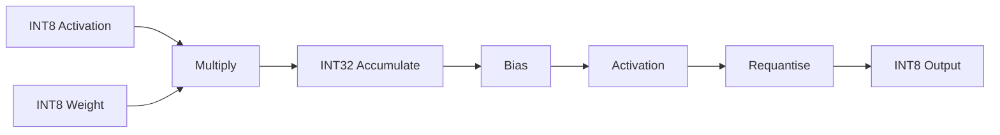

The point of something like ReLU was not mathematically interesting. I already knew what ReLU did. What mattered was that a real accelerator needed somewhere to perform it. The same was true of bias addition and requantisation. The convolution backend could produce a correct INT32 sum and still not produce the representation the next layer wanted.

Requantisation was particularly useful in making the problem concrete. The accumulated value had to be brought back down into INT8, so the design applied an arithmetic right shift and saturated the result rather than allowing an out-of-range value to wrap around. Bias and activation lived before that reduction because they operated on the wider result.

At this point, none of that told me what an NPU should look like as a machine. It did give me one small piece of the datapath which I understood well enough to begin asking hardware questions about it.

## Learning Enough to Start

My normal learning process is fairly project-driven. I do not like spending months studying a field before I am allowed to touch it, but I also do not find blindly trying things until the errors disappear that useful. I usually want enough theory to construct an initial model, then I want a real problem in front of me as quickly as possible so that the gaps in that model become obvious.

Hardware was unfamiliar enough that I spent part of the first weekend just learning the vocabulary and basic execution model. One of the earliest things I encountered was RTL, register-transfer level, and that removed a large amount of the mystery almost immediately. Hardware was described in code, something I was more than comfortable with.

SystemVerilog looked familiar enough to tempt all of the wrong intuitions. It had conditions, loops, functions, variables and plenty of syntax which looked like programming, but the resemblance was only superficial.

Ordinary software describes instructions which an existing machine executes. RTL describes behaviour and structure that become the machine itself. If I write a loop in software, the obvious interpretation is that the same processor executes an operation several times. A loop in synthesised RTL can instead describe several copies of logic which all physically exist at once. Statements are not automatically a sequence of events simply because they appear one after another in a file, and pieces of combinational logic do not take turns executing. They describe relationships between signals which exist simultaneously.

State was another important difference. In software, retaining a variable between two points in a function feels almost free because the underlying machine already provides storage. In hardware, if a value has to survive across time, something somewhere has to store it. Clock edges begin to define when state changes, while combinational logic transforms the values between those points.

Once that conceptual distinction clicked, basic RTL quickly became much less intimidating. I think the first broad understanding took perhaps half an hour: not enough to claim I knew digital design, obviously, but enough that I could look at simple SystemVerilog and understand what kind of circuit it was trying to describe.

The dangerous part was that this made it possible to build long before I understood the physical reasons underneath many of the rules I was using.

I knew a flip-flop stored state; I could use one correctly. I knew that incomplete combinational assignments could result in a latch; I could fix the warning. I knew registers updated around clock edges, and I could look at a waveform and follow the resulting values.

If somebody had kept asking *why*, though, I would have run out of answers fairly quickly.

There is an old image on my hard drive which captures that gap better than anything I could come up with right now. It is from my Computer Science A-level material and shows a D flip-flop, a truth table and a timing waveform. I remember being shown diagrams like this at school and basically thinking "*what is going on?*"


I could see the symbols and could probably have memorised the rule. What I lacked was a mechanism in my head for the picture to refer to.

Looking at the same diagram now feels completely different. $D$ is an input presented to a storage element, $Q$ is the stored output, and the waveform is showing the relationship between those values through time and around the relevant clock edge. Nothing about the original diagram changed; I finally had enough surrounding understanding that it represented something rather than asking me to memorise a pattern.

At the beginning of lg-npu, I was somewhere between those two versions of myself. I had enough of the abstraction to move, but many of the deeper mechanisms were still missing. I was fine with that for the moment. The point of the project was not to wait until I understood everything before doing anything; it was to create the problems which would eventually force me to understand more.

## Designing From the Part I Knew

Once I understood enough RTL to start designing the larger machine, I did not begin from a MAC, but instead from software.

More specifically, I began from the interface between software and a device, because that was the part of the system I already knew how to reason about.

Memory-mapped I/O, or MMIO, lets software interact with hardware through addresses which correspond to device registers rather than ordinary memory. From software, the interaction is fairly simple:

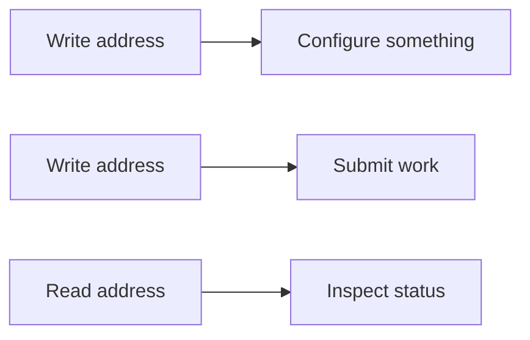

I had worked with interfaces like this plenty of times before. I knew what I wanted the caller to see, which meant I could start asking questions about what had to exist on the other side.

If software wants the accelerator to run a convolution, what information does it need to provide? Where are the activations? Where are the weights? And so on.

Then another question appeared: what happens if software submits more work while the current operation is still running?

I did not want the host to be able to overwrite the parameters of an active command halfway through execution. Once work was submitted, the hardware needed its own stable copy of that description. That immediately suggested a command format and somewhere for pending commands to live.

The design eventually settled around a fixed command descriptor containing the information needed by the different operations. The front-end could fetch that descriptor, decode it, and place the resulting command into a small FIFO. I used a default queue depth of four. There was nothing sacred about four; it was simply enough to decouple submission from execution without turning the queue itself into a major design problem.


Something then had to consume those commands. That became the scheduler.

Calling it a scheduler makes the early version sound rather more sophisticated than it was. It did not attempt out-of-order execution, resource-aware parallel scheduling, or any of the things a mature accelerator might eventually want. It took the next command, determined which execution block should handle it, dispatched the work, and waited for completion before moving to the next one.


The machine was intentionally serial. That choice matters because one of the things which originally annoyed me about the AMD stack was its serialisation. I started the project wondering whether such restrictions were fundamental, then immediately built a scheduler which was even simpler. The difference was that I now understood why I was doing it.

Concurrency is not a magic flag you enable once several compute blocks exist. If DMA and computation can overlap, the memory system has to support both without corrupting each other's accesses. If two backends can execute simultaneously, their resource requirements need to be understood and arbitrated.

I did not yet know how to solve all of that cleanly, and none of it was required to prove that the basic architecture worked. So the first scheduler executed one operation at a time, in order, and I could come back to concurrency once there was a machine worth making concurrent.

That was already a more satisfying answer to my original question than "AMD only lets me run one op at a time."

The host-facing path gradually became:

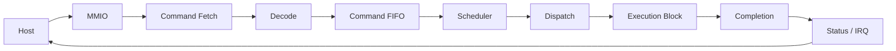

This was one of the first points where the experiment started giving me the answer I was actually looking for.

I did not know the hardware idioms very well yet, but I knew how to decompose a system.

Those instincts came from software, but they were not really about software. They were about making systems understandable.

## The First Architecture

I did a fair amount of design before writing the bulk of the RTL.

The original notes are unfortunately gone. I wish they were not, because they would probably be one of the more interesting artefacts to put here. It was not elegant design documentation. It was one enormous Markdown file full of register ideas, partial diagrams, questions, pieces of dataflow, possible modules and whatever else I needed to get out of my head before I lost track of it.

Once those pieces were written down, I could start attacking the vague parts. A sentence like "the NPU has memory" was useless. Which memory? What lives there? What width is it? Who can access it? When does the data arrive?

The first local-memory model separated three broad kinds of data: weights, activations and partial sums.

Weights and activations were INT8, matching the external quantised representation. Partial sums were INT32 because that was the width used while accumulating products. Treating those as separate storage regions made the intended accesses easier to reason about and eventually made the physical memory problem much more visible when I moved toward an ASIC flow.

The early default configuration was still tiny: roughly 4 KiB for weights, 8 KiB for activations and 16 KiB for partial sums. At this stage they were simulation-friendly memory abstractions rather than the SRAM macros I would eventually have to place physically on the chip.

Around those memories sat the common machinery: MMIO, command fetch and decode, the FIFO, scheduler, dispatch and completion. The compute blocks could then sit behind that shell rather than each inventing their own host interface.


Conceptually, I was building a small platform before I had built most of the things the platform would run. That decision made adding operations much easier later.

I also brought over the repository structure and engineering habits I already trusted. RTL, simulation, tooling and documentation lived separately. I set up linting, regression scripts and the surrounding build infrastructure early because those were cheap decisions for me to make. I already knew how quickly a project becomes unpleasant once there is no obvious way to run all of its tests or no clear place for different kinds of code to live.

Claude helped a fair amount around those edges. I used it to turn rough notes into more structured documentation, generate some boilerplate, build parts of the Python reference implementation, create repetitive test scaffolding from cases I had defined, and help with unfamiliar tooling such as Verilator. It was also useful early on when I hit a hardware concept I did not yet have a name for and needed someone to tell me what I should be reading about.

I did not use it to decide the architecture for me, and the SystemVerilog implementation itself was mine. Partly that was because hardware models were not good enough for me to trust them with the design anyway, but more importantly, outsourcing those decisions would have defeated the point. I was doing this because I wanted to find out whether I could learn the domain, not whether Claude could.

By the end of that first weekend, I had much more of a machine in my head than I had working RTL. The host interface existed conceptually, commands had a representation, the queue and scheduler had a role, the different local memories had started to take shape, and I knew roughly how a convolution backend could connect to all of it.

I still had not proved that any of it could compute something correctly. That was the next problem.

## Making One MAC Real

The first compute implementation was deliberately tiny — foreshadowing is a narrative device where an author... (if you know, you know).

I chose convolution as the first backend, which was probably a questionable choice for somebody writing their first serious RTL. A matrix multiply would have been simpler, and there were plenty of much smaller circuits I could have built if the only goal was learning digital logic. I kept coming back to the same motivation, though: I wanted this thing to eventually run a computer-vision model.

Even binary classification would have been enough. The idea that I could put an image into a chip I had designed and get some useful decision out of the other side was much more exciting to me than building a small arithmetic demo and calling it a day.

That did not mean I wanted to build the full accelerator in one shot. The processing array started with a single processing element, or PE. The dimensions were parameterised so I could grow the array later, but a $1 \times 1$ configuration removed almost every question about parallelism while preserving the actual operation I cared about.


At the centre of the PE was the multiply-accumulate:

```math
p_n = x_n w_n
```

```math
a_{n+1} = a_n + p_n
```

where $x_n$ and $w_n$ are signed INT8 values and $a_n$ is the running INT32 partial sum.


The multiplication itself is far from interesting. What was new to me was everything required to make that arithmetic exist as part of a clocked machine.

An activation and weight had to be presented to the PE. The PE had to know when those values were valid. Something had to tell the surrounding logic when it was ready to accept them. The result had to be registered somewhere, and the partial sum had to survive across however many MAC operations contributed to one output.

I used a simple valid/ready style handshake around parts of the datapath. Rather than assuming every module would always produce and consume a value on exactly the cycle I hoped, the interface made the transfer explicit: data moves when the producer has something valid and the consumer is able to accept it.

This was familiar in spirit. Network code, queues and asynchronous software systems use similar ideas all the time. The difference was that here I could watch the contract happen one clock edge at a time.

The PE itself was only one piece. A convolution engine has to somehow turn something like this:

```text
for each output pixel
	for each output channel
		for each input channel
			for each kernel row
				for each kernel column
					acc += input[...] * weight[...]
```

into hardware which knows what to do on every cycle.

That was where the project started becoming much more interesting.

## Turning Loops Into Hardware

In software, the loop nest is almost all of the description I need. The CPU already provides the machinery for incrementing the counters, calculating addresses, loading values, performing the arithmetic and jumping back to the beginning of a loop. None of that machinery existed here unless I described it.

The loop indices therefore became actual state in the convolution controller. Output coordinates, channel indices and kernel positions all had to be represented somewhere and advanced deliberately. Reaching the end of one dimension had to reset that counter and advance the next one. Padding meant that some logical input coordinates did not correspond to a real activation at all. Stride affected how an output coordinate mapped back into the input tensor.

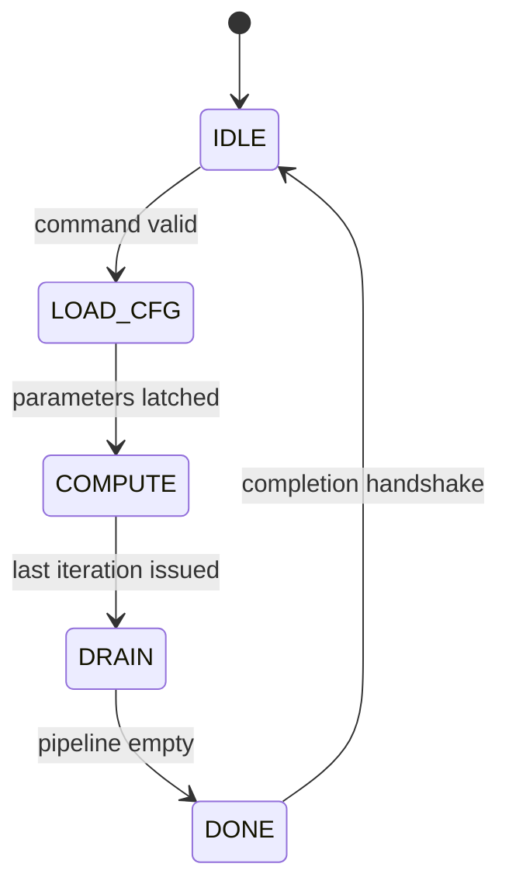

The address-generation block then turned those coordinates into addresses for the local memories.

For an input tensor in NHWC layout, meaning batch, height, width and channel with the channel innermost, a logical activation at batch $n$, row $h$, column $w$ and channel $c$ can be flattened roughly as:

```math
\operatorname{addr}(n,h,w,c)
=
((nH+h)W+w)C+c
```

with the exact expression adjusted by the base address and whatever dimensions belong to the current command.

The weight side has its own indexing because a convolution kernel is arranged differently from an activation tensor. The important part for me was that indexing I previously treated as an arithmetic expression in C or Python was now becoming part of the datapath.

That sounds like a small distinction, but it changed the way I looked at a lot of software.

An array index is not inherently cheap. A nested loop is not inherently free. A multiplication inside an address expression has to become something. The processor usually hides all of that from the person writing the loop because somebody else has already designed the machinery which makes those operations routine.

I was now the somebody else, on a very small scale.

The convolution backend gradually split itself into several pieces because trying to make one module own all of this became unpleasant quickly.

The **controller** owned the sequencing and loop state. The **address generator** worked out which activation and weight corresponded to the current point in the convolution. The **loader** dealt with getting those values from the local memories into the compute path. The **PE array** performed the multiplications. The **accumulation path** kept the running partial sum. Once an output was complete, a **writer** handled getting the finished value back into activation memory.

Conceptually, one output moved through something like:


This is overly simplified though. In actuality, it's more something like this:


Anyway, the feedback from the accumulator into the PE was important because one output is built over many MAC operations. At the time I thought I had arranged that path to sustain one MAC per cycle once the pipeline was moving.

I had not.

This is a tad embarrassing, as it would take me a few months and a substantially better understanding of timing to notice why. For now, the design behaved correctly, and there were more immediate problems to solve.

Once all contributions to an output had been accumulated, the INT32 result entered the post-processing path. Bias could be added there if the command requested it, followed by the selected activation. I supported no activation, ReLU, and a simple Leaky ReLU with a fixed slope of $1/8$.

The fixed slope was deliberate. A general multiplication by an arbitrary floating-point coefficient would have been ridiculous for what I was trying to learn. Dividing by eight is just an arithmetic right shift by three bits, which gave me useful Leaky ReLU behaviour without turning a tiny post-processing operation into another arithmetic unit.

After activation came requantisation.

The accumulator might contain a perfectly valid INT32 value which could not possibly fit into INT8. The design applied a configurable arithmetic right shift and then saturated the result:

```math
q =
\operatorname{sat}_{[-128,127]}
\left(
a \gg s
\right)
```

where $s$ is the quantisation shift.

If the shifted value was larger than $127$, the output became $127$. If it was smaller than $-128$, it became $-128$. Otherwise the lower-precision result could be written back normally.

None of these operations were conceptually difficult. Their importance was architectural. A convolution backend which only produced an INT32 dot product would not be enough to feed the next quantised layer. The machine needed some path for turning its internal representation back into the representation the rest of the model expected.

Initially, several of those pieces lived too close to convolution because convolution was the only backend that needed them. I did not yet have enough of the machine to see why that would become problematic.

For the moment, I wanted one convolution to work.

## The First End-to-End Path

The first version of the NPU lived entirely inside simulation.

I used Verilator to translate the SystemVerilog into a model that I could drive from a C++ test harness. The harness could provide a clock, manipulate the inputs, write values into the simulated memories and MMIO interface, submit a command, then keep ticking the design until the operation completed.

For expected outputs, I just had a Python reference model. As I previously said, Claude helped write much of that implementation from the behaviour I specified. I did not want the reference to be clever; I wanted it to be obviously correct and completely independent from the way I had structured the RTL.

If I reproduced the exact same mistake in both implementations, getting equal outputs would tell me very little. The Python side was therefore written like ordinary numerical code, while the RTL implemented the clocked architecture I was actually trying to test.

The first useful case was tiny enough that I could still reason about most of it manually. The PE array was effectively $1 \times 1$, the tensors were small, and much of the eventual feature set did not exist. I was not trying to prove that the architecture was fast or that it could run a useful neural network yet.

I wanted to know whether I could configure this thing, feed it data, let a command travel through the control path, execute a convolution, and get the correct numbers back.

It took a couple of hours of debugging before the complete path behaved.

The debugging itself was much less traumatic than I expected. I assumed RTL would produce some new category of impossible-to-understand failure where I stared at electrical hieroglyphics for three days. Most of the actual mistakes were much more ordinary: a state transitioned at the wrong time, an index was off, a signal was not held for the cycle I expected, or one side of a handshake disagreed with the other.

Assertions and diagnostic prints helped, but waveforms very quickly became the thing I reached for when timing was involved. Instead of asking only what some variable contained when the program failed, I could look backwards through cycles and see *when* a signal changed relative to everything else.

That way of debugging clicked with me much faster than I expected.

Eventually the test ran to completion and printed something along the lines of:

```text
All tests passed!
```

It was a tiny amount of text for how happy it made me.

I wrote some SystemVerilog. I ran a simulator. Some tiny convolution came out with the same values as Python. From the outside there was nothing particularly spectacular happening, but this was the first time I described a piece of compute hardware and then watched it actually behave like the machine I intended to describe.

Hardware was a black box a few days earlier. Now there was at least one little piece of it I made myself.

The first success also immediately created another question: did it actually work, or had I merely found one set of inputs for which it happened not to fail?

## Trying to Break It

Verification was one of the parts of hardware where I felt the transfer from software most strongly.

The mechanics were different, but I already distrusted happy-path tests. One successful convolution told me that a particular route through the state machines and address calculations worked for one particular combination of dimensions and values. It said very little about what assumptions I had accidentally baked into the design.

So I started expanding the tests.

I ended up with a distinction between quick smoke tests and a much broader full regression. During development I wanted something cheap enough to run constantly, while the larger suite was there to attack more combinations once I thought a change was stable.

The reference model made this much easier. Inputs could be generated, evaluated, and then driven into the RTL and compared automatically. When the answers disagreed, I could move downward: which output is wrong, which partial sum diverged, which address was requested, which state was active on that cycle?

This was where the repository discipline I had brought from software started paying off. I had linting, automated test runners, an independent reference implementation, assertions and a repeatable way to run everything. The syntax and simulator were new, but the basic attitude was exactly the same: if I was going to keep changing the architecture aggressively, I wanted the machine to tell me quickly when I had broken something old.

The full suite did not pass the first time. I spent roughly three hours working through failures, fixing whatever each one exposed and rerunning the relevant tests. I do not remember any single one of those bugs well anymore. What I remember is the number at the end:

```text
196/196 tests passing
```

I remember staring at that with the same expression I had for the "All tests passed!" output.

The exact number was not important. Two hundred tests would not have magically made the design better than one hundred and ninety-six, and I could have written a thousand useless tests if I wanted a larger number.

The point was that I had spent the previous few hours deliberately trying to make my own design disagree with me, and eventually I ran out of known ways to do it.

That was enough confidence to start building much more aggressively.

In hindsight, there is an important limit to what those tests proved. They were very good evidence that the RTL did the arithmetic and control behaviour I had asked it to do. They did not prove that my performance assumptions were correct. They did not tell me whether the circuit would meet timing once synthesised, whether my memory model made physical sense, whether the architecture used area reasonably, or whether a simulator was quietly allowing abstractions that would become painful later.

I did not understand the size of that distinction yet.

At the time I had a working convolution engine, a regression suite I trusted, and a lot of momentum. The obvious thing to do was start adding everything else.

## The Machine Starts Growing

Once the convolution path was stable, I started adding things very quickly.

My memory of this period is slightly unreliable because it feels like it happened over several days. The Git history suggests that an unreasonable amount of it happened on March 10th.

Once something catches properly, I can work for a very long time without noticing much else, and at this point lg-npu had caught hard. A few days earlier I had not known what RTL was. Now I had a command path, local memories, a convolution backend, a reference model and a regression suite, and the obvious question had changed from *can I make one thing work?* to *how much of a neural network can I actually build into this?*

This was also where one of the early architectural decisions started paying off. Convolution did not own the host interface. It sat behind the same command, scheduling and memory machinery that could theoretically dispatch work to something else. Adding another kind of computation therefore did not require inventing another accelerator from scratch.

The next obvious operation was GEMM.

**General matrix multiplication** computes:

```math
C = AB
```

or, for one output element,

```math
C_{ij} = \sum_k A_{ik}B_{kj}
```

which should look familiar by now. Each output is another series of multiply-accumulate operations.

A large part of the design was already there. The part which changed most was the control around the computation: GEMM walks through its inputs differently from convolution, so it needed its own loop structure and address generation.

The actual arithmetic machinery could be shared.

Conceptually, convolution and GEMM looked different from the outside:

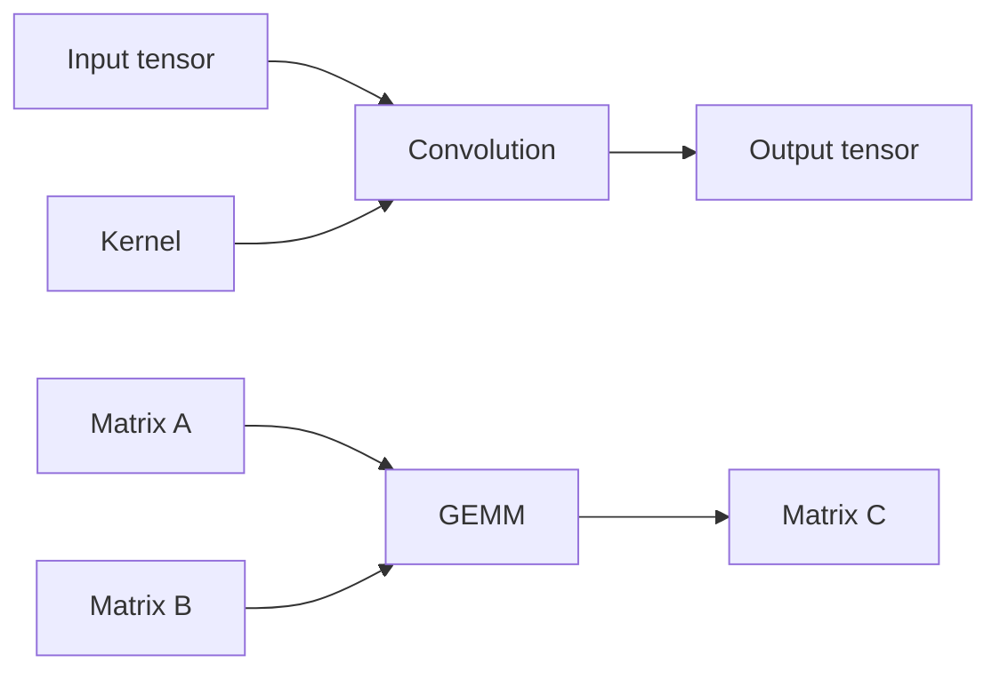

but once the indices had been resolved and the values reached the compute path, both eventually wanted something close to:

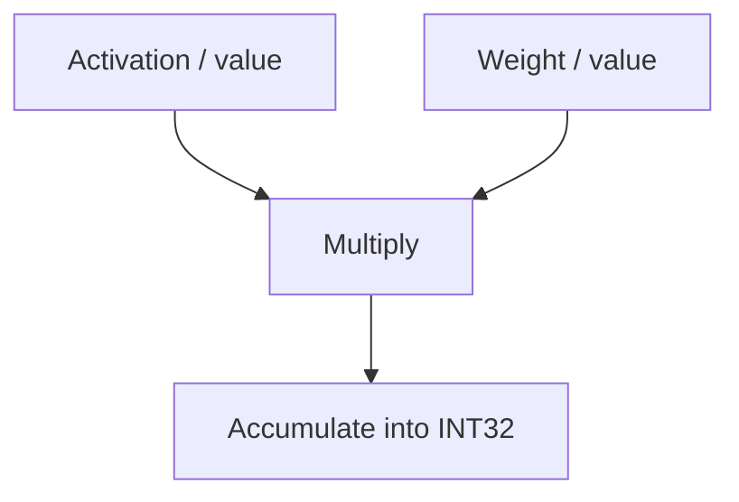

That was satisfying because it was the first time I built a piece of hardware for one purpose and then discovered that the boundary I had chosen around it was actually useful for another purpose.

It also made the PE array feel less like "the convolution thing". It was becoming a shared arithmetic resource.

The GEMM backend still needed its own controller. Instead of walking output image coordinates, input channels and kernel positions, it had to walk matrix rows, columns and the shared reduction dimension $k$. Those counters determined which addresses should be presented to memory and when an output element had received all of its contributions.

At a very simplified level:

```text
for i in rows(A)
	for j in cols(B)
		acc = 0

		for k in shared_dimension
			acc += A[i][k] * B[k][j]

		C[i][j] = acc
```

Again, software hides almost everything underneath that loop. The hardware version needed counters for $i$, $j$ and $k$, address logic for both matrices, state describing whether the current values had arrived, control over accumulation, and a point where the result became complete and could move onward.

I reused the convolution PE array, accumulator, loader/writer machinery and eventually the same post-processing logic. GEMM supplied different control and addressing around them.

That reuse was one of the first moments where the project started feeling like an architecture instead of a pile of RTL modules.

## After the MAC

The next problem came from something much smaller.

Bias, activation and quantisation had originally grown inside the convolution path because convolution was where I first needed them. There was nothing obviously wrong with that while only one backend existed. Convolution completed its accumulation, added bias, applied the requested activation, shifted the result back toward INT8 and wrote it out.

Then GEMM wanted almost exactly the same thing.

ReLU is not a property of convolution. Neither is adding a bias, and neither is converting an INT32 result back into the INT8 representation expected by the next layer. They are operations which happen to commonly follow several different kinds of computation.

The duplication also would not have remained small. If I later fixed some saturation behaviour or changed how activation selection worked, I would now have multiple versions of the same logic which could quietly drift apart. So I pulled that machinery out.

The result became a reusable post-processing path:

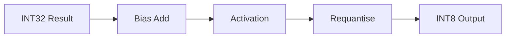


The important part was not that each box was sophisticated. Most were not. The important part was that the architecture now had a clear point where a backend stopped being responsible for producing the representation expected by the rest of the model.

Convolution could concentrate on convolution. GEMM could concentrate on matrix multiplication. Once either produced an INT32 result, common machinery could take over.

Bias was optional. Activation was selectable, including no activation, ReLU and the fixed $1/8$ Leaky ReLU I mentioned earlier. Requantisation then applied the configured shift and saturation before the result returned to activation memory as INT8.

This was a small refactor compared with the rest of the project, but I am still quite happy with it because it happened for the right reason. I was not trying to make the block diagram look elegant. I allowed a piece of logic to live wherever it was first useful, then moved it once another caller demonstrated that the original ownership was wrong.

That pattern repeated throughout the project.

## Not Everything Is a MAC Array

Convolution and GEMM fit together conveniently because both spend most of their time building dot products. Neural networks contain plenty of operations which do not.

Softmax was one of the first places where that became obvious.

I already knew what softmax was for from the software side. It takes a vector of scores and turns them into a normalised distribution. What mattered for the hardware design was that computing one output depends on information about the *whole vector*.

For an element $x_i$:

```math
\operatorname{softmax}(x_i)
=
\frac{e^{x_i}}
{\sum_j e^{x_j}}
```

You cannot simply stream one value through an independent little arithmetic function and immediately write the final result. The denominator depends on every element.

There is also a numerical-stability problem. In software, a common form subtracts the maximum value before evaluating the exponentials:

```math
\operatorname{softmax}(x_i)
=
\frac{e^{x_i-m}}
{\sum_j e^{x_j-m}},
\qquad
m = \max_j x_j
```

That naturally implies multiple passes.

My implementation followed roughly that shape. It first walked the input to find the maximum. It then walked the values again to build the exponential sum using an approximation rather than trying to implement some enormous general-purpose transcendental unit. Finally, it needed another pass to normalise the individual values against the accumulated denominator.

The control structure therefore looked more like:

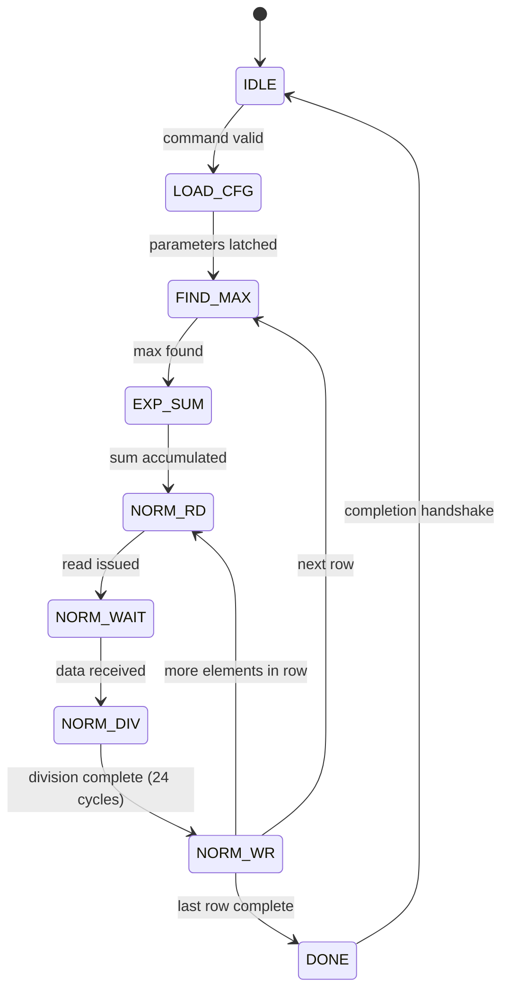


That is very different from the convolution backend.

Convolution spends a long time producing one result through repeated MACs, then advances to the next one. Softmax spends several passes gathering information about an entire vector before all of the final outputs can be known.

This eventually contributed to a distinction I started using in the project between **backends**, **ops** and **composites**.

Backends were the larger compute engines with their own major datapaths, such as convolution and GEMM. Ops were smaller pieces of reusable behaviour such as bias, activation or requantisation. Composites were operations substantial enough to need their own control machinery but which did not really belong in the same category as the main MAC-oriented engines.

Softmax was a good example of a composite.

The categories were not some established grand taxonomy I had carefully researched and adopted. They were just useful names for the structure that was emerging.

I mention this because there is a tendency when looking back at a project to make every architectural decision sound intentional from the beginning. This one wasn't. I started with convolution, put the things convolution needed around it, then had to reorganise the design once more operations showed me which parts were actually general.

## Vector Operations

Vector operations involved a lot less drama, but they filled another obvious gap.

A neural-network accelerator cannot reasonably turn every element-wise arithmetic operation into a round trip through some large specialised backend. There are plenty of cases where the useful operation is simply "take these values and apply something element by element".

The vector path therefore handled simpler arithmetic over activation data. Compared with convolution, the control was straightforward: iterate over a range, load the relevant value or values, perform the selected operation, and write the result.


What interested me here was less the arithmetic than the way the machine was starting to divide work according to shape.

Some work looked like a large reduction over many products, some required multiple passes over a vector, and some was just parallel element-wise arithmetic.

Those operations all belonged in a neural-network workload, but there was no reason they should all be forced through the same physical datapath.

This is something which seems obvious once stated, but before this project words like **NPU** had encouraged me to picture a more homogeneous machine. I knew GPUs had many different fixed-function and general-purpose pieces, and intellectually I knew specialised accelerators did too, but building one made the point much more concrete.

There was no single "NPU operation".

There was a collection of workload shapes, and the architecture was becoming a collection of answers to those shapes.

## Layer Normalisation

Layer normalisation pushed that idea further.

Again, the equation itself was not what I needed to learn. I already knew why normalisation appears in neural networks. The hardware question was how to evaluate an operation whose output depends on statistics gathered over a collection of values.

For a group of $N$ values, the mean is:

```math
\mu = \frac{1}{N}\sum_{i=1}^{N}x_i
```

and the variance depends on another reduction:

```math
\sigma^2
=
\frac{1}{N}
\sum_{i=1}^{N}(x_i-\mu)^2
```

before the individual values can finally be normalised.

That means the machine cannot know the final normalised value of the first element merely because the first element arrived.

It needs context from the rest of the group.

My LayerNorm path therefore became another multi-stage controller. The exact internal organisation evolved, but conceptually it had to gather the sum, derive the mean, determine the variance, calculate the scale implied by that variance, and then pass through the data again to produce the normalised outputs.

Something along the lines of:

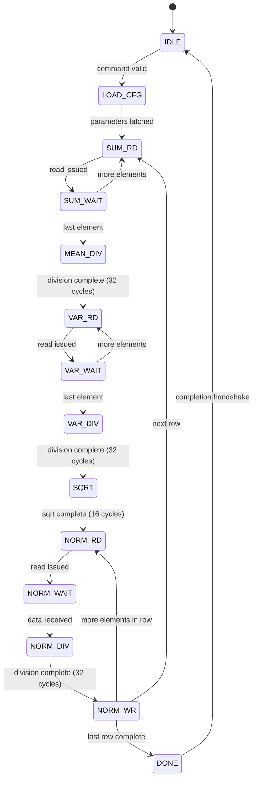


This is where the difference between "an operation in a model" and "a machine which performs that operation" kept becoming more interesting to me.

In Python I might write a handful of expressions and let a framework worry about everything else. In hardware I had to decide what intermediate state physically needed to survive between passes, how wide those intermediate values should be, how the controller knew which pass it was executing, and when memory could be reused safely.

I was not producing some state-of-the-art LayerNorm engine. Most of these implementations were deliberately serial and simple because the goal was to understand the complete mechanism before trying to make it fast.

That distinction is important throughout the project.

There are many places where a more experienced accelerator designer would look at the implementation and immediately identify better dataflows, more parallelism, fewer passes, more efficient arithmetic or a better memory architecture.

They would be right.

I was just trying to build enough of each thing that it stopped being magic.

## Pooling

Pooling was another operation I already understood mathematically but never had to turn into control logic.

A pooling window moves across spatial input data in a way superficially similar to convolution, except there is no learned kernel multiplication. Depending on the mode, the hardware might select the maximum value in the window or combine the values in some other way.

That meant some of the indexing problems were familiar from convolution: output coordinates, kernel/window coordinates, channels, stride and boundaries. The arithmetic was simpler, but the nested iteration still had to become state.

My pooling controller ended up with a fairly deep loop structure because several dimensions had to advance independently. The fact that there were exactly five nested control dimensions is less interesting than what it did to my intuition: software makes deep nested iteration visually cheap. Hardware forces you to acknowledge that something has to remember every one of those positions and know exactly when each counter rolls over.


By this point I was getting much better at designing that kind of control. The first convolution controller required me to consciously translate software loops into registers, comparisons and FSM transitions. With pooling, I no longer had to rediscover that mental model from scratch.

That was one of the first places I could actually *feel* experience accumulating inside the new domain.

Not seven years of experience. Not expertise. Just enough repetition that the second or third version of a problem no longer felt like the first.

That was worth more than any number of operations on a feature list.

## Six Different Shapes of Work

By the end of this burst, the machine supported six broad kernel areas:

- convolution
- GEMM
- softmax
- vector operations
- layer normalisation
- pooling

The command front-end, scheduler, local memories and completion machinery sat around all of them, and the smaller reusable operations handled things such as bias, activation and quantisation where appropriate.

A simplified view of the architecture was becoming:

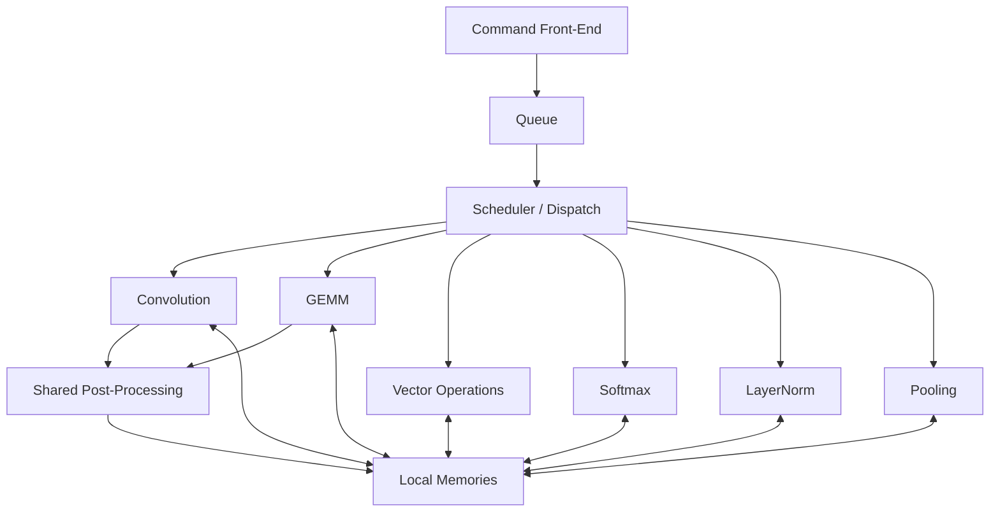

Eventually, this turned into:

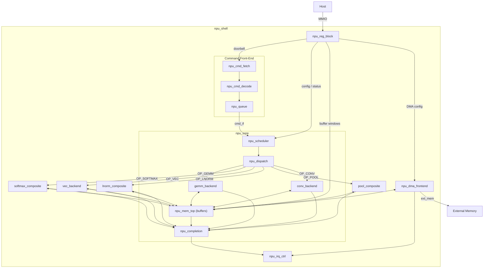


The project was still very small compared to a commercial accelerator, but it was no longer just a single arithmetic block with a grand name attached to it. There was a common submission model, several kinds of execution machinery, reusable operations, local storage, and a software-facing interface which could describe different kinds of work.

This was also where I started feeling slightly uncomfortable with calling it an NPU.

There is no clean physical law which says that a design with five operations is merely a neural-network accelerator but a design with six is suddenly a neural processing unit. The industry itself is not particularly consistent about the boundary. Breadth matters, programmability matters, the software stack matters, performance matters, and marketing departments are allowed to participate in the naming process too.

If I had built a convolution block and immediately called it an NPU, I would have felt silly. With the broader machine taking shape, the name felt more defensible, although I am still not sure I would call this a "proper" NPU.

A much more complete version would need substantially more than I had. More datatypes, more operators, useful concurrency, a better memory architecture, broader software support, and eventually an implementation whose performance actually justified the hardware.

The interesting part was that I could now see those missing pieces.

Before starting the project, "NPU" was a category of device sold by Intel, AMD or Qualcomm. It was a black box with an API and some advertised TOPS number.

A week into the project, it turned into a set of engineering decisions I could disagree with. That was an enormous change in a very short amount of time.

## Breadth Versus Depth

There was a downside to how quickly I was adding things: I was chasing breadth.

That was deliberate to some extent. My goal was to explore the shape of the field, and building several different execution patterns was teaching me more about accelerator architecture than spending the entire first month polishing one convolution datapath.

It also meant that some things I understood well enough to improve never actually received the improvement.

Convolution is the best example.

The naïve path repeatedly reads activations from local memory as the kernel moves across the image. Functionally, that is perfectly fine. From a bandwidth perspective, it is wasteful because neighbouring convolution windows reuse a huge amount of the same input data.

Take a $3 \times 3$ window:

```text
a b c
d e f
g h i
```

Move it one position to the right and the next window might be:

```text
b c j
e f k
h i l
```

Six of the nine positions above are reused in this simple horizontal shift. Across a full convolution there is substantial reuse both horizontally and vertically.

Reading every value again from SRAM ignores that.

A common solution is to use line buffers. Rather than treating every convolution window as a fresh set of memory accesses, rows of activation data can be retained close to the compute path. A window generator then assembles the current kernel window from those buffered values as new data streams in.

The broad idea is:

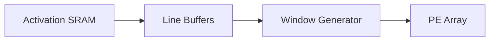

This changes the problem from repeatedly asking SRAM for nearly identical windows to streaming new data in while retaining what will be reused.

I worked through this from first principles and wrote the line-buffer and window-generation modules. Then I never integrated them into the active convolution backend. They are there in the project, but the main datapath does not use them.

At the time I kept finding new parts of the architecture more interesting than returning to optimise the old one. Once convolution worked, GEMM taught me something new. Once GEMM worked, softmax taught me something new. Then LayerNorm, DMA, the runtime and eventually the ASIC flow were waiting.

This is one of the choices I would make differently if the objective were to produce the best convolution accelerator possible. But that was not quite the objective.

It was instead to find out whether I could walk into hardware with almost no domain knowledge and learn my way through building a meaningful system.

Breadth was useful for that because every new operation forced a different kind of problem into view.

## The Other Half of an Accelerator

Once I had enough compute blocks to make the machine look interesting, the memory system became hard to ignore.

A MAC can only do useful work if an activation and a weight are available when it needs them. If the PE array spends most of its time waiting for those values, adding more multipliers just gives me more hardware sitting idle. I understood this in the broad sense when I started the project, but I had not yet internalised how much of accelerator design is really a data-movement problem.

The first memory architecture was intentionally small: the three separate regions for weights, activations and partial sums from that first weekend, a few kilobytes each. That was enough to make the architecture concrete without pretending I was going to fit a modern neural network inside a tiny first design.

Inputs and outputs could share the activation address space at different offsets, which meant a command could say where its input tensor lived and where the result should be written without requiring a completely separate physical memory for every intermediate tensor.


In simulation, all of this was convenient. I could describe memories behaviourally, give them addresses, and move on. The simulator did not care whether the storage was physically sensible. That would become a problem later.

For now, the important part was access.

The buffers were not magical multi-ported stores where everyone could read and write whatever they wanted simultaneously. Requests had to be arbitrated. The compute backend needed predictable access while it was active, the host still needed some way to inspect or populate the buffers, and later the DMA engine would need access too.

I chose a simple priority scheme rather than trying to make the memory system fair. When the compute backend was using a buffer, it got priority. A host request could wait.

That sounds a bit rude to the host, but the compute path was the thing with the timing-sensitive stream of work. Stalling a software MMIO access for a moment was much less damaging than starving the arithmetic pipeline halfway through an operation.

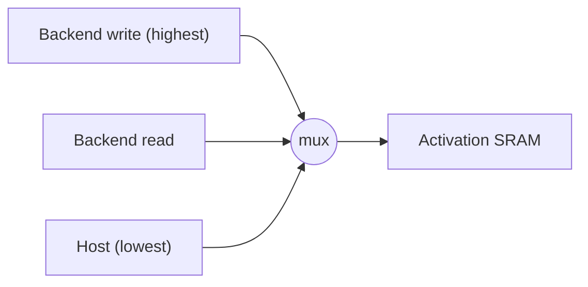

The activation path was particularly busy because it was both input and output storage. A backend might need to read an activation for the current computation and eventually write a completed result back into the same memory space. The early implementation therefore had fixed priorities around those requests rather than any elaborate arbitration policy.


This was another place where something I had previously treated as "memory" fractured into several actual engineering questions.

The behavioural SRAM wrapper used a simple request/grant/response protocol with a one-cycle read latency. A requester presents an address and request; once accepted, read data becomes valid on the following cycle.

That one cycle immediately matters to the control around it.

If address generation says "I need activation $x$ and weight $w$," the PE does not necessarily receive them on the same cycle that those addresses are produced. The controller and loader have to respect the memory latency and keep the associated control information aligned with the returned values.

This was the first time I started getting a stronger intuition for pipelines as something less abstract than "put registers between stages". Each stage exists partly because different pieces of the machine have their own latency, and the control has to preserve the relationship between data while it moves through them.

For the convolution path, that meant the controller could generate an iteration, the address generator could derive the activation and weight addresses, the loader could issue the memory requests, and only once those reads came back could the pair be sent onward into the PE.

Padding gave the loader an extra case. If the logical input coordinate fell outside the actual tensor because the convolution was operating over padded edges, there was no reason to perform a meaningless SRAM read. The address generator could mark the access as zero-padding and the loader could simply substitute zero for the activation.

That is a tiny optimisation, but I liked it because the software-level definition of padding had turned into an actual hardware decision. "Outside the image is zero" no longer meant some framework quietly gave me a padded tensor. It meant the address-generation logic knew that a particular coordinate did not exist and produced a zero without touching memory.

The more of these details I implemented, the less the original operation resembled the single equation I had started with.

```math
y = \sum_i x_iw_i
```

was still true, but it was increasingly obvious that the summation itself was not most of the machine.

## Getting Data Into the Machine

The local memories solved only the problem of where compute data lived *while the NPU was using it*. The data still had to arrive there.

For early simulation and debugging, the host could access the local buffers through MMIO windows. That was convenient because it made everything inspectable. Software could write values directly into weight or activation storage, run a command, then read the result back.

It was also not a serious way to feed an accelerator.

If the CPU has to perform a separate MMIO operation for every byte of a tensor, the accelerator may spend far more time waiting to be prepared than actually computing anything. A useful device needs to move blocks of memory without making the CPU babysit every individual transfer.

This was familiar territory conceptually because I already knew DMA from software and systems work. **Direct memory access** lets a hardware engine perform the copying after software describes what needs to move.

The basic shape was:

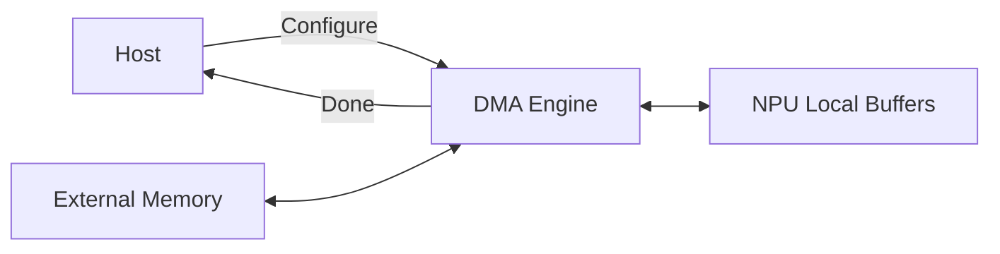

The DMA interface had an external base address, a local address, a length and a direction. Software could tell it to move data from external memory into one of the NPU buffers or take local data and write it back out.

The implementation itself was primitive:


For an external-to-local transfer, the reader issued a memory request, waited for the response, wrote the received value into the selected local buffer, advanced the addresses, and repeated. The reverse direction read from the local buffer, waited for the data, issued the corresponding external write, and continued until the requested length was exhausted. The transfer progressed byte by byte.

There were no long bursts, no pile of outstanding memory requests, no clever coalescing, no multiple DMA channels, and no attempt to hide latency with a deep queue of transfers.

A mature DMA engine would almost certainly want several of those things. Wide transfers and bursts would make much better use of the external interface. More requests could be outstanding. Data movement could be double-buffered so that one tensor tile was being computed while the next was arriving. My implementation did none of that.

At the time, that was enough to teach me the entire path from "the model lives somewhere in system memory" to "the values are now sitting inside local storage where my RTL can consume them". Before this, DMA was one of those pieces of computer architecture which I understood from the side of the operating system and device interface. Now I had to build the little state machine actually performing the transfer.

I found that extremely satisfying in a fairly mundane way. A concept I had used for years stopped being infrastructure somebody else supplied.

There was also an architectural limitation which I made very explicit: DMA and compute were mutually exclusive.

While DMA was active, it took over the relevant local-buffer path. The NPU reported itself busy, and computation did not run simultaneously.

That left obvious performance on the table, but it kept the ownership problem simple. I did not yet need to arbitrate a compute backend and a DMA engine both hammering the same single-port storage while also preserving the guarantees expected by software.

This tied back nicely to the concurrency question. From outside a commercial NPU, "why can't these things run simultaneously?" can feel like an arbitrary limitation. From inside even my tiny design, allowing two things to run simultaneously immediately created questions about memory ports, arbitration, dependencies, completion, buffer ownership and scheduling.

It did not make every commercial limitation reasonable, and it certainly did not tell me why AMD had made any particular decision, but it did make concurrency stop looking free, which is something I knew in principle, but not in practice.

## One Clock, For Now

Thinking about DMA and eventual real hardware also introduced another class of problem I had essentially never needed to care about in ordinary software: clocks.

The actual lg-npu design at this stage was deliberately kept in one synchronous clock domain. I did not build some sophisticated asynchronous boundary into the DMA engine, and I do not want to imply that I had already solved clock-domain crossing correctly. The simple design avoided the problem rather than solving the general case.

But once I started thinking about connecting the accelerator to real external systems, the question became unavoidable.

What if the thing providing memory traffic runs on a different clock?

Two clocks do not have to line their edges up politely. A signal can change at nearly the same moment another clock domain tries to sample it. At that point the nice digital abstraction of "this is either zero or one" is sitting on top of a physical device which needs some finite time to resolve.

That was my introduction to metastability and clock-domain crossing.

I learned enough to understand that moving information between unrelated clocks needs deliberate synchronisation or asynchronous transport structures, depending on the kind of information being transferred. I did not yet have the physical intuition for metastability which I would develop later, and the current design simply stayed synchronous.

This was a recurring feature of the project: I would hit the edge of what the current architecture required, discover an entire problem sitting just beyond it, learn enough to understand what I was avoiding, then keep going.

Sometimes that is the right engineering choice. You do not need to solve every possible future version of a problem before the first version works.

## The Runtime

The software runtime appeared very early, partly because it was useful and partly because I genuinely wanted to build it.

There is something slightly funny about starting a hardware project because software had become too familiar and then becoming excited about writing software for it a few days later. The difference was that the software was now connecting directly to a machine whose behaviour I controlled.

Before the runtime, using the NPU meant thinking in terms of register offsets, buffer addresses and command fields. That was useful for bring-up, but it was not the interface I wanted somebody to use.

I wanted the software-facing side to deal with concepts closer to the actual workload: tensors, operations and commands.

The runtime therefore sat above the raw MMIO interface and dealt with the details needed to turn those concepts into something the hardware understood. It could construct commands, interact with the device registers, prepare tensor data, drive DMA, wait for completion and hide the low-level representation from the caller.

This was familiar work again, but with a newfound liberty: I owned both sides.

If the software API became ugly because the hardware exposed something awkward, I did not have to write increasingly unpleasant wrappers around somebody else's decision. I could change the register interface or command representation.

If the hardware was being complicated purely to make some software abstraction prettier, I could move the compromise the other way.

That feedback loop was one of my favourite parts of the project. Hardware/software co-design sounded like a grand phrase before. In practice, on a tiny project, it often meant sitting there thinking, "this API sucks because I made the hardware interface stupid," and then fixing whichever side actually deserved to change.

Tensor layout gave me a good example.

The convolution datapath was built around **NHWC** layout:

```text
N = batch
H = height
W = width
C = channels
```

so contiguous activation data was arranged conceptually as:

```math
[N][H][W][C]
```

The channel dimension being innermost meant values for neighbouring channels at the same spatial position sat beside one another in memory, which fit the way I was thinking about the convolution datapath.

A lot of software and model tooling also deals with **NCHW**:

```math
[N][C][H][W]
```

I did not want the runtime to reject NCHW entirely just because my first hardware implementation preferred something else. At the same time, supporting both layouts directly in the address-generation hardware would have increased the number of paths I needed to implement and verify.

So I took the compromise on the software side.

The runtime could convert an NCHW tensor into NHWC before submission.

For a source index:

```math
\operatorname{src}(n,c,h,w)
=
((nC+c)H+h)W+w
```

the corresponding destination index was:

```math
\operatorname{dst}(n,h,w,c)
=
((nH+h)W+w)C+c
```

The actual implementation was ordinary C:

```c
HOT_CALL NO_NULL_ARGS
static void convert_nchw_to_nhwc(
	int8_t*       RESTRICT dst,
	const int8_t* RESTRICT src,
	uint16_t               N,
	uint16_t               H,
	uint16_t               W,
	uint16_t               C)
{
	const size_t HW  = (size_t)H * W;
	const size_t WC  = (size_t)W * C;
	const size_t HWC = HW * C;

	for (uint16_t n = 0; n < N; ++n)
	{
		int8_t*       dn = dst + n * HWC;
		const int8_t* sn = src + n * HWC;

		for (uint16_t c = 0; c < C; ++c)
		{
			int8_t*       dc = dn + c;
			const int8_t* sc = sn + (size_t)c * HW;

			for (uint16_t h = 0; h < H; ++h)
			{
				const int8_t* sh = sc + (size_t)h * W;
				int8_t*       dh = dc + h * WC;

				for (uint16_t w = 0; w < W; ++w)
					dh[w * C] = sh[w];
			}
		}
	}
}
```

I arranged the loops and pointer arithmetic with the usual compiler optimisation in mind, but I was never completely happy with the solution.

The conversion costs time and memory bandwidth before the NPU has done any useful inference at all. If the accelerator only looks fast because I ignore expensive layout conversion in the runtime, I have not really made the system fast.

A better version could support more layouts directly where doing so makes sense, or make layout planning part of a larger graph compiler so that unnecessary conversions disappear between layers. But that was another entire project hiding inside this one.

For the version I was building, accepting NCHW in software and converting it was a reasonable boundary. I knew it was imperfect, I understood where the cost lived, and it let me keep the hardware datapath simpler while I learned everything else.

That kind of decision became more common as the project grew. There was always a more general version available if I was willing to spend another day on it.

At some point, "support everything properly" is just another way to never get past the first project.

And to be honest, the software stack in its current form is deliberately restrained. It's simple, does a lot of things with a "bare minimum" nature, and is not all that on its own, and I think I'm proud of that; it represents a well-designed boundary, well-designed intent, and well-designed semantics.

## Bringing It Back Home

The runtime ended up being one of the parts I was happiest with.

At the top, I could work with a device and tensors rather than individual control-register writes. Underneath, the runtime handled the representation the hardware actually wanted. The command format and register map became a contract between the two sides instead of details leaking randomly into application code.


Later I also started putting together a Linux device interface. The project was moving from a Verilator experiment toward the shape of something which could eventually exist as an actual device with a driver, runtime and user-facing API.

This did not feel like retreating back into software. If anything, it was the first time the relationship between the two sides had become this clear to me.

Previously, when I wrote low-level software against some piece of hardware, or even just in general, there was always an interface whose deeper decisions I had to accept — which, if you know anything about me, you'll know I am bad at.

Now I could follow the decision all the way through because I had made both ends of it. This was probably the clearest point yet where the original question about transfer stopped feeling hypothetical.

## The First Ceiling

By this point the progress was suspiciously smooth.

The RTL worked in simulation. The regression suite was large enough that I trusted it within the scope it actually covered. The machine had six families of operations, a host interface, local storage, DMA and a runtime. New modules no longer felt particularly scary to write.

I was still only about a week into knowing SystemVerilog.

That made me extremely happy and, in hindsight, probably far too confident.

The original goal was never to produce a very elaborate simulator model. I wanted something physical. Eventually I had to cross from "the RTL behaves correctly" into "can this description actually become hardware?"

The first step I knew the name of was synthesis.

My software-trained mental model was roughly:

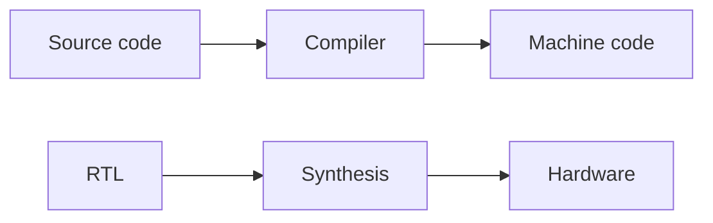

That is not completely wrong, but the amount of missing context in the second line was enormous.

At the time, I thought synthesis was basically the hardware equivalent of compilation. Give a tool the RTL, let it transform the description into lower-level logic, fix whatever errors it found, and continue toward the chip.

So I tried it... aaaand it failed.

I no longer remember the exact error, which says something about how much importance I assigned to it at the time. I had an enormous list of other things which were working and still wanted my attention, so my reaction was basically: I'll fix it later.

I did not yet understand that synthesis was not an annoying final conversion step attached to the end of the RTL work. It was the beginning of another discipline, and getting a design through it said almost nothing about whether that design could actually become good silicon.

For the moment I went back to the part of hardware where everything was moving quickly.

The project was about to get interrupted for a little while anyway.

## A Break

Later in March I went to Scotland.

I mentioned this trip in an earlier entry, and it was important to me for reasons which had nothing to do with hardware. I was going there to see a dear friend, and one thing I remember in retrospect is how completely the project disappeared while I was away.

Which is funny because that never really happens with me.

When I am deep into something, there is normally some part of my brain still working on it in the background. I can be out with friends, climbing, trying to sleep, doing something completely unrelated, and eventually I will notice that I have started thinking about whatever problem I left at home. It is not always deliberate and it is certainly not always useful. Sometimes it is just the project refusing to leave.

Though, while I was gone, I barely thought about the project. I did not feel guilty about not working on it either, which might have been even more unusual.

I appreciate that a lot in retrospect, which is why I'm mentioning it here now. A good break is often vital.

When I came back, I fell into the project again pretty quickly. There was a small detour into some other work, but most of the NPU's architecture already existed by then and hardware no longer felt remotely as foreign as it had a few weeks earlier.

That confidence was probably about to become useful, because I was also about to discover how little of the field I had actually seen.

## A Much Bigger Map

Not long after returning, I met somebody while bouldering who was doing a master's in physics.

His work was much closer to the device and research side of hardware than mine. I remember him talking about computer-vision chips and some of the physics around them. I do not remember enough of the details to reconstruct his research accurately now, and I would rather not pretend otherwise, but I remember being extremely interested.

At some point I explained what I was doing with lg-npu.

He described it as something roughly along the lines of "a bit of RTL."

I do not think he intended that as dismissive at all. From his perspective, that was simply what it was. He was looking at hardware from a place where RTL was one tool among a much larger collection of concerns.

It's essentially the same as a software engineer saying "a bit of Python" while working deep in assembly or something. It doesn't actually mean much, but it shows the frame of reference.

Regardless, I remember that sentence.

I went from knowing almost nothing about digital design to writing a fairly large amount of RTL very quickly, and because that transition went better than I expected, I started unconsciously compressing "hardware" into the thing I was currently learning.

That conversation broke that illusion almost immediately.

There was synthesis, timing, physical design, memory compilers, and eventually photonics as well as entire areas of physics I did not even have enough vocabulary to misunderstand properly yet.

The reaction was not discouragement though; it was maybe the opposite.

I remember sitting on the roof of my house later and reading for hours. I started with things adjacent to what he mentioned and kept branching outward into physical design, electronics, semiconductor physics, photonics and whatever else looked interesting enough to open another tab.

The field suddenly felt enormous, which was exactly what I was looking for a month earlier.

It also put the speed of the first few weeks into a healthier context. RTL had clicked with me quickly, and I was still proud of that. But I had not somehow "learned hardware" in a month, which is something I intrinsically knew, but also enjoyed quietly ignoring. I found one part of it where my existing way of working transferred well, and then somebody showed me that there was an entire continent around it.

That was exciting, but more importantly, I wanted to keep going.

By then the original experiment was already giving me an answer I didn't really expect to get this quickly. I entered a field where I knew almost nothing, and the lack of familiarity didn't paralyse me. I found something I did know, started from there, built outward, made mistakes, learned enough to fix them, and eventually reached the point where the unknown parts had stopped feeling threatening and started feeling inviting.

## The Silicon Problem

The original physical goal did not go away either. I still wanted the chip.

At this point lg-npu was becoming large enough that I started looking more seriously at what manufacturing it would actually involve. That was where one of the nicer parts of my fantasy ran into the cold, hard, and bitter wall that is money.

A private ASIC run is expensive.

Not "I need to save for a development board" expensive. Once fabrication, packaging and all of the surrounding practical work are included, ten thousand euros would have been the optimistic end for a project of this size.

That was obviously not happening for a personal experiment.

An FPGA was the sensible answer. I could have put the design onto real programmable logic, run it at an actual clock, connected it to a host, measured throughput and power, and learned a huge amount in the process.

I still want to do that, but it was not the thing which had been stuck in my head since the bike ride. I did not just want RTL running on hardware. I wanted *my* silicon.

There is something irrationally satisfying about the idea that a microscopic physical structure only exists because you put it there. An FPGA could give me real timing and real wires and real logic resources, but the silicon itself would still have been designed by somebody else.

For a little while I assumed that part of the goal would simply have to wait until I had a very different amount of money, which, as far as I can see, is not happening any time soon.

But then, I found an alternative.

## Tiny Tapeout

Tiny Tapeout works by putting many tiny independent designs onto the same fabrication run. Instead of paying for an entire die, each person gets a very small region of one shared chip.

The available area was tiny compared to lg-npu. That didn't matter.

I didn't need the entire accelerator to satisfy the original idea. I needed enough of it that the silicon still felt connected to the thing which had brought me into hardware in the first place.

The MAC/convolution path was the obvious candidate.

It was the first real compute structure I had built, it sat at the centre of the larger design, and it was self-contained enough that I could strip away most of the platform around it and fit a much smaller descendant into a Tiny Tapeout slot.

The RTL itself did not take very long. I had already spent weeks thinking about the compute path in lg-npu, so most of the difficult architectural questions were old questions by then. I could reduce the interface, remove the broader command and software machinery, keep the part I cared about and get something working in an afternoon and part of an evening.

What took me somewhere new was everything after that.

For the first time, I had a reason to take an RTL design through an actual ASIC flow for a real process.

I will eventually write about that project separately, especially once the chip itself arrives. At the time of writing, the design has been submitted and the silicon is expected later this year, so this is not yet the satisfying "here is the chip in my hand" part of the story.

But the submission changed lg-npu anyway.

In roughly seven hours I went through synthesis, timing checks, placement, routing and the surrounding flow needed to get a tiny design into a form that could actually be submitted for fabrication.

So, this was the first GDSII I ever made:


There is more to say about this GDSII than fits in a paragraph here.

That experience completely destroyed my earlier idea that synthesis was basically hardware compilation.

It was not that synthesis itself had suddenly become incomprehensible. It was that synthesis turned out to be one step near the beginning of a much larger process.

When I returned to lg-npu, the failed synthesis attempt I had casually ignored earlier looked a lot less like an annoying tooling problem. It looked like the next project.

## Coming Back to lg-npu

The Tiny Tapeout design was small enough that the physical flow was still relatively manageable. lg-npu was not.

I started putting together a flow using Yosys and OpenROAD against SkyWater's open Sky130 process. The broad route from the SystemVerilog to layout was:

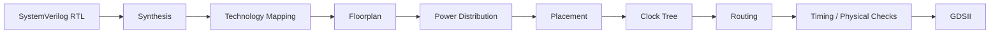

I had technically encountered most of those words through Tiny Tapeout by then, but doing them on a design this much larger made them substantially less theoretical.

Synthesis first turns the RTL into a network of logic, then technology mapping has to express that logic using cells which actually exist in the target process. An abstract Boolean AND eventually has to become some actual characterised cell from the Sky130 library. Registers become real flip-flop cells. Arithmetic gets decomposed and mapped into structures the process can build.

Then the problem gets geometric.

The chip needs dimensions. Large fixed structures need positions. Standard cells need somewhere to live. Power has to get through the design. The clock has to reach enormous numbers of sequential elements without arriving arbitrarily late at some of them. Every connection described by the netlist eventually needs a legal route through real metal layers.

That was the first important shift in how I looked at the project after Tiny Tapeout. Functional correctness had felt like a very large milestone before because it was the whole world I was working inside. Now I could see how many different ways a functionally correct design could still be useless.

## Memory Becomes Physical

Memory was probably the clearest example: in the simulator, I was using nice behavioural memories. They had addresses, requests, read latency, and the interface semantics I wanted, and on top of that, Verilator was perfectly happy to pretend the storage existed. At the RTL level, that was enough.

On silicon, saying "there is a 16 KiB memory here" does not conjure one into existence — even if that would be pretty convenient.

You can build storage out of ordinary flip-flops, but doing that for large memories is horribly expensive in area and power. Real ASICs use dedicated SRAM structures which are far denser than synthesised banks of registers.

This meant the abstract local memories I was using needed to turn into actual physical SRAM macros.

For the Sky130 version, the memory organisation eventually mapped onto fourteen OpenRAM macros: two for weights, four for activations and eight for partial sums.

The number of macros came from the capacity and width requirements of the three local stores. The partial-sum memory was especially expensive because every entry was INT32 rather than INT8, so providing the same kind of useful capacity required much more physical storage.

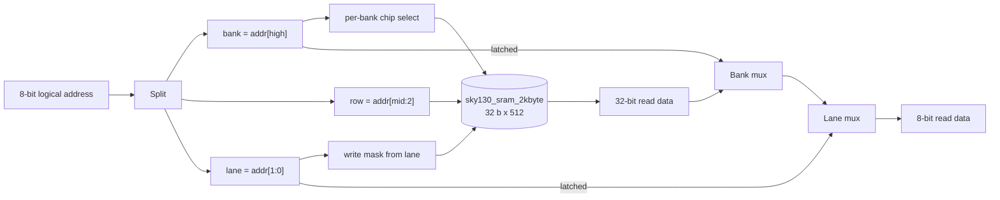


Seem familiar?


Suddenly the memory hierarchy I designed months earlier was visible on the floorplan.

Those macros were not little logical boxes anymore. They were large rectangular chunks of silicon with fixed dimensions and pins at specific physical locations.

That affects everything around them: put a macro in a bad place and signals may have to travel much farther. Pack them awkwardly and routing channels can become congested. The standard-cell logic has to fit around them. Power has to reach them. Their interfaces need to be timed like anything else.

This was one of the moments where I started seeing why physical-design people can look at perfectly respectable RTL and have a completely different set of complaints about it.

The architecture had consequences I was not able to see from simulation.

My first encounter with that fact was much funnier.

## 800,000 Cells

One of the early synthesis runs produced a cell count somewhere around eight hundred thousand, though I think one report was closer to 860,000.

I essentially had no intuition for what the correct number should have been. Hence, my first reaction was:

> *big cell count cool.*

I am not proud of the technical analysis involved there, but it is what my ape brain thought.

Fortunately, I asked people in the Tiny Tapeout Discord about it before getting too attached to the number. The reaction was basically confusion.

That is when I started asking the much more useful question of why the design needed anything remotely close to that many standard cells.

The answer was memory.

The SRAM configuration was not selected correctly during synthesis. I believe the immediate problem was a missing preprocessor condition, which meant the tool was not treating one of the memory implementations as a hardened macro in the way I intended.

Instead, an enormous amount of storage expanded into ordinary synthesised logic.

The RTL still described *a* memory. The synthesis tool had simply built that memory in one of the physically stupidest ways possible.

Once the SRAM mapping was fixed properly, the number fell dramatically. The design eventually landed at:

```text
   Number of cells:              33928
     sky130_fd_sc_hd__mux2_1      4577
     sky130_fd_sc_hd__dfrtp_2     4091
     sky130_fd_sc_hd__nand2_2     2489
     sky130_fd_sc_hd__nor2_2      2226
     sky130_fd_sc_hd__xnor2_2     2198
     ...
     sky130_sram_2kbyte_1rw1r_32x512_8     14

   Chip area for module '\npu_shell': 413406.489600
     of which used for sequential elements: 140369.625600 (33.95%)
```

rather than hundreds of thousands of standard cells pretending to be memory.

This also created a mildly embarrassing historical artefact.

The first CV I made while I was learning hardware still mentions the roughly 800,000-cell number. At the time, I thought it demonstrated scale. Instead, it mostly demonstrates that I did not know what the report was telling me.

I think that's fun though. I have very little interest in cleaning up the project history until it looks like I understood everything from the beginning. I didn't. The whole point was to enter something I did not understand and find out what happened.

## When One Iteration Takes Two Days

The physical-design flow changed another habit very quickly: iteration became expensive.

In RTL simulation, most feedback was cheap. I could make a change, run lint, execute a regression, inspect a waveform and know relatively quickly whether I had broken something.

Synthesis was already slower. On the full design it could take around an hour, with the later physical stages taking much longer.

A complete flow could take something approaching two days.

That changes the feeling of a mistake. If a test fails after twenty seconds, I fix it. If a flow dies after twelve hours because some unsupported construct reached a tool which did not like it, I get to discover that I wrote the mistake yesterday.

These failures were unfortunately common.

The open-source SystemVerilog support was good enough to build a surprising amount, but not everything the simulator accepted travelled cleanly through every synthesis stage. Some constructs had to be rewritten. Macros needed special treatment. Constraints which had not mattered at all to Verilator suddenly mattered. A problem which had nothing to do with the numerical behaviour of the NPU could stop the entire run.

I spent days iterating through those problems.

This was a very different pace from the first week of lg-npu, where I was throwing new features into the architecture almost continuously.

It was also a much better test of the thing I wanted to test in the first place. None of my software intuition could tell me where an SRAM macro should sit in a floorplan, but the way I approached not knowing still worked.

## The First Layout

Eventually the flow completed and I opened the GDSII in KLayout:


I had already seen the Tiny Tapeout layout by then, but lg-npu was on a completely different scale. The design filled the screen with standard cells, routing and large SRAM blocks. I could zoom in and keep zooming until the thing which had started as a Markdown architecture sketch became tiny rectangles and metal tracks.

I stared at it for a long time.

Rendered without the tool around it, the whole die looks like this:


There is an important qualification here: the fact that I had produced a GDSII did **not** mean lg-npu was ready to manufacture.

The timing work was immature. The floorplan could be substantially better. The macro placement deserved much more deliberate attention. The constraints needed work, and frankly, I didn't do anything close to the level of verification I would want before spending real money on fabrication.

The dieshot makes the floorplan problem obvious once you know what to look for. The fourteen macros sit in two tidy rows, but the standard cells which actually do the computing are crammed into one dense blob in the middle of the band between them. The rest of that band is mostly fill, power straps and routing. The die is also much larger than the logic needs, because the SRAM macros block most of the metal layers above them and I had to widen the gaps and the die to get global routing through at all:


Then there is the embarrassing part. Eight of those fourteen macros are the partial-sum buffer, and the compute path never touches it. The convolution backend keeps its running sums in accumulator registers, and every other backend works directly on the activation buffer. More than half of the macro area on this die is reserved for a tiling scheme I never built. A better floorplan would size the die to the design, arrange the macros around the logic rather than the logic between the macros, and not spend silicon on memory nothing reads.

Getting through OpenROAD proved that the design could survive the broad RTL-to-layout flow I had assembled. That's very different from signoff.

I understood enough by then to know that distinction, although I did not yet understand all of the details well enough to fix them. None of that reduced how sexy the layout looked to me — I know, concerning.

A few months earlier, hardware was the thing underneath assembly which I knew almost nothing about. Now there was a file on my computer containing an actual geometric implementation of a neural-network accelerator I designed.

It was imperfect, probably full of decisions a much better hardware engineer would immediately want to change, and nowhere near something I would confidently fabricate.

## Reading My Own Work Again

The GDS was not the end of lg-npu. It was more like the point where the project stopped moving continuously.

By then I already had most of what I originally wanted from it. I had gone from knowing essentially nothing about RTL to having a fairly substantial accelerator, a runtime, a verification environment and an ASIC flow. There were plenty of things left to improve, but the rate at which every new feature exposed an entirely new idea was slowing down.

I did not abandon it. I just stopped feeling the need to add something every evening.

A few months later, I had a reason to go back through the project much more critically. I was preparing for a hardware interview, and lg-npu was obviously going to be one of the things I would have to defend. It was the largest hardware project I had built. I placed it prominently on my CV, and if somebody on the other side of the table actually knew what they were doing, "the tests pass" was not going to be much of an answer.

By then my hardware knowledge was also quite different from when I wrote the first convolution backend. I spent much more time on timing, sequential logic and the physical behaviour underneath the RTL abstractions. The exact reason I suddenly became so obsessive about those fundamentals is its own story, and I will get to it in another entry.

For lg-npu, it meant going back through the architecture from first principles.

I tried to explain the important paths to myself as though somebody had just interrupted me halfway through a sentence and asked: *Why?*

I was describing the PE as capable of one MAC per cycle in steady state. That was the intended architecture: each cycle, an activation and weight would contribute another product to the running partial sum.

Something like:

```math
a_{n+1} = a_n + x_nw_n
```

One contribution every clock.

I walked through the implementation cycle by cycle and it did not make sense.

At first I assumed I was explaining it badly. I went through it again. It still did not make sense. Eventually I stopped looking at the architecture diagram and went directly to the registers in the feedback path. There were two.

The PE produced its result into a register called `result_r`. The separate accumulator stage then registered that value again into `acc_r`, and *that* value was fed back for the next accumulation.

```system-verilog
assign mul       = act_in   * wt_in;
assign product   = acc_in   + ACC_W'(mul);
assign acc_out   = result_r;

always_ff @(posedge clk or negedge rst_n) begin
    if (!rst_n) begin
        result_r <= '0;
        valid_r  <= 1'b0;
    end else begin
        if (do_accept) begin
            result_r <= product;
            valid_r  <= 1'b1;
        end else if (do_emit) begin
            valid_r  <= 1'b0;
        end
    end
end
```

The datapath I had built was effectively:

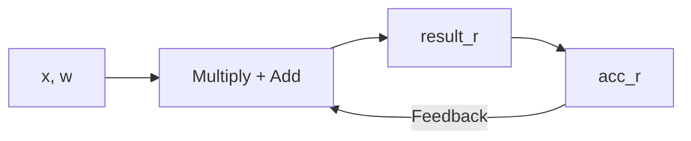

The problem should be fairly obvious once drawn like that.

The loop-carried dependency crosses two registers.

If a MAC operation begins using accumulator value $a_n$, its result is not available on the feedback path for the immediately following cycle. It first enters `result_r`, then `acc_r`, and only then becomes the value which can participate in the next dependent accumulation.

The recurrence I mentally treated as one cycle was actually two.


That meant the compute path could not sustain one dependent MAC every cycle. The real rate for that accumulation chain was one MAC every two cycles.

This was not some harmless typo in the documentation. I had misunderstood the performance of the central datapath of the accelerator. The PE was one of the first pieces of hardware I designed, and I propagated the assumption that it could sustain a MAC every cycle for months.

Yet all 196 tests passed.

That initially sounds like the tests had failed me, but they didn't. They were just checking something else entirely.

The surrounding convolution controller naturally left enough space between dependent contributions that the accumulator always received the correct previous value before it was used again. The extra register did not corrupt the calculation. It made the calculation slower.

If the reference model expected:

```math
y = x_0w_0 + x_1w_1 + x_2w_2 + \cdots
```

the RTL still produced exactly that; it just took more cycles than I thought it did.

## Fixing the Feedback Path

Once I understood the problem, the fix was conceptually simple.

The accumulation itself needed to live inside the PE rather than travelling through a registered PE result and then another registered accumulator before coming back.

Instead of:

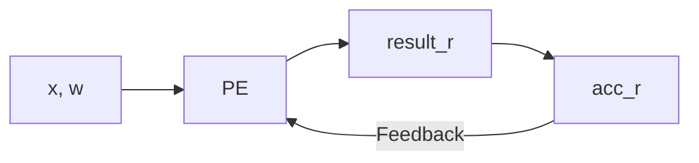

the running state could live behind a single register in the PE:

```mermaid
flowchart LR
	A["x, w"] --> B["Multiply + Accumulate"]
	C["acc_r"] --> B
	B --> C
	C --> D["Completed Result"]
```

Now the loop-carried path implements the recurrence much more directly:

```math
a_{n+1} = a_n + x_nw_n
```

with one registered state update.

The old accumulator stage could still be useful, but no longer as part of the dependency loop. It could become a holding stage for a completed result on its way into bias, activation and requantisation.

That change is currently in my local version of lg-npu rather than the public repository, which is one reason the repository should not be treated as a perfect description of where the design is today.

The amusing part is that the old version did not remain confined to lg-npu; the Tiny Tapeout MAC engine descended from this convolution design, and I submitted it before finding the mistake.

Assuming the silicon comes back as expected, my first fabricated chip will therefore contain a tiny physical fossil of the version of me who did not notice the extra cycle. I think that's a fun quirk.

Obviously I would prefer not to put bugs into chips, and if this had been a commercial tapeout the reaction would have been rather less sentimental. But as a first piece of silicon, it feels appropriate. The chip is supposed to represent learning hardware. Having one of my early misunderstandings literally frozen into the silicon is about as honest a record of that process as I could ask for.

More importantly, finding the mistake did not make me embarrassed about the original design. Instead it gave me more confidence.

When I first wrote the PE, I understood enough to make the arithmetic work. When I returned months later, I understood enough to look at my own explanation, feel that something was wrong, ignore the authority of my own documentation, and derive the actual behaviour from the registers underneath it.

That difference is worth far more than having been right the first time.

There are probably more mistakes like that in lg-npu; I would be surprised if there weren't.

## What I Would Change Now

The project is still very obviously the work of somebody learning the field while building it.

I do not mean that as an insult toward it.

The serial scheduler is one example. Running one command at a time made the first architecture much easier to reason about, but it leaves an enormous amount of potential performance unused. DMA cannot operate while a compute backend is active. Independent operations cannot overlap. The various execution blocks mostly sit idle unless they are the one currently selected by the scheduler.

A more serious design would need to think about resource ownership rather than simply avoiding conflicts by serialising everything.

DMA could fill one region of memory while compute consumes another. Commands without dependencies could potentially overlap. Buffer ownership could be tracked explicitly. Completion would no longer mean "the one thing the machine was doing is finished," so the host and runtime would need a better model of outstanding work.

That would also change the memory system. The simple local-buffer arbitration was fine when there was usually one important requester, but concurrency makes bandwidth and port availability much harder problems. A compute engine and DMA controller cannot both be promised unrestricted access to the same single-port SRAM.

The convolution backend still has the line-buffer problem too. I designed the machinery for reusing activation rows and generating windows, but the working convolution path continues to perform more SRAM reads than it should because I never integrated it.

That bothers me more now than it did when I wrote it.

At the time I was trying to learn the whole system. Today, if I returned specifically to improve convolution throughput, data reuse would be one of the first places I looked. There is little value in building a wider PE array if the memory system cannot feed it.

Datatype support is similarly narrow. INT8 was a very good choice for learning because it let me build a realistic quantised datapath without immediately disappearing into floating-point arithmetic, but a broadly useful neural accelerator needs more flexibility than one representation. Different precision choices change the multiplier area, accumulator requirements, memory bandwidth, software model and quantisation behaviour, so "add another datatype" is not simply a case statement I forgot to write.

Tensor layout is another compromise I would revisit. Supporting NCHW by converting to NHWC in software was reasonable for the first runtime, but it moves a potentially expensive operation into the host path. A better system would either support the useful layouts directly or make the compiler/runtime intelligent enough to minimise conversions across an entire graph rather than treating each operation in isolation.

The software could grow enormously above that. The current runtime knows how to talk to the hardware I built. A serious stack would need much better model integration, graph-level scheduling, memory planning, a proper device driver across the platforms I cared about, and tooling capable of taking something closer to an ordinary trained model and turning it into commands the accelerator can execute.

Then there is the physical implementation.

The current Sky130 flow completes. I am careful with that sentence now. A flow completing is not the same as a design being ready for tapeout.

I would want much stronger timing work before I trusted the current lg-npu GDS. The floorplan deserves another pass, particularly around the SRAM macros. The constraints need more scrutiny. The clocking, physical checks and implementation assumptions all deserve somebody coming back to them with more experience than I had during the first run.

Sky130 itself is also a learning process, not a route to building something competitive with a modern laptop NPU. A contemporary commercial accelerator benefits from vastly denser, faster and more power-efficient process technology, not to mention teams of people who have spent years solving each part of the problem I was touching for the first time.

I never expected to compete with AMD from my bedroom. That was not why I built it.

## Still a Beginner

One thing I do not want this entry to accidentally imply is that lg-npu turned me into an experienced hardware engineer in a few months. Obviously, it didn't.

I got comfortable with RTL and digital architecture very quickly. I learned enough about verification, synthesis and physical design to build substantial things and understand where many of my gaps were. I can now look at subjects which were completely opaque at the start of the year and have a useful conversation about them.

I still consider myself a beginner.

Maybe somewhere around the lower edge of whatever comes after beginner in some parts of digital design. In other parts, particularly once the problem becomes deeply electrical or device-physical, "beginner" may still be generous.

The more I learned, the less bothered I became by saying that.

At the beginning, the field was small in my head because almost all of it was invisible. Learning expanded the map much faster than it filled it in. Every answer created several new areas I could now at least see well enough to know I did not understand them.

That was what I wanted.

## The Actual Experiment

Somewhere along the way, I realised lg-npu was answering a question which was larger than whether I liked hardware.

I have been programming for around seven years, and for a long time that created an uncertainty for me.

I've never found words like "talented", "gifted", or "smart" particularly reassuring. They are obviously kind, but I find they erase too much: years of consistently doing this, nights where I kept working long after I should have stopped, repeated failures, projects which did not work, hours spent reading something until it made sense, and the absurd amount of repetition underneath everything that comes much more naturally to me now.

My point here is sacrifice. I'm sure that anyone who is passionate about their craft understands exactly what I'm saying.

I have written before about the slightly unhealthy combination of curiosity, excitement and insecurity which tends to drive a lot of my work right now. Once something becomes a target, I am extremely good at continuing to move toward it. I once compared the process to a heat-seeking missile, which is probably still the best description I have.

But all of the strongest evidence I had for that process came from software. That bothered me more than I would like to admit.

Maybe I was just a one-trick pony.

After seven years, it felt difficult to think otherwise. If I enter an unfamiliar compiler project, I am still bringing years of C/C++, systems knowledge, debugging experience and intuition about software architecture with me. If I start working on a kernel, networking stack, graphics engine, or whatever, I already know enough ideas, or neighbouring ideas, that I am never really beginning from zero.

Hardware was the first clean attempt I had made in a long time to remove that comfort. Kinda like putting on a white belt for a completely new martial art.

The first synthesis report could tell me something completely absurd and I did not yet have the intuition to recognise it.

What I did have was the way I learned to work. The knowledge didn't transfer, the process did. That distinction answered something for me.

I don't think building an "NPU" proves that I can walk into any field on Earth and eventually become good at it. That would be a stupid conclusion from one project.

But it was the first serious evidence I had that the thing I relied on was not tied completely to software.

I could become a beginner again and still recognise myself. That meant a lot to me.

To be fair, from the outside this seems obvious: engineering principles transfer across engineering domains. Perhaps those same principles are the reason why I could not let myself believe that without evidence. Or maybe not, who knows.

## A Snapshot of What Existed

Looking back at the Git history is slightly surreal because my memory stretches this period out much more than the commits do.

On March 10th, the repository got a commit titled:

```text
Made v0 (it works!)
```

The project was already around 6,600 lines across more than a hundred files.

That number includes documentation, verification and software rather than only synthesised RTL, so I do not mean it as a measure of hardware complexity. What surprises me is what was already represented in the project at that point.

There was the convolution path, the PE and array, accumulation, address generation, loading and writing, the command machinery, scheduling and completion, memories, MMIO, performance counters, a Python reference model and the end-to-end simulation harness.

Then most of the remaining operation families appeared almost immediately around it.

The first runtime work followed on March 11th, and I was already poking at synthesis on March 12th.

Serious work on the Sky130 flow came later still.

I entered the project expecting hardware to slow me down because I lacked the accumulated intuition I had in software.

Instead, once I understood enough of the basic model to start moving, the development process felt extremely familiar.

I consider the project more or less concluded now. Not because I think the NPU is finished, or because there is nothing left to improve. There is plenty, and I could probably spend another year finding things I would now design differently.

But that was never really the point.

The point was to take away the seven years of familiarity I had built around software, put myself somewhere I knew almost nothing, and see what remained. The project gave me a fairly clear answer to that, and continuing to polish it indefinitely would not make the answer much clearer.

There is still a little housekeeping left. The public repository is behind the actual current state of the project as of writing this, so I will be bringing that up to date soon. But personally, I am ready to move on and take what I learned here into something new.

And that is where the story continues.

I am now working on a [radiation detection chip](https://journal.lucagoddijn.com/entries/radiation-detection-chip/), which has a somewhat unusual reason for existing and asks a different question from this one.

For now, I'll leave that story at a peculiar job posting.

In any case, thank you for reading.

Here is the [repository](https://github.com/Arty3/lg-npu).
