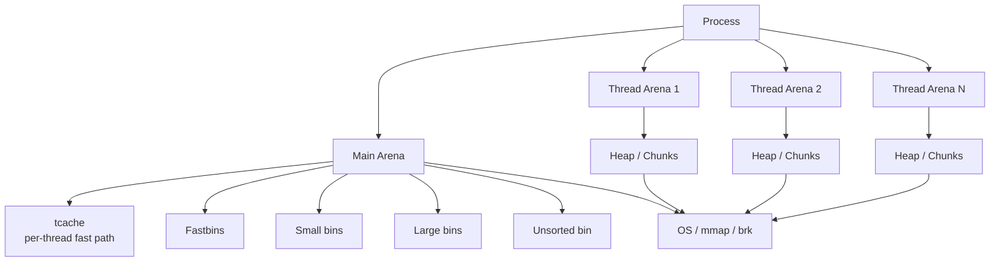
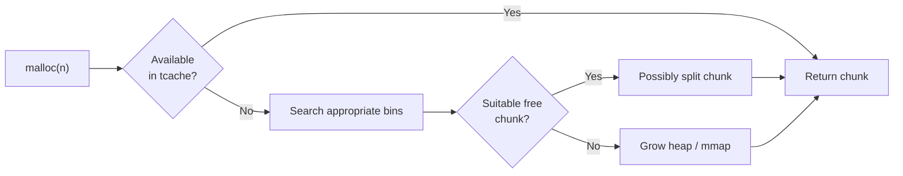
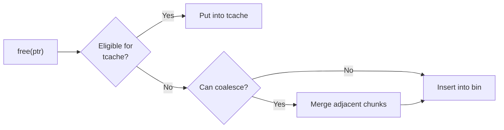
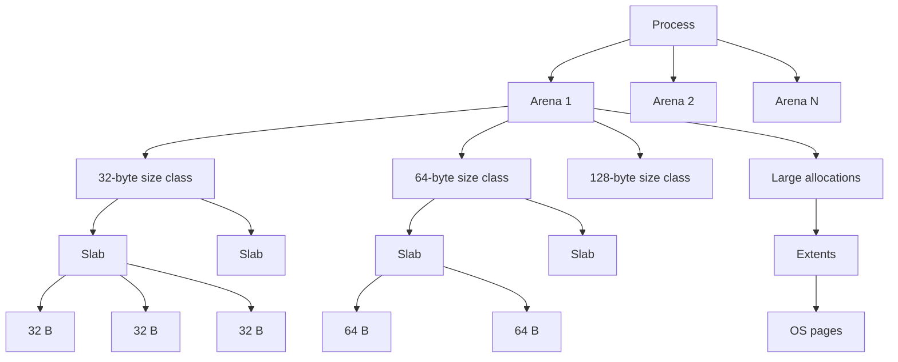
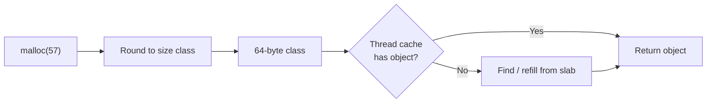
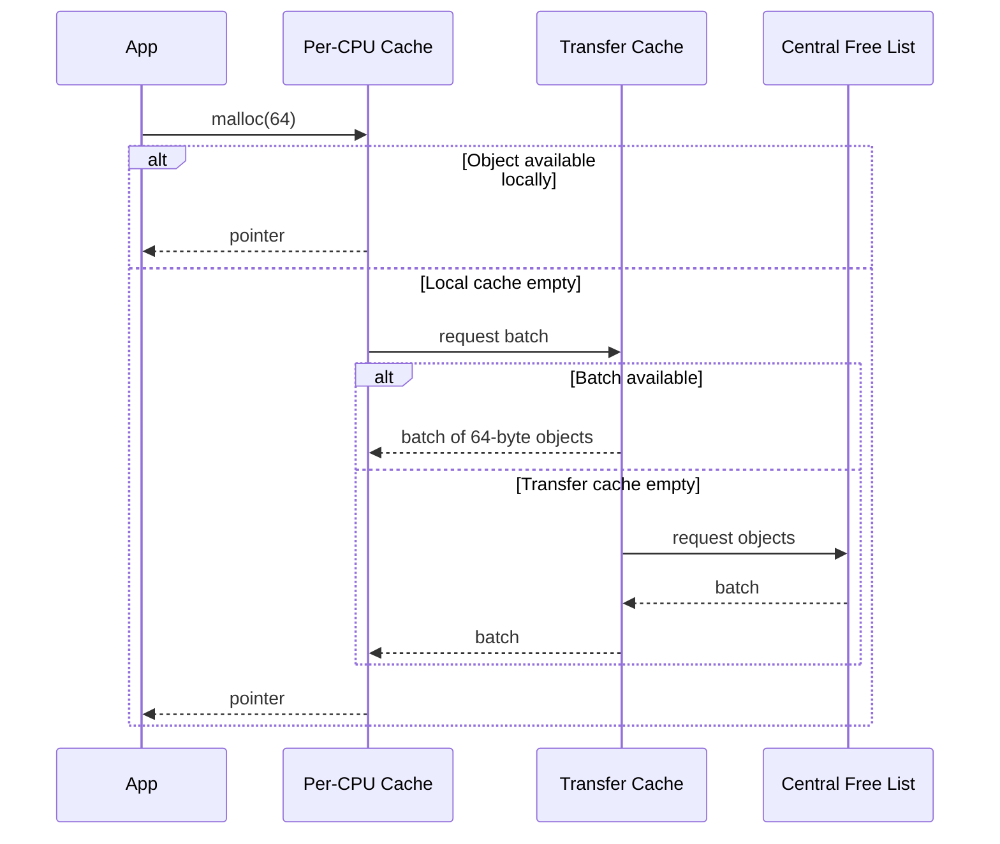
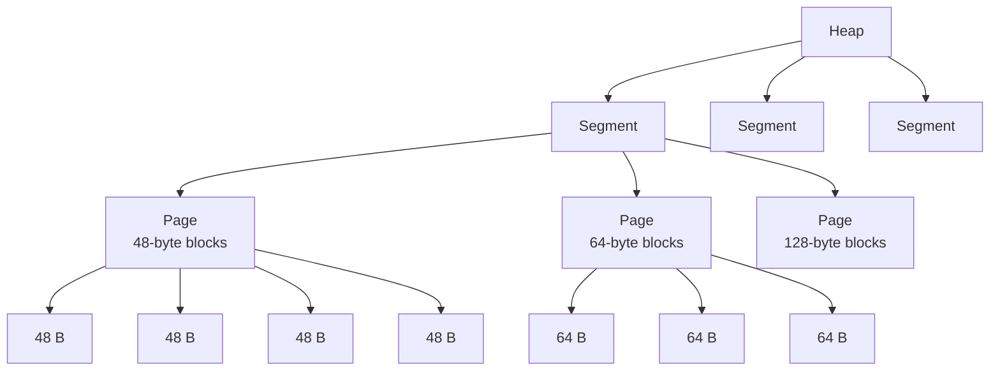
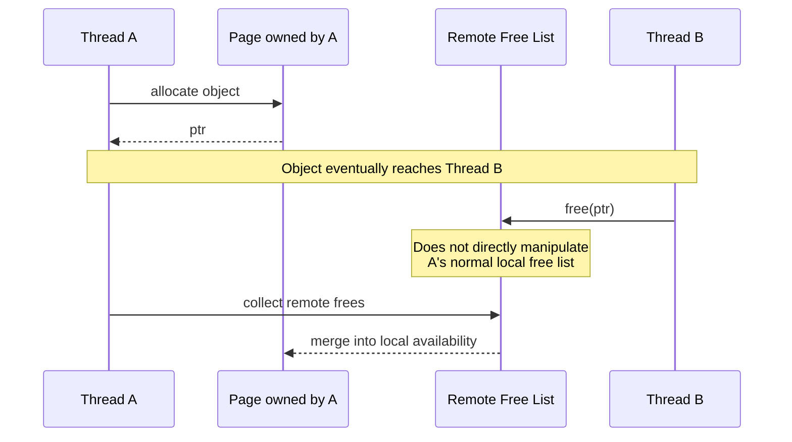
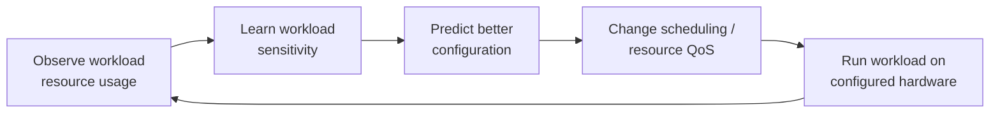
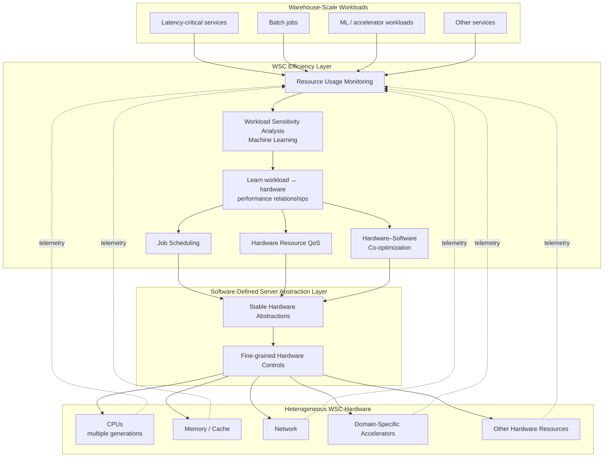

> [!TIP]
> Already familiar with how allocators work? [Skip ahead to where the story continues](#reinventing-the-wheel).

## Memory in Computers

One of the core reasons computers "work" is memory: they can remember what came before. Memory isn't necessarily an easy concept; it's often a source of bugs, vulnerabilities, and conceptual confusion. But at its core, the mechanism is, as with most elegant solutions, quite simple:

*State and values persist through time.*

I previously talked about abstractions in my entry on [The Worst Hello World](https://journal.lucagoddijn.com/entries/the-worst-hello-world/), where I defined an abstraction as, broadly speaking, "a generalization that hides some underlying complexity." This applies to memory just as much.

At the hardware level, memory isn't some magical primitive where a metal wire simply "remembers" something. Through clever circuits, physical mechanisms, and the brilliance of many people before us, we construct systems capable of preserving state. Then, one abstraction higher, programming makes this feel completely natural.

Something as basic as:

```c
a = b + c;
```

implicitly depends on memory. Without really thinking about it, one of the most fundamental computations we can write assumes that `a`, `b`, and `c` have values that exist somewhere and persist long enough to be useful. In hardware, this becomes a very real concern; it's why we have sequencing elements such as flip-flops, where memory emerges as a property of the underlying mechanism rather than existing as some primitive concept of "remembering."

Thankfully, when programming, we usually don't have to think at that level because it has been abstracted away from us. Still, our job isn't quite as easy as "don't worry about it." At lower levels, we still have to manage memory ourselves. At higher levels, abstractions once again hold our hands and often manage it for us, but that's beyond the scope of what I want to talk about here.

Broadly, when programming at this level, we'll concern ourselves with two places our memory tends to live: the **stack** and the **heap**. Stack memory is relatively simple. When we know ahead of time how much memory something requires, the compiler can arrange space for it as part of the program's stack frame. Say we have a 32-bit integer: we know it requires 4 bytes, so allocating space for it is straightforward.

Simple enough. But here comes the complicated part: **what if we don't know how much memory we're going to need?**

Let's imagine we want to receive a message from your favorite chat platform. We have no idea how large that message will be before the program is running and the message actually arrives. This is where our friend `malloc` comes in.

`malloc` is a function that gives us some memory to work with. Its API is defined roughly as:

```c
void *malloc(size_t size);
```

You give it the number of bytes you want, and it gives you back a pointer — a memory address — to the beginning of the allocated region.

Let's run through a simple example:

```c
int* memory = (int*)malloc(size * sizeof(int));

if (!memory)
	return;

for (int i = 0; i < size; ++i)
	memory[i] = i;

free(memory);
```

Here we're allocating a memory buffer of `size * sizeof(int)` bytes. We call `malloc(size * sizeof(int))` and store the returned address inside our `memory` variable. And yes, for those with a keen eye, the `memory` variable itself needs memory too: it has to remember where our newly allocated region lives. The pointer itself can live on the stack because its own size is already known.

From there, we check whether `malloc` succeeded and then start using the allocation. Since `size` isn't a compile-time constant, the way we operate on this memory is relative to whatever value it happens to contain at runtime. Maybe we're dealing with ten elements, maybe a hundred, maybe substantially more.

Finally, once we're done with the memory, we free it:

```c
free(memory);
```

This tells the allocator that we no longer need that allocation and that the memory can be reused or, eventually, returned to the operating system. If we continually allocate memory without ever releasing it, we get what's called a **memory leak**: memory remains occupied even though the program no longer has any meaningful use for it.

If you thought your laptop was slow now, imagine how things would look if everyone just leaked everything forever.

## What Does `malloc` Actually Do?

This is where today's story really begins.

Approximately two or three years ago, as of writing this, I was still relatively new to the world of low-level programming. Naturally, one of the things you eventually discover is that `malloc` isn't really just "giving" you memory. It's another abstraction, dare I say luxury: another piece of modern software holding your hand while an enormous amount of machinery operates underneath.

I had known this for a while, but I only really started digging into it after watching [this video](https://youtu.be/CulF4YQt6zA). In it, Ed goes through the process of creating his own custom heap allocator to learn a thing or two, and naive me naturally thought:

*How hard could it be?*

So I started making one too.

The thing is, allocators are **very, very complicated pieces of software**. There isn't even one canonical implementation of `malloc`; the API may remain mostly familiar, but underneath it sit many different allocators, each making different decisions and trade-offs to accomplish roughly the same task.

## Why Allocation Is Difficult

Let's define the problem properly.

Requesting memory from the operating system isn't free. The OS has to manage virtual address spaces, physical memory, permissions, pages, mappings, other processes, and a whole collection of machinery that we would rather not invoke for every tiny allocation our program makes.

If every `malloc(32)` directly asked the operating system for 32 new bytes, our programs would be considerably slower. And considering that an absurd amount of software depends on this API, we'd better make sure it's fast as f*ck.

One of the important ideas used to solve this is the **arena**. In 1990, David R. Hanson published *Fast Allocation and Deallocation of Memory Based on Object Lifetimes*. The central idea is essentially what we now associate with arena allocation:

> **Group objects with the same expected lifetime, allocate them sequentially from large blocks of memory, and reclaim the entire group at once.**

There is an important historical qualification here, though. Hanson did not invent the underlying concept from nothing; an earlier recognizable ancestor appears in Douglas T. Ross's 1967 *The AED Free Storage Package*, where entire zones of allocated memory could be released together. That's essentially the same broad arena-like semantic idea, although the terminology and implementation differ.

In any case, arenas became one of the foundational concepts behind modern memory allocation. The principle is roughly as described above: instead of repeatedly asking the operating system for tiny pieces of memory, we obtain larger regions and then manage smaller allocations ourselves within them.

A very simple allocator could request a large slab of memory when `malloc` is first called, divide that region however it sees fit, and then satisfy later allocations from memory it already owns. When some memory is freed, it can be recycled, and when appropriate, entire regions can eventually be returned to the operating system.

Most modern allocator implementations and allocator research don't really dispute the basic idea that managing larger regions ourselves is useful. Instead, the interesting work happens in **how** we organize everything in between.

So let's look at a few different `malloc` implementations:

* `ptmalloc2`
* `jemalloc`
* `tcmalloc`
* `mimalloc`

### `ptmalloc2`

`ptmalloc2` forms the historical basis of glibc's `malloc` implementation on Linux today, although modern glibc has evolved considerably beyond the original `ptmalloc2`.

Conceptually, its memory organization looks something like this:



Each allocation is represented as a chunk with metadata associated with it, while freed chunks are categorized into different linked structures called **bins**, depending on their size and state.

A heavily simplified allocation path looks something like:



And freeing:



One of the clever parts of `ptmalloc` compared with older single-heap allocators is its use of multiple arenas: different threads can operate on different arenas instead of every thread fighting over one global heap lock. Modern glibc also has a per-thread `tcache`, which makes many common small allocations substantially faster than this simplified description would suggest.

### `jemalloc`

`jemalloc` also uses multiple arenas, but its heap organization is much more deliberately structured around **size classes**. Rather than thinking primarily in terms of arbitrary chunks, `jemalloc` rounds allocations into predefined classes:

```text
16, 32, 48, 64, ...
```

Small objects belonging to the same size class can then be packed into slabs:



This makes finding appropriate memory much easier. For example:



`jemalloc` also has per-thread caches, meaning many common operations don't even have to access an arena directly. Its philosophy is roughly:

> *sacrifice some flexibility by grouping objects into carefully chosen size classes, in exchange for predictable performance, scalability, and fragmentation control.*

That's one reason `jemalloc` became especially popular for large server workloads. Its design is heavily concerned with fragmentation and scalability as well as simply making `malloc` fast.

### `tcmalloc`

This one is particularly important because it sparked the idea behind `lgmalloc`.

`tcmalloc` is Google's allocator, originally born from the need to handle memory allocation efficiently across highly concurrent workloads. Its defining idea is right there in the name: **Thread-Caching Malloc.**

From the [official design documentation](https://github.com/google/tcmalloc/blob/master/docs/design.md), its goals include fast uncontended allocation and deallocation, flexible memory reuse, low per-object overhead, and efficient sampling for understanding application memory use.

Here is a rough overview of `tcmalloc`'s internal structure:

<div align="center">
	
</div>

Essentially, `tcmalloc` tries to make the overwhelmingly common allocation path almost entirely local to the executing thread or CPU, which makes it extremely effective for highly concurrent programs performing enormous numbers of small allocations.

A normal small allocation therefore looks roughly like:



The design isn't perfect, though, and this is where I have some criticism which will later become important for `lgmalloc`.

### `mimalloc`

`mimalloc` is Microsoft's allocator, and it brings another interesting approach to the table: one of its major ideas is **free-list sharding**.

Instead of maintaining one comparatively large shared free list for a size class, `mimalloc` breaks memory into pages, each with its own free list. Free-list operations therefore naturally happen over smaller, more localized structures.

The hierarchy looks approximately like this:



A page typically contains blocks belonging to a single size class, which has a nice property for locality. Say you repeatedly allocate 48-byte objects: rather than having those objects scattered throughout unrelated memory, `mimalloc` tries to satisfy them from the same active page. That means allocator metadata, free-list operations, and the objects themselves tend to remain relatively cache-local.

The original `mimalloc` paper emphasizes free-list sharding as one of its central innovations, and you can read it [here](https://www.microsoft.com/en-us/research/wp-content/uploads/2019/06/mimalloc-tr-v1.pdf). That paper describes the original `mimalloc` design, while the allocator itself has continued evolving considerably since then.

Anyway, the broad philosophy is to keep allocator data structures **small, local, and heavily partitioned**, improving both synchronization and cache behavior.

It also has an elegant mechanism for cross-thread frees. If thread B frees memory originally owned by thread A, it doesn't have to immediately take over A's normal allocator structures; remote frees can instead be accumulated separately and later reconciled by the owning thread:



## Reinventing the Wheel

All of these `malloc` implementations are examples of great engineering, but, as with most great engineering, eventually everything becomes a game of trade-offs.

This is where my story continues. While studying `tcmalloc`, I noticed something — the criticism I mentioned earlier. I should probably qualify the word *criticism*, because it isn't entirely fair: this is an issue that the engineers behind these allocators are obviously aware of, and I certainly wasn't uncovering some secret that nobody smarter than me had noticed.

Still, I didn't want to simply accept it.

At some point, sufficiently local caches have to interact with more central allocator structures, and under enough contention those shared structures can become bottlenecks. That brings us to one of the fundamental trade-offs allocators face in multi-threaded environments:

*shared structures can introduce contention, while highly thread-local designs require additional memory to maintain all of that locality.*

In other words, we either risk sacrificing performance under heavy contention, or we avoid contention by keeping more memory around locally.

`lgmalloc` was born out of wanting to challenge that trade-off. I essentially asked myself:

> *Does it really have to be this way?*

The premise was to somehow **predict what memory the program would request during its lifetime**. If we could do that, maybe we could satisfy both sides: preserve thread-locality for performance, reduce the amount of memory wasted to achieve it, and sprinkle in a little "I already know what's coming" engineering.

This idea actually wasn't new to me. Way back in 2019, an aspiring 14-year-old Luca had basically the same idea, just applied to a very different problem.

Allow me to introduce: *The Ocean Kernel*

<div align="center">
	
</div>

I even proudly wrote:

> *PROPRIETARY & CONFIDENTIAL*

Which I find pretty funny; though to be honest, I'm actually quite proud of what I was writing at 14:

<div align="center">
	
</div>

What happened was that a friend introduced me to FPGAs. To me, these were crazy sci-fi pieces of technology, but the part that really stuck with me was their reconfigurability: you could configure hardware specifically around a task.

Naturally, my teenage brain immediately went:

> **REPROGRAMMABLE CPU ARCHITECTURE!!**

without really understanding that FPGAs and CPUs occupy very different design spaces, or that FPGAs generally pay heavily for their programmability compared with custom silicon.

I was barely into high school at the time, learning basic CPU scheduling algorithms and similar concepts. I'd listen to my teacher describe them and think about how inefficient some of them sounded, while simultaneously being baffled by just how much was happening inside my computer while I was doing something as mundane as playing a video game.

So I combined "reprogrammable CPU architecture" with "machine learning", threw in a few other fancy words such as "polymorphism", slapped all of it onto an imaginary kernel, and thought:

> *Wow, I'm so smart! How has nobody ever thought of this before?*

I had, of course, written approximately zero lines of code.

The idea behind the project was essentially:

*What if we optimize all of these hidden things the kernel and operating system do for us — scheduling, file-system behavior, networking, and so on — by learning their patterns and dynamically modifying the algorithms or hardware underneath them?*

Polymorphism 🤯!

To be fair, the underlying idea isn't actually half bad. I'm making fun of myself because I now realize how superficial the plan was, but someone at Google did, in fact, pursue this broader idea in a much more serious form:

https://research.google/pubs/autonomous-warehouse-scale-computers/

Conceptually, it forms a closed optimization loop:



With a little more detail, it becomes:



That paper came out in 2020, so technically speaking, I preceded Google by a year 😎.

Alright, jokes and detours aside, there is one intellectual point I want to carry from this back into `lgmalloc`: it was proposing essentially the same broad idea, just wearing a different costume.

The details are completely different, obviously, but the core question remains:

> *What if we can learn what is coming our way beforehand?*

The contention-versus-memory-waste trade-off I described earlier exists partly because the allocator doesn't know what the program is going to request. It has to be prepared, and preparedness costs resources.

So what if we could know more?

There is one crucial nuance here, though: **we need to learn before the workload hits us.** Allocator adaptation already exists in various forms, but runtime adaptation first has to observe behavior before it can react to it. What I wanted was stronger: predict useful allocation behavior **before the allocator actually encounters it**.

Alright, let's learn beforehand then. But how?

## Trying to Predict Allocations

The System V ABI gives us something useful here: ELF, the **Executable and Linkable Format**. ELF is the standard binary format used by executable files, object files, shared libraries, and related artifacts on systems such as Linux, but most importantly for my idea, **ELF files are parseable.**

So I started experimenting with ways of embedding allocation metadata into the binary itself. This resulted in things like:

```c
/* ******************************************** */
/*                                              */
/*   lgmalloc_heuristics.h                      */
/*                                              */
/*   Author: https://github.com/Arty3           */
/*                                              */
/* ******************************************** */

#ifndef __LGMALLOC_HEURISTICS_H
#define __LGMALLOC_HEURISTICS_H

#include "lgmalloc_features.h"

#include <stddef.h>

#define LGMALLOC_HEURISTICS_SECTION ".lgmalloc_heuristics_data"

/**
 * Metadata for malloc calls throughout the user's source files.
 * Allows us to track and predict allocation patterns heurically.
 */
typedef struct
{
	size_t      size;
	const char *file;
	int         line;
	const char *func;
	size_t      freq;
	int         is_const;
} lgmalloc_heuristic_entry_t;

/**
 * The initialization process relies on the respective
 * size classes when creating the memory mappings.
 * This attempts to improve the size class definitions
 * via a heuristic statistical approach.
 *
 * These macros serve to wrap the lgmalloc call, allowing
 * us to track allocation patterns, predict size classes
 * and optimize memory mappings accordingly.
 *
 * Two main branches exist. The most important is the
 * const call, i.e. tracking allocations where `size`
 * is a constant known at compile time. The second is
 * the runtime call tracker, where we don't know what
 * `size` will be.
 *
 * The runtime call doesn't prove as effective since
 * we of course don't know the allocation size. Though,
 * the frequency of the calls give an insight into
 * overhead model designs and strategies.
 *
 * The compile time call allows us to already predict
 * some, if not all, the allocations that will happen
 * throughout the program's life-span. This proves
 * HIGHLY useful in simple control flow programs.
 *
 * Due to each thread having its own heap and memory
 * map, heuristics will be applied in a thread local
 * context based approach. Since we want to predict
 * size classes when we initialize, and we initialize
 * when a new thread is created and lgmalloc is called,
 * we can just restrict everything to a per-thread
 * context, avoiding unnecessary memory waste.
 *
 * This functionality comes at a cost. The API will
 * not be as clean, because the lgmalloc function
 * (or the malloc symbol respectively) will become
 * a macro, therefore the type of `size` (size_t)
 * won't be evident to the average user. This
 * logic will also need to be exposed in the API.
 *
 * We cannot wrap this logic within the function
 * itself as the heuristic approach will crumble,
 * losing call patterns and compile-time constants.
 */

#define __TRACK_LGMALLOC_RUNTIME_CALL(sz, file, line, func)             \
	do                                                                  \
	{                                                                   \
		__attribute__((section(LGMALLOC_HEURISTICS_SECTION), used))      \
		static _Thread_local TLS_MODEL lgmalloc_heuristic_entry_t        \
		__lgmalloc_track_##file##_##line = {                             \
			.size = (sz), .file = #file, .line = (line),                 \
			.func = (func), .freq = 0, .is_const = 0                     \
		}; __lgmalloc_track_##file##_##line.freq++;                      \
	} while (0)

#define __LGMALLOC_CONST_SECTION(sz) \
	LGMALLOC_HEURISTICS_SECTION ".const." LGMALLOC_STRINGIFY(sz)

#define __TRACK_LGMALLOC_CONST_CALL(sz)                                 \
	do                                                                  \
	{                                                                   \
		__attribute__((section(__LGMALLOC_CONST_SECTION(sz)), used))     \
		static _Thread_local TLS_MODEL lgmalloc_heuristic_entry_t        \
		__lgmalloc_track_const_##__FILE__##__LINE__ = {                  \
			.size = (sz), .file = __FILE__, .line = __LINE__,            \
			.func = __func__, .freq = 0, .is_const = 1                   \
		}; __lgmalloc_track_const_##__FILE__##__LINE__.freq++;           \
	} while (0)

#define __TRACK_LGMALLOC_CALL(sz)                       \
	do                                                  \
	{                                                   \
		if (__builtin_constant_p(sz))                   \
			__TRACK_LGMALLOC_CONST_CALL(sz);            \
		else                                            \
			__TRACK_LGMALLOC_RUNTIME_CALL(              \
				sz, __FILE__, __LINE__, __func__        \
			);                                          \
	} while (0)

#endif /* __LGMALLOC_HEURISTICS_H */
```

This mess is "trying" to do exactly what the huge papyrus comment says: **track allocation call sites.**

There are approximately two million flaws in this snippet, but one in particular makes the entire strategy collapse. The system primarily wants to exploit allocations whose sizes are known at compile time, and if you've read the stack-versus-heap explanation above — or simply already know how this works — you may immediately see the problem.

One of the major reasons we use dynamic allocation in the first place is that we **don't** necessarily know what memory we will need at compile time. Generally speaking, you don't see:

```c
malloc(123);
```

Because when a fixed amount of storage is genuinely known and suitable to allocate statically or automatically, there are often simpler ways to express it.

So I had built a substantial part of the prediction mechanism around exactly the class of allocation where prediction is least interesting.

Outstanding progress.

One lesson I took from this was to **fail early**, or at least earlier than this. These days I try to test the fundamental assumption behind an idea as soon as possible, because sometimes a project simply isn't worth pursuing.

Still, let's go back to the ELF idea. Theoretically, we could build a system sophisticated enough to train on enormous quantities of other programs and infer likely allocation behavior from a new executable. Ignoring the licensing and ethical problems for a moment, the result still wouldn't be robust enough.

And the reason is the same reason thread-local allocators waste memory in the first place: **we simply cannot know with certainty what memory the program will need at runtime.**

Maybe inference gets us 60% of the way there. Maybe even more. But if the strategy depends on very accurate preallocation and we undershoot at exactly the wrong moment, we fall back onto the expensive paths we were trying to avoid anyway.

Parsing the ELF is therefore ***a*** strategy. We inspect call patterns, infer behavior from what we've learned elsewhere, and perhaps arrive at something useful, but it also becomes fragile. We need instrumentation or wrappers to preserve useful information through compilation; we begin changing the API assumptions; optimizations can transform the program underneath us; and dynamic input still dominates many of the allocations we actually care about.

Eventually, we arrive back at the fundamental problem:

**The idea fails because of the same uncertainty that makes `malloc` necessary in the first place.**

We simply don't know what's coming with enough certainty.

## What `lgmalloc` Eventually Became

In its current abandoned form, `lgmalloc` is an unfinished implementation. I architected and wrote code for a large chunk of it, but almost none of the core novel ideas were implemented end-to-end. The architecture followed many principles taken from `rpmalloc`, `tcmalloc`, `jemalloc`, `snmalloc`, and `mimalloc`, shaping its own identity standing on their shoulders.

The design is based on this structural hierarchy:

### `block_t`

```c
typedef struct __block_t
{
	struct __block_t    *next;
	uintptr_t           alloc;
	/* Remove size field later if not needed */
	size_t              size;
}	block_t;
```

This structure represents a raw memory block. It's the lowest abstraction from a raw memory slab. This holds the raw memory with a size of its respective size class.

Raw memory blocks are handled by chunks which hold a linked list of memory blocks, all being of the same size class (e.g. 8 bytes).

### `chunk_t`

```c
typedef struct __chunk_t
{
	struct __chunk_t    *next;
	struct __chunk_t    *prev;
	size_t              size_class;
	size_t              block_count;
	size_t              blocks_in_use;
	int                 is_full;
	segment_t           *parent_segment;
}	chunk_t;
```

As mentioned, a chunk has all memory blocks within it partitioned to the same size class. Some of you may notice the lack of a `block_t` linked list, the reason is that we access blocks with size class-based bit manipulation logic elsewhere, which is even faster than traversing the linked list.

### `segment_t`

```c
typedef struct __segment_t
{
	struct __segment_t  *next;
	heap_t              *parent_heap;
	chunk_t             *chunk_list;
	size_t              chunk_count;
	size_t              segment_size;
	uintptr_t           mmap_start;
}	segment_t;
```

This is instead a segment, a large memory mapping which is then split into chunks based on size classes. This is effectively an **arena**.

If the `size` argument passed to `lgmalloc` exceeds a value defined by the macro `LGMALLOC_MMAP_THRESHOLD` then `lgmalloc` calls a dedicated memory mapping to not waste segments which are already prepared for smaller and predictable allocations.

### `mmap_t`

```c
typedef struct __mmap_t
{
	struct __mmap_t *next;
	void            *alloc;
	size_t          size;
}	mmap_t;
```

This is instead a memory map — yes, confusing naming it the same way as the API — it holds the actual dedicated memory mappings. This helps simplify the freeing process since calling free on this will directly go to `munmap`.

### `heap_t`

Finally the structure overseeing it all, the heap:

```c
typedef struct __heap_t
{
	uintptr_t   tid;
	segment_t   *segment_list;
	size_t		segment_count;
	mmap_t      *mmap_list;
	size_t      mmap_count;
}	heap_t;
```

In the case of `lgmalloc`, the heap structure is thread-unique, this is to avoid contention overhead and maintain performance scalability across threads. Since each thread will have their own memory segments and memory management, the memory footprint won't scale like it does in other allocators — had the core ideas did work correctly.

### Size Classes

As I mentioned, `lgmalloc` uses size classes. They look like this:

```c
/* Default size classes which is then optimized
 * Will always be of size `size_class_count_g`
 */
static _Thread_local TLS_MODEL
size_class_t __size_classes_g[] =
{
	LGMALLOC_SMALL_CLASS(1),		LGMALLOC_SMALL_CLASS(1),		LGMALLOC_SMALL_CLASS(2),
	LGMALLOC_SMALL_CLASS(3),		LGMALLOC_SMALL_CLASS(4),		LGMALLOC_SMALL_CLASS(5),
	LGMALLOC_SMALL_CLASS(6),		LGMALLOC_SMALL_CLASS(7),		LGMALLOC_SMALL_CLASS(8),
	// ...
};
```

> *The size class `1` appearing twice is on purpose.*

These have surrounding infrastructure to optimize and handle them appropriately.

One of the core principles for `lgmalloc` was exactly this, size class and memory retrieval should be lightning fast. Most of that was implemented via what I call "highways": specialized hot paths to return memory as fast as possible.

The reasoning here is that if we know what's probably coming, we can optimize for that, reducing the size classes we pre-allocate and with some SIMD and bit manipulation magic, we can return memory allocations really, really fast.

Finally, one of the last core principles of `lgmalloc` was thread locality. As I mentioned, heap structures were unique to each thread. This means that every time a new thread spawns, it receives its own heap structure, memory segments, and so on. This allowed `lgmalloc` to avoid locks and contention entirely.

So `lgmalloc` was not just a few lines of code written and a lengthy thought experiment, it had a large chunk of infrastructure already implemented, complete even with features like profiling and statistics. The problem was simply that the core ideas don't work.

## Moving On

This project taught me a lot, but the first lesson is the obvious one: **fail early.** Within this kind of work, it is probably one of the healthiest and most productive habits you can develop.

`lgmalloc` also left me with other ideas that eventually developed into more concrete projects and areas of interest, though. Two things in particular stood out:

1. Bridging the gap between programmers and the compiler through language semantics.
2. Learning how to formalize your work.

I want to start with the first one because I find it much more interesting.

Let's look at some code from `lgmalloc`:

```c
MALLOC_CALL(2) HOT_CALL NO_INLINE NO_NULL_ARGS
void *heap_alloc(heap_t *heap, size_t size)
{
	GUARANTEE(size, "size must not be 0");

	if (size <= LGMALLOC_TINY_THRESHOLD)
	{
		block_t *block = do_tiny_alloc(heap, size);

		if (LIKELY(block))
			return block;

		// ...
	}

	void *alloc = regular_heap_alloc(heap, size);

	if (UNLIKELY(!alloc))
		errno = errno != EAGAIN ? ENOMEM : EAGAIN;

	return alloc;
}
```

Notice anything weird?

There are a bunch of macros doing weird things. They're fairly self-explanatory, sure, but **why they exist in the first place** is what I find interesting.

When I started writing `lgmalloc`, I intended it to become a long-term project — because I had not yet learned the "fail early" lesson — so I spent at least a week cementing the foundations of the project and its codebase. Taking inspiration from glibc, I began defining macros like these, and then I noticed that I kept going.

Using them was actually really pleasant. I wanted the codebase to remain readable, understandable, and of reasonably high quality, and these macros gave me a vocabulary for expressing intent.

Most of them ultimately expand into compiler built-ins or attributes, but there is a meaningful difference between writing:

```c
__attribute__((visibility("default")))
```

and writing:

```c
API_CALL
```

The first describes a compiler mechanism; the second describes what that mechanism **means to my program**.

This is already a major reason macros are used in large C codebases. Unfortunately, the implementation side can get very messy.

Like, **very messy**:

```c
/* Calls the given function `f` on the variable `var`,
 * it will be called when the variable goes out of scope.
 * Expecting a function that takes `typeof(var)` */
#define VAR_DESTRUCTOR(var, f)                                          \
	do                                                                  \
	{                                                                   \
		_Static_assert(                                                 \
			_Generic(&(var), typeof(&(var)): 1, default: 0),            \
			"Variable " #var " type check failed"                       \
		);                                                              \
		_Static_assert(                                                 \
			_Generic((f), void (*)(typeof(&(var))): 1, default: 0),     \
			"Cleanup function " #f " signature mismatch for " #var      \
		);                                                              \
		(void)0;                                                        \
	} while(0)                                                         \
	__attribute__((cleanup(f)))
```

Yikes.

But actually *using* abstractions like these can be delightful. Their obvious purpose is to wrap functionality in a convenient and somewhat portable interface while hiding compiler and preprocessor machinery, but I think they also have a second, more interesting purpose:

They improve the semantics of the language — or at least the semantics of the project built on top of it.

I think this matters more than we often realize, and I'll talk about it properly in a future entry I'm planning to call **"Bridging the Gap to the Compiler."** This idea eventually evolved into something much larger for me.

Funny enough, C++26 is introducing contracts, which I'm extremely excited about because they formally express essentially the same ideas I've been duct-taping onto C and C++ code for around two years. If you're interested in how they work, [this video](https://youtu.be/9HRGPeVBoW4) is quite good.

I'll go into much more depth on this in that future entry, including how the approaches I've experimented with differ from the now-standardized C++ mechanism.

## Formalizing the Work

The second major thing `lgmalloc` taught me was how to begin **formalizing my work**.

I actually started writing a paper for the project, with the plan being to write it alongside development as I gathered results. The thing is, I've never gone through a traditional university path. Nobody had ever required me to formalize my work, conduct research in that setting, or write academic papers; whenever I've done those things, I've done them because I wanted to learn how.

So my skills were, well... not good.

To be fair, I only got as far as writing the abstract and introduction, but even that taught me the basics of what the process was supposed to look like. Since then, I've become much more deliberate about design documents, technical documentation, formal reasoning, and writing down the structure behind the systems I build.

That has especially carried over into my day job, where I regularly find myself designing new systems, making architectural decisions, and trying to explain those decisions clearly enough that other people can build on them.

Anyway, here is the paper:

<object class="pdf-embed" data="/assets/entries/lgmalloc/lgmalloc-paper.pdf" type="application/pdf" aria-label="lgmalloc paper (PDF)"><p>Your browser can't display PDFs inline — <a href="/assets/entries/lgmalloc/lgmalloc-paper.pdf">download the paper</a> instead.</p></object>

I'll talk more about my process of learning how to write papers in another entry.

## Is `lgmalloc` Dead?

I don't think this project is entirely dead. There are ideas buried in it that I'd still like to repurpose in a different direction, although I'm not making any guarantees.

Maybe come back here in a year or two and there will be a link to something new.

Normally, I'd link the repository at the end of an entry like this, but this time I've deliberately kept it private for exactly that reason. Whatever I found useful enough to share from the original project, I've already shared here.

One final thing before I sign off: I'd like to shout out [Mattias Jansson](https://github.com/mjansson) and the other contributors behind [`rpmalloc`](https://github.com/mjansson/rpmalloc). I haven't focused on it in this entry, but I found it to be a fantastic piece of software and learned a lot from studying it while working on my own overly ambitious allocator.

They've also released version 2.0.0 with a collection of improvements that I think are worth looking through. There's always something to learn from good software.

Anyway, thank you for reading through!

> *By the way, for those curious, `lgmalloc` stands for "luca goddijn malloc", I didn't know what to name it and `jemalloc` follows the same principle.*
