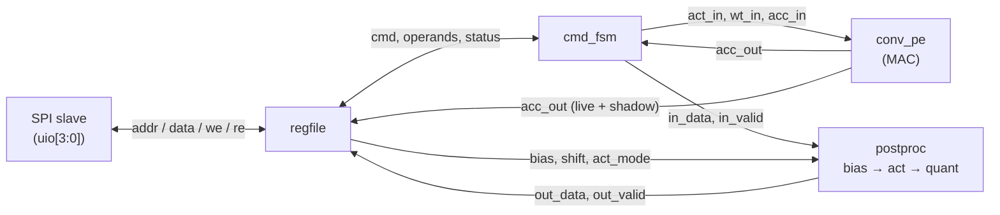
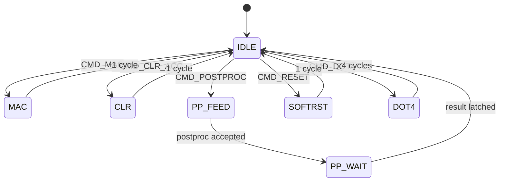
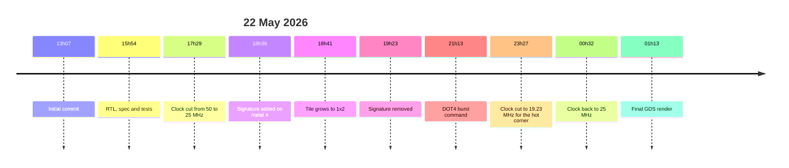

> [!NOTE]
> I'm writing this before the chip exists. The design went off to the foundry in June 2026 and the silicon is expected later this year, so the story stops at the point where I pressed submit. The last section is a promise rather than a result, and I'll come back to finish it when there is something to hold.

## A Grain of Salt

For as long as I can remember working on software, I've always been somewhat fascinated with the transition into the physical world.

I wrote about that in the [lg-npu](https://journal.lucagoddijn.com/entries/lg-npu/) entry, in a section I called "Something Physical", and I described the image in my head fairly literally: I wanted a real piece of silicon I could hold between two fingers and know that somewhere inside it, far too small to see, were structures that existed only because I decided they should. Not a simulation of them, not an FPGA pretending to be them, the things themselves, etched into a rock.

By May of 2026, I was a couple of months into lg-npu, and if you've read that entry you know roughly where I was. The RTL worked in simulation. The regression suite passed. I had tried synthesis exactly once, it had failed, and I had shrugged and gone back to the parts that were moving quickly. Somebody had recently described the whole thing to me as "a bit of RTL", I had spent an evening on my roof reading about everything that sentence implied, and I had run head first into the cold, hard, and bitter wall of what a private chip run actually costs.

So, to be clear, lg-npu was nowhere near finished. It was a machine that behaved correctly in a simulator and had never been asked to be anything else.

In the sense I actually cared about, it didn't exist.

That gap is what this entry is about. I just wanted to do this. Sometimes that's all there is to it.

I'm not going to re-explain MACs, quantised inference or RTL here. If you've read lg-npu you have everything you need, and if you haven't, the short version is that the chip multiplies small numbers and adds them up, which turns out to be most of what a neural network is. What was new this time was everything that happened after the RTL worked. A real process. A fixed amount of silicon. A timing corner that refused to close comfortably. And a button that turned editable source code into a set of polygons on their way to a factory.

## Other People's Chips

I already went through the money problem in lg-npu, so I'll keep it short: a private ASIC run for a design that size would have started somewhere around ten thousand euros, and that was the optimistic end. An FPGA was the sensible answer, and it was not the answer I wanted. I didn't just want RTL running on hardware. I wanted *my* silicon.

For a little while I assumed that part of the goal would have to wait for a very different bank balance.

Then I found [Tiny Tapeout](https://tinytapeout.com).

The idea is fairly simple. Take many small designs from many people, place them side by side on one shared die, wire them all to a common multiplexer, and fabricate the whole thing as one chip. Everyone gets the same silicon. Everyone's design is on it. Instead of paying for a die, you pay for a tile.

On a more personal note — I think that what Tiny Tapeout does is brilliant, and I am beyond thankful for what I was able to do thanks to them. Please go check them out.

From that explanation, here is what my shuttle looks like:

That blue rectangle is me! Everything else on the die belongs to somebody else.

To be honest, seeing myself there feels a lot like this image:

A single tile on the shuttle I joined is roughly 340 by 160 micrometres. That's a region you could lose under a grain of salt. The process is GlobalFoundries' GF180MCU, a 180 nanometre node that is ancient by the standards of a phone and completely real by every standard that matters here: the same physics, the same metal layers, the same rules, just larger transistors. The shuttle was called GF26a, and my design became project number 450 on it, one of 127 that made the run.

## What Survived the Cut

The second problem was that lg-npu would never fit.

I didn't have exact numbers yet, because at that point lg-npu had never made it through synthesis. But I didn't need them. A tile has room for a few thousand gates, and lg-npu had six families of operations, a DMA engine, local memory, and a runtime behind it. When I did eventually push it through a flow, months later, it came out at around 34,000 cells. There was never going to be a clever version of the whole machine that squeezed into a tile.

So the question became which part of it deserved to become real.

I didn't have to think about that for long. I didn't need the whole machine. I needed enough of it that the silicon would still feel connected to the thing that brought me into hardware in the first place, and that was always the MAC. The multiply-accumulate was the first real compute structure I built. It sits at the centre of the accelerator. And it's self-contained enough that you can strip the entire platform away from around it and still have something that does work.

What was left is small enough to describe in one breath. A single signed INT8 multiply-accumulate with a 32-bit accumulator, followed by the same post-processing pipeline lg-npu uses: add a bias, apply an activation, requantise back down to INT8. A host microcontroller streams operands in over SPI, issues a command, and reads the result back. No memory, no DMA, no tiling, no convolution loop. Storage is the host's problem. The chip is an arithmetic primitive and absolutely nothing else.

Everything on the right of that diagram is lifted from lg-npu without a single line changed. Everything on the left is new, and it isn't much: an SPI slave, a register file, and a small sequencer that turns a command byte into a handful of cycles of control signals. That's the entire wrapper. It's why the RTL took maybe a couple of hours. All the hard thinking was already spent. This was reduction, not design.

A few details of the wrapper matter for later. Every SPI transaction is exactly sixteen clocks: a header byte carrying a read/write bit and a seven-bit address, then one byte of data. Writing to the command register launches one of five things: a single MAC, a clear, a post-processing pass, a soft reset, or a burst I'll come back to. The chip's status comes out on dedicated pins as well as over SPI, so a logic analyser can watch the state machine without asking it anything. And one pin carries a heartbeat, the system clock divided by about a million, which blinks roughly twenty-four times a second. That pin exists for one reason only. When the real chip arrives, it's the first thing I'll look at, and if it blinks, the thing is alive.

One decision buried in that sequencer turned out to matter far more than I knew at the time. It gets its own section near the end, because I only understood it months later.

## One Friday in May

The whole thing happened on the 22nd of May, a Friday.

I know the times because git remembers them better than I do. The first commit is at seven minutes past one in the afternoon. The RTL, the spec and the testbench land together at six minutes to four. The last commit, a render of the finished layout, is at thirteen minutes past one the next morning. The RTL took the afternoon. Everything after it took the evening and a good chunk of the night, and by my own count at the time, roughly seven of those hours were spent on the part I had never done before.

In lg-npu I wrote about my "synthesis is basically compilation" model, and about the first time it failed and I shrugged it off. This was the day those thoughts died.

It isn't a stupid model. It's roughly what the word suggests, and nothing in simulation ever contradicts it. It just stops far too early. Synthesis is one step near the beginning of a much longer process, and every step after it is a place where a perfectly correct design can fail for reasons that have nothing to do with being correct. The netlist has to be expressed in cells that physically exist in the GF180MCU library. The design needs dimensions. Every cell needs a position. Power has to reach all of them. The clock has to arrive at every flip-flop without arriving unreasonably late at some of them. Every wire needs a legal route through real layers of metal. And all of that gets checked against the rules of the process and the timing constraints of the design, at several different operating conditions, before anyone will accept it.

Tiny Tapeout runs that whole flow for you. You push to GitHub, an action hardens the design through LibreLane, and it tells you what went wrong. That is an enormous gift, and I didn't appreciate how enormous until I set the same flow up myself for lg-npu afterwards and lost weeks to it.

But it also meant something I hadn't felt before. Every red cross in that action was a step the design had to pass before it could go to fabrication. Not before it could be merged, or demoed, or shown to a friend. Before it could become an object. For the first time, failing to satisfy a tool had consequences that didn't reset when I closed the terminal.

## Not Enough Room for the Wires

The first of those consequences arrived within the hour. The design didn't fit in a tile.

Not because there were too many gates. The gates fit with room to spare. The problem was that with the cells packed into a single tile, there wasn't enough metal to connect them all, and the router gave up in congestion. Too many wires wanted to pass through the same small region, and no arrangement of them was legal.

This is a category of failure that simply doesn't exist in simulation. A design can be entirely, provably correct and still be unbuildable, because the wires it needs don't have anywhere to go.

The fix was to ask for a 1x2 tile, about 340 by 320 micrometres, which gave the router twice the area to work with and made the problem vanish immediately. It cost nothing but a line in a configuration file and twice the money 🤑. It was still the first time area stopped being a number in a spec and turned into something I was spending.

## Hot, Slow and Underfed

Most of the evening went on timing.

A fabricated chip has to work across a range of conditions it never gets to choose. The transistors come out of the fab a little faster or a little slower than nominal. The chip runs hot or cold. The supply sags or overshoots. The flow checks the design against combinations of these, called corners, and the one that fought me was the worst of them: slow silicon, 125 degrees, and a supply at the bottom of its range. Hot, slow and underfed, all at once.

It closed. It just didn't close well. The margin at that corner was thin enough that the tooling kept flagging it, and I spent hours going back and forth trying to give it room. At half past five I cut the clock from 50 MHz to 25. Six hours later, I cut it again, down to 19.23 MHz, specifically to make that corner comfortable. And an hour after that, at half past midnight, I put it back to 25 and stopped.

The reasoning for stopping wasn't sophisticated. This chip was going to sit on a demo board on my desk, in a room that is never going to reach 125 degrees. Accepting a thin margin at a corner the chip would never see, in exchange for the clock the design was built around, was a trade I could defend to myself. I made it, and in my head, I haven't regretted it since.

What I want to be straight about is how much of that back and forth I actually understood while I was doing it.

Not much. I was iterating on a problem whose mechanism I only roughly grasped. I knew some paths were too long for the clock period at that corner, and I knew which knobs moved the number. Eventually I roughly understood what I was doing. But I couldn't have explained setup and hold to you, or derating, or why that particular corner was the slow one, with any real depth. I was doing what people do with a tool they haven't understood yet: changing things until it passed, and learning a little from each change.

The understanding came later, and it came for an unrelated reason. Months afterwards I went [back to the bottom](https://journal.lucagoddijn.com/entries/radiation-detection-chip/#going-back-to-the-bottom) of digital design while preparing for an interview, and somewhere in the middle of relearning flip-flops, setup, hold and clock skew, this corner stopped being a thing that had happened to me and became a thing I could have predicted.

I would love to give you the numbers. I can't. The flow ran in the cloud, its reports expired before I thought to keep them, and the slack at that corner is gone with them. Backups, as established elsewhere in this journal, are not my strong suit. What I can tell you is that it was positive, that it wasn't positive by much, and that I chose to leave it there.

## 47 Minutes of Fame

At 18:36 that evening, for 47 minutes, the chip had my name on it.

Chips get signed. It's one of the quieter traditions of the field: designers hide initials, little drawings, jokes and messages in the unused corners of the metal layers, where the only people who will ever see them are the ones who go looking with a microscope. I wanted that for myself. If a physical object was going to exist because I drew it, I wanted the drawing to say so. I thought it would be a fun thing to do, and a cool Easter egg for when I showed others.

So I wrote a small script that produced "L. GODDIJN" as polygons on metal 4, eight micrometres tall, rotated to read upward along the left edge of the core, where the layout had an empty band. The flow can merge extra geometry into the final GDS, and the plan was for the signature to ride along with the design into the fab:

It fought me at every step. The merged cell conflicted with the design's own top cell and broke the render. The geometry didn't land where I wanted it. Each attempt meant another full run of the flow, and each run was time I didn't feel I had. After a few tries I gave up. It didn't fit well, it was a hassle to do properly, and I had bigger problems.

The commit message has a frowning face in it.

## Waiting on the Bus

At nine I roughly had the flow passing. Instead of calling it a day, I did something I would normally tell other people not to do. I added a feature.

A single MAC over SPI costs three transactions: write operand A, write operand B, write the command. Each transaction is sixteen SPI clocks, and the SPI clock is only allowed to run at a quarter of the system clock or slower. The MAC itself takes one cycle. Which meant that the arithmetic, the one thing this chip existed to do, was spending almost its entire life waiting for the host to finish talking.

The fix was a burst. The register file grew three more pairs of operands, and the sequencer gained a state that walks through all four pairs in four consecutive cycles, accumulating each product as it goes. The host loads eight operands, issues one command, and gets four multiply-accumulates for the price of one round trip. It roughly halves the SPI overhead per result.

It's a small thing, and I wouldn't mention it except that it's the same lesson I ended up writing about in lg-npu months later, arriving here at the smallest scale possible: there's little point building compute that can't be fed. On lg-npu, the thing starving the compute was the memory system. On a chip the size of a grain of salt, it was a four-wire bus.

## I Made That

By midnight the design was done, the flow was green, and I had a 3D render of the layout open in the browser:

I stared at it for a very long time.

It was the first GDS I had ever seen, let alone made, and I couldn't stop looking at it. The same thought came back over and over with a kind of excitement which I'd argue is one of the best feelings one can experience in a lifetime: I made that. Every one of those little blocks was going to be a physical thing, and every physical thing was going to be there because of a line I wrote describing it.

Then I pressed submit.

There is a moment in that act that I want to record carefully. Right up until I clicked, the design was source code, and source code is endlessly editable. The second after, it was a set of polygons on its way to a foundry. Whatever was in that file was what would be built. There's no patch. There's no hotfix. There's no version 1.0.1. Every mistake in it was now permanent in the most literal sense the word has.

What surprised me was that I felt none of the dread that sentence seems to call for. I was satisfied with the state the chip was in. The corner trade-off was the only open question, and I had made my peace with it hours earlier. I looked at the render one more time, turned the computer off, and went to bed.

I've felt that way about it ever since. lg-npu is full of things that bother me; I wrote an entire section about them. This chip has none. For once, I made something, finished it, and wasn't left wanting to change a thing. I think that's partly its size, and partly the finality: once you genuinely can't change something, you stop rehearsing how you would.

## The Fossil That Isn't There

Let's contradict what I just said.

There was one thing I did want to change, briefly, but it turned out not to be there.

In the lg-npu entry, after I discovered months later that my convolution path could only manage one dependent MAC every two cycles instead of every cycle, I wrote this about the chip you're reading about now:

> *Assuming the silicon comes back as expected, my first fabricated chip will therefore contain a tiny physical fossil of the version of me who did not notice the extra cycle. I think that's a fun quirk.*

I believed that when I wrote it. I kept believing it right up until I re-read this chip's RTL while preparing this entry, fully intending to explain the fossil in detail.

To my surprise, it isn't there.

The lg-npu mistake was never inside the processing element itself. It was in how the convolution backend wrapped it. The PE's result went into a register, then into a separate accumulator register, and then back around to the PE's input: two registers in the loop, so every dependent multiply-accumulate needed two cycles to come around. The fix I eventually found was to make the PE's own output register the accumulator, with nothing else in the loop.

This chip's wrapper does exactly that. The sequencer feeds the PE's output register straight back in as the accumulator input, and it forces the handshake so that the register is overwritten on every single cycle.

I wish I could tell you that was insight. It wasn't. The PE module has no clear input, and the wrapper needed some way to zero the accumulator and keep accumulating without adding a stage, and forcing the handshake was the thing that worked. I didn't know I was avoiding a bug. I was making the module fit its new surroundings, and the structure that fit happened to be the correct one. Honestly, I don't remember deciding it at all.

The burst command proves it, because it couldn't work any other way. Four dependent multiply-accumulates in four consecutive cycles, each one adding onto the result of the cycle before:

If the two-register loop were in this chip, every second lane would have added onto a stale value, and the burst tests I wrote that Friday would have failed. They passed then, they pass now:

I'm leaving the paragraph in lg-npu exactly as it is. It's an accurate record of what I believed when I wrote it, and keeping those is the entire point of this journal. But the chip records something better than the fossil I expected. The constraint forced the right answer before I was capable of deriving it.

## Somewhere in a Fab

The design was submitted to Tiny Tapeout in May. The shuttle was submitted to the foundry in June. The silicon is expected later this year, in November.

Right now, somewhere, there is a wafer with my 352 by 317 micrometres on it, and I have no idea what stage it's at. That's a strange thing to know about an object you made.

When it arrives, it'll come on a demo board with a small microcontroller driving the multiplexer, and the first thing I'll look at is the heartbeat pin. If it blinks, the clock reaches the design and the design is alive. After that there's a plan I wrote into the spec that same Friday, twenty-three tests in a strict order, each one a precondition for the next. Reset, the feature ID register, writing a value and reading it back, one MAC, many MACs, overflow, each of the post-processing modes, the interlocks, and at the end, the clock sweeps, which will finally put real numbers against the corner I argued with. One test deliberately drives the SPI clock too fast, to confirm the chip breaks exactly the way the spec says it should.

Buried in that plan is a line noting that the state machine has one unreachable encoding, and that if it ever shows up on the status pins, the chip has suffered a physical fault rather than a logic error. I wrote that line before I knew anything about radiation. Then I spent the rest of the summer learning about it.

This is what I expect to get back in November:

This is the final die shot, which is probably the closest render to the real thing I can give you.

I think it looks pretty damn cool.

If you wish to see the full interactive 3D view, you can find it [here](https://gds-viewer.tinytapeout.com/?pdk=gf180mcuD&model=https%3A%2F%2Farty3.github.io%2Fttgf-mac-engine%2F%2Ftinytapeout.oas).

Additionally, you can find more about the project here:

- [Official Tiny Tapeout Project Page](https://tinytapeout.com/chips/ttgf26a/tt_um_arty3_mac_engine)
- [GitHub Repository](https://github.com/Arty3/ttgf-mac-engine)

So this is where the entry stops, on purpose. The last step, geometry becoming an object I can hold and test, hasn't happened yet. When it does, this entry gets its final section.

One more thing: multiple people have asked me:

> *To what end?*

As in, what will you do with the chip once you have it and it's been tested? The answer to that is literally just keep it on display somewhere. Maybe not so satisfying for the amount of work I put in, but I think that's perfectly ok. Most of my projects roughly end up like that, except this time, it sits on a shelf. I don't necessarily need some long-term use for it. I can just be happy for the experience, the journey, and that I made something.

See you in November.
